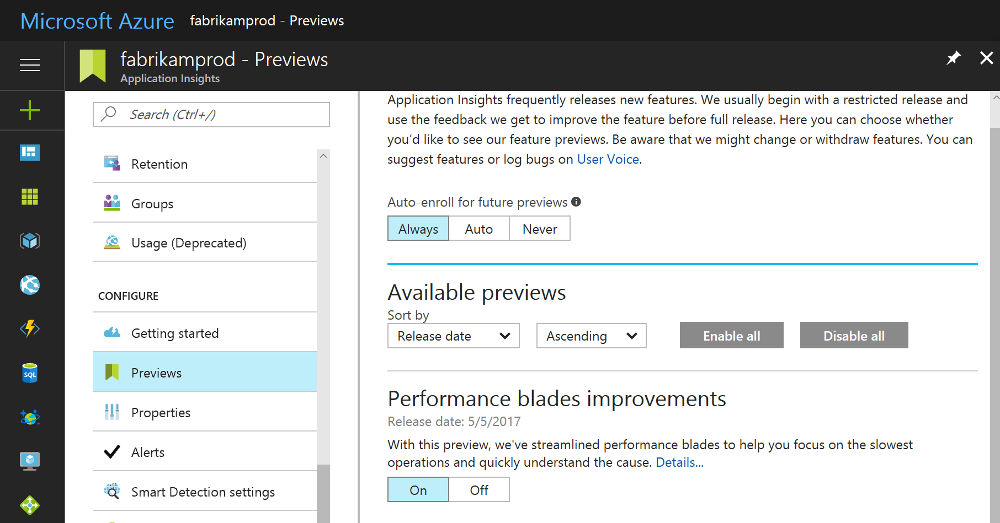

# Preview upcoming changes to Azure Application Insights 

Application Insights frequently releases new features. If you want to see previews of these improvements, you can sign up on the Application Insights Preview blade.  The development team makes previews of new features available on a limited basis before releasing them to all users. 

The following image illustrates how to set your preview preferences.

## Set preferences

On the Preview blade, you can select from the following options for when you see previews.

- Always: You see Preview experiences as soon as they are available.
- Auto: You see Preview experiences that Microsoft recommends for your account. 
- Never: You will only see Preview experiences that you select. 

## Next steps

- [Create a resource](app-insights-create-new-resource.md)
