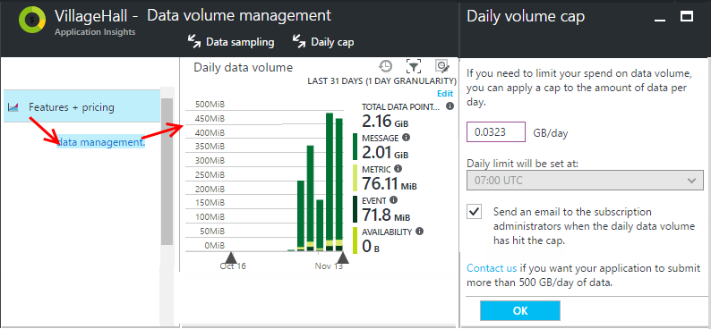

# Manage pricing and data volume in Application Insights

Pricing for [Azure Application Insights][start] is based on data volume per application. Low usage during development or for a small app is likely to be free, because there's a 1 GB monthly allowance of telemetry data.

Each Application Insights resource is charged as a separate service, and contributes to the bill for your subscription to Azure.

There are two pricing plans. The default plan is called Basic. You can opt for the Enterprise plan, which has a daily charge, but enables certain additional features such as [continuous export](app-insights-export-telemetry.md).

If you have questions about how pricing works for Application Insights, feel free to post a question in our [forum](https://social.msdn.microsoft.com/Forums/en-US/home?forum=ApplicationInsights). 

## The price plans

See the [Application Insights pricing page][pricing] for current prices in your currency.

### Basic plan

The Basic plan is the default when a new Application Insights resource is created, and will suffice for most customers.

* In the Basic plan, you are charged by data volume: number of bytes of telemetry received by Application Insights. 
Data volume is measured as the size of the uncompressed JSON data package received by Application Insights from your application.
For [tabular data imported into Analytics](https://docs.microsoft.com/en-us/azure/application-insights/app-insights-analytics-import), the data volume is measured as the uncompressed size of files sent to Application Insights.  
* Your first 1 GB for each app is free, so if you're just experimenting or developing, you're unlikely to have to pay.
* [Live Metrics Stream](app-insights-live-stream.md) data isn't counted for pricing purposes.
* [Continuous Export](app-insights-export-telemetry.md) is available for an extra per-GB charge in the Basic plan.

### Enterprise plan

* In the Enterprise plan, your app can use all the features of Application Insights. [Continuous Export](app-insights-export-telemetry.md) and 

[Log Analytics connector](https://go.microsoft.com/fwlink/?LinkId=833039&amp;clcid=0x409) are available without any extra charge in the Enterprise plan.
* You pay per node that is sending telemetry for any apps in the Enterprise plan. 
 * A *node* is a physical or virtual server machine, or a Platform-as-a-Service role instance, that hosts your app.
 * Development machines, client browsers, and mobile devices are not counted as nodes.
 * If your app has several components that send telemetry, such as a web service and a back-end worker, they are counted separately.
 * [Live Metrics Stream](app-insights-live-stream.md) data isn't counted for pricing purposes.* Across a subscription, your charges are per node, not per app. If you have five nodes sending telemetry for 12 apps, then the charge is for five nodes.
* Although charges are quoted per month, you're charged only for any hour in which a node sends telemetry from an app. The hourly charge is the quoted monthly charge / 744 (the number of hours in a 31-day month).
* A data volume allocation of 200 MB per day is given for each node detected (with hourly granularity). Unused data allocation is not carried over from one day to the next.
 * If you choose the Enterprise pricing option, each subscription gets a daily allowance of data based on the number of nodes sending telemetry to the Application Insights resources in that subscription. So if you have 5 nodes sending data all day, you will have a pooled allowance of 1 GB applied to all the Application Insights resources in that subscription. It doesn't matter if certain nodes are sending more data than other nodes because the included data is shared across all nodes. If, on a given day, the Application Insights resources receive more data than is included in the daily data allocation for this subscription, the per-GB overage data charges apply. 
 * The daily data allowance is calculated as the number of hours in the day (using UTC) that each node is sending telemetry divided by 24 times 200 MB. So if you have 4 nodes sending telemetry during 15 of the 24 hours in the day, the included data for that day would be ((4 x 15) / 24) x 200 MB = 500 MB. At the price of 2.30 USD per GB for data overage, the charge for would be 1.15 USD if the nodes send 1 GB of data that day.
 * Note that the Enterprise plan's daily allowance is not shared with applications for which you have chosen the Basic option and unused allowance is not carried over from day-to-day. 
* Here are some examples of determining distinct node count:
| Scenario                               | Total daily node count |
|:---------------------------------------|:----------------:|
| 1 application is using 3 Azure App Service instances and 1 virtual server | 4 |
| 3 applications running on 2 VMs, and the Application Insights resources for these applications are in the same subscription and in the Enterprise plan | 2 | 
| 4 applications whose Applications Insights resources are in the same subscription. Each application runs 2 instances during 16 off-peak hours, and 4 instances during 8 peak hours. | 13.33 | 
| Cloud services with 1 Worker Role and 1 Web Role, each running 2 instances | 4 | 
| 5-node Service Fabric Cluster running 50 micro-services, each micro-service running 3 instances | 5|

* The precise node counting behavior depends on which Application Insights SDK your application is using. 
  * In SDK versions 2.2 and onwards, both the Application Insights [Core SDK](https://www.nuget.org/packages/Microsoft.ApplicationInsights/) or [Web SDK](https://www.nuget.org/packages/Microsoft.ApplicationInsights.Web/) will report each application host as a node, for example the computer name for physical server and VM hosts or the instance name in the case of cloud services.  The only exception is applications only using [.NET Core](https://dotnet.github.io/) and the Application Insights Core SDK, in which case only one node will be reported for all hosts because the host name is not available. 
  * For earlier versions of the SDK, the [Web SDK](https://www.nuget.org/packages/Microsoft.ApplicationInsights.Web/) will behave just as the newer SDK versions, however the [Core SDK](https://www.nuget.org/packages/Microsoft.ApplicationInsights/) will report only one node regardless of the number of actual application hosts. 
  * Note that if your application is using the SDK to set roleInstance to a custom value, by default that same value will be used to determine the count of nodes. 
  * If you are using a new SDK version with an app that is run from client machines or mobile devices, it is possible that the count of nodes might return a number which is very large (from the large number of client machines or mobile devices). 

### Multi-step web tests

There's an additional charge for [multi-step web tests](app-insights-monitor-web-app-availability.md#multi-step-web-tests). This refers to web tests that perform a sequence of actions. 

There is no separate charge for 'ping tests' of a single page. Telemetry from both ping tests and multi-step tests is charged along with other telemetry from your app.
 
## Operations Management Suite subscription entitlement

As [recently announced](https://blogs.technet.microsoft.com/msoms/2017/05/19/azure-application-insights-enterprise-as-part-of-operations-management-suite-subscription/), customers who purchase Microsoft Operations Management Suite E1 and E2 are able to get Application Insights Enterprise as an additional component at no additional cost. Specifically, each unit of Operations Management Suite E1 and E2 includes an entitlement to 1 node of the Enterprise plan of Application Insights. As noted above, each Application Insights node includes up to 200 MB of data ingested per day (separate from Log Analytics data ingestion), with 90-day data retention at no additional cost. 

> [!NOTE]
> To ensure that you get this entitlement, you must have your Application Insights resources in the Enterprise pricing plan. This entitlement applies only as nodes, so Application Insights resources in the Basic plan will not realize any benefit. Note that this entitlement will not be visible on the estimated costs shown on the Features + pricing blade. 
>
 
## Review pricing plans and estimate costs

Applicaition Insights makes it easy to understand the pricing plans available and what the costs are likely be be based on recent usage patterns. Start by opening the **Features + Pricing** blade in the Application Insights resource in the Azure portal:

**a.** Review your data volume for the month. This includes all the data received and retained (after any [sampling](app-insights-sampling.md) from your server and client apps, and from availability tests.

**b.** A separate charge is made for [multi-step web tests](app-insights-monitor-web-app-availability.md#multi-step-web-tests). (This doesn't include simple availability tests, which are included in the data volume charge.)

**c.** Enable the Enterprise plan.

**d.** Click through to data management options to view data volume for the last month, set a daily cap or set ingestion sampling.

Application Insights charges are added to your Azure bill. You can see details of your Azure bill on the Billing section of the Azure portal or in the [Azure Billing Portal](https://account.windowsazure.com/Subscriptions). 

## Data rate
There are three ways in which the volume you send data is limited:

* **Sampling:** This mechanism can be used reduce the amount of telemetry sent from your server and client apps, with minimal distortion of metrics. This is the primary tool you have to tune the amount of data. Learn more about [sampling features](app-insights-sampling.md). 
* **Daily cap:** When creating an Application Insights resource from the Azure portal this is set to 500 GB/day. The default when creating an Application Insights resource from Visual Studio, is small (only 32.3 MB/day) which is intended only to faciliate testing. In this case it is intended that the user will raise the daily cap before deploying the app into production. The maximum cap is 500 GB/day unless you have requested a higher maximum for a high traffic application. Use care when setting the daily cap, as your intent should be **never to hit the daily cap**, because you will then lose data for the remainder of the day and be unable to monitor your application. To change it, use the Daily volume cap blade, linked from the Data Volume Management blade (see below). Note that some subscription types have credit which cannot be used for Application Insights. If the subscription has a spending limit, the daily cap blade will have instructions how to remove it and enable the daily cap to be raised beyond 32.3 MB/day.  
* **Throttling:** This limits the data rate to 32 k events per second, averaged over 1 minute. 

*What happens if my app exceeds the throttling rate?*

* The volume of data that your app sends is assessed every minute. If it exceeds the per-second rate averaged over the minute, the server refuses some requests. The SDK buffers the data and then tries to resend, spreading a surge out over several minutes. If your app consistently sends data at above the throttling rate, some data will be dropped. (The ASP.NET, Java, and JavaScript SDKs try to resend in this way; other SDKs might simply drop throttled data.) If throttling occurs, you'll see a notification warning that this has happened.

*How do I know how much data my app is sending?*

* Open the **Data volume management** blade to see the Daily data volume chart. 
* Or in Metrics Explorer, add a new chart and select **Data point volume** as its metric. Switch on Grouping, and group by **Data type**.

## To reduce your data rate
Here are some things you can do to reduce your data volume:

* Use [Sampling](app-insights-sampling.md). This technology reduces data rate without skewing your metrics, and without disrupting the ability to navigate between related items in Search. In server apps, it operates automatically.
* [Limit the number of Ajax calls that can be reported](app-insights-javascript.md#detailed-configuration) in every page view, or switch off Ajax reporting.
* Switch off collection modules you don't need by [editing ApplicationInsights.config](app-insights-configuration-with-applicationinsights-config.md). For example, you might decide that performance counters or dependency data are inessential.
* Split your telemetry to separate instrumentation keys. 
* Pre-aggregate metrics. If you have put calls to TrackMetric in your app, you can reduce traffic by using the overload that accepts your calculation of the average and standard deviation of a batch of measurements. Or you can use a [pre-aggregating package](https://www.myget.org/gallery/applicationinsights-sdk-labs).

## Managing the maximum daily data volume

You can use the daily volume cap to limit the data collected, but if the cap is met, it will result in a loss of all telemetery sent from your application for the remainder of the day. It is **not advisable** to have your application to hit the daily cap since you are unable to track the health and performance of your application after it is hit. 

Instead, use  [Sampling](app-insights-sampling.md) to tune the data volume to the level you'd like, and use the daily cap only as a "last resort" in case your application starts sending much higher volumes of telemetery unexpectedly. 

To change the daily cap, in the Configure section of your Application Insihgts resource, click **Data volume management** then **Daily Cap**.

 

## Sampling
[Sampling](app-insights-sampling.md) is a method of reducing the rate at which telemetry is sent to your app, while still retaining the ability to find related events during diagnostic searches, and still retaining correct event counts. 

Sampling is an effective way to reduce charges and stay within your monthly quota. The sampling algorithm retains related items of telemetry, so that, for example, when you use Search, you can find the request related to a particular exception. The algorithm also retains correct counts, so that you see the correct values in Metric Explorer for request rates, exception rates, and other counts.

There are several forms of sampling.

* [Adaptive sampling](app-insights-sampling.md) is the default for the ASP.NET SDK, which automatically adjusts to the volume of telemetry that your app sends. It operates automatically in the SDK in your web app, so that the telemetry traffic on the network is reduced. 
* *Ingestion sampling* is an alternative that operates at the point where telemetry from your app enters the Application Insights service. It doesn't affect the volume of telemetry sent from your app, but it reduces the volume retained by the service. You can use it to reduce the quota used up by telemetry from browsers and other SDKs.

To set ingestion sampling, set the control in the Pricing blade:

> [!WARNING]
> The Data sampling blade only controls the value of ingestion sampling. It doesn't reflect the sampling rate that is being applied by the Application Insights SDK in your app. If the incoming telemetry has already been sampled at the SDK, ingestion sampling is not applied.
> 

To discover the actual sampling rate no matter where it has been applied, use an [Analytics query](app-insights-analytics.md) such as this:

    requests | where timestamp > ago(1d)
    | summarize 100/avg(itemCount) by bin(timestamp, 1h) 
    | render areachart 

In each retained record, `itemCount` indicates the number of original records that it represents, equal to 1 + the number of previous discarded records. 

## Automation

You can write a script to set the price plan, using Azure Resource Management. [Learn how](app-insights-powershell.md#price).

## Limits summary
[!INCLUDE [application-insights-limits](../../includes/application-insights-limits.md)]

## Next steps

* [Sampling](app-insights-sampling.md)

<!--Link references-->

[api]: app-insights-api-custom-events-metrics.md
[apiproperties]: app-insights-api-custom-events-metrics.md#properties
[start]: app-insights-overview.md
[pricing]: http://azure.microsoft.com/pricing/details/application-insights/

