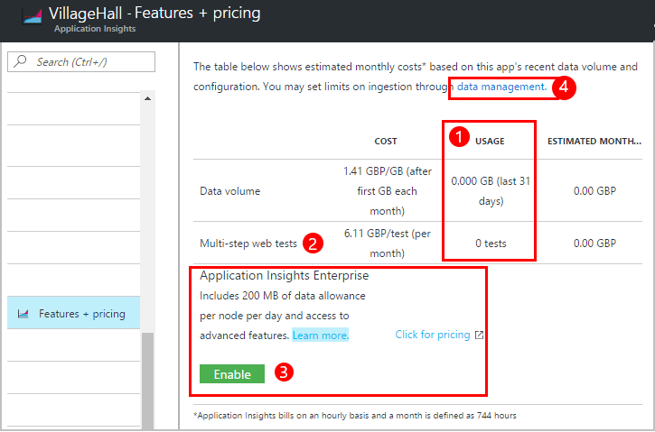
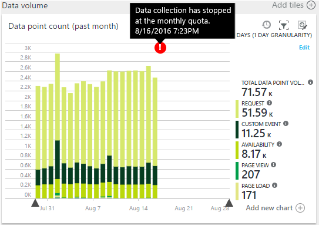
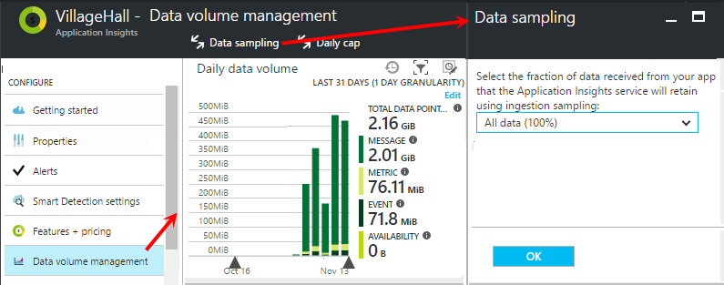

<properties 
	pageTitle="Manage pricing and quota for Application Insights" 
	description="Choose the price plan you need" 
	services="application-insights" 
    documentationCenter=""
	authors="alancameronwills" 
	manager="douge"/>

<tags 
	ms.service="application-insights" 
	ms.workload="tbd" 
	ms.tgt_pltfrm="ibiza" 
	ms.devlang="na" 
	ms.topic="article" 
	ms.date="06/22/2016" 
	ms.author="awills"/>

# Manage pricing and quota for Application Insights

*Application Insights is in preview.*

[Pricing][pricing] for [Visual Studio Application Insights][start] is based on data volume per application. There's a substantial Free tier in which you get most of the features with some limitations.

Each Application Insights resource is charged as a separate service, and contributes to the bill for your subscription to Azure.

[See the pricing scheme][pricing].

## Review quota and price plan for your Application Insights resource

You can open the Quota + Pricing blade from your application resource's Settings.

Your choice of pricing scheme affects:

* [Monthly Quota](#monthly-quota) - the amount of telemetry you can analyze each month.
* [Data rate](#data-rate) - the maximum rate at which data from your app can be processed.
* [Continuous export](#continuous-export) - whether you can export data to other tools and services.

These limits are set separately for each Application Insights resource.

### Free Premium trial

When you first create a new Application Insights resource, it starts in the Free tier.

At any time, you can switch to the 30 day free Premium trial. This gives you the benefits of the Premium tier. After 30 days, it will automatically revert to whatever tier you were in before - unless you explicitly choose another tier. You select the tier you'd like at any time during the trial period, but you'll still get the free trial until the end of the 30-day period.

## Monthly Quota

* In each calendar month, your application can send up to a specified quantity of telemetry to Application Insights. Currently the quota for the free pricing tier is 5 million data points per month, and substantially more for the other schemes; you can buy more if you reach the quota.  See the [pricing scheme][pricing] for the  actual numbers. 
* The quota depends on the pricing tier that you have chosen.
* The quota is counted from midnight UTC on the first day of each month.
* The Data points chart shows how much of your quota has been used up this month.
* The quota is measured in *data points.* A single data point is a call to one of the Track methods, whether called explicitly in your code, or by one of the standard telemetry modules. It can have multiple attached properties and metrics.
* Data points are generated by:
 * [SDK modules](app-insights-configuration-with-applicationinsights-config.md) that automatically collect data, for example to report a request or crash, or to measure performance.
 * [API](app-insights-api-custom-events-metrics.md) `Track...` calls that you have written, such as `TrackEvent` or `trackPageView`.
 * [Availability web tests](app-insights-monitor-web-app-availability.md) that you have set up.
* While you're debugging, you can see data points being sent from your app in the Visual Studio output window. Client events can be seen by opening the network tab in your browser's debugging pane (usually F12).
* *Session data* is not counted in the quota. This includes counts of users, sessions, environment and device data.
* If you'd like to count up data points by inspection, you can find them in various places:
 * Each item you see in [diagnostic search](app-insights-diagnostic-search.md), which includes HTTP requests, exceptions, log traces, page views, dependency events, and custom events.
 * Each raw measurement of a [metric](app-insights-metrics-explorer.md) such as a performance counter. (The points you see on the charts are usually aggregates of multiple raw data points.)
 * Each point on a web availability chart is also an aggregate of several data points.
* You can also inspect individual data points at source during debugging:
 * If you run your app in debug mode in Visual Studio, the data points are logged in the Output window. 
 * To see client data points, open your browser's debugging pane (usually F12) and open the network tab.
* The data rate may be (by default) reduced by [adaptive sampling](app-insights-sampling.md). This means that, as usage of your app increases, the telemetry rate won't increase as much as you might expect.

### Overage

If your application sends more than the monthly quota, you can:

* Pay for additional data. See the [pricing scheme][pricing] for details. You can choose this option in advance. This option isn't available in the Free pricing tier.
* Upgrade your pricing tier.
* Do nothing. Session data will continue to be recorded, but other data will not appear in diagnostic search or in metrics explorer.

### How much data am I sending?

The chart at the bottom of the pricing blade shows your application's data point volume, grouped by data point type. (You can also create this chart in Metric Explorer.)

Click the chart for more detail, or drag across it and click (+) for the detail of a time range.

The chart shows the volume of data that arrives at the Application Insights service, after [sampling](app-insights-sampling.md).

## Data rate

In addition to the monthly quota, there are throttling limits on the data rate. For the free [pricing tier][pricing] the limit is 200 data points/second averaged over 5 minutes and for the paid tiers it is 500/s averaged over 1 minute. 

There are three buckets which are counted separately:

* [TrackTrace calls](app-insights-api-custom-events-metrics.md#track-trace) and [captured logs](app-insights-asp-net-trace-logs.md)
* [Exceptions](app-insights-api-custom-events-metrics.md#track-exception), limited to 50 points/s.
* All other telemetry (page views, sessions, requests, dependencies, metrics, custom events, web test results).

*What happens if my app exceeds the per-second rate?*

* The volume of data that your app sends is assessed every minute. If it exceeds the per-second rate averaged over the minute, the server refuses some requests. Some versions of the SDK then try to resend, spreading a surge out over several minutes; others such as the JavaScript SDK just drop the refused data.

If throttling occurs, you'll see a notification warning that this has happened.

*How do I know how many data points my app is sending?*

* Open Settings/Quota and Pricing to see the Data Volume chart.
* Or in Metrics Explorer, add a new chart and select **Data point volume** as its metric. Switch on Grouping, and group by **Data type**.

### Tips for reducing your data rate

If you encounter the throttling limits, here are some things you can do:

* Use [Sampling](app-insights-sampling.md). This technology reduces data rate without skewing your metrics, and without disrupting the ability to navigate between related items in Search.
* [Limit the number of Ajax calls that can be reported](app-insights-javascript.md#detailed-configuration) in every page view, or switch off Ajax reporting.
* Switch off collection modules you don't need by [editing ApplicationInsights.config](app-insights-configuration-with-applicationinsights-config.md). For example, you might decide that performance counters or dependency data are inessential.
* Pre-aggregate metrics. If you have put calls to TrackMetric in your app, you can reduce traffic by using the overload that accepts your calculation of the average and standard deviation of a batch of measurements. Or you can use a [pre-aggregating package](https://www.myget.org/gallery/applicationinsights-sdk-labs). 

## Sampling

[Sampling](app-insights-sampling.md) is a method of reducing the rate at which telemetry is sent to your app, while still retaining the ability to find related events during diagnostic searches, and still retaining correct event counts. Sampling helps you to keep within your monthly quota.

There are several forms of sampling. We recommend [adaptive sampling](app-insights-sampling.md), which automatically adjusts to the volume of telemetry that your app sends. It operates in the SDK in your web app, so that the telemetry traffic on the network is reduced. You can use it if your web app framework is .NET: just install the latest (beta) version of the SDK.

As an alternative, you can set *ingestion sampling* on the Quotas + pricing blade. This form of sampling operates at the point where telemetry from your app enters the Application Insights service. It doesn't affect the volume of telemetry sent from your app, but it reduces the volume retained by the service.

Sampling is an effective way to reduce charges and stay within your monthly quota. The sampling algorithm retains related items of telemetry, so that, for example, when you use Search, you can find the request related to a particular exception. The algorithm also retains correct counts, so that you see the correct values in Metric Explorer for request rates, exception rates, and other counts.

## Review the bill for your subscription to Azure

Application Insights charges are added to your Azure bill. You can see details of your Azure bill on the Billing section of the Azure portal or in the [Azure Billing Portal](https://account.windowsazure.com/Subscriptions). 

## Name limits

1.	Maximum of 200 unique metric names and 200 unique property names for your application. Metrics include data sent via TrackMetric as well as measurements on other  data types such as Events.  [Metrics and property names][api] are global per instrumentation key.
2.	[Properties][apiproperties] can be used for filtering and group-by only while they have less than 100 unique values for each property. After the number of unique values exceeds 100, you can still search the property, but no longer use it for filters or group-by.
3.	Standard properties such as Request Name and Page URL are limited to 1000 unique values per week. After 1000 unique values, additional values are marked as "Other values." The original values can still be used for full text search and filtering.

If you find your application is exceeding these limits, consider splitting your data between different instrumentation keys - that is, [create new Application Insights resources](app-insights-create-new-resource.md) and send some of the data to the new instrumentation keys. You might find that the result is better structured. You can use [dashboards](app-insights-dashboards.md#dashboards) to bring the different metrics onto the same screen, so this approach doesn't restrict your ability to compare different metrics. 

## Limits summary

[AZURE.INCLUDE [application-insights-limits](../../includes/application-insights-limits.md)]

<!--Link references-->

[api]: app-insights-api-custom-events-metrics.md
[apiproperties]: app-insights-api-custom-events-metrics.md#properties
[start]: app-insights-overview.md
[pricing]: http://azure.microsoft.com/pricing/details/application-insights/

 