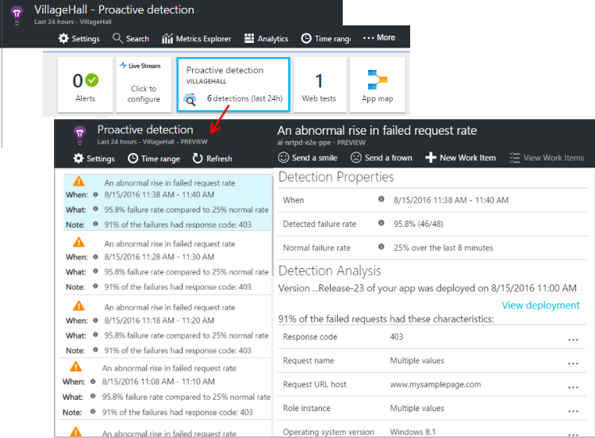

<properties 
	pageTitle="Proactive detection in Application Insights | Microsoft Azure" 
	description="Application Insights performs automatic deep analysis of your app telemetry and warns you of potential problems." 
	services="application-insights" 
    documentationCenter="windows"
	authors="rakefetj" 
	manager="douge"/>

<tags 
	ms.service="application-insights" 
	ms.workload="tbd" 
	ms.tgt_pltfrm="ibiza" 
	ms.devlang="na" 
	ms.topic="article" 
	ms.date="08/15/2016" 
	ms.author="awills"/>

#  Proactive Detection in Application Insights

 Proactive Detection automatically warns you of potential performance problems in your web application. It performs smart analysis of the telemetry that your app sends to [Visual Studio Application Insights](app-insights-overview.md). If there is a sudden rise in failure rates, or abnormal patterns in client or server performance, you get an alert. This feature needs no configuration. It operates if your application sends enough telemetry.

You can access Proactive Detection alerts both from the emails you receive, and from the Proactive Detection blade.

## Review your Proactive Detections

You can discover detections in two ways:

* **You receive an email** from Application Insights. Here's a typical example:

    

    Click the big button to open more detail in the portal.

* **The Proactive Detection tile** on your app's overview blade shows a count of recent alerts. Click the tile to see a list of recent alerts.

Select an alert to see its details.

## What problems are detected?

There are three kinds of detection:

* [Near-real time failure alerts](app-insights-proactive-failure-diagnostics.md). We use machine learning to set the expected rate of failed requests for your app, correlating with load and other factors. If the failure rate goes outside the expected envelope, we send an alert.
* [Anomaly diagnostics](app-insights-proactive-anomaly-diagnostics.md). We search for anomalous patterns in response times and failure rates every day. We correlate these issues with properties such as location, browser, client OS, server instance, and time of day.
* [Azure Cloud Services](https://azure.microsoft.com/blog/proactive-notifications-on-cloud-service-issues-with-azure-diagnostics-and-application-insights/). You get alerts if your app is hosted in Azure Cloud Services and a role instance has startup failures, frequent recycling, or runtime crashes.

(The help links in each notification take you to the relevant articles.)

## Next steps

These diagnostic tools help you inspect the telemetry from your app:

* [Metric explorer](app-insights-metrics-explorer.md)
* [Search explorer](app-insights-diagnostic-search.md)
* [Analytics - powerful query language](app-insights-analytics-tour.md)

Proactive detections are completely automatic. But maybe you'd like to set up some more alerts?

* [Manually configured metric alerts](app-insights-alerts.md)
* [Availability web tests](app-insights-monitor-web-app-availability.md) 

