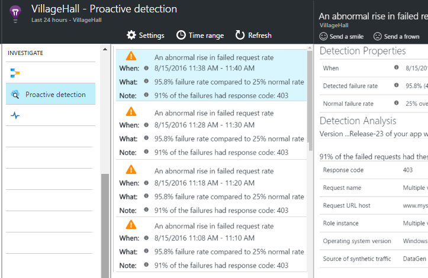

# Smart Detection in Application Insights
 Smart Detection automatically warns you of potential performance problems in your web application. It performs proactive analysis of the telemetry that your app sends to [Application Insights](app-insights-overview.md). If there is a sudden rise in failure rates, or abnormal patterns in client or server performance, you get an alert. This feature needs no configuration. It operates if your application sends enough telemetry.

You can access Smart Detection alerts both from the emails you receive, and from the Smart Detection blade.

## Review your Smart Detections
You can discover detections in two ways:

* **You receive an email** from Application Insights. Here's a typical example:
  
    
  
    Click the big button to open more detail in the portal.
* **The Smart Detection tile** on your app's overview blade shows a count of recent alerts. Click the tile to see a list of recent alerts.

Select an alert to see its details.

## What problems are detected?
There are three kinds of detection:

* [Smart detection - Failure Anomalies](app-insights-proactive-failure-diagnostics.md). We use machine learning to set the expected rate of failed requests for your app, correlating with load and other factors. If the failure rate goes outside the expected envelope, we send an alert.
* [Smart detection - Performance Anomalies](app-insights-proactive-performance-diagnostics.md). You get notifications if response time of an operation or dependency duration is slowing down compared to historical baseline or if we identify an anomalous pattern in response time or page load time.   
* [Smart detection - Azure Cloud Service issues](https://azure.microsoft.com/blog/proactive-notifications-on-cloud-service-issues-with-azure-diagnostics-and-application-insights/). You get alerts if your app is hosted in Azure Cloud Services and a role instance has startup failures, frequent recycling, or runtime crashes.

(The help links in each notification take you to the relevant articles.)

## Video

> [!VIDEO https://channel9.msdn.com/events/Connect/2016/112/player]

## Next steps
These diagnostic tools help you inspect the telemetry from your app:

* [Metric explorer](app-insights-metrics-explorer.md)
* [Search explorer](app-insights-diagnostic-search.md)
* [Analytics - powerful query language](app-insights-analytics-tour.md)

Smart Detection is completely automatic. But maybe you'd like to set up some more alerts?

* [Manually configured metric alerts](app-insights-alerts.md)
* [Availability web tests](app-insights-monitor-web-app-availability.md) 

