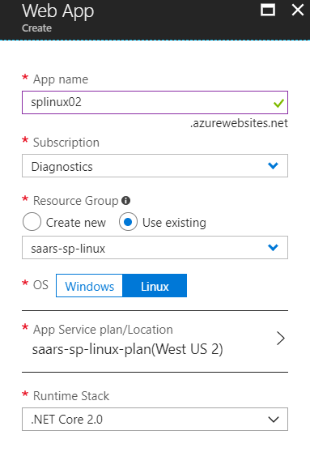
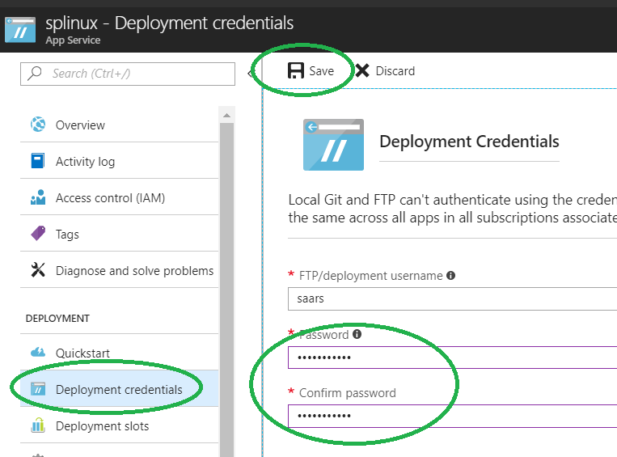
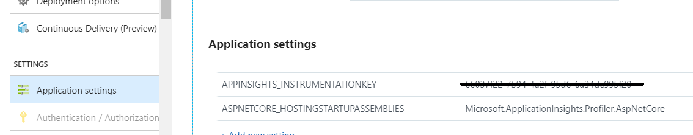

# Profiler ASP.NET Core Azure Linux Web Apps with Application Insights Profiler

This feature is currently in preview

Find out how much time is spent in each method of your live web application when using [Application Insights](app-insights-overview.md). Profiler is now available for ASP.NET core web apps hosted in Linux on App Services. This guide provides step-by-step instruction on how profiler traces can be collected for ASP.NET core Linux web apps.

## Pre-requisites
Instructions below applied to all of Windows, Linux, and Mac environments:

* Install [.NET core SDK 2.1.2 or later](https://www.microsoft.com/net/download/windows/build)
* Install Git following instructions at [Getting Started - Installing Git](https://git-scm.com/book/en/v2/Getting-Started-Installing-Git)

## Setup project locally

1. Open commands prompt on your machine. The instructions below works for all of Windows, Linux, and Mac environments.

2. Create an ASP.NET core MVC web application
```
dotnet new mvc -n ServiceProfilerE2E
```
3. Change directory in command prompt to the project root folder

4. Add Nuget package for collecting profiler traces
```
dotnet add package Microsoft.ApplicationInsights.Profiler.AspNetCore -s https://saarsnuget.azurewebsites.net/nuget -v 1.1.0-beta1
```
5. Add a line of code to randomly delay a few seconds in HomeController.cs

```csharp
    public IActionResult Index()
        {
            Random r = new Random();
            int delay = r.Next(5000, 10000);
            Thread.Sleep(delay);
            return View();
        }
```
6. Save and commit your changes to the local repository

## Create Azure App Service for hosting your project
1. Create an App Services Linux environment

    

2. Create deployment credential. Take a note of your password as you will need this later when deploy your app.

    

3. Choose deployment option. Set up a local Git repository in the web app following instructions on Azure portal. A Git repository will automatically be created.

    

More deployment options are available [here](https://docs.microsoft.com/en-us/azure/app-service/app-service-deploy-ftp)

## Deploy your project

1. In your Command prompt, navigate to your project root folder. Add Git remote repository to point to the one on App Services:

```
git remote add azure https://<username>@<app_name>.scm.azurewebsites.net:443/<app_name>.git
```
* Use the 'username' from the step of "create deployment credential."
* Use the 'app name' from the step of "create app service."

2. Deploy the project by pushing the changes to Azure

```
git push azure master
```
You will see output similar to the following:

```
Counting objects: 9, done.
Delta compression using up to 8 threads.
Compressing objects: 100% (8/8), done.
Writing objects: 100% (9/9), 1.78 KiB | 911.00 KiB/s, done.
Total 9 (delta 3), reused 0 (delta 0)
remote: Updating branch 'master'.
remote: Updating submodules.
remote: Preparing deployment for commit id 'd7369a99d7'.
remote: Generating deployment script.
remote: Running deployment command...
remote: Handling ASP.NET Core Web Application deployment.
remote: ......
remote:   Restoring packages for /home/site/repository/EventPipeExampleLinux.csproj...
remote: .
remote:   Installing Newtonsoft.Json 10.0.3.
remote:   Installing Microsoft.ApplicationInsights.Profiler.Core 1.1.0-LKG
…

```

## Add Application Insights to monitor your web apps
1. [Create an Application Insights resource](./app-insights-create-new-resource.md)
2. Copy the iKey of the Application Insights resource and set the following settings in your App services

    

3. Generate some load to your HomeController method. You can run a load test, or refresh the site home page for a few times.

4. Wait for 2-5 minutes so the events can be aggregated to Application Insights.

5. Navigate to Performance pane in Application Insights portal. You will see profiler traces available in the bottom right corner.

    
