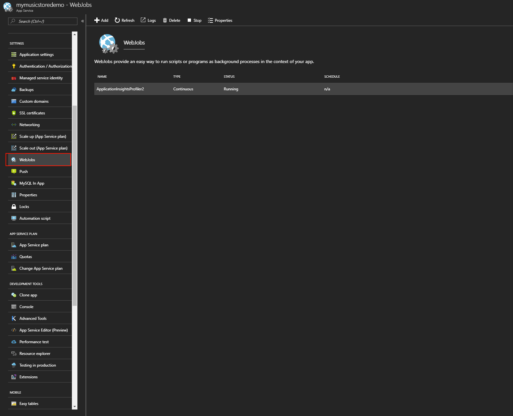
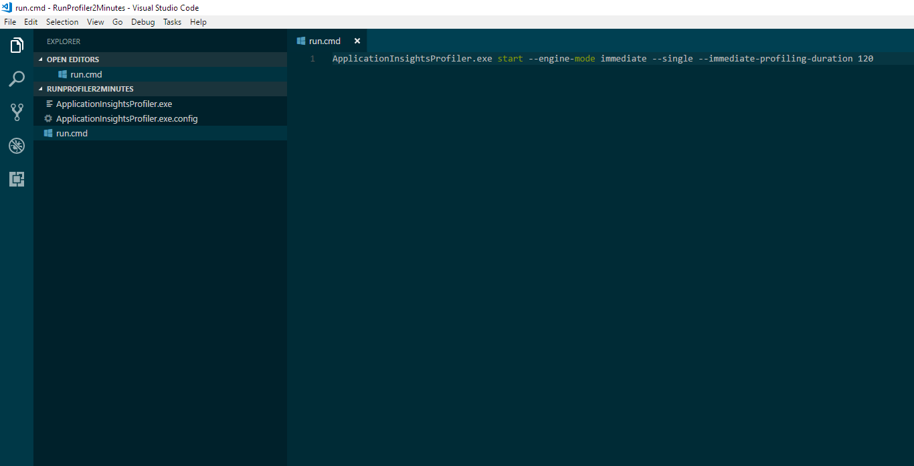
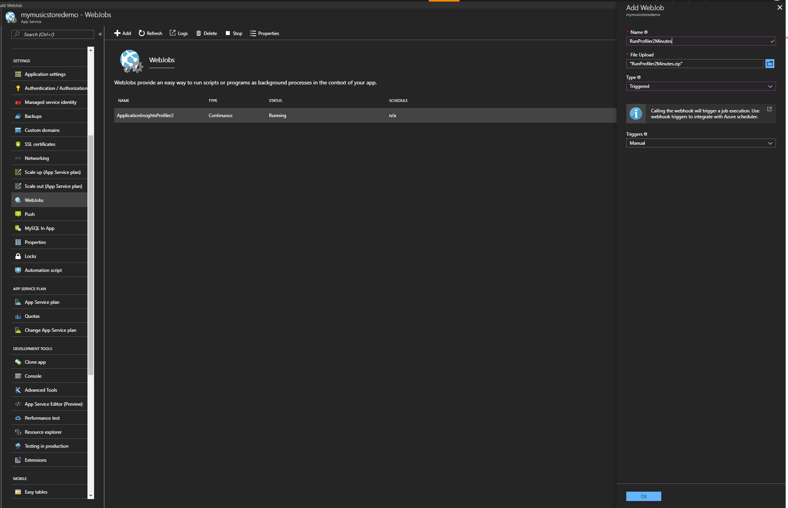

# Profile live Azure web apps with Application Insights

*This feature of Azure Application Insights is generally available for the Web Apps feature of Azure App Service and is in preview for Azure compute resources.*

This article discusses the amount of time that's spent in each method of your live web application when you use [Application Insights](app-insights-overview.md). The Application Insights Profiler tool displays detailed profiles of live requests that were served by your app. Profiler highlights the *hot path* that uses the most time. Requests with various response times are profiled on a sampling basis. By using a variety of techniques, you can minimize the overhead that's associated with the application.

Profiler currently works for ASP.NET and ASP.NET Core web apps that are running on Web Apps. The Basic service tier or higher is required to use Profiler.

## <a id="installation"></a> Enable Profiler for your Web Apps web app
If you already have the application published to a web app, but have not done anything in the source code to use Application Insights, do the following:
1. Go to the **App Services** pane in the Azure portal.
2. Under **Monitoring**, select **Application Insights**, and then either follow the instructions on the pane to create a new resource or select an existing Application Insights resource to monitor your web app.

   ![Enable App Insights on App Services portal][appinsights-in-appservices]

3. If you have access to your project source code, [install Application Insights](app-insights-asp-net.md).  
   If it's already installed, make sure you have the latest version. To check for the latest version, in Solution Explorer, right-click your project, and then select **Manage NuGet packages** > **Updates** > **Update all packages**. Then, deploy your app.

ASP.NET Core applications require the installation of the Microsoft.ApplicationInsights.AspNetCore NuGet package 2.1.0-beta6 or later to work with Profiler. As of June 27, 2017, earlier versions are not supported.

1. In [the Azure portal](https://portal.azure.com), open the Application Insights resource for your web app. 
2. Select **Performance** > **Enable Application Insights Profiler**.

   ![Select the Enable profiler banner][enable-profiler-banner]

3. Alternatively, you can select the **Profiler** configuration to view the status and enable or disable Profiler.

   ![Select Profiler configuration][performance-blade]

   Web apps that are configured with Application Insights are listed in the **Profiler** configuration pane. If you followed the preceding steps, the Profiler agent should be installed. 

4. In the **Profiler** configuration pane, select **Enable Profiler**.

5. If necessary, follow the instructions to install the Profiler agent. If no web apps have been configured with Application Insights, select **Add Linked Apps**.

   ![Configure pane options][linked app services]

Unlike web apps that are hosted through Web Apps plans, applications that are hosted in Azure compute resources (for example, Azure Virtual Machines, virtual machine scale sets, Azure Service Fabric, or Azure Cloud Services) are not directly managed by Azure. In this case, there's no web app to link to. Instead of linking to an app, select the **Enable Profiler** button.

### Enable Profiler for Azure compute resources (preview)

For information, see the [preview version of Profiler for Azure compute resources](https://go.microsoft.com/fwlink/?linkid=848155).

## View profiler data

Make sure your application is receiving traffic. If you are doing an experiment, you can generate requests to your web app using [Application Insights Performance Testing](https://docs.microsoft.com/en-us/vsts/load-test/app-service-web-app-performance-test). If you have newly enabled Profiler, you can run a short load test for about 15 minutes, which should generate profiler traces. If you have had Profiler enabled for a while already, keep in mind that Profiler runs randomly two times every hour and for a duration of two minutes each time it runs. We recommend first running the load test for one hour to make sure you get sample profiler traces.

After your application receives some traffic, go to the **Performance** pane, select **Take Actions** to view profiler traces, and then select the **Profiler Traces** button.

![Application Insights Performance pane preview Profiler traces][performance-blade-v2-examples]

Select a sample to display a code-level breakdown of time spent executing the request.

![Application Insights trace explorer][trace-explorer]

The trace explorer displays the following information:

* **Show Hot Path**: Opens the biggest leaf node, or at least something close. In most cases, this node is adjacent to a performance bottleneck.
* **Label**: The name of the function or event. The tree displays a mix of code and events that occurred (like SQL and HTTP events). The top event represents the overall request duration.
* **Elapsed**: The time interval between the start of the operation and the end of the operation.
* **When**: The time when the function or event was running in relation to other functions.

## How to read performance data

The Microsoft service profiler uses a combination of sampling methods and instrumentation to analyze the performance of your application. When detailed collection is in progress, the service profiler samples the instruction pointer of each machine CPU every millisecond. Each sample captures the complete call stack of the thread that is currently executing. It gives detailed information about what that thread was doing, both at a high level and at a low level of abstraction. The service profiler also collects other events to track activity correlation and causality, including context switching events, Task Parallel Library (TPL) events, and thread pool events.

The call stack that's displayed in the timeline view is the result of the sampling and instrumentation. Because each sample captures the complete call stack of the thread, it includes code from Microsoft .NET Framework, and from other frameworks that you reference.

### <a id="jitnewobj"></a>Object allocation (clr!JIT\_New or clr!JIT\_Newarr1)
**clr!JIT\_New** and **clr!JIT\_Newarr1** are helper functions in the .NET Framework that allocate memory from a managed heap. **clr!JIT\_New** is invoked when an object is allocated. **clr!JIT\_Newarr1** is invoked when an object array is allocated. These two functions are usually fast and take relatively small amounts of time. If you see **clr!JIT\_New** or **clr!JIT\_Newarr1** take a substantial amount of time in your timeline, it indicates that the code might be allocating many objects and consuming significant amounts of memory.

### <a id="theprestub"></a>Loading code (clr!ThePreStub)
**clr!ThePreStub** is a helper function in the .NET Framework that prepares the code to execute for the first time. This usually includes, but is not limited to, just-in-time (JIT) compilation. For each C# method, **clr!ThePreStub** should be invoked at most once during the lifetime of a process.

If **clr!ThePreStub** takes a substantial amount of time for a request, this indicates that the request is the first one that executes that method. The time for the .NET Framework runtime to load the first method is significant. You might consider using a warmup process that executes that portion of the code before your users access it, or consider running Native Image Generator (ngen.exe) on your assemblies.

### <a id="lockcontention"></a>Lock contention (clr!JITutil\_MonContention or clr!JITutil\_MonEnterWorker)
**clr!JITutil\_MonContention** or **clr!JITutil\_MonEnterWorker** indicates that the current thread is waiting for a lock to be released. This text is usually displayed when you execute a C# **LOCK** statement, when invoking the **Monitor.Enter** method, or when invoking a method with the **MethodImplOptions.Synchronized** attribute. Lock contention usually occurs when thread _A_ acquires a lock, and thread _B_ tries to acquire the same lock before thread _A_ releases it.

### <a id="ngencold"></a>Loading code ([COLD])
If the method name contains **[COLD]**, such as **mscorlib.ni![COLD]System.Reflection.CustomAttribute.IsDefined**, the .NET Framework runtime is executing code for the first time that is not optimized by <a href="https://msdn.microsoft.com/library/e7k32f4k.aspx">profile-guided optimization</a>. For each method, it should be displayed at most once during the lifetime of the process.

If loading code takes a substantial amount of time for a request, this indicates that the request is the first one to execute the unoptimized portion of the method. Consider using a warmup process that executes that portion of the code before your users access it.

### <a id="httpclientsend"></a>Send HTTP request
Methods like **HttpClient.Send** indicate that the code is waiting for an HTTP request to be completed.

### <a id="sqlcommand"></a>Database operation
Methods like **SqlCommand.Execute** indicate that the code is waiting for a database operation to finish.

### <a id="await"></a>Waiting (AWAIT\_TIME)
**AWAIT\_TIME** indicates that the code is waiting for another task to finish. This usually happens with the C# **AWAIT** statement. When the code does a C# **AWAIT**, the thread unwinds and returns control to the thread pool, and there is no thread that is blocked waiting for the **AWAIT** to finish. However, logically, the thread that did the **AWAIT** is "blocked," and is waiting for the operation to finish. The **AWAIT\_TIME** statement indicates the blocked time waiting for the task to finish.

### <a id="block"></a>Blocked time
**BLOCKED_TIME** indicates that the code is waiting for another resource to be available. For example, it might be waiting for a synchronization object, for a thread to be available, or for a request to finish.

### <a id="cpu"></a>CPU time
The CPU is busy executing the instructions.

### <a id="disk"></a>Disk time
The application is performing disk operations.

### <a id="network"></a>Network time
The application is performing network operations.

### <a id="when"></a>When column
The **When** column is a visualization of how the INCLUSIVE samples collected for a node vary over time. The total range of the request is divided into 32 time buckets. The inclusive samples for that node are accumulated in those 32 buckets. Each bucket is represented as a bar. The height of the bar represents a scaled value. For nodes that are marked **CPU_TIME** or **BLOCKED_TIME**, or where there is an obvious relationship to consuming a resource (for example, a CPU, disk, or thread), the bar represents the consumption of one of the resources during the period of that bucket. For these metrics, it's possible to get a value of greater than 100 percent by consuming multiple resources. For example, if you use, on average, two CPUs during an interval, you get 200 percent.

## Limitations

The default data retention period is five days. The maximum data that's ingested per day is 10 GB.

There are no charges for using the Profiler service. For you to use the Profiler service, your web app must be hosted in at least the Basic tier of Web Apps.

## Overhead and sampling algorithm

Profiler randomly runs two minutes every hour on each virtual machine that hosts the application that has Profiler enabled for capturing traces. When Profiler is running, it adds from 5 percent to 15 percent CPU overhead to the server.

The more servers that are available for hosting the application, the less impact Profiler has on the overall application performance. This is because the sampling algorithm results in Profiler running on only 5 percent of servers at any time. More servers are available to serve web requests to offset the server overhead caused by running Profiler.

## Disable Profiler
To stop or restart Profiler for an individual web apps instance, under **Web Jobs**, go to the Web Apps resource. To delete Profiler, go to **Extensions**.

![Disable Profiler for a web job][disable-profiler-webjob]

We recommend that you have Profiler enabled on all your web apps to discover any performance issues as early as possible.

If you use WebDeploy to deploy changes to your web application, ensure that you exclude the App_Data folder from being deleted during deployment. Otherwise, the Profiler extension's files are deleted the next time you deploy the web application to Azure.


## <a id="troubleshooting"></a>Troubleshooting

### Too many active profiling sessions

Currently, you can enable Profiler on a maximum of four Azure web apps and deployment slots that are running in the same service plan. If the Profiler web job is reporting too many active profiling sessions, move some web apps to a different service plan.

### How do I determine whether Application Insights Profiler is running?

Profiler runs as a continuous web job in the web app. You can open the web app resource in the [Azure portal](https://portal.azure.com). In the **WebJobs** pane, check the status of **ApplicationInsightsProfiler**. If it isn't running, open **Logs** to get more information.

### Why can't I find any stack examples, even though Profiler is running?

Here are a few things that you can check:

* Make sure that your web app service plan is Basic tier or higher.
* Make sure that your web app has Application Insights SDK 2.2 Beta or later enabled.
* Make sure that your web app has the **APPINSIGHTS_INSTRUMENTATIONKEY** setting configured with the same instrumentation key that's used by the Application Insights SDK.
* Make sure that your web app is running on .NET Framework 4.6.
* If your web app is an ASP.NET Core application, check [the required dependencies](#aspnetcore).

After Profiler is started, there is a short warmup period during which Profiler actively collects several performance traces. After that, Profiler collects performance traces for two minutes every hour.

### I was using Azure Service profiler. What happened to it?

When you enable Application Insights Profiler, the Azure Service profiler agent is disabled.

### <a id="double-counting"></a>Double counting in parallel threads

In some cases, the total time metric in the stack viewer is more than the duration of the request.

This situation might occur when two or more threads are associated with a request, and they are operating in parallel. In that case, the total thread time is more than the elapsed time. One thread might be waiting on the other to be completed. The viewer tries to detect this and omits the uninteresting wait, but it errs on the side of displaying too much information rather than omit what might be critical information.

When you see parallel threads in your traces, determine which threads are waiting so you can ascertain the critical path for the request. In most cases, the thread that quickly goes into a wait state is simply waiting on the other threads. Concentrate on the other threads, and ignore the time in the waiting threads.

### <a id="issue-loading-trace-in-viewer"></a>No profiling data

Here are a few things that you can check:

* If the data you are trying to view is older than a couple of weeks, try limiting your time filter and try again.
* Ensure that proxies or a firewall have not blocked access to https://gateway.azureserviceprofiler.net.
* Ensure that the Application Insights instrumentation key you are using in your app is the same as the Application Insights resource that you used to enabled profiling. The key is usually in the ApplicationInsights.config file, but it might also be in the web.config or app.config file.

### Error report in the profiling viewer

Submit a support ticket in the portal. Be sure to include the correlation ID from the error message.

### Deployment error: Directory Not Empty 'D:\\home\\site\\wwwroot\\App_Data\\jobs'

If you are redeploying your web app to a Web Apps resource with Profiler enabled, you might see a message like the following:

*Directory Not Empty 'D:\\home\\site\\wwwroot\\App_Data\\jobs'*

This error occurs if you run Web Deploy from scripts or from the Visual Studio Team Services Deployment Pipeline. The solution is to add the following additional deployment parameters to the Web Deploy task:

```
-skip:Directory='.*\\App_Data\\jobs\\continuous\\ApplicationInsightsProfiler.*' -skip:skipAction=Delete,objectname='dirPath',absolutepath='.*\\App_Data\\jobs\\continuous$' -skip:skipAction=Delete,objectname='dirPath',absolutepath='.*\\App_Data\\jobs$'  -skip:skipAction=Delete,objectname='dirPath',absolutepath='.*\\App_Data$'
```

These parameters delete the folder that's used by Application Insights Profiler and unblock the redeploy process. They don't affect the Profiler instance that's currently running.


## Manual installation

When you configure Profiler, updates are made to the web app's settings. You can apply the updates manually if your environment requires it. An example might be that your application is running in a Web Apps environment for PowerApps.

1. In the **Web App Control** pane, open **Settings**.
2. Set **.Net Framework version** to **v4.6**.
3. Set **Always On** to **On**.
4. Add the **APPINSIGHTS_INSTRUMENTATIONKEY** app setting, and set the value to the same instrumentation key that's used by the SDK.
5. Open **Advanced Tools**.
6. Select **Go** to open the Kudu website.
7. On the Kudu website, select **Site extensions**.
8. Install **Application Insights** from the Azure Web Apps Gallery.
9. Restart the web app.

## <a id="profileondemand"></a> Manually trigger Profiler
When we developed Profiler, we added a command-line interface so that we could test Profiler on app services. By using this same interface, users can also customize how Profiler starts. At a high level, Profiler uses the Web Apps Kudu System to manage profiling in the background. When you install the Application Insights Extension, we create a continuous web job that hosts Profiler. We use this same technology to create a new web job that you can customize to fit your needs.

This section explains how to:

* Create a web job, which can start Profiler for two minutes with the press of a button.
* Create a web job, which can schedule Profiler to run.
* Set arguments for Profiler.


### Set up
First, familiarize yourself with the web job's dashboard. Under **Settings**, select the **WebJobs** tab.



As you can see, this dashboard displays all the web jobs that are currently installed on your site. You can see the ApplicationInsightsProfiler2 web job, which has the Profiler job running. This is where we create new web jobs for manual and scheduled profiling.

To get the binaries you need, do the following:

1.	On the Kudu site, on the **Development tools** tab, select the **Advanced Tools** tab with the Kudu logo, and then select **Go**.  
   A new site opens, and you are signed in automatically.
2.	To download the Profiler binaries, go to File Explorer via **Debug Console** > **CMD**, which is located at the top of the page.
3.	Select **Site** > **wwwroot** > **App_Data** > **Jobs** > **Continuous**.  
   You should see a folder named *ApplicationInsightsProfiler2*. 
4. At the left of the folder, select the **Download** icon.  
   This action downloads the *ApplicationInsightsProfiler2.zip* file. We recommend that you create a clean directory to move this zip archive to.

### Setting up the web job archive
When you add a new web job to the Azure website, you essentially create a zip archive with a *run.cmd* file inside. The *run.cmd* file tells the web job system what to do when you run the web job.

1.	Create a new folder (for example, *RunProfiler2Minutes*).
2.	Copy the files from the extracted *ApplicationInsightProfiler2* folder into this new folder.
3.	Create a new *run.cmd* file.  
    For convenience, you can open the working folder in Visual Studio Code before you start.
4.	In the file, add the command `ApplicationInsightsProfiler.exe start --engine-mode immediate --single --immediate-profiling-duration 120`. The commands are described as follows:

    * `start`: Tells Profiler to start.  
    * `--engine-mode immediate`: Tells Profiler to begin profiling immediately.  
    * `--single`: Tells Profiler to run and then stop automatically.  
    * `--immediate-profiling-duration 120`: Tells Profiler to run for 120 seconds, or 2 minutes.

5.	Save your changes.
6.	Archive the folder by right-clicking it and then selecting **Send to** > **Compressed (zipped) folder**.  
   This action creates a .zip file that uses the name of your folder.



You have now created a web job .zip file, which you can use to set up web jobs in your site.

### Add a new web job
In this section, you add a new web job on your site. The following example shows how to add a manually triggered web job. After you've added the manually triggered web job, the process is nearly the same for a scheduled web job.

1.	Go to the **Web jobs** dashboard.
2.	On the toolbar, select **Add**.
3.	Give your web job a name.  
    For clarity, it can help to match the name of your archive and to open it up for a variety of versions of the *run.cmd* file.
4.	In the **File upload** area of the form, select the **Open file** icon, and then search for the .zip file that you created in the preceding section.

    a.	In the **Type** box, select **Triggered**.  
    b.  In the **Triggers** box, select **Manual**.

5.	Select **OK**.



### Run Profiler

Now that you have a new web job that you can trigger manually, you can try to run it by following the instructions in this section.

By design, you can have only one *ApplicationInsightsProfiler.exe* process running on a machine at any given time. So, before you begin, disable the *Continuous* web job from this dashboard. 
1. Select the row with the new web job, and then select **Stop**. 
2. On the toolbar, select **Refresh**, and confirm that the status indicates that the job is stopped.
3. Select the row with the new web job, and then select **Run**.
4. With the row still selected, on the toolbar, select the **Logs** command.  
    This action opens a web jobs dashboard for the new web job, and it lists the most recent runs and their results.
5. Select the instance of the run you've just started.  
    If you've successfully triggered the new web job, you can view some diagnostic logs coming from Profiler that confirm that the profiling has started.

### Things to consider

Though this method is relatively straightforward, consider the following:

* Because your web job is not managed by our service, we have no way to update the agent binaries for your web job. We do not currently have a stable download page for our binaries, so the only way to get the latest binaries is by updating your extension and grabbing it from the *Continuous* folder as you did in the previous steps.

* Because this process utilizes command-line arguments that were originally designed for developers rather than end-users, the arguments might change in the future. Be aware of possible changes when you upgrade. It shouldn't be much of a problem, because you can add a web job, run it, and test to ensure that it works. Eventually, we will build a UI to handle this without the manual process.

* The Web Jobs feature of Web Apps is unique. When it runs the web job, it ensures that your process has the same environment variables and app settings that your website will have. This means that you do not need to pass the instrumentation key through the command line to Profiler. Profiler should pick up the instrumentation key from the environment. However, if you want to run Profiler on your dev box or on a machine outside of Web Apps, you need to supply an instrumentation key. You can do so by passing an argument, `--ikey <instrumentation-key>`. This value must match the instrumentation key that your application is using. The log output from Profiler tells you which ikey Profiler started with and whether we detected activity from that instrumentation key while we were profiling.

* Manually triggered web jobs can be triggered via Web Hook. You can get this URL by right-clicking the web job on the dashboard and viewing the properties. Or, in the toolbar, you can select **Properties** after you select the web job in the table. This approach opens up endless possibilities, such as triggering Profiler from your CI/CD pipeline (like VSTS) or something like Microsoft Flow (https://flow.microsoft.com/en-us/). Ultimately, your choice depends on how complex you want to make your *run.cmd* file (which can also be a *run.ps1* file), but the flexibility is there.

## Next steps

* [Working with Application Insights in Visual Studio](https://docs.microsoft.com/azure/application-insights/app-insights-visual-studio)

[appinsights-in-appservices]:./media/app-insights-profiler/AppInsights-AppServices.png
[performance-blade]: ./media/app-insights-profiler/performance-blade.png
[performance-blade-examples]: ./media/app-insights-profiler/performance-blade-examples.png
[performance-blade-v2-examples]:./media/app-insights-profiler/performance-blade-v2-examples.png
[trace-explorer]: ./media/app-insights-profiler/trace-explorer.png
[trace-explorer-toolbar]: ./media/app-insights-profiler/trace-explorer-toolbar.png
[trace-explorer-hint-tip]: ./media/app-insights-profiler/trace-explorer-hint-tip.png
[trace-explorer-hot-path]: ./media/app-insights-profiler/trace-explorer-hot-path.png
[enable-profiler-banner]: ./media/app-insights-profiler/enable-profiler-banner.png
[disable-profiler-webjob]: ./media/app-insights-profiler/disable-profiler-webjob.png
[linked app services]: ./media/app-insights-profiler/linked-app-services.png
