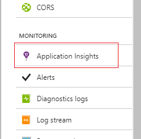

---
title: Profile live web apps on Azure with Application Insights Profiler | Microsoft Docs
description: Identify the hot path in your web server code with a low-footprint profiler.
services: application-insights
documentationcenter: ''
author: mrbullwinkle
manager: carmonm

ms.service: application-insights
ms.workload: tbd
ms.tgt_pltfrm: ibiza
ms.devlang: na
ms.topic: conceptual
ms.reviewer: cawa
ms.date: 08/06/2018
ms.author: mbullwin

---
# Profile live Azure web apps with Application Insights

This feature of Azure Application Insights is generally available for the Web Apps feature of Azure App Service and Azure compute resources. For information regarding [on premises use of profiler](https://docs.microsoft.com/azure/application-insights/enable-profiler-compute#enable-profiler-on-on-premises-servers).

This article discusses the amount of time that's spent in each method of your live web application when you use [Application Insights](app-insights-overview.md). The Application Insights Profiler tool displays detailed profiles of live requests that were served by your app. Profiler highlights the *hot path* that uses the most time. Requests with various response times are profiled on a sampling basis. By using a variety of techniques, you can minimize the overhead that's associated with the application.

Profiler currently works for ASP.NET and ASP.NET Core web apps that are running on Web Apps. The Basic service tier or higher is required to use Profiler.

## <a id="installation"></a> Enable Profiler for your Web Apps

Once you have deployed a Web App, regardless of if you included the App Insights SDK in the source code, do the following:

1. Go to the **App Services** pane in the Azure portal.
1. Navigate to **Settings > Monitoring** pane.

   

1. Either follow the instructions on the pane to create a new resource or select an existing App Insights resource to monitor your web app. Accept all default options. **Code level diagnostics** is on by default and enables Profiler.

   ![Add App Insights site extension][Enablement UI]

1. Profiler is now installed with the App Insights site extension, and is enabled using an App Services App Setting.

    ![App Setting for Profiler][profiler-app-setting]

### Enable Profiler for Azure compute resources

For information, see the [version of Profiler for Azure compute resources](https://go.microsoft.com/fwlink/?linkid=848155).

## View profiler data

Make sure your application is receiving traffic. If you are doing an experiment, you can generate requests to your web app using [Application Insights Performance Testing](https://docs.microsoft.com/vsts/load-test/app-service-web-app-performance-test). If you have newly enabled Profiler, you can run a short load test for about 15 minutes, which should generate profiler traces. If you have had Profiler enabled for a while already, keep in mind that Profiler runs randomly two times every hour and for a duration of two minutes each time it runs. We recommend first running the load test for one hour to make sure you get sample profiler traces.

After your application receives some traffic, go to the **Performance** pane, select **Take Actions** to view profiler traces, and then select the **Profiler Traces** button.

![Application Insights Performance pane preview Profiler traces][performance-blade-v2-examples]

Select a sample to display a code-level breakdown of time spent executing the request.

![Application Insights trace explorer][trace-explorer]

The trace explorer displays the following information:

* **Show Hot Path**: Opens the biggest leaf node, or at least something close. In most cases, this node is adjacent to a performance bottleneck.
* **Label**: The name of the function or event. The tree displays a mix of code and events that occurred (like SQL and HTTP events). The top event represents the overall request duration.
* **Elapsed**: The time interval between the start of the operation and the end of the operation.
* **When**: The time when the function or event was running in relation to other functions.

## How to read performance data

The Microsoft service profiler uses a combination of sampling methods and instrumentation to analyze the performance of your application. When detailed collection is in progress, the service profiler samples the instruction pointer of each machine CPU every millisecond. Each sample captures the complete call stack of the thread that is currently executing. It gives detailed information about what that thread was doing, both at a high level and at a low level of abstraction. The service profiler also collects other events to track activity correlation and causality, including context switching events, Task Parallel Library (TPL) events, and thread pool events.

The call stack that's displayed in the timeline view is the result of the sampling and instrumentation. Because each sample captures the complete call stack of the thread, it includes code from Microsoft .NET Framework, and from other frameworks that you reference.

### <a id="jitnewobj"></a>Object allocation (clr!JIT\_New or clr!JIT\_Newarr1)

**clr!JIT\_New** and **clr!JIT\_Newarr1** are helper functions in the .NET Framework that allocate memory from a managed heap. **clr!JIT\_New** is invoked when an object is allocated. **clr!JIT\_Newarr1** is invoked when an object array is allocated. These two functions are usually fast and take relatively small amounts of time. If you see **clr!JIT\_New** or **clr!JIT\_Newarr1** take a substantial amount of time in your timeline, it indicates that the code might be allocating many objects and consuming significant amounts of memory.

### <a id="theprestub"></a>Loading code (clr!ThePreStub)

**clr!ThePreStub** is a helper function in the .NET Framework that prepares the code to execute for the first time. This usually includes, but is not limited to, just-in-time (JIT) compilation. For each C# method, **clr!ThePreStub** should be invoked at most once during the lifetime of a process.

If **clr!ThePreStub** takes a substantial amount of time for a request, this indicates that the request is the first one that executes that method. The time for the .NET Framework runtime to load the first method is significant. You might consider using a warmup process that executes that portion of the code before your users access it, or consider running Native Image Generator (ngen.exe) on your assemblies.

### <a id="lockcontention"></a>Lock contention (clr!JITutil\_MonContention or clr!JITutil\_MonEnterWorker)

**clr!JITutil\_MonContention** or **clr!JITutil\_MonEnterWorker** indicates that the current thread is waiting for a lock to be released. This text is often displayed when you execute a C# **LOCK** statement, when invoking the **Monitor.Enter** method, or when invoking a method with the **MethodImplOptions.Synchronized** attribute. Lock contention usually occurs when thread _A_ acquires a lock, and thread _B_ tries to acquire the same lock before thread _A_ releases it.

### <a id="ngencold"></a>Loading code ([COLD])

If the method name contains **[COLD]**, such as **mscorlib.ni![COLD]System.Reflection.CustomAttribute.IsDefined**, the .NET Framework runtime is executing code for the first time that is not optimized by <a href="https://msdn.microsoft.com/library/e7k32f4k.aspx">profile-guided optimization</a>. For each method, it should be displayed at most once during the lifetime of the process.

If loading code takes a substantial amount of time for a request, this indicates that the request is the first one to execute the unoptimized portion of the method. Consider using a warmup process that executes that portion of the code before your users access it.

### <a id="httpclientsend"></a>Send HTTP request

Methods like **HttpClient.Send** indicate that the code is waiting for an HTTP request to be completed.

### <a id="sqlcommand"></a>Database operation

Methods like **SqlCommand.Execute** indicate that the code is waiting for a database operation to finish.

### <a id="await"></a>Waiting (AWAIT\_TIME)

**AWAIT\_TIME** indicates that the code is waiting for another task to finish. This usually happens with the C# **AWAIT** statement. When the code does a C# **AWAIT**, the thread unwinds and returns control to the thread pool, and there is no thread that is blocked waiting for the **AWAIT** to finish. However, logically, the thread that did the **AWAIT** is "blocked," and is waiting for the operation to finish. The **AWAIT\_TIME** statement indicates the blocked time waiting for the task to finish.

### <a id="block"></a>Blocked time

**BLOCKED_TIME** indicates that the code is waiting for another resource to be available. For example, it might be waiting for a synchronization object, for a thread to be available, or for a request to finish.

### <a id="cpu"></a>CPU time

The CPU is busy executing the instructions.

### <a id="disk"></a>Disk time

The application is performing disk operations.

### <a id="network"></a>Network time

The application is performing network operations.

### <a id="when"></a>When column

The **When** column is a visualization of how the INCLUSIVE samples collected for a node vary over time. The total range of the request is divided into 32 time buckets. The inclusive samples for that node are accumulated in those 32 buckets. Each bucket is represented as a bar. The height of the bar represents a scaled value. For nodes that are marked **CPU_TIME** or **BLOCKED_TIME**, or where there is an obvious relationship to consuming a resource (for example, a CPU, disk, or thread), the bar represents the consumption of one of the resources during the period of that bucket. For these metrics, it's possible to get a value of greater than 100 percent by consuming multiple resources. For example, if you use, on average, two CPUs during an interval, you get 200 percent.

## Limitations

The default data retention period is five days. The maximum data that's ingested per day is 10 GB.

There are no charges for using the Profiler service. For you to use the Profiler service, your web app must be hosted in at least the Basic tier of Web Apps.

## Overhead and sampling algorithm

Profiler randomly runs two minutes every hour on each virtual machine that hosts the application that has Profiler enabled for capturing traces. When Profiler is running, it adds from 5 percent to 15 percent CPU overhead to the server.

The more servers that are available for hosting the application, the less impact Profiler has on the overall application performance. This is because the sampling algorithm results in Profiler running on only 5 percent of servers at any time. More servers are available to serve web requests to offset the server overhead caused by running Profiler.

## Disable Profiler

To stop or restart Profiler for an individual web app's instance, under **Web Jobs**, go to the Web Apps resource. To delete Profiler, go to **Extensions**.

![Disable Profiler for a web job][disable-profiler-webjob]

We recommend that you have Profiler enabled on all your web apps to discover any performance issues as early as possible.

If you use WebDeploy to deploy changes to your web application, ensure that you exclude the App_Data folder from being deleted during deployment. Otherwise, the Profiler extension's files are deleted the next time you deploy the web application to Azure.


## <a id="troubleshooting"></a>Troubleshooting

### Too many active profiling sessions

Currently, you can enable Profiler on a maximum of four Azure web apps and deployment slots that are running in the same service plan. If the Profiler web job is reporting too many active profiling sessions, move some web apps to a different service plan.

### How do I determine whether Application Insights Profiler is running?

Profiler runs as a continuous web job in the web app. You can open the web app resource in the [Azure portal](https://portal.azure.com). In the **WebJobs** pane, check the status of **ApplicationInsightsProfiler**. If it isn't running, open **Logs** to get more information.

### Why can't I find any stack examples, even though Profiler is running?

Here are a few things that you can check:

* Make sure that your web app service plan is Basic tier or higher.
* Make sure that your web app has Application Insights SDK 2.2 Beta or later enabled.
* Make sure that your web app has the **APPINSIGHTS_INSTRUMENTATIONKEY** setting configured with the same instrumentation key that's used by the Application Insights SDK.
* Make sure that your web app is running on .NET Framework 4.6.
* If your web app is an ASP.NET Core application, it must be running at least ASP.NET Core 2.0.

After Profiler is started, there is a short warmup period during which Profiler actively collects several performance traces. After that, Profiler collects performance traces for two minutes every hour.

> [!NOTE]
> There is a bug in the profiler agent that prevents it from uploading traces taken from applications running on ASP.NET Core 2.1. We are working on a fix and will have it ready soon.

### I was using Azure Service profiler. What happened to it?

When you enable Application Insights Profiler, the Azure Service profiler agent is disabled.

### <a id="double-counting"></a>Double counting in parallel threads

In some cases, the total time metric in the stack viewer is more than the duration of the request.

This situation might occur when two or more threads are associated with a request, and they are operating in parallel. In that case, the total thread time is more than the elapsed time. One thread might be waiting on the other to be completed. The viewer tries to detect this and omits the uninteresting wait, but it errs on the side of displaying too much information rather than omit what might be critical information.

When you see parallel threads in your traces, determine which threads are waiting so you can ascertain the critical path for the request. In most cases, the thread that quickly goes into a wait state is simply waiting on the other threads. Concentrate on the other threads, and ignore the time in the waiting threads.

### <a id="issue-loading-trace-in-viewer"></a>No profiling data

Here are a few things that you can check:

* If the data you are trying to view is older than a couple of weeks, try limiting your time filter and try again.
* Ensure that proxies or a firewall have not blocked access to https://gateway.azureserviceprofiler.net.
* Ensure that the Application Insights instrumentation key you are using in your app is the same as the Application Insights resource that you used to enable profiling. The key is usually in the ApplicationInsights.config file, but it might also be in the web.config or app.config file.

### Error report in the profiling viewer

Submit a support ticket in the portal. Be sure to include the correlation ID from the error message.

### Deployment error: Directory Not Empty 'D:\\home\\site\\wwwroot\\App_Data\\jobs'

If you are redeploying your web app to a Web Apps resource with Profiler enabled, you might see a message like the following:

*Directory Not Empty 'D:\\home\\site\\wwwroot\\App_Data\\jobs'*

This error occurs if you run Web Deploy from scripts or from the Azure DevOps Deployment Pipeline. The solution is to add the following additional deployment parameters to the Web Deploy task:

```
-skip:Directory='.*\\App_Data\\jobs\\continuous\\ApplicationInsightsProfiler.*' -skip:skipAction=Delete,objectname='dirPath',absolutepath='.*\\App_Data\\jobs\\continuous$' -skip:skipAction=Delete,objectname='dirPath',absolutepath='.*\\App_Data\\jobs$'  -skip:skipAction=Delete,objectname='dirPath',absolutepath='.*\\App_Data$'
```

These parameters delete the folder that's used by Application Insights Profiler and unblock the redeploy process. They don't affect the Profiler instance that's currently running.

## Manual installation

When you configure Profiler, updates are made to the web app's settings. You can apply the updates manually if your environment requires it. An example might be that your application is running in a Web Apps environment for PowerApps.

1. In the **Web App Control** pane, open **Settings**.
1. Set **.Net Framework version** to **v4.6**.
1. Set **Always On** to **On**.
1. Add the **APPINSIGHTS_INSTRUMENTATIONKEY** app setting, and set the value to the same instrumentation key that's used by the SDK.
1. Open **Advanced Tools**.
1. Select **Go** to open the Kudu website.
1. On the Kudu website, select **Site extensions**.
1. Install **Application Insights** from the Azure Web Apps Gallery.
1. Restart the web app.

## <a id="profileondemand"></a> Manually trigger Profiler

Profiler can be triggered manually with one button click. Suppose you are running a web performance test. You will need traces to help you understand how your web app is performing under load. Having control over when traces are captured is crucial since you know when load test will be running, but the random sampling interval might miss it.
The following steps illustrate how this scenario works:

### (Optional) Step 1: Generate traffic to your web app by starting a web performance test

If your web app already has incoming traffic or if you just want to manually generate traffic, skip this section and proceed to Step 2.

Navigate to Application Insights portal, **Configure > Performance Testing**. Click on New button to start a new performance test.
![create new performance test][create-performance-test]

In the **New performance test** pane, configure the test target URL. Accept all default settings and start running the load test.

![Configure load test][configure-performance-test]

You will see the new test is queued first, followed by a status of in progress.

![load test is submitted and queued][load-test-queued]

![load test is running in progress][load-test-in-progress]

### Step 2: Start profiler on-demand

Once the load test is running, we can start profiler to capture traces on the web app while it's receiving load.
Navigate to Configure Profiler pane:

![configure profiler pane entry][configure-profiler-entry]

On the **Configure Profiler pane**, there is a **Profile Now** button to trigger profiler on all instances of the linked web apps. In addition, you are provided visibility on when profiler was running in the past.

![Profiler on-demand][profiler-on-demand]

You will see notification and status change on the profiler run status.

### Step 3: View traces

Once the profiler finishes running, follow the instructions on notification to go to Performance blade and view traces.

### Troubleshooting on-demand profiler

Sometimes you might see Profiler timeout error message after an on-demand session:

![Profiler timeout error][profiler-timeout]

There could be two reasons why you see this error:

1. The on-demand profiler session was successful, but Application Insights took a longer time to process the collected data. If data did not finish being processed in 15 minutes, the portal will display a timeout message. Though after a while, Profiler traces will show up. If this happens, please just ignore the error message for now. We are actively working on a fix

1. Your web app has an older version of Profiler agent that does not have the on-demand feature. If you enabled Application Insights Profile previously, chances are you need to update your Profiler agent to start using the on-demand capability.
  
Follow these steps to check and install the latest Profiler:

1. Go to App Services App Settings and check if the following settings are set:
    * **APPINSIGHTS_INSTRUMENTATIONKEY**: Replace with the proper instrumentation key for Application Insights.
    * **APPINSIGHTS_PORTALINFO**: ASP.NET
    * **APPINSIGHTS_PROFILERFEATURE_VERSION**: 1.0.0
If any of these settings are not set, go to the Application Insights enablement pane to install the latest site extension.

1. Go to Application Insights pane in App Services portal.

    ![Enable Application Insights from App Services portal][enable-app-insights]

1. If you see an ‘Update’ button in the following page, click it to update Application Insights site extension which will install the latest Profiler agent.
![Update site extension][update-site-extension]

1. Then click **change** to making sure the Profiler is turned on and select **OK** to save the changes.

    ![Change and save app insights][change-and-save-appinsights]

1. Go back to **App Settings** tab for the App Service to double-check the following app settings items are set:
    * **APPINSIGHTS_INSTRUMENTATIONKEY**: Replace with the proper instrumentation key for application insights.
    * **APPINSIGHTS_PORTALINFO**: ASP.NET
    * **APPINSIGHTS_PROFILERFEATURE_VERSION**: 1.0.0

    ![app settings for profiler][app-settings-for-profiler]

1. Optionally, check the extension version and making sure there’s no update available.

    ![check for extension update][check-for-extension-update]

## Next steps

* [Working with Application Insights in Visual Studio](https://docs.microsoft.com/azure/application-insights/app-insights-visual-studio)

[appinsights-in-appservices]:./media/app-insights-profiler/AppInsights-AppServices.png
[Enablement UI]: ./media/app-insights-profiler/Enablement_UI.png
[profiler-app-setting]:./media/app-insights-profiler/profiler-app-setting.png
[performance-blade]: ./media/app-insights-profiler/performance-blade.png
[performance-blade-examples]: ./media/app-insights-profiler/performance-blade-examples.png
[performance-blade-v2-examples]:./media/app-insights-profiler/performance-blade-v2-examples.png
[trace-explorer]: ./media/app-insights-profiler/trace-explorer.png
[trace-explorer-toolbar]: ./media/app-insights-profiler/trace-explorer-toolbar.png
[trace-explorer-hint-tip]: ./media/app-insights-profiler/trace-explorer-hint-tip.png
[trace-explorer-hot-path]: ./media/app-insights-profiler/trace-explorer-hot-path.png
[enable-profiler-banner]: ./media/app-insights-profiler/enable-profiler-banner.png
[disable-profiler-webjob]: ./media/app-insights-profiler/disable-profiler-webjob.png
[linked app services]: ./media/app-insights-profiler/linked-app-services.png
[create-performance-test]: ./media/app-insights-profiler/new-performance-test.png
[configure-performance-test]: ./media/app-insights-profiler/configure-performance-test.png
[load-test-queued]: ./media/app-insights-profiler/load-test-queued.png
[load-test-in-progress]: ./media/app-insights-profiler/load-test-inprogress.png
[profiler-on-demand]: ./media/app-insights-profiler/Profiler-on-demand.png
[configure-profiler-entry]: ./media/app-insights-profiler/configure-profiler-entry.png
[enable-app-insights]: ./media/app-insights-profiler/enable-app-insights-blade-01.png
[update-site-extension]: ./media/app-insights-profiler/update-site-extension-01.png
[change-and-save-appinsights]: ./media/app-insights-profiler/change-and-save-appinsights-01.png
[app-settings-for-profiler]: ./media/app-insights-profiler/appsettings-for-profiler-01.png
[check-for-extension-update]: ./media/app-insights-profiler/check-extension-update-01.png
[profiler-timeout]: ./media/app-insights-profiler/profiler-timeout.png
