<properties
	pageTitle="Release notes for Visual Studio Extension for Developer Analytics"
	description="The latest updates for Visual Studio tools for Developer Analytics."
	services="application-insights"
    documentationCenter=""
	authors="acearun"
	manager="douge"/>
<tags
	ms.service="application-insights"
	ms.workload="tbd"
	ms.tgt_pltfrm="ibiza"
	ms.devlang="na"
	ms.topic="article"
	ms.date="06/09/2016"
	ms.author="acearun"/>

# Release Notes for Developer Analytics Tools
What's new: Application Insights and HockeyApp analytics in Visual Studio.
## Version 7.0
### Visual Studio Application Insights Trends
Visual Studio Application Insights is a new tool in Visual Studio that you can use to help you analyze how your app operates over time. To get started, on the **Application Insights** toolbar button or in the Application Insights Search window, choose **Explore Telemetry Trends**. Or, on the **View** menu, click **Other Windows**, and then click **Application Insights Trends**. Choose one of five common queries to get started. You can analyze different data sets based on telemetry types, time ranges, and other properties. To find anomalies in your data, choose one of the anomaly options in the **View Type** drop-down list. The filtering options at the bottom of the window make it easy to hone in on specific subsets of your telemetry.

### Exceptions in CodeLens
Exception telemetry is now displayed in CodeLens. If you've connected your project to the Application Insights service, you'll see the number of exceptions that have occurred in each method in production in the past 24 hours. From CodeLens, you can jump to Search or Trends to investigate the exceptions in more detail.

### ASP.NET Core support
Application Insights now supports ASP.NET Core RC2 projects in Visual Studio. You can add Application Insights to new ASP.NET Core RC2 projects from the **New Project** dialog, as in the following screenshot. Or, you can add it to an existing project, right-click the project in Solution Explorer, and then click **Add Application Insights Telemetry**.

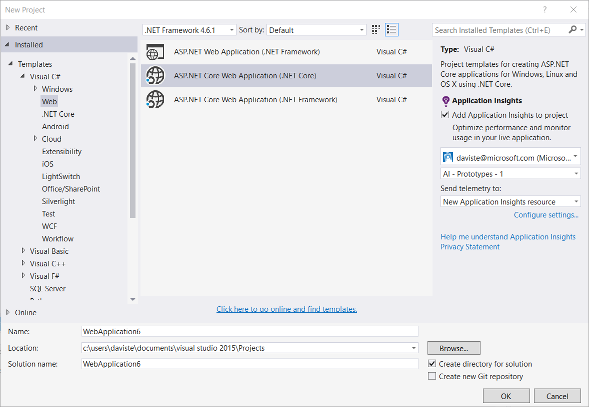

ASP.NET 5 RC1 and ASP.NET Core RC2 projects also have new support in the Diagnostic Tools window. You'll see Application Insights events like requests and exceptions from your ASP.NET app while you debug locally on your PC. From each event, click **Search** to drill down for more information.

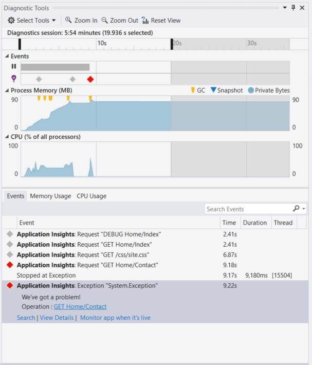

### HockeyApp for Universal Windows apps
In addition to beta distribution and user feedback, HockeyApp provides symbolicated crash reporting for your Universal Windows apps. We've made it even easier to add the HockeyApp SDK: right-click on your Universal Windows project, and then click **Hockey App - Enable Crash Analytics**. This installs the SDK, sets up crash collection, and provisions a HockeyApp resource in the cloud, all without uploading your app to the HockeyApp service.

Other new features:

* We've made the Application Insights Search experience faster and more intuitive. Now, time ranges and detail filters are automatically applied as you select them.
* Also in Application Insights Search, now there's an option to jump to the code directly from the request telemetry.
* We've made improvements to the HockeyApp sign-in experience.
* In Diagnostic Tools, production telemetry information for exceptions is displayed.

## Version 5.2
We are happy to announce the introduction of HockeyApp scenarios in Visual Studio. The first integration is in beta distribution of Universal Windows apps and Windows Forms apps from within Visual Studio.

With beta distribution, you upload early versions of your apps to HockeyApp for distribution to a selected subset of customers or testers. Beta distribution, combined with HockeyApp crash collection and user feedback features, can provide you with valuable information about your app before you make a broad release. You can use this information to address issues with your app so that you can avoid or minimize future problems, such as low app ratings, negative feedback, and so on.

Check out how simple it is to upload builds for beta distribution from within Visual Studio.
### Universal Windows apps
The context menu for a Universal Windows app project node now includes an option to upload your build to HockeyApp.

Choose the item and the HockeyApp upload dialog box opens. You will need a HockeyApp account to upload your build. If you are a new user, don't worry. Creating an account is a simple process.

When you are connected, you will see the upload form in the dialog.

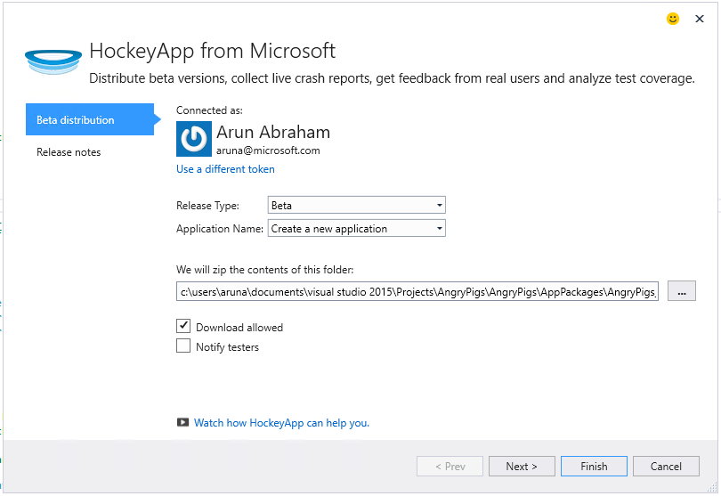

Select the content to upload (an .appxbundle or .appx file), and then choose release options in the wizard. Optionally, you can add release notes on the next page. Choose **Finish** to begin the upload.

When the upload is complete, a HockeyApp notification with confirmation and a link to the app in the HockeyApp portal appears.

That’s it! You've just uploaded a build for beta distribution with just a few clicks.

You can manage your application in numerous ways in the HockeyApp portal. This includes inviting users, viewing crash reports and feedback, changing details, and so on.

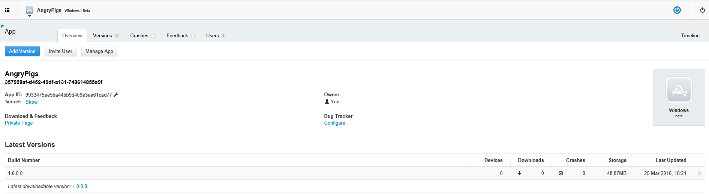

See the [HockeyApp Knowledge Base](http://support.hockeyapp.net/kb/app-management-2) for more details about app management.

### Windows Forms apps
The context menu for a Windows Form project node now includes an option to upload your build to HockeyApp.

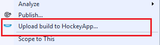

This opens the HockeyApp upload dialog, which is similar to the one in a Universal Windows app.

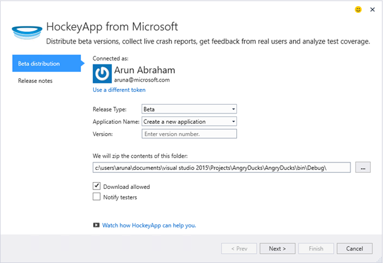

Note a new field in this wizard, for specifying the version of the app. For Universal Windows apps, the information is populated from the manifest. Windows Forms apps, unfortunately, don’t have an equivalent to this feature. You will need to specify them manually.

The rest of the flow is similar to Universal Windows apps: choose build and release options, add release notes, upload, and manage in the HockeyApp portal.

It’s as simple as that. Give it a try and let us know what you think.
## Version 4.3
### Search telemetry from local debug sessions
With this release, you can now search for Application Insights telemetry generated in the Visual Studio debug session. Before, you could use search only if you registered your app with Application Insights. Now, your app only needs to have the Application Insights SDK installed to search for local telemetry.

If you have an ASP.NET application with the Application Insights SDK, do the following steps to use Search.

1. Debug your application.
2. Open Application Insights Search in one of these ways:
	- On the **View** menu, click **Other Windows**, and then click **Application Insights Search**.
	- Click the **Application Insights** toolbar button.
	- In Solution Explorer, expand **ApplicationInsights.config**, and then click **Search debug session telemetry**.
3. If you haven't signed up with Application Insights, the Search window will open in debug session telemetry mode.
4. Click the **Search** icon to see your local telemetry.

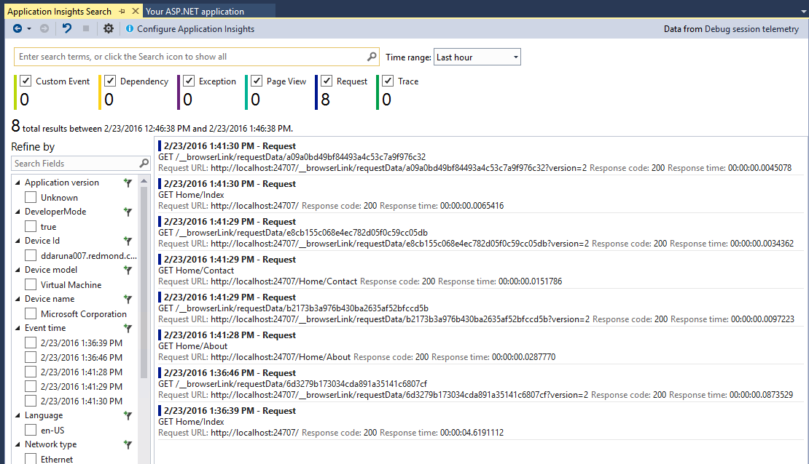

## Version 4.2
In this release, we added features to make searching for data easier in the context of events, with the ability to jump to code from more data events, and an effortless experience to send your logging data to Application Insights. This extension is updated monthly. If you have feedback or feature requests, send it to aidevtools@microsoft.com.
### No-click logging experience
If you're already using NLog, log4net, or System.Diagnostics.Tracing, you don't have to worry about moving all of your traces to Application Insights. In this release, we've integrated the Application Insights logging adapters with the normal configuration experience.
If you already have one of these logging frameworks configured, the following section describes how to get it.
**If you've already added Application Insights:**
1. Right-click the project node, and then click **Application Insights**, and then click **Configure Application Insights**. Make sure that you see the option to add the correct adapter in the configuration window.
2. Alternatively, when you build the solution, note the pop-up window that appears on the top right of your screen and click **Configure**.

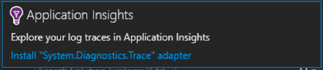

When you have the Logging adapter installed, run your application and make sure you see the data in the diagnostic tools tab, like this:

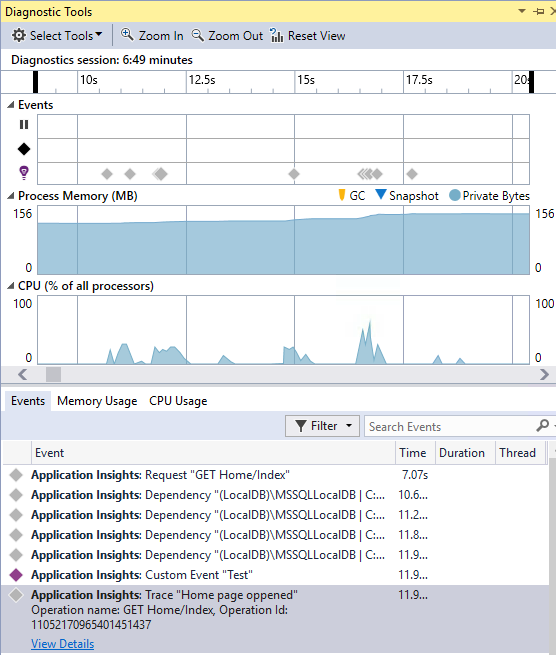

### Jump to or find the code where the telemetry event property is emitted
With the new release user can click on any value in the event detail and this will search for a matching string in the current open solution. Results will show up in Visual Studio "Find Results" list as shown below:

### New Search window for when you are not signed in
We've improved the look of the Application Insights Search window to help you search your data while your app is in production.

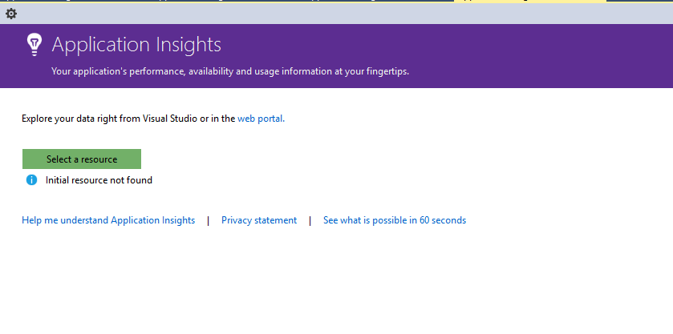

### See all telemetry events associated with the event
We've added a new tab, with predefined queries for all data related to the telemetry event the user is viewing, next to the tab for event details. For example, a request has a field called **Operation ID**. Every event associated to this request has the same value for **Operation ID**. If an exception occurs while the operation is processing the request, the exception is given the same operation ID as the request to make it easier to find. If you're looking at a request, click **All telemetry for this operation** to open a new tab that displays the new search results.

### Forward and Back history in Search
Now you can go back and forth between search results.

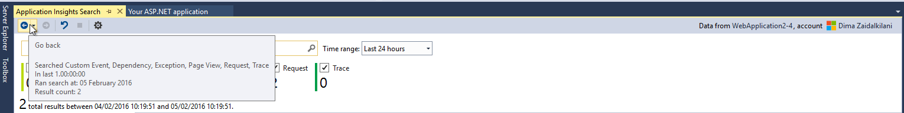

## Version 4.1
This release comes with a number of new features and updates. You need to have Update 1 installed to install this release.

### Jump from an exception to method in source code
Now, if you view exceptions from your production app in the Application Insights Search window, you can jump to the method in your code where the exception is occurring. You only need to have the correct project loaded and Application Insights takes care of the rest! (To learn more about the Application Insights Search window, see the release notes for Version 4.0 in the following sections.)

How does it work? You can use Applications Insights Search even when a solution isn't open. The stack trace area displays an information message, and many of the items in the stack trace are unavailable.

If file information is available, some items might be links, but the solution information item will still be visible.

If you click the hyperlink, you'll jump to the location of the selected method in your code. There might be a difference in the version number, but the feature, to jump to the correct version of the code, will come in later releases.

### New entry points to the Search experience in Solution Explorer
Now you can access Search through Solution Explorer.

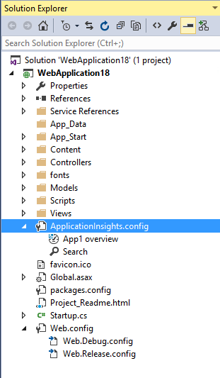

### Displays a notification when publish is completed
A pop-up dialog box appears when the project is published online, so that you can view your Application Insights data in production.

## Version 4.0

### Search Application Insights data from within Visual Studio
Like the search function in the Application Insights portal, now in Visual Studio you can filter and search on event types, property values, and text, and then inspect individual events.

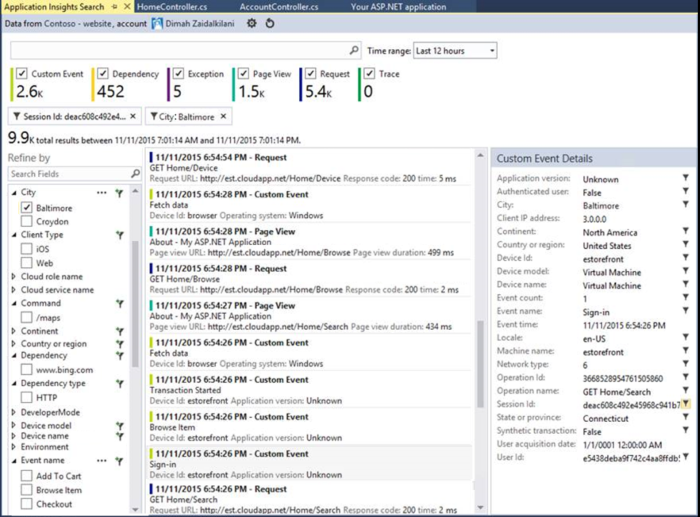

### See data coming from your local computer in Diagnostic Tools

You can view your telemetry, in addition to other debugging data, on the Visual Studio Diagnostic Tools page. Only ASP.NET 4.5 is supported.

### Add the SDK to your project without signing in to Azure

You no longer have to sign in to Azure to add Application Insights packages to your project, either through the **New Project** dialog or from the project context menu. If you do sign in, the SDK will be installed and configured to send telemetry to the portal as before. If you don’t sign in, the SDK will be added to your project and it will generate telemetry for the diagnostic hub. You can configure it later if you want.

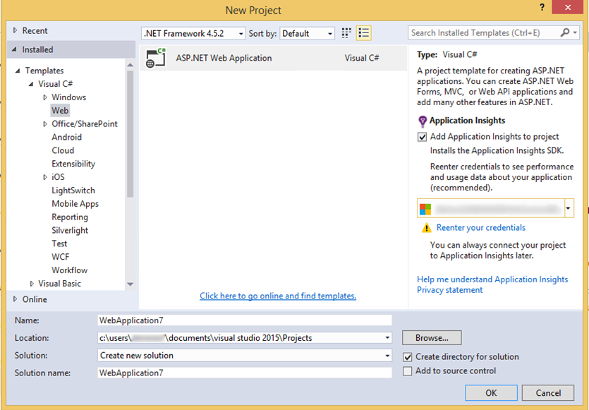

### Device support

At *Connect();* 2015, we [announced](https://azure.microsoft.com/blog/deep-diagnostics-for-web-apps-with-application-insights/) that our mobile developer experience for devices is HockeyApp. HockeyApp helps you distribute beta builds to your testers, collect and analyze all crashes from your app, and collect feedback directly from your customers.
HockeyApp supports your app on whichever platform you choose to build it, whether that be iOS, Android, or Windows, or a cross-platform solution like Xamarin, Cordova, or Unity.

In future releases of the Application Insights extension, we’ll introduce a more integrated experience between HockeyApp and Visual Studio. For now, you can start with HockeyApp by simply adding the NuGet reference. See the [documentation](http://support.hockeyapp.net/kb/client-integration-windows-and-windows-phone) for more information.
