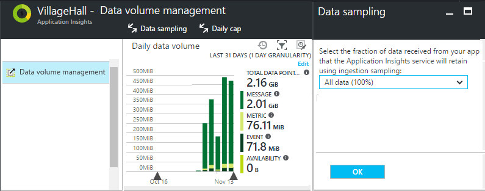

<properties 
	pageTitle="Telemetry sampling in Application Insights" 
	description="How to keep the volume of telemetry under control." 
	services="application-insights" 
    documentationCenter="windows"
	authors="vgorbenko" 
	manager="douge"/>

<tags 
	ms.service="application-insights" 
	ms.workload="tbd" 
	ms.tgt_pltfrm="ibiza" 
	ms.devlang="na" 
	ms.topic="article" 
	ms.date="05/07/2016" 
	ms.author="awills"/>

#  Sampling in Application Insights

*Application Insights is in preview.*


Sampling is a feature in Application Insights that allows you to collect and store a reduced set of telemetry while maintaining a statistically correct analysis of application data.  It reduces traffic and helps avoid [throttling](app-insights-pricing.md#data-rate). The data is filtered in such a way that related items are allowed through, so that you can navigate between items when you're performing diagnostic investigations.
When metric counts are presented to you in the portal, they are renormalized to take account of the sampling, to minimize any effect on the statistics.

Sampling is currently in Beta, and may change in the future.

## In brief:

* Sampling retains 1 in *n* records and discards the rest. For example, it might retain 1 in 5 events, a sampling rate of 20%.
* Sampling happens automatically if your application sends a lot of telemetry. Automatic sampling only kicks in at high volumes, and only in ASP.NET web server apps.
* You can also set sampling manually, either in the portal on the pricing page (to reduce the volume of telemetry retained, and keep within your monthly quota); or in the ASP.NET SDK in the .config file, to also reduce the network traffic.
* The current sampling rate is a property of each record. In the Search window, open an event such as a request. Expand the full properties ellipsis "..." to find the "* count" property - named, for example, "request count" or "event count", depending on the type of telemetry. If it is > 1, then sampling is occurring. A count of 3 would mean that sampling is at 33%: each retained record stands for 3 originally generated records.
* If you log custom events and you want to make sure that a set of events is either retained or discarded together, make sure that they have the same OperationId value.
* If you write Analytics queries, you should [take account of sampling](app-insights-analytics-tour.md#counting-sampled-data). In particular, instead of simply counting records, you should use `summarize sum(itemCount)`.


## Types of sampling

There are three alternative sampling methods:

* **Adaptive sampling** automatically adjusts the volume of telemetry sent from the SDK in your ASP.NET app. Default from SDK v 2.0.0-beta3.
* **Fixed-rate sampling** reduces the volume of telemetry sent from both your ASP.NET server and from your users' browsers. You set the rate.
* **Ingestion sampling** reduces the volume of telemetry retained by the Application Insights service, at a rate that you set. It doesn't reduce telemetry traffic, but helps you keep within your monthly quota. 

## Ingestion sampling

This form of sampling operates at the point where the telemetry from your web server, browsers, and devices reaches the Application Insights service endpoint. Although it doesn't reduce the telemetry traffic sent from your app, it does reduce the amount processed and retained (and charged for) by Application Insights.

Use this type of sampling if your app often goes over its monthly quota and you don't have the option of using either of the SDK-based types of sampling. 

Set the sampling rate in the Quotas and Pricing blade:



Like other types of sampling, the algorithm retains related telemetry items. For example, when you're inspecting the telemetry in Search, you'll be able to find the request related to a particular exception. Metric counts such as request rate and exception rate are correctly retained.

Data points that are discarded by sampling are not available in any Application Insights feature such as [Continuous Export](app-insights-export-telemetry.md).

Ingestion sampling doesn't operate while SDK-based adaptive or fixed-rate sampling is in operation. If the sampling rate at the SDK  is less than 100%, then the ingestion sampling rate that you set is ignored.


## Adaptive sampling at your web server

Adaptive sampling is available for the Application Insights SDK for ASP.NET v 2.0.0-beta3 and later, and is enabled by default. 


Adaptive sampling affects the volume of telemetry sent from your web server app to the Application Insights service. The volume is adjusted automatically to keep within a specified maximum rate of traffic.

It doesn't operate at low volumes of telemetry, so an app in debugging or a website with low usage won't be affected.

To achieve the target volume, some of the telemetry generated is discarded. But like other types of sampling, the algorithm retains related telemetry items. For example, when you're inspecting the telemetry in Search, you'll be able to find the request related to a particular exception. 

Metric counts such as request rate and exception rate are adjusted to compensate for the sampling rate, so that they show approximately correct values in Metric Explorer.

**Update your project's NuGet** packages to the latest *pre-release* version of Application Insights: Right-click the project in Solution Explorer, choose Manage NuGet Packages, check **Include prerelease** and search for Microsoft.ApplicationInsights.Web. 

In [ApplicationInsights.config](app-insights-configuration-with-applicationinsights-config.md), you can adjust a number of parameters in the `AdaptiveSamplingTelemetryProcessor` node. The figures shown are the default values:

* `<MaxTelemetryItemsPerSecond>5</MaxTelemetryItemsPerSecond>`

    The target rate that the adaptive algorithm aims for **on a single server host**. If your web app runs on many hosts, you will want to reduce this value so as to remain within your target rate of traffic at the Application Insights portal.

* `<EvaluationInterval>00:00:15</EvaluationInterval>` 

    The interval at which the current rate of telemetry is re-evaluated. Evaluation is performed as a moving average. You might want to shorten this interval if your telemetry is liable to sudden bursts.

* `<SamplingPercentageDecreaseTimeout>00:02:00</SamplingPercentageDecreaseTimeout>`

    When sampling percentage value changes, how soon after are we allowed to lower sampling percentage again to capture less data.

* `<SamplingPercentageIncreaseTimeout>00:15:00</SamplingPercentageIncreaseTimeout>`

    When sampling percentage value changes, how soon after are we allowed to increase sampling percentage again to capture more data.

* `<MinSamplingPercentage>0.1</MinSamplingPercentage>`

    As sampling percentage varies, what is the minimum value we're allowed to set.

* `<MaxSamplingPercentage>100.0</MaxSamplingPercentage>`

    As sampling percentage varies, what is the maximum value we're allowed to set.

* `<MovingAverageRatio>0.25</MovingAverageRatio>` 

    In the calculation of the moving average, the weight assigned to the most recent value. Use a value equal to or less than 1. Smaller values make the algorithm less reactive to sudden changes.

* `<InitialSamplingPercentage>100</InitialSamplingPercentage>`

    The value assigned when the app has just started. Don't reduce this while you're debugging. 

### Alternative: configure adaptive sampling in code

Instead of adjusting sampling in the .config file, you can use code. This allows you to specify a callback function that is invoked whenever the sampling rate is re-evaluated. You could use this, for example, to find out what sampling rate is being used.

Remove the `AdaptiveSamplingTelemetryProcessor` node from the .config file.


*C#*

```C#

    using Microsoft.ApplicationInsights;
    using Microsoft.ApplicationInsights.Extensibility;
    using Microsoft.ApplicationInsights.WindowsServer.Channel.Implementation;
    using Microsoft.ApplicationInsights.WindowsServer.TelemetryChannel;
    ...

    var adaptiveSamplingSettings = new SamplingPercentageEstimatorSettings();

    // Optional: here you can adjust the settings from their defaults.

    var builder = TelemetryConfiguration.Active.GetTelemetryProcessorChainBuilder();
    
    builder.UseAdaptiveSampling(
         adaptiveSamplingSettings,

        // Callback on rate re-evaluation:
        (double afterSamplingTelemetryItemRatePerSecond,
         double currentSamplingPercentage,
         double newSamplingPercentage,
         bool isSamplingPercentageChanged,
         SamplingPercentageEstimatorSettings s
        ) =>
        {
          if (isSamplingPercentageChanged)
          {
             // Report the sampling rate.
             telemetryClient.TrackMetric("samplingPercentage", newSamplingPercentage);
          }
      });

    // If you have other telemetry processors:
    builder.Use((next) => new AnotherProcessor(next));

    builder.Build();

```

([Learn about telemetry processors](app-insights-api-filtering-sampling.md#filtering).)


<a name="other-web-pages"></a>
## Sampling for web pages with JavaScript

You can configure web pages for fixed-rate sampling from any server. 

When you [configure the web pages for Application Insights](app-insights-javascript.md), modify the snippet that you get from the Application Insights portal. (In ASP.NET apps, the snippet typically goes in _Layout.cshtml.)  Insert a line like `samplingPercentage: 10,` before the instrumentation key:

    <script>
	var appInsights= ... 
	}({ 


    // Value must be 100/N where N is an integer.
    // Valid examples: 50, 25, 20, 10, 5, 1, 0.1, ...
	samplingPercentage: 10, 

	instrumentationKey:...
	}); 
	
	window.appInsights=appInsights; 
	appInsights.trackPageView(); 
	</script> 

For the sampling percentage, choose a percentage that is close to 100/N where N is an integer.  Currently sampling doesn't support other values.

If you also enable fixed-rate sampling at the server, the clients and server will synchronize so that, in Search, you can  navigate between related page views and requests.


## Fixed-rate sampling for ASP.NET web sites

Fixed rate sampling reduces the traffic sent from your web server and web browsers. Unlike adaptive sampling, it reduces telemetry at a fixed rate decided by you. It also synchronizes the client and server sampling so that related items are retained - for example, so that if you look at a page view in Search, you can find its related request.

The sampling algorithm retains related items. For each HTTP request event, it and its related events are either discarded or transmitted. 

In Metrics Explorer, rates such as request and exception counts are multiplied by a factor to compensate for the sampling rate, so that they are approximately correct.

1. **Update your project's NuGet packages** to the latest *pre-release* version of Application Insights. Right-click the project in Solution Explorer, choose Manage NuGet Packages, check **Include prerelease** and search for Microsoft.ApplicationInsights.Web. 

2. **Disable adaptive sampling**: In [ApplicationInsights.config](app-insights-configuration-with-applicationinsights-config.md), remove or comment out the `AdaptiveSamplingTelemetryProcessor` node.

    ```xml

    <TelemetryProcessors>
    <!-- Disabled adaptive sampling:
      <Add Type="Microsoft.ApplicationInsights.WindowsServer.TelemetryChannel.AdaptiveSamplingTelemetryProcessor, Microsoft.AI.ServerTelemetryChannel">
        <MaxTelemetryItemsPerSecond>5</MaxTelemetryItemsPerSecond>
      </Add>
    -->
    

    ```

2. **Enable the fixed-rate sampling module.** Add this snippet to [ApplicationInsights.config](app-insights-configuration-with-applicationinsights-config.md):

    ```XML

    <TelemetryProcessors>
     <Add  Type="Microsoft.ApplicationInsights.WindowsServer.TelemetryChannel.SamplingTelemetryProcessor, Microsoft.AI.ServerTelemetryChannel">

      <!-- Set a percentage close to 100/N where N is an integer. -->
     <!-- E.g. 50 (=100/2), 33.33 (=100/3), 25 (=100/4), 20, 1 (=100/100), 0.1 (=100/1000) -->
      <SamplingPercentage>10</SamplingPercentage>
      </Add>
    </TelemetryProcessors>

    ```

> [AZURE.NOTE] For the sampling percentage, choose a percentage that is close to 100/N where N is an integer.  Currently sampling doesn't support other values.


### Alternative: enable fixed-rate sampling in your server code


Instead of setting the sampling parameter in the .config file, you can use code. 

*C#*

```C#

    using Microsoft.ApplicationInsights.Extensibility;
    using Microsoft.ApplicationInsights.WindowsServer.TelemetryChannel;
    ...

    var builder = TelemetryConfiguration.Active.GetTelemetryProcessorChainBuilder();
    builder.UseSampling(10.0); // percentage

    // If you have other telemetry processors:
    builder.Use((next) => new AnotherProcessor(next));

    builder.Build();

```

([Learn about telemetry processors](app-insights-api-filtering-sampling.md#filtering).)


## When  to use sampling?

Adaptive sampling is automatically enabled if you use the ASP.NET SDK version 2.0.0-beta3 or later. No matter what SDK version you use, you can use ingestion sampling (at our server).

You don’t need sampling for most small and medium size applications. The most useful diagnostic information and most accurate statistics are obtained by collecting data on all of your user activities. 

 
The main advantages of sampling are:

* Application Insights service drops ("throttles") data points when your app sends a very high rate of telemetry in short time interval. 
* To keep within the [quota](app-insights-pricing.md) of data points for your pricing tier. 
* To reduce network traffic from the collection of telemetry. 

### Which type of sampling should I use?


**Use ingestion sampling if:**

* You often go through your monthly quota of telemetry.
* You're using a version of the SDK that doesn't support sampling - for example, the Java SDK or ASP.NET versions earlier than 2.
* You're getting a lot of telemetry from your users' web browsers.

**Use fixed-rate sampling if:**

* You're using the Application Insights SDK for ASP.NET web services version 2.0.0 or later, and
* You want synchronized sampling between client and server, so that, when you're investigating events in [Search](app-insights-diagnostic-search.md), you can navigate between related events on the client and server, such as page views and http requests.
* You are confident of the appropriate sampling percentage for your app. It should be high enough to get accurate metrics, but below the rate that exceeds your pricing quota and the throttling limits. 


**Use adaptive sampling:**

Otherwise, we recommend adaptive sampling. This is enabled by default in the ASP.NET server SDK, version 2.0.0-beta3 or later. It doesn't reduce traffic until a certain minimum rate, so it won't affect a low-use site.


## How does sampling work?

Fixed-rate and adaptive sampling are a feature of the SDK in ASP.NET versions from 2.0.0 onwards. Ingestion sampling is a feature of the Application Insights service, and can be in operation if the SDK is not performing sampling. 

The sampling algorithm decides which telemetry items to drop, and which ones to keep (whether it's in the SDK or in the Application Insights service). The sampling decision is based on several rules that aim to preserve all interrelated data points intact, maintaining a diagnostic experience in Application Insights that is actionable and reliable even with a reduced data set. For example, if for a failed request your app sends additional telemetry items (such as exception and traces logged from this request), sampling will not split this request and other telemetry. It either keeps or drops them all together. As a result, when you look at the request details in Application Insights, you can always see the request along with its associated telemetry items. 

For applications that define "user" (that is, most typical web applications), the sampling decision is based on the hash of the user id, which means that all telemetry for any particular user is either preserved or dropped. For the types of applications that don't define users (such as web services) the sampling decision is based on the operation id of the request. Finally, for the telemetry items that neither have user nor operation id set (for example telemetry items reported from asynchronous threads with no http context) sampling simply captures a percentage of telemetry items of each type. 

When presenting telemetry back to you, the Application Insights service adjusts the metrics by the same sampling percentage that was used at the time of collection, to compensate for the missing data points. Hence, when looking at the telemetry in Application Insights, the users are seeing statistically correct approximations that are very close to the real numbers.

The accuracy of the approximation largely depends on the configured sampling percentage. Also, the accuracy increases for applications that handle a large volume of generally similar requests from lots of users. On the other hand, for applications that don't work with a significant load, sampling is not needed as these applications can usually send all of their telemetry while staying within the quota, without causing data loss from throttling. 

Note that Application Insights does not sample Metrics and Sessions telemetry types, since for these types reduction in the precision can be highly undesirable. 

### Adaptive sampling

Adaptive sampling adds a component that monitors the current rate of transmission from the SDK, and adjusts the sampling percentage to try to stay within the target maximum rate. The adjustment is recalculated at regular intervals, and is based on a moving average of the outgoing transmission rate.

## Sampling and the JavaScript SDK

The client-side (JavaScript) SDK participates in fixed-rate sampling in conjunction with server side SDK. The instrumented pages will only send client-side telemetry from the same users for which the server-side made its decision to "sample in". This logic is designed to maintain integrity of user session across client- and server-sides. As a result, from any particular telemetry item in Application Insights you can find all other telemetry items for this user or session. 

*My client and server side telemetry don't show coordinated samples as you describe above.*

* Verify that you enabled fixed-rate sampling both on server and client.
* Make sure that the SDK version is 2.0 or above.
* Check that you set the same sampling percentage in both the client and server.


## Frequently Asked Questions 

*Why isn't sampling a simple "collect X percent of each telemetry type"?*

 *  While this sampling approach would provide with a very high precision in metric approximations, it would break ability to correlate diagnostic data per user, session, and request, which is critical for diagnostics. Therefore, sampling works better with "collect all telemetry items for X percent of app users", or "collect all telemetry for X percent of app requests" logic. For the telemetry items not associated with the requests (such as background asynchronous processing), the fall back is to "collect X percent of all items for each telemetry type". 

*Can the sampling percentage change over time?*

 * Yes, adaptive sampling gradually changes the sampling percentage, based on the currently observed volume of the telemetry.

 

*If I use fixed-rate sampling, how do I know which sampling percentage will work the best for my app?*

* One way is to start with adaptive sampling, find out what rate it settles on (see the above question), and then switch to fixed-rate sampling using that rate. 

    Otherwise, you have to guess. Analyze your current telemetry usage in AI, observe any throttling that is occurring, and estimate the volume of the collected telemetry. These three inputs, together with your selected pricing tier, will suggest how much you might want to reduce the volume of the collected telemetry. However, an increase in the number of your users or some other shift in the volume of telemetry might invalidate your estimate.

*What happens if I configure sampling percentage too low?*

* Excessively low sampling percentage (over-aggressive sampling) will reduce the accuracy of the approximations, when Application Insights attempts to compensate the visualization of the data for the data volume reduction. Also, diagnostic experience might be negatively impacted, as some of the infrequently failing or slow requests may be sampled out.

*What happens if I configure sampling percentage too high?*

* Configuring too high sampling percentage (not aggressive enough) will result in an insufficient reduction in the volume of the collected telemetry. You may still experience telemetry data loss related to throttling, and the cost of using Application Insights might be higher than you planned due to overage charges.

*On what platforms can I use sampling?*

* Ingestion sampling can occur automatically for any telemetry above a certain volume, if the SDK is not performing sampling. This would work, for example, if your app uses a Java server, or if you are using an older version of the ASP.NET SDK.

* If you're using ASP.NET SDK versions 2.0.0 and above (hosted either in Azure or on your own server), you get adaptive sampling by default, but you can switch to fixed-rate as described above. With fixed-rate sampling, the browser SDK automatically synchronizes to sample related events. 

*There are certain rare events I always want to see. How can I get them past the sampling module?*

 * Initialize a separate instance of TelemetryClient with a new TelemetryConfiguration (not the default Active one). Use that to send your rare events.
