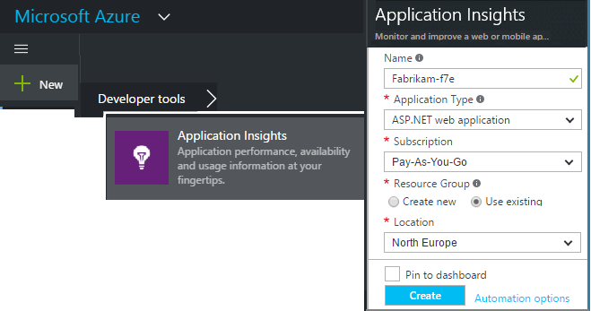
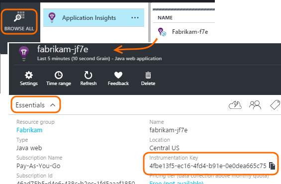

<properties 
	pageTitle="Separate Application Insights resources for dev, test and production" 
	description="Monitor the performance and usage of your application at different stages of development" 
	services="application-insights" 
    documentationCenter=""
	authors="alancameronwills" 
	manager="douge"/>

<tags 
	ms.service="application-insights" 
	ms.workload="tbd" 
	ms.tgt_pltfrm="ibiza" 
	ms.devlang="na" 
	ms.topic="article" 
	ms.date="09/02/2015" 
	ms.author="awills"/>

# Separate Application Insights resources for development, test and production

To avoid mixing up telemetry from debugging, test, and production versions of your app, create separate [Application Insights][start] resources to receive the data from each version.

The data received from your application is stored and processed by Application Insights in a Microsoft Azure *resource*. Each resource is identified by an *instrumentation key.* In your app, the key is provided to the Application Insights SDK so that it can send the data it collects to the right resource. The key can be provided either in code or in ApplicationInsights.config. By changing the key in the SDK, you can direct data to different resources. 

## Create an Application Insights resource
  

In the [portal.azure.com](https://portal.azure.com), add an Application Insights resource:

* **Application type** affects what you see on the overview blade and the properties available in [metric explorer][metrics]. If you don't see your type of app, choose one of the web types for web pages, and one of the phone types for other devices.
* **Resource group** is a convenience for managing properties like [access control](app-insights-resources-roles-access-control.md). You could use separate resource groups for development, test, and production.
* **Subscription** is your payment account in Azure.
* **Location** is where we keep your data. Currently it can't be changed.
* **Add to startboard** puts a quick-access tile for your resource on your Azure Home page. 

Creating the resource takes a few seconds. You'll see an alert when it's done.

(You can write a [PowerShell script](app-insights-powershell-script-create-resource.md) to create a resource automatically.)

## Copy the instrumentation key

The instrumentation key identifies the resource that you created. 

You'll need the instrumentation keys of all the resources to which your app will send data.

##  Dynamic instrumentation key

Usually the SDK gets the iKey from ApplicationInsights.config. Instead, make it more easy to change by setting it in your code.

Set the key in an initialization method, such as global.aspx.cs in an ASP.NET service:

*C#*

    protected void Application_Start()
    {
      Microsoft.ApplicationInsights.Extensibility.
        TelemetryConfiguration.Active.InstrumentationKey = 
          // - for example -
          WebConfigurationManager.AppSettings["ikey"];
      ...

In this example, the ikeys for the different resources are placed in different versions of the web configuration file. Swapping the web configuration file will swap the target resource.

#### Web pages

The iKey is also used in your app's web pages, in the [script that you got from the quick start blade](app-insights-javascript.md). Instead of coding it literally into the script, generate it from the server state. For example, in an ASP.NET app:

*JavaScript in Razor*

    <script type="text/javascript">
    // Standard Application Insights web page script:
    var appInsights = window.appInsights || function(config){ ...
    // Modify this part:
    }({instrumentationKey:  
      // Generate from server property:
      @Microsoft.ApplicationInsights.Extensibility.
         TelemetryConfiguration.Active.InstrumentationKey"
    }) // ...

<!--Link references-->

[api]: app-insights-api-custom-events-metrics.md
[diagnostic]: app-insights-diagnostic-search.md
[metrics]: app-insights-metrics-explorer.md
[start]: app-insights-overview.md

 