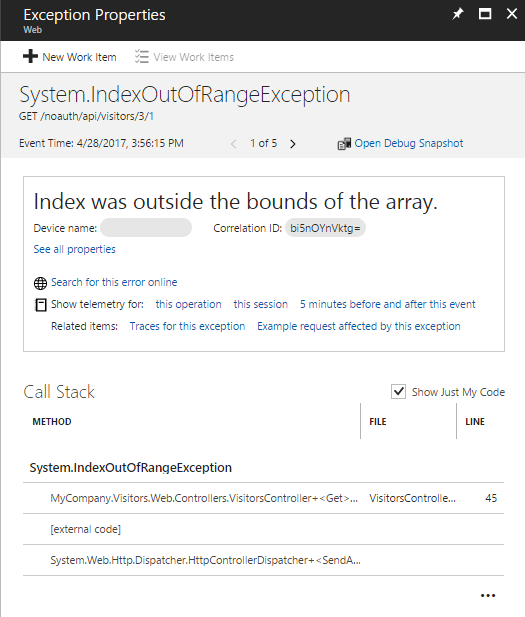
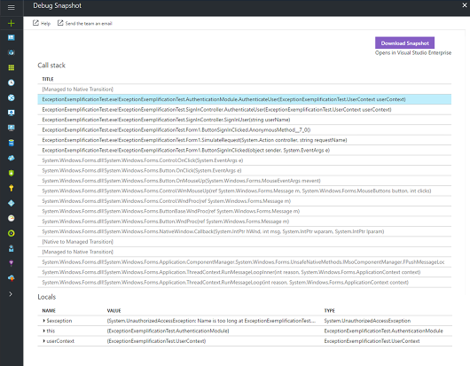
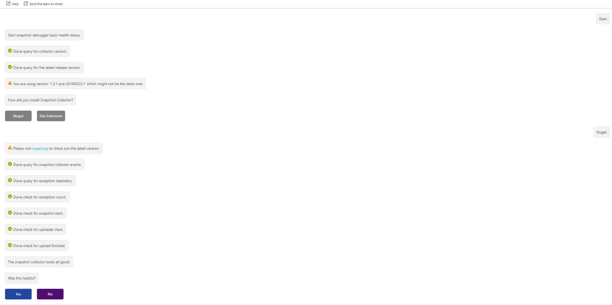

# Debug snapshots on exceptions in .NET apps

When an exception occurs, you can automatically collect a debug snapshot from your live web application. The snapshot shows the state of source code and variables at the moment the exception was thrown. The Snapshot Debugger (preview) in [Azure Application Insights](app-insights-overview.md) monitors exception telemetry from your web app. It collects snapshots on your top-throwing exceptions so that you have the information you need to diagnose issues in production. Include the [Snapshot collector NuGet package](http://www.nuget.org/packages/Microsoft.ApplicationInsights.SnapshotCollector) in your application, and optionally configure collection parameters in [ApplicationInsights.config](app-insights-configuration-with-applicationinsights-config.md). Snapshots appear on [exceptions](app-insights-asp-net-exceptions.md) in the Application Insights portal.

You can view debug snapshots in the portal to see the call stack and inspect variables at each call stack frame. To get a more powerful debugging experience with source code, open snapshots with Visual Studio 2017 Enterprise by [downloading the Snapshot Debugger extension for Visual Studio](https://aka.ms/snapshotdebugger). In Visual Studio, you can also [set Snappoints to interactively take snapshots](https://aka.ms/snappoint) without waiting for an exception.

Debug snapshots are stored for seven days. This retention policy is set on a per-application basis. If you need to increase this value, you can request an increase by opening a support case in the Azure portal.

Snapshot collection is available for:
* .NET Framework and ASP.NET applications running .NET Framework 4.5 or later.
* .NET Core 2.0 and ASP.NET Core 2.0 applications running on Windows.

The following environments are supported:
* Azure App Service.
* Azure Cloud Service running OS family 4 or later.
* Azure Service Fabric services running on Windows Server 2012 R2 or later.
* Azure Virtual Machines running Windows Server 2012 R2 or later.
* On-premises virtual or physical machines running Windows Server 2012 R2 or later.

> [!NOTE]
> Client applications (for example, WPF, Windows Forms or UWP) are not supported.

### Configure snapshot collection for ASP.NET applications

1. [Enable Application Insights in your web app](app-insights-asp-net.md), if you haven't done it yet.

2. Include the [Microsoft.ApplicationInsights.SnapshotCollector](http://www.nuget.org/packages/Microsoft.ApplicationInsights.SnapshotCollector) NuGet package in your app.

3. Review the default options that the package added to [ApplicationInsights.config](app-insights-configuration-with-applicationinsights-config.md):

    ```xml
    <TelemetryProcessors>
        <Add Type="Microsoft.ApplicationInsights.SnapshotCollector.SnapshotCollectorTelemetryProcessor, Microsoft.ApplicationInsights.SnapshotCollector">
        <!-- The default is true, but you can disable Snapshot Debugging by setting it to false -->
        <IsEnabled>true</IsEnabled>
        <!-- Snapshot Debugging is usually disabled in developer mode, but you can enable it by setting this to true. -->
        <!-- DeveloperMode is a property on the active TelemetryChannel. -->
        <IsEnabledInDeveloperMode>false</IsEnabledInDeveloperMode>
        <!-- How many times we need to see an exception before we ask for snapshots. -->
        <ThresholdForSnapshotting>1</ThresholdForSnapshotting>
        <!-- The maximum number of examples we create for a single problem. -->
        <MaximumSnapshotsRequired>3</MaximumSnapshotsRequired>
        <!-- The maximum number of problems that we can be tracking at any time. -->
        <MaximumCollectionPlanSize>50</MaximumCollectionPlanSize>
        <!-- How often we reconnect to the stamp. The default value is 15 minutes.-->
        <ReconnectInterval>00:15:00</ReconnectInterval>
        <!-- How often to reset problem counters. -->
        <ProblemCounterResetInterval>1.00:00:00</ProblemCounterResetInterval>
        <!-- The maximum number of snapshots allowed in ten minutes.The default value is 1. -->
        <SnapshotsPerTenMinutesLimit>1</SnapshotsPerTenMinutesLimit>
        <!-- The maximum number of snapshots allowed per day. -->
        <SnapshotsPerDayLimit>30</SnapshotsPerDayLimit>
        <!-- Whether or not to collect snapshot in low IO priority thread. The default value is true. -->
        <SnapshotInLowPriorityThread>true</SnapshotInLowPriorityThread>
        <!-- Agree to send anonymous data to Microsoft to make this product better. -->
        <ProvideAnonymousTelemetry>true</ProvideAnonymousTelemetry>
        <!-- The limit on the number of failed requests to request snapshots before the telemetry processor is disabled. -->
        <FailedRequestLimit>3</FailedRequestLimit>
        </Add>
    </TelemetryProcessors>
    ```

4. Snapshots are collected only on exceptions that are reported to Application Insights. In some cases (for example, older versions of the .NET platform), you might need to [configure exception collection](app-insights-asp-net-exceptions.md#exceptions) to see exceptions with snapshots in the portal.


### Configure snapshot collection for ASP.NET Core 2.0 applications

1. [Enable Application Insights in your ASP.NET Core web app](app-insights-asp-net-core.md), if you haven't done it yet.

    > [!NOTE]
    > Be sure that your application references version 2.1.1, or newer, of the Microsoft.ApplicationInsights.AspNetCore package.

2. Include the [Microsoft.ApplicationInsights.SnapshotCollector](http://www.nuget.org/packages/Microsoft.ApplicationInsights.SnapshotCollector) NuGet package in your app.

3. Modify your application's `Startup` class to add and configure the Snapshot Collector's telemetry processor.

    Add the following using statements to `Startup.cs`

   ```csharp
   using Microsoft.ApplicationInsights.SnapshotCollector;
   using Microsoft.Extensions.Options;
   using Microsoft.ApplicationInsights.AspNetCore;
   using Microsoft.ApplicationInsights.Extensibility;
   ```

   Add the following `SnapshotCollectorTelemetryProcessorFactory` class to `Startup` class.

   ```csharp
   class Startup
   {
       private class SnapshotCollectorTelemetryProcessorFactory : ITelemetryProcessorFactory
       {
           private readonly IServiceProvider _serviceProvider;

           public SnapshotCollectorTelemetryProcessorFactory(IServiceProvider serviceProvider) =>
               _serviceProvider = serviceProvider;

           public ITelemetryProcessor Create(ITelemetryProcessor next)
           {
               var snapshotConfigurationOptions = _serviceProvider.GetService<IOptions<SnapshotCollectorConfiguration>>();
               return new SnapshotCollectorTelemetryProcessor(next, configuration: snapshotConfigurationOptions.Value);
           }
       }
       ...
    ```
    Add the `SnapshotCollectorConfiguration` and `SnapshotCollectorTelemetryProcessorFactory` services to the startup pipeline:

    ```csharp
       // This method gets called by the runtime. Use this method to add services to the container.
       public void ConfigureServices(IServiceCollection services)
       {
           // Configure SnapshotCollector from application settings
           services.Configure<SnapshotCollectorConfiguration>(Configuration.GetSection(nameof(SnapshotCollectorConfiguration)));

           // Add SnapshotCollector telemetry processor.
           services.AddSingleton<ITelemetryProcessorFactory>(sp => new SnapshotCollectorTelemetryProcessorFactory(sp));

           // TODO: Add other services your application needs here.
       }
   }
   ```

4. Configure the Snapshot Collector by adding a SnapshotCollectorConfiguration section to appsettings.json. For example:

   ```json
   {
     "ApplicationInsights": {
       "InstrumentationKey": "<your instrumentation key>"
     },
     "SnapshotCollectorConfiguration": {
       "IsEnabledInDeveloperMode": false,
       "ThresholdForSnapshotting": 1,
       "MaximumSnapshotsRequired": 3,
       "MaximumCollectionPlanSize": 50,
       "ReconnectInterval": "00:15:00",
       "ProblemCounterResetInterval":"1.00:00:00",
       "SnapshotsPerTenMinutesLimit": 1,
       "SnapshotsPerDayLimit": 30,
       "SnapshotInLowPriorityThread": true,
       "ProvideAnonymousTelemetry": true,
       "FailedRequestLimit": 3
     }
   }
   ```

### Configure snapshot collection for other .NET applications

1. If your application isn't already instrumented with Application Insights, get started by [enabling Application Insights and setting the instrumentation key](app-insights-windows-desktop.md).

2. Add the [Microsoft.ApplicationInsights.SnapshotCollector](http://www.nuget.org/packages/Microsoft.ApplicationInsights.SnapshotCollector) NuGet package in your app.

3. Snapshots are collected only on exceptions that are reported to Application Insights. You may need to modify your code to report them. The exception handling code depends on the structure of your application, but an example is below:
    ```csharp
   TelemetryClient _telemetryClient = new TelemetryClient();

   void ExampleRequest()
   {
        try
        {
            // TODO: Handle the request.
        }
        catch (Exception ex)
        {
            // Report the exception to Application Insights.
            _telemetryClient.TrackException(ex);

            // TODO: Rethrow the exception if desired.
        }
   }
    ```

## Grant permissions

Access to snapshots is protected by role-based access control (RBAC). To inspect a snapshot, you must first be added to the necessary role by a subscription owner.

> [!NOTE]
> Owners and contributors do not automatically have this role. If they want to view snapshots, they must add themselves to the role.

Subscription owners should assign the `Application Insights Snapshot Debugger` role to users who will inspect snapshots. This role can be assigned to individual users or groups by subscription owners for the target Application Insights resource or its resource group or subscription.

1. Navigate to the Application Insights resource in the Azure portal.
1. Click **Access Control (IAM)**.
1. Click the **+Add** button.
1. Select **Application Insights Snapshot Debugger** from the **Roles** drop-down list.
1. Search for and enter a name for the user to add.
1. Click the **Save** button to add the user to the role.


> [!IMPORTANT]
> Snapshots can potentially contain personal and other sensitive information in variable and parameter values.

## Debug snapshots in the Application Insights portal

If a snapshot is available for a given exception or a problem ID, an **Open Debug Snapshot** button appears on the [exception](app-insights-asp-net-exceptions.md) in the Application Insights portal.



In the Debug Snapshot view, you see a call stack and a variables pane. When you select frames of the call stack in the call stack pane, you can view local variables and parameters for that function call in the variables pane.



Snapshots might include sensitive information, and by default they aren't viewable. To view snapshots, you must have the `Application Insights Snapshot Debugger` role assigned to you.

## Debug snapshots with Visual Studio 2017 Enterprise
1. Click the **Download Snapshot** button to download a `.diagsession` file, which can be opened by Visual Studio 2017 Enterprise.

2. To open the `.diagsession` file, you must first [download and install the Snapshot Debugger extension for Visual Studio](https://aka.ms/snapshotdebugger).

3. After you open the snapshot file, the Minidump Debugging page in Visual Studio appears. Click **Debug Managed Code** to start debugging the snapshot. The snapshot opens to the line of code where the exception was thrown so that you can debug the current state of the process.

    

The downloaded snapshot includes any symbol files that were found on your web application server. These symbol files are required to associate snapshot data with source code. For App Service apps, make sure to enable symbol deployment when you publish your web apps.

## How snapshots work

The Snapshot Collector is implemented as an [Application Insights Telemetry Processor](app-insights-configuration-with-applicationinsights-config.md#telemetry-processors-aspnet). When your application runs, the Snapshot Collector Telemetry Processor is added to your application's telemetry pipeline.
Each time your application calls [TrackException](app-insights-asp-net-exceptions.md#exceptions), the Snapshot Collector computes a Problem ID from the type of exception being thrown and the throwing method.
Each time your application calls TrackException, a counter is incremented for the appropriate Problem ID. When the counter reaches the `ThresholdForSnapshotting` value, the Problem ID is added to a Collection Plan.

The Snapshot Collector also monitors exceptions as they're thrown by subscribing to the [AppDomain.CurrentDomain.FirstChanceException](https://docs.microsoft.com/dotnet/api/system.appdomain.firstchanceexception) event. When that event fires, the Problem ID of the exception is computed and compared against the Problem IDs in the Collection Plan.
If there's a match, then a snapshot of the running process is created. The snapshot is assigned a unique identifier and the exception is stamped with that identifier. After the FirstChanceException handler returns, the thrown exception is processed as normal. Eventually, the exception reaches the TrackException method again where it, along with the snapshot identifier, is reported to Application Insights.

The main process continues to run and serve traffic to users with little interruption. Meanwhile, the snapshot is handed off to the Snapshot Uploader process. The Snapshot Uploader creates a minidump and uploads it to Application Insights along with any relevant symbol (.pdb) files.

> [!TIP]
> - A process snapshot is a suspended clone of the running process.
> - Creating the snapshot takes about 10 to 20 milliseconds.
> - The default value for `ThresholdForSnapshotting` is 1. This is also the minimum value. Therefore, your app has to trigger the same exception **twice** before a snapshot is created.
> - Set `IsEnabledInDeveloperMode` to true if you want to generate snapshots while debugging in Visual Studio.
> - The snapshot creation rate is limited by the `SnapshotsPerTenMinutesLimit` setting. By default, the limit is one snapshot every ten minutes.
> - No more than 50 snapshots per day may be uploaded.

## Current limitations

### Publish symbols
The Snapshot Debugger requires symbol files on the production server to decode variables and to provide a debugging experience in Visual Studio.
Version 15.2 (or above) of Visual Studio 2017 publishes symbols for release builds by default when it publishes to App Service. In prior versions, you need to add the following line to your publish profile `.pubxml` file so that symbols are published in release mode:

```xml
    <ExcludeGeneratedDebugSymbol>False</ExcludeGeneratedDebugSymbol>
```

For Azure Compute and other types, make sure that the symbol files are in the same folder of the main application .dll (typically, `wwwroot/bin`) or are available on the current path.

### Optimized builds
In some cases, local variables can't be viewed in release builds because of optimizations that are applied by the JIT compiler.
However, in Azure App Services, the Snapshot Collector can deoptimize throwing methods that are part of its Collection Plan.

> [!TIP]
> Install the Application Insights Site Extension in your App Service to get deoptimization support.

## Troubleshooting

These tips help you troubleshoot problems with the Snapshot Debugger.

### Use the snapshot health check
Several common problems result in the Open Debug Snapshot not showing up. Using an outdated Snapshot Collector, for example; reaching the daily upload limit; or perhaps the snapshot is just taking a long time to upload. Use the Snapshot Health Check to troubleshoot common problems.

There's a link in the exception pane of the end-to-end trace view that takes you to the Snapshot Health Check.


The interactive, chat-like interface looks for common problems and guides you to fix them.



If that doesn't solve the problem, then refer to the following manual troubleshooting steps.

### Verify the instrumentation key

Make sure you're using the correct instrumentation key in your published application. Usually, the instrumentation key is read from the ApplicationInsights.config file. Verify the value is the same as the instrumentation key for the Application Insights resource that you see in the portal.

### Upgrade to the latest version of the NuGet package

Use Visual Studio's NuGet Package Manager to make sure you're using the latest version of Microsoft.ApplicationInsights.SnapshotCollector. Release notes can be found at https://github.com/Microsoft/ApplicationInsights-Home/issues/167

### Check the uploader logs

After a snapshot is created, a minidump file (.dmp) is created on disk. A separate uploader process creates that minidump file and uploads it, along with any associated PDBs, to Application Insights Snapshot Debugger storage. After the minidump has uploaded successfully, it's deleted from disk. The log files for the uploader process are kept on disk. In an App Service environment, you can find these logs in `D:\Home\LogFiles`. Use the Kudu management site for App Service to find these log files.

1. Open your App Service application in the Azure portal.
2. Click **Advanced Tools**, or search for **Kudu**.
3. Click **Go**.
4. In the **Debug console** drop-down list box, select **CMD**.
5. Click **LogFiles**.

You should see at least one file with a name that begins with `Uploader_` or `SnapshotUploader_` and a `.log` extension. Click the appropriate icon to download any log files or open them in a browser.
The file name includes a unique suffix that identifies the App Service instance. If your App Service instance is hosted on more than one machine, there are separate log files for each machine. When the uploader detects a new minidump file, it's recorded in the log file. Here's an example of a successful snapshot and upload:

```
SnapshotUploader.exe Information: 0 : Received Fork request ID 139e411a23934dc0b9ea08a626db16c5 from process 6368 (Low pri)
    DateTime=2018-03-09T01:42:41.8571711Z
SnapshotUploader.exe Information: 0 : Creating minidump from Fork request ID 139e411a23934dc0b9ea08a626db16c5 from process 6368 (Low pri)
    DateTime=2018-03-09T01:42:41.8571711Z
SnapshotUploader.exe Information: 0 : Dump placeholder file created: 139e411a23934dc0b9ea08a626db16c5.dm_
    DateTime=2018-03-09T01:42:41.8728496Z
SnapshotUploader.exe Information: 0 : Dump available 139e411a23934dc0b9ea08a626db16c5.dmp
    DateTime=2018-03-09T01:42:45.7525022Z
SnapshotUploader.exe Information: 0 : Successfully wrote minidump to D:\local\Temp\Dumps\c12a605e73c44346a984e00000000000\139e411a23934dc0b9ea08a626db16c5.dmp
    DateTime=2018-03-09T01:42:45.7681360Z
SnapshotUploader.exe Information: 0 : Uploading D:\local\Temp\Dumps\c12a605e73c44346a984e00000000000\139e411a23934dc0b9ea08a626db16c5.dmp, 214.42 MB (uncompressed)
    DateTime=2018-03-09T01:42:45.7681360Z
SnapshotUploader.exe Information: 0 : Upload successful. Compressed size 86.56 MB
    DateTime=2018-03-09T01:42:59.6184651Z
SnapshotUploader.exe Information: 0 : Extracting PDB info from D:\local\Temp\Dumps\c12a605e73c44346a984e00000000000\139e411a23934dc0b9ea08a626db16c5.dmp.
    DateTime=2018-03-09T01:42:59.6184651Z
SnapshotUploader.exe Information: 0 : Matched 2 PDB(s) with local files.
    DateTime=2018-03-09T01:42:59.6809606Z
SnapshotUploader.exe Information: 0 : Stamp does not want any of our matched PDBs.
    DateTime=2018-03-09T01:42:59.8059929Z
SnapshotUploader.exe Information: 0 : Deleted D:\local\Temp\Dumps\c12a605e73c44346a984e00000000000\139e411a23934dc0b9ea08a626db16c5.dmp
    DateTime=2018-03-09T01:42:59.8530649Z
```

> [!NOTE]
> The example above is from version 1.2.0 of the Microsoft.ApplicationInsights.SnapshotCollector NuGet package. In earlier versions, the uploader process is called `MinidumpUploader.exe` and the log is less detailed.

In the previous example, the instrumentation key is `c12a605e73c44346a984e00000000000`. This value should match the instrumentation key for your application.
The minidump is associated with a snapshot with the ID `139e411a23934dc0b9ea08a626db16c5`. You can use this ID later to locate the associated exception telemetry in Application Insights Analytics.

The uploader scans for new PDBs about once every 15 minutes. Here's an example:

```
SnapshotUploader.exe Information: 0 : PDB rescan requested.
    DateTime=2018-03-09T01:47:19.4457768Z
SnapshotUploader.exe Information: 0 : Scanning D:\home\site\wwwroot for local PDBs.
    DateTime=2018-03-09T01:47:19.4457768Z
SnapshotUploader.exe Information: 0 : Local PDB scan complete. Found 2 PDB(s).
    DateTime=2018-03-09T01:47:19.4614027Z
SnapshotUploader.exe Information: 0 : Deleted PDB scan marker : D:\local\Temp\Dumps\c12a605e73c44346a984e00000000000\6368.pdbscan
    DateTime=2018-03-09T01:47:19.4614027Z
```

For applications that _aren't_ hosted in App Service, the uploader logs are in the same folder as the minidumps: `%TEMP%\Dumps\<ikey>` (where `<ikey>` is your instrumentation key).

### Troubleshooting Cloud Services
For roles in Cloud Services, the default temporary folder may be too small to hold the minidump files, leading to lost snapshots.
The space needed depends on the total working set of your application and the number of concurrent snapshots.
The working set of a 32-bit ASP.NET web role is typically between 200 MB and 500 MB.
Allow for at least two concurrent snapshots.
For example, if your application uses 1 GB of total working set, you should make sure that there is at least 2 GB of disk space to store snapshots.
Follow these steps to configure your Cloud Service role with a dedicated local resource for snapshots.

1. Add a new local resource to your Cloud Service by editing the Cloud Service definition (.csdef) file. The following example defines a resource called `SnapshotStore` with a size of 5 GB.
   ```xml
   <LocalResources>
     <LocalStorage name="SnapshotStore" cleanOnRoleRecycle="false" sizeInMB="5120" />
   </LocalResources>
   ```

2. Modify your role's startup code to add an environment variable that points to the `SnapshotStore` local resource. For Worker Roles, the code should be added to your role's `OnStart` method:
   ```csharp
   public override bool OnStart()
   {
       Environment.SetEnvironmentVariable("SNAPSHOTSTORE", RoleEnvironment.GetLocalResource("SnapshotStore").RootPath);
       return base.OnStart();
   }
   ```
   For Web Roles (ASP.NET), the code should be added to your web application's `Application_Start` method:
   ```csharp
   using Microsoft.WindowsAzure.ServiceRuntime;
   using System;

   namespace MyWebRoleApp
   {
       public class MyMvcApplication : System.Web.HttpApplication
       {
          protected void Application_Start()
          {
             Environment.SetEnvironmentVariable("SNAPSHOTSTORE", RoleEnvironment.GetLocalResource("SnapshotStore").RootPath);
             // TODO: The rest of your application startup code
          }
       }
   }
   ```

3. Update your role's ApplicationInsights.config file to override the temporary folder location used by `SnapshotCollector`
   ```xml
   <TelemetryProcessors>
    <Add Type="Microsoft.ApplicationInsights.SnapshotCollector.SnapshotCollectorTelemetryProcessor, Microsoft.ApplicationInsights.SnapshotCollector">
      <!-- Use the SnapshotStore local resource for snapshots -->
      <TempFolder>%SNAPSHOTSTORE%</TempFolder>
      <!-- Other SnapshotCollector configuration options -->
    </Add>
   </TelemetryProcessors>
   ```

### Overriding the Shadow Copy folder

When the Snapshot Collector starts up, it tries to find a folder on disk that is suitable for running the Snapshot Uploader process. The chosen folder is known as the Shadow Copy folder.

The Snapshot Collector checks a few well-known locations, making sure it has permissions to copy the Snapshot Uploader binaries. The following environment variables are used:
- Fabric_Folder_App_Temp
- LOCALAPPDATA
- APPDATA
- TEMP

If a suitable folder can't be found, Snapshot Collector reports an error saying _"Could not find a suitable shadow copy folder."_

If the copy fails, Snapshot Collector reports a `ShadowCopyFailed` error.

If the uploader can't be launched, Snapshot Collector reports an `UploaderCannotStartFromShadowCopy` error. The body of the message often contains `System.UnauthorizedAccessException`. This error usually occurs because the application is running under an account with reduced permissions. The account has permission to write to the shadow copy folder, but it doesn't have permission to execute code.

Since these errors usually happen during startup, they'll usually be followed by an `ExceptionDuringConnect` error saying _"Uploader failed to start."_

To work around these errors, you can specify the shadow copy folder manually via the `ShadowCopyFolder` configuration option. For example, using ApplicationInsights.config:

   ```xml
   <TelemetryProcessors>
    <Add Type="Microsoft.ApplicationInsights.SnapshotCollector.SnapshotCollectorTelemetryProcessor, Microsoft.ApplicationInsights.SnapshotCollector">
      <!-- Override the default shadow copy folder. -->
      <ShadowCopyFolder>D:\SnapshotUploader</ShadowCopyFolder>
      <!-- Other SnapshotCollector configuration options -->
    </Add>
   </TelemetryProcessors>
   ```

Or, if you're using appsettings.json with a .NET Core application:

   ```json
   {
     "ApplicationInsights": {
       "InstrumentationKey": "<your instrumentation key>"
     },
     "SnapshotCollectorConfiguration": {
       "ShadowCopyFolder": "D:\\SnapshotUploader"
     }
   }
   ```

### Use Application Insights search to find exceptions with snapshots

When a snapshot is created, the throwing exception is tagged with a snapshot ID. That snapshot ID is included as a custom property when the exception telemetry is reported to Application Insights. Using **Search** in Application Insights, you can find all telemetry with the `ai.snapshot.id` custom property.

1. Browse to your Application Insights resource in the Azure portal.
2. Click **Search**.
3. Type `ai.snapshot.id` in the Search text box and press Enter.


If this search returns no results, then no snapshots were reported to Application Insights for your application in the selected time range.

To search for a specific snapshot ID from the Uploader logs, type that ID in the Search box. If you can't find telemetry for a snapshot that you know was uploaded, follow these steps:

1. Double-check that you're looking at the right Application Insights resource by verifying the instrumentation key.

2. Using the timestamp from the Uploader log, adjust the Time Range filter of the search to cover that time range.

If you still don't see an exception with that snapshot ID, then the exception telemetry wasn't reported to Application Insights. This situation can happen if your application crashed after it took the snapshot but before it reported the exception telemetry. In this case, check the App Service logs under `Diagnose and solve problems` to see if there were unexpected restarts or unhandled exceptions.

### Edit network proxy or firewall rules

If your application connects to the Internet via a proxy or a firewall, you may need to edit the rules to allow your application to communicate with the Snapshot Debugger service. Here is [a list of IP addresses and ports used by the Snapshot Debugger](app-insights-ip-addresses.md#snapshot-debugger).

## Next steps

* [Set snappoints in your code](https://docs.microsoft.com/visualstudio/debugger/debug-live-azure-applications) to get snapshots without waiting for an exception.
* [Diagnose exceptions in your web apps](app-insights-asp-net-exceptions.md) explains how to make more exceptions visible to Application Insights.
* [Smart Detection](app-insights-proactive-diagnostics.md) automatically discovers performance anomalies.
