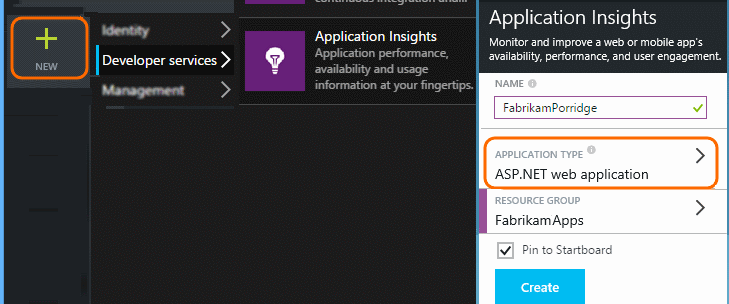
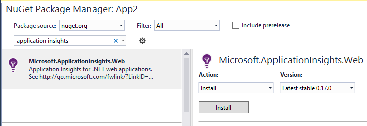
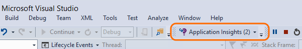

<properties
	pageTitle="Add Application Insights SDK to monitor your ASP.NET app | Microsoft Azure"
	description="Analyze usage, availability and performance of your on-premises or Microsoft Azure web application with Application Insights."
	services="application-insights"
    documentationCenter=".net"
	authors="alancameronwills"
	manager="douge"/>

<tags
	ms.service="application-insights"
	ms.workload="tbd"
	ms.tgt_pltfrm="ibiza"
	ms.devlang="na"
	ms.topic="get-started-article"
	ms.date="09/23/2015"
	ms.author="awills"/>


# Add Application Insights SDK to monitor your ASP.NET app

*Application Insights is in preview.*

[AZURE.INCLUDE [app-insights-selector-get-started](../../includes/app-insights-selector-get-started.md)]


Visual Studio Application Insights monitors your live application to help you [detect and diagnose performance issues and exceptions][detect], and [discover how your app is used][knowUsers]. It can be used with a wide variety of application types. It works for apps that are hosted on your own on-premises IIS servers or on Azure VMs, as well as Azure web apps.


*See also:*

* [ASP.NET 5](app-insights-asp-net-five.md)
* [Device apps and Java servers][platforms]

#### Before you start

For many application types, [Visual Studio can add Application Insights to your app](#ide) almost without you noticing. But since you're reading this to get a better understanding of what's going on, we'll take you through the steps manually.


You need:

* A subscription to [Microsoft Azure](http://azure.com). If your team or organization has an Azure subscription, the owner can add you to it, using your [Microsoft account](http://live.com).
* Visual Studio 2013 or later.

## <a name="add"></a> 1. Create an Application Insights resource

Sign in to the [Azure portal][portal], and create a new Application Insights resource. Choose ASP.NET as the application type.



A [resource][roles] in Azure is an instance of a service. This resource is where telemetry from your app will be analyzed and presented to you.

The choice of application type sets the default content of the resource blades and the properties visible in [Metrics Explorer][metrics].

#### Copy of the Instrumentation Key

The key identifies the resource, and you'll install it soon in the SDK to direct data to the resource.


The steps you've just done to create a new resource are a good way to start monitoring any application. Now you can send data to it.

## <a name="sdk"></a> 2. Install the SDK in your application

Installing and configuring the Application Insights SDK varies depending on the platform you're working on. For ASP.NET apps, it's easy.

1. In Visual Studio, edit the NuGet packages of your desktop app project.

    

2. Install Application Insights SDK for Web Apps.

    

3. Edit ApplicationInsights.config (which was added by the NuGet install). Insert this just before the closing tag:

    `<InstrumentationKey>` *the instrumentation key you copied* `</InstrumentationKey>`

    (Alternatively, you can [set the key by writing some code][apikey] in your app.)

#### To upgrade to future SDK versions

We release a new version of the SDK from time to time.

To upgrade to a [new release of the SDK](app-insights-release-notes-dotnet.md), open NuGet package manager again and filter on installed packages. Select **Microsoft.ApplicationInsights.Web** and choose **Upgrade**.

If you made any customizations to ApplicationInsights.config, save a copy of it before you upgrade, and afterwards merge your changes into the new version.


## <a name="run"></a> 3. Run your project

Use the **F5** to run your application and try it out: open different pages to generate some telemetry.

In Visual Studio, you'll see a count of the events that have been sent.



## <a name="monitor"></a> 4. View your telemetry

Return to the [Azure portal][portal] and browse to your Application Insights resource.


Look for data in the Overview charts. At first, you'll just see one or two points. For example:


Click through any chart to see more detailed metrics. [Learn more about metrics.][perf]

#### No data?

* Open the [Search][diagnostic] tile, to see individual events.
* Use the application, opening different pages so that it generates some telemetry.
* Wait a few seconds and click **Refresh**. Charts refresh themselves periodically, but you can refresh manually if you're waiting for some data to show up.
* See [Troubleshooting][qna].

## Publish your app

Now deploy your application to IIS or to Azure and watch the data accumulate.

When you run in debug mode, telemetry is expedited through the pipeline, so that you should see data appearing within seconds. When you deploy your app, data accumulates more slowly.

#### No data after you publish to your server?

Open these ports for outgoing traffic in your server's firewall:

+ `dc.services.visualstudio.com:443`
+ `f5.services.visualstudio.com:443`


#### Trouble on your build server?

Please see [this Troubleshooting item](app-insights-troubleshoot-faq.md#NuGetBuild).


## Track Application version

Make sure `buildinfo.config` is generated by your build process. In your .csproj file, add:  

```XML

    <PropertyGroup>
      <GenerateBuildInfoConfigFile>true</GenerateBuildInfoConfigFile>    <IncludeServerNameInBuildInfo>true</IncludeServerNameInBuildInfo>
    </PropertyGroup> 
```

When it has the build info, the Application Insights web module automatically adds **Application version** as a property to every item of telemetry. That allows you to filter by version when performing [diagnostic searches][diagnostic] or when [exploring metrics][metrics].


## 5. Add dependency tracking (and IIS perf counters)

The SDK needs a little help to get access to some data. In particular, you'll need this additional step in order to automatically measure calls from your app to databases, REST APIs, and other external components. These dependency metrics can be invaluable to help you diagnose performance issues.

If you're running on your own IIS server, this step will also allow system performance counters to show up in [metrics explorer](app-insights-metrics-explorer.md).

#### If your app runs in your IIS server

Sign in to your server with admin rights, and install [Application Insights Status Monitor](http://go.microsoft.com/fwlink/?LinkId=506648).

You might need to [open additional outgoing ports in your firewall](app-insights-monitor-performance-live-website-now.md#troubleshooting).

This step also enables [reporting of performance counters](app-insights-web-monitor-performance.md#system-performance-counters) such as CPU, memory, network occupancy.

#### If your app is an Azure Web App

In the control panel of your Azure Web App, add the Application Insights extension.


#### If it's an Azure cloud services project

[Add scripts to web and worker roles](app-insights-cloudservices.md).


## 6. Add client-side monitoring

You've installed the SDK that sends telemetry data from the server (back end) of your application. Now you can add client-side monitoring. This provides you with data on users, sessions, page views, and any exceptions or crashes that occur in the client. 

You'll also be able to write your own code to track how your users work with your app, right down to the detailed level of clicks and keystrokes.

#### If your clients are web browsers

If your app displays web pages, add a JavaScript snippet to every page. Get the code from your Application Insights resource:


Notice that the code contains the instrumentation key that identifies your application resource.

[Learn more about web page tracking.](app-insights-web-track-usage.md)

#### If your clients are device apps

If your application is serving clients such as phones or other devices, add the [appropriate SDK](app-insights-platforms.md) to your device app.

If you configure the client SDK with the same instrumentation key as the server SDK, the two streams will be integrated so that you can see them together.


## 7. Complete your installation

To get the full 360-degree view of your application, there are a few more things you can do:

* [Set up web tests][availability] to make sure your application stays live and responsive.
* [Capture log traces][netlogs] from your favorite logging framework
* [Track custom events and metrics][api] in client or server or both, to learn more about how your application is used.

## <a name="ide"></a> The automated way

We said at the beginning of this article that we'd show you the manual way to create a Application Insights resource, and then install the SDK. We believe it's good to understand the two parts of that procedure. But for ASP.NET apps (and many others) there's an even quicker automated way.

You'll need [Visual Studio](http://go.microsoft.com/fwlink/?linkid=397827&clcid=0x409) (2013 update 3 or later) and an account in [Microsoft Azure](http://azure.com).

#### If it's a new project...

When you create a new project in Visual Studio, make sure **Add Application Insights** is selected.


Visual Studio creates a resource in Application Insights, adds the SDK to your project, and places the key in the `.config` file.

If your project has web pages, it also adds the [JavaScript SDK][client] to the master web page.

#### ... or if it's an existing project

Right-click the project in Solution Explorer, and choose **Add Application Insights**.


Visual Studio creates a resource in Application Insights, adds the SDK to your project, and places the key in the `.config` file.

In this case, it doesn't add the [JavaScript SDK][client] to your web pages - we recommend you do that as the next step.

#### Setup options

If this is your first time, you'll be asked sign in or sign up to Microsoft Azure Preview. 

If this app is part of a bigger application, you might want to use **Configure settings** to put it in the same resource group as the other components.

*No Application Insights option? Check that you're using Visual Studio 2013 Update 3 or later and that Application Insights Tools are enabled in Extensions and Updates.*

#### Open Application Insights from your project


## <a name="video"></a>Video

> [AZURE.VIDEO getting-started-with-application-insights]


<!--Link references-->

[api]: app-insights-api-custom-events-metrics.md
[apikey]: app-insights-api-custom-events-metrics.md#ikey
[availability]: app-insights-monitor-web-app-availability.md
[azure]: ../insights-perf-analytics.md
[client]: app-insights-javascript.md
[detect]: app-insights-detect-triage-diagnose.md
[diagnostic]: app-insights-diagnostic-search.md
[knowUsers]: app-insights-overview-usage.md
[metrics]: app-insights-metrics-explorer.md
[netlogs]: app-insights-asp-net-trace-logs.md
[perf]: app-insights-web-monitor-performance.md
[platforms]: app-insights-platforms.md
[portal]: http://portal.azure.com/
[qna]: app-insights-troubleshoot-faq.md
[redfield]: app-insights-monitor-performance-live-website-now.md
[roles]: app-insights-resources-roles-access-control.md
[start]: app-insights-get-started.md
