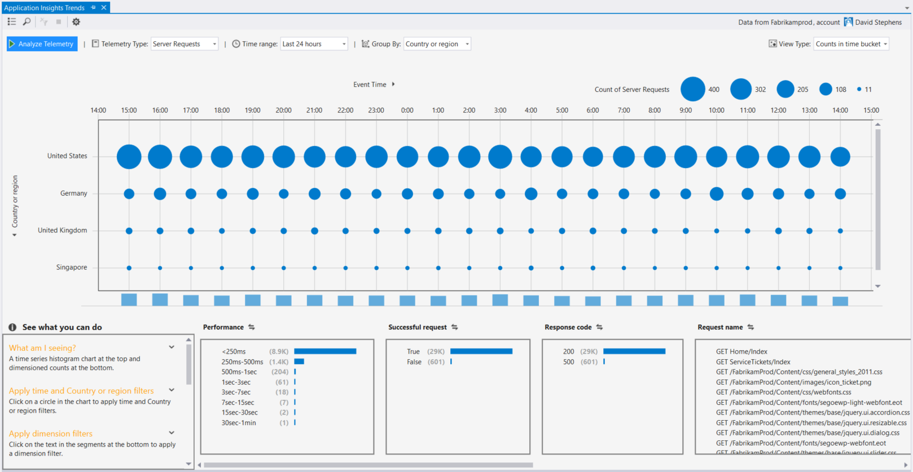
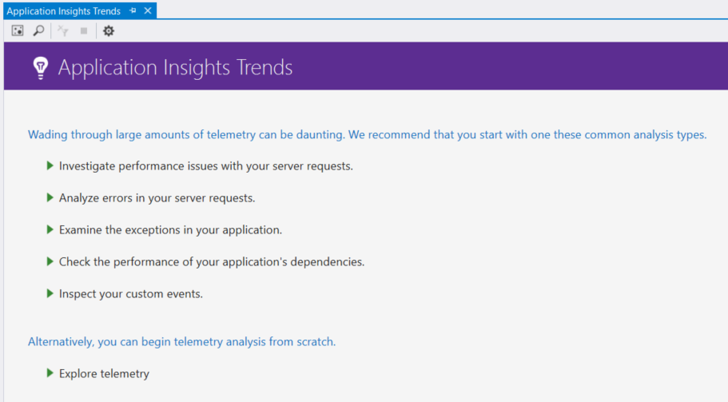

<!-- TODO: Add the necessary metadata -->
<!-- Required stuff:
1. ( ) Properties tag
2. ( ) Tags tag
3. (X) H1 heading
4. (X) H2 headings
5. (X) Intro paragraph
6. (X) Conceptual info
7. ( ) Next steps
-->
	
# Analyzing Trends in Visual Studio
The Application Insights Trends tool visualizes how your application's important metrics change over time, helping you quickly identify problems and anomalies. By linking you to more detailed diagnostic information, Trends can help you improve your app's performance, track down the causes of exceptions, and uncover insights from your custom events.

> [AZURE.NOTE] Application Insights Trends is available in Visual Studio 2015 Update 3 and later, or with the [Developer Analytics Tools extension](https://visualstudiogallery.msdn.microsoft.com/82367b81-3f97-4de1-bbf1-eaf52ddc635a) version 5.209 and later.

## Open Application Insights Trends
To open the Application Insights Trends window:
* From the Application Insights toolbar button, choose **Explore Telemetry Trends**, or
* From the Visual Studio menu bar, choose **View > Other Windows > Application Insights Trends**.

You may see a prompt to select a resource. Click **Select a resource**, sign in with an Azure subscription, then choose an Application Insights resource from the list for which you'd like to analyze telemetry trends.

## Choose a trend analysis

Get started by choosing from one of five common trend analyses:
* **Investigate performance issues with your server requests** - Requests made to your service in the last 24 hours, grouped by response times
* **Analyze errors in your server requests** - Requests made to your service in the last 24 hours, grouped by HTTP response code
* **Examine the exceptions in your application** - Exceptions from your service in the last 24 hours, grouped by exception type
* **Check the performance of your application's dependencies** - Services called by your service in the last 24 hours, grouped by response times
* **Inspect your custom events** - Custom events you've set up for your service that have been sent in the last 24 hours, grouped by event type.

These pre-built analyses are available later from the **View common types of telemetry analysis** button in the upper-left corner of the Trends window.

## Visualize trends in your application
Application Insights Trends creates a time series visualization from your app's telemetry. Each time series visualization displays one type of telemetry, grouped by one property of that telemetry, over some time range. For example, you might want to view server requests, grouped by the country from which they originated, over the last 24 hours. In this example, each bubble on the visualization would represent a count of the server requests for some country/region during one hour.

Use the controls at the top of the window to adjust what types of telemetry you view. First, choose the telemetry types in which you're interested:
* **Telemetry Type** - Server requests, exceptions, depdendencies, or custom events
* **Time Range** - Anywhere from the last 30 minutes to the last 3 days
* **Group By** - Exception type, problem ID, failed method, role instance, country or region; or application version.

Then, click **Analyze Telemetry** to run the query.

To navigate between bubbles in the visualization:
* Click to select a bubble, which updates the filters at the bottom of the window, summarizing just the events that occurred during a specific time period
* Double-click a bubble to navigate to the Search tool and see all of the individual telemetry events that occured during that time period
* Ctrl-click a bubble to de-select it in the visualization.

## Filter
Further refine your Trends visualization with the filter controls at the bottom of the window. There are two ways to filter:
* Quick filtering
* Re-query filtering

(Explain quick filtering)

(Explain re-query filtering)

(Explain how to un-filter)

## Find anomalies
TBD - the View Type dropdown; especially useful when bubbles are all small

## Next steps
TBD
