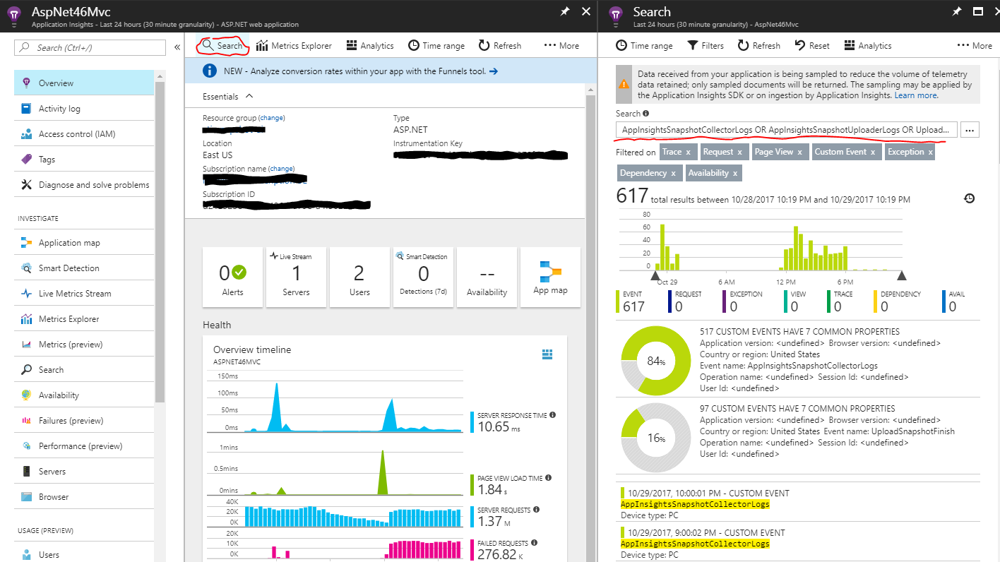
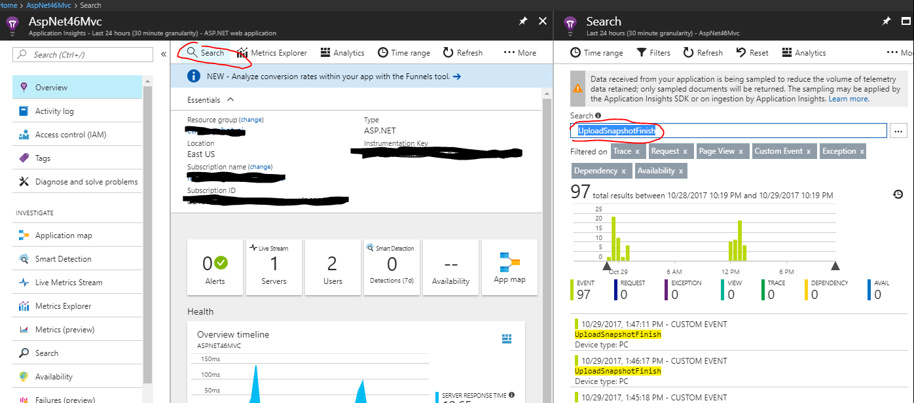
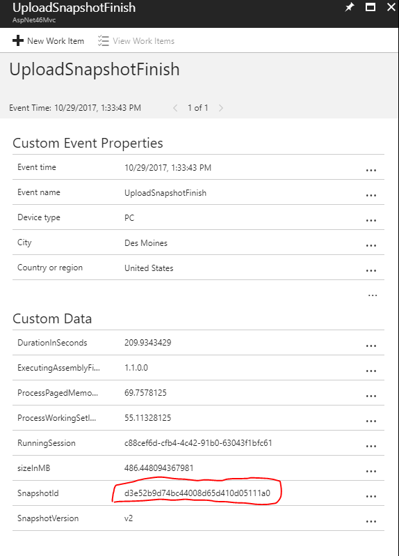
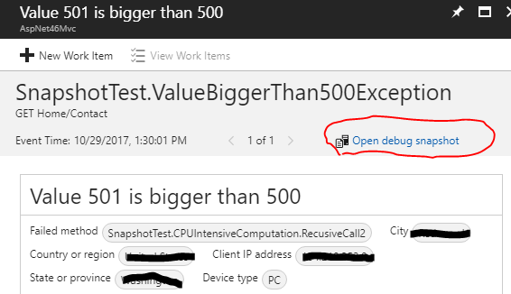

# Snapshot Debugger: Troubleshooting Guide

## How does Application Insights Snapshot Debugger work

Application Insights Snapshot debugger is part of the Application Insights telemetry pipeline (an instance of ITelemetryProcessor), the snapshot collector is monitoring both the exceptions thrown in your code (AppDomain.FirstChanceException) and the exceptions that get tracked by the Application Insights Exception Telemetry pipeline. When you have successfully added the snapshot collector to your project, and it has detected one exception in the Application Insights telemetry pipeline, one Application Insights custom event with the name 'AppInsightsSnapshotCollectorLogs' and 'SnapshotCollectorEnabled' in the Custom Data will be sent. At the same time, it will also start a process with the name of 'MinidumpUploader.exe', to upload the collected snapshot data files to Application Insights.  When the 'MinidumpUploader.exe' process starts, a custom event with the name 'UploaderStart' will be sent. After the previous steps, the snapshot collector will enter its normal monitoring behavior.

While the snapshot collector is monitoring the Application Insights exception telemetry, it will use the parameters (e.g. ThresholdForSnapshotting, MaximumSnapshotsRequired, MaximumCollectionPlanSize, ProblemCounterResetInterval) defined in the configuration to determine when to collect a snapshot. When all the rules are met, the collector will request a snapshot for the next exception thrown at the same place. While this is going on, an Application Insights custom event with the name 'AppInsightsSnapshotCollectorLogs' and 'RequestSnapshots' will be sent. Since the compiler will optimize 'Release' code, local variables may not be visible in the collected snapshot. The snapshot collector will try to deoptimize the method that threw the exception, when it requests snapshots. During this time, an Application Insights custom event with name 'AppInsightsSnapshotCollectorLogs' and 'ProductionBreakpointsDeOptimizeMethod' in the custom data will be sent.  When the snapshot of the next exception is collected, the local variables will be available. After the snapshot is collected, it will reoptimize the code to ensure the performance. Note that the deoptimization requires the Application Insights site extension is installed.

When a snapshot is requested for a specific exception, the snapshot collector will start monitoring your application's exception handling pipeline (AppDomain.FirstChanceException). When the exception happens again, the collector will start a snapshot (Application Insights custom event with the name 'AppInsightsSnapshotCollectorLogs' and 'SnapshotStart' in the custom data). Then a shadow copy of the running process is made (the page table will be duplicated). This normally will take 10 to 20 milliseconds. After this, an Application Insights custom event with the name 'AppInsightsSnapshotCollectorLogs' and 'SnapshotStop' in the custom data will be sent. When the forked process is created, the total paged memory will be increased by the same amount as the paged memory of your running application (the working set will be much smaller). While your application process is running normally, the shadow copied process's memory will be dumped to disk and uploaded to Application Insights. After the snapshot is uploaded, an Application Insights custom event with the name 'UploadSnapshotFinish' will be sent.

## Is the snapshot collector working properly?

### How to find Snapshot Collector logs
Snapshot collector logs are sent to your Application Insight account if the [Snapshot Collector NuGet package](https://www.nuget.org/packages/Microsoft.ApplicationInsights.SnapshotCollector) is version 1.1.0 or later. Make sure the *ProvideAnonymousTelemetry* is not set to false (the value is true be default).

* Navigate to your Application Insights resource in the Azure portal
* Click *Search* in the Overview section
* Enter the following string into the search box:
    ```
    AppInsightsSnapshotCollectorLogs OR AppInsightsSnapshotUploaderLogs OR UploadSnapshotFinish OR UploaderStart OR UploaderStop
    ```
* Note: change the *Time range* if needed




### Examine Snapshot collector logs
When searching for Snapshot Collector logs, there should be 'UploadSnapshotFinish' events in the targeted time range. If you still don't see the 'Open Debug Snapshot' button to open the Snapshot, please send email to snapshothelp@microsoft.com with your Application Insights' Instrumentation Key.



## I cannot find snapshot to Open
If the following steps don't help you solve the issue, please send email to snapshothelp@microsoft.com with your Application Insights' Instrumentation Key.

### Step 1: Make sure your application is sending telemetry data and exception data to Application Insights
Navigate to Application Insights resource, check that there is data sent from your application.

### Step 2: Make sure Snapshot collector is added correctly to your application's Application Insights Telemetry pipe line
If you can find logs in the 'How to find Snapshot Collector logs' step, the snapshot collector is correctly added to your project, you can ignore this step.

If there are no Snapshot collector logs, please verify the following:
* For classic ASP.NET applications, check for this line *<Add Type="Microsoft.ApplicationInsights.SnapshotCollector.SnapshotCollectorTelemetryProcessor, Microsoft.ApplicationInsights.SnapshotCollector">* in the *ApplicationInsights.config* file.

* For ASP.NET Core applications, please make sure the *ITelemetryProcessorFactory* with *SnapshotCollectorTelemetryProcessor* is added to *IServiceCollection* services.

* Also check that you're using the correct instrumentation key in your published application.

* The Snapshot collector doesn't support multiple instrumentation keys within the one application, it will send snapshots to the instrumentation key of the first exception it observes.

* If you set the *InstrmentationKey* manually in your code, please update the *InstrumentationKey* element from the *ApplicationInsights.config*.

### Step 3: Make sure the minidump uploader is started
In the snapshot collector logs, search for *UploaderStart* (type UploaderStart in the search text box). There should be an event when the snapshot collector monitored the first exception. If this event doesn't exist, please check other logs for details. One possible way for solving this issue is restarting your application.

### Step 4: Make sure Snapshot Collector expressed its intent to collect snapshots
In the snapshot collector logs, search for *RequestSnapshots* (type ```RequestSnapshots``` in the search text box).  If there isn't any, please check your configuration, e.g. *ThresholdForSnapshotting* which indicates the number of a specific exceptions that can occur before it starts collecting snapshots.

### Step 5: Make sure that Snapshot is not disabled due to Memory Protection
To protect your application's performance, a snapshot will only be captured when there is a good memory buffer. In the snapshot collector logs, search for 'CannotSnapshotDueToMemoryUsage'. In the event's custom data, it will have a detailed reason. If your application is running in an Azure Web App, the restriction may be strict. Since Azure Web App will restart your app when certain memory rules are met. You can try to scale up your service plan to machines with more memory to solve this issue.

### Step 6: Make sure snapshots were captured
In the snapshot collector logs, search for ```RequestSnapshots```.  If there isn't any, please check your configuration, e.g. ```ThresholdForSnapshotting``` this indicates the number of a specific exceptions before collecting a snapshot.

### Step 7: Make sure snapshots are uploaded correctly
In the snapshot collector logs, search for ```UploadSnapshotFinish```.  If this is not present, please send email to snapshothelp@microsoft.com with your Application Insights' Instrumentation Key. If this event exists, please open one of them and copy the 'SnapshotId' value in the Custom Data. Then search for the value. This will find the exception corresponding to the snapshot. Then click the exception and open debug snapshot. (If there is no corresponding exception, the exception telemetry may be sampled, due to high volume, please try another snapshotId.)






## Snapshot View Local Variables are not complete

Some of the local variables are missing. If your application is running release code, the compiler will optimize some variables away. For example:

```csharp
	const int a = 1; // a will be discarded by compiler and the value 1 will be inline.
	Random rand = new Random();
	int b = rand.Next() % 300; // b will be discarded and the value will be directly put to the 'FindNthPrimeNumber' call stack.
	long primeNumber = FindNthPrimeNumber(b);
```

If your case is different, it could be a bug. Please send email to snapshothelp@microsoft.com with your Application Insights' Instrumentation Key along with the code snippet.

## Snapshot View: Cannot obtain value of the local variable or argument because it is not available at this instruction pointer
Please make sure the [Application Insights site extension](https://www.siteextensions.net/packages/Microsoft.ApplicationInsights.AzureWebSites/) is installed. If the issue persists, please send email to snapshothelp@microsoft.com with your Application Insights' Instrumentation Key.
