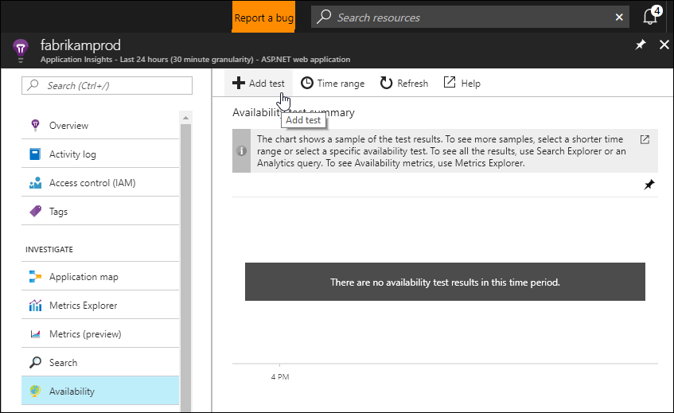
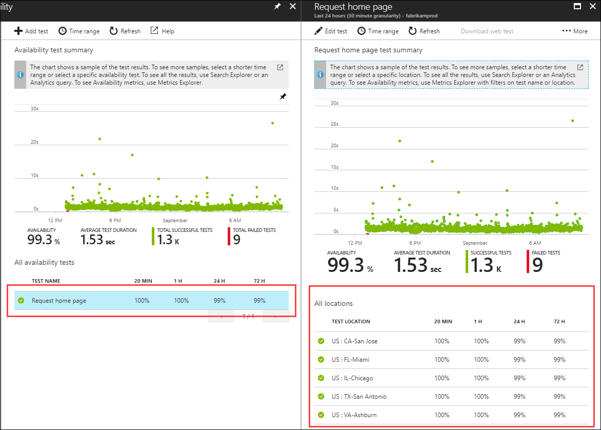
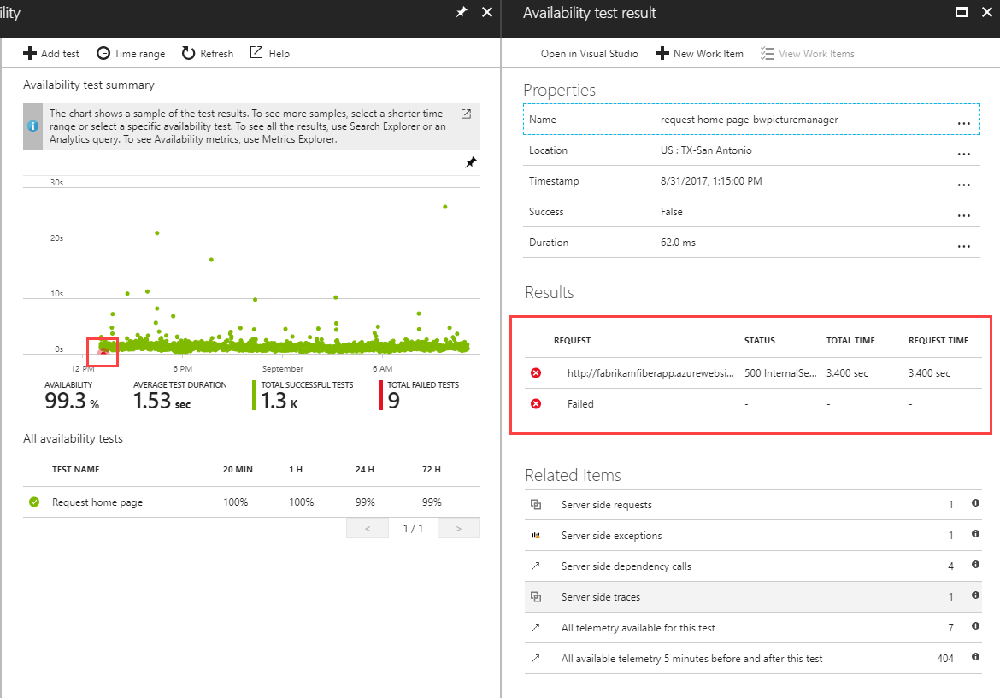
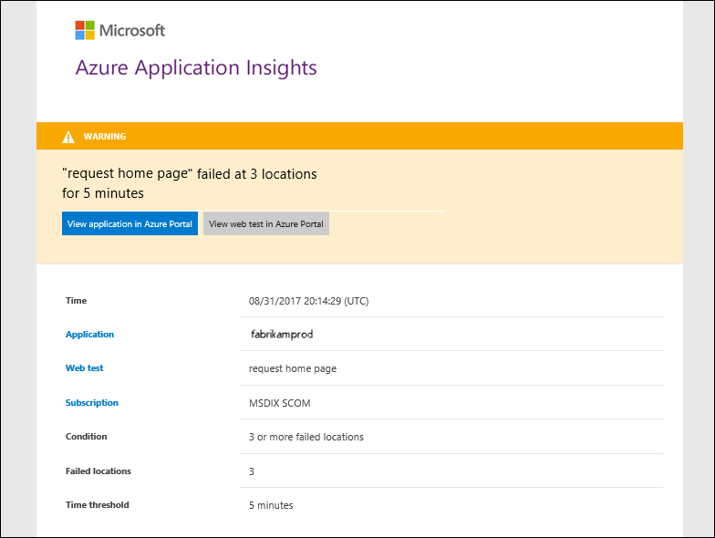
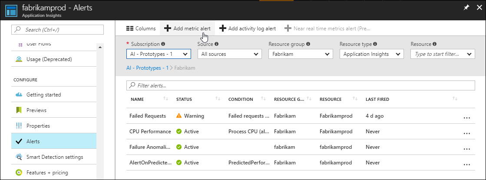
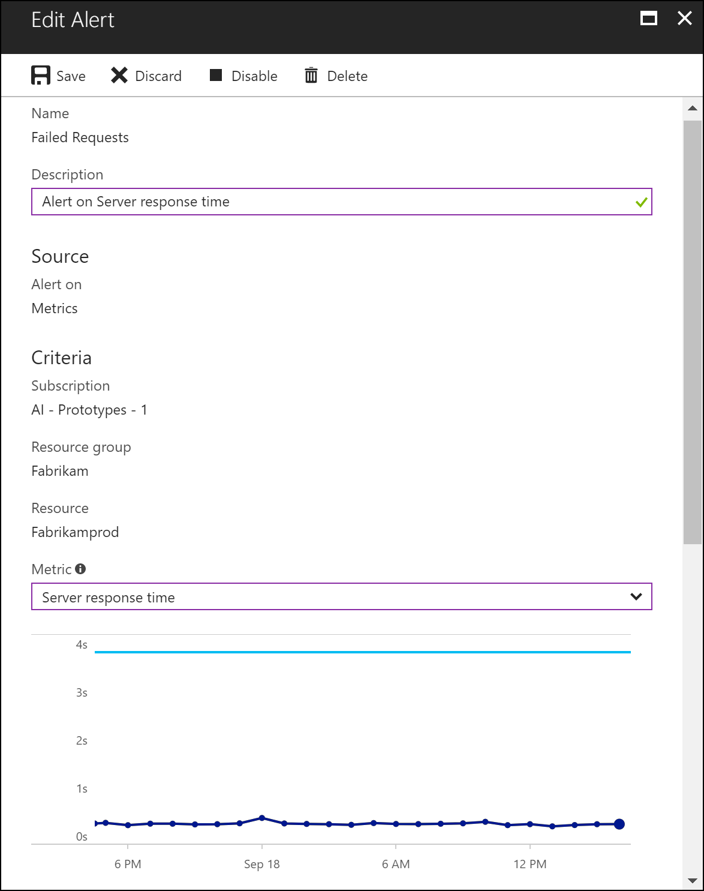

# Monitor and alert on application health with Azure Application Insights

Azure Application Insights allows you to monitor your application and send you alerts when it is either unavailable, experiencing failures, or suffering from performance issues.  This tutorial takes you through the process of creating tests to continuously check the availability of your application and to send different kinds of alerts in response to detected issues.  You learn how to:

> [!div class="checklist"]
> * Create availability test to continuously check the response of the application
> * Send mail to administrators when a problem occurs
> * Create alerts based on performance metrics 
> * Use a Logic App to send summarized telemetry on a schedule.

## Prerequisites

To complete this tutorial:

- Install [Visual Studio 2017](https://www.visualstudio.com/downloads/) with the following workloads:
	- ASP.NET and web development
	- Azure development
	- Deploy a .NET application to Azure and [enable the Application Insights SDK](app-insights-asp-net.md). 

## Log in to Azure
Log in to the Azure portal at [https://portal.azure.com](https://portal.azure.com).

## Create availability test
Availability tests in Application Insights allow you to automatically test your application from various locations around the world.   In this tutorial, you will perform a simple test to ensure that the application is available.  You could also create a complete walkthrough to test its detailed operation. 

1. Select **Application Insights** and then select your subscription.  
1. Select **Availability** under the **Investigate** menu and then click **Add test**.
 
	

2. Type in a name for the test and leave the other defaults.  This requests the home page of the application every 5 minutes from 5 different geographic locations. 
3. Select **Alerts** to open the **Alerts** panel where you can define details for how to respond if the test fails. Type in an email address to send when the alert criteria is met.  You could optionally type in the address of a webhook to call when the alert criteria is met.

	
 
4. Return to the test panel, and after a few minutes you should start seeing results from the availability test.  Click on the test name to view details from each location.  The scatter chart shows the success and duration of each test.

	

5.  You can drill down in to the details of any particular test by clicking on its dot in the scatter chart.  The example below shows the details for a failed request.

	
  
6. If the alert criteria is met, a mail similar to the one below is sent to the address that you specified.

	

## Create an alert from metrics
In addition to sending alerts from an availability test, you can create an alert from any performance metrics that are being collected for your application.

2. Select **Alerts** from the **Configure** menu.  This opens the Azure Alerts panel.  There may be other alert rules configured here for other services.
3. Click **Add metric alert**.  This opens the panel to create a new alert rule.

	

4. Type in a **Name** for the alert rule, and select your application in the dropdown for **Resource**.
5. Select a **Metric** to sample.  A graph is displayed to indicate the value of this request over the past 24 hours.  This assists you in setting the condition for the metric.

	

6. Specify a **Condition** and **Threshold** for the alert. This is the number of times that the metric must be exceeded for an alert to be created. 
6. Under **Notify via** check the **Email owners, contributors, and readers** box to send a mail to these users when the alert condition is met and add the email address of any additional recipients.  You can also specify a webhook or a logic app here that runs when the condition is met.  These could be used to attempt to mitigate the detected issue or 

	

## Proactively send information
Alerts are created in reaction to a particular set of issues identified in your application, and you typically reserve alerts for critical conditions requiring immediate attention.  You can proactively receive information about your application with a Logic App that runs automatically on a schedule.  For example, you could have a mail sent to administrators daily with summary information that requires further evaluation.

For details on creating a Logic App with Application Insights, see [Automate Application Insights processes by using Logic Apps](automate-with-logic-apps.md)

## Next steps
Now that you've learned how to alert on issues, advance to the next tutorial to learn how to analyze how users are interacting with your application.

> [!div class="nextstepaction"]
> [Understand users](app-insights-tutorial-users.md)