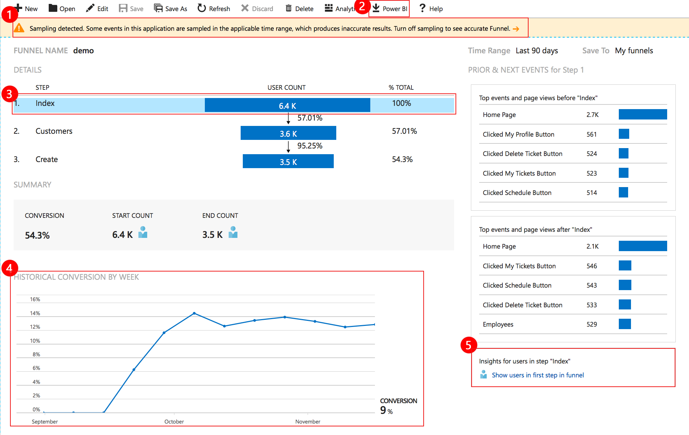

# Discover how customers are using your application with the Application Insights Funnels

Understanding customer experience is of the utmost importance to your business. If your application involves multiple stages, you will need to know if most customers are progressing through the entire process, or if they are ending the process at some point. The progression through a series of steps in a web application is known as a "funnel". You can use the Application Insights Funnels to gain insights into your users and monitor step-by-step conversion rates. 

## Get started with the Funnels blade
The easiest way to learn about Funnels is to walk though an example. The following illustrations demonstrate the steps owners of an e-commerce business would take to learn how their customers interact with their web application.  

### Create your funnel
Before you create your funnel, you need to decide on the question you want to answer. For example, you might want to know how many customers viewing your home page click on an advertisement. In this example, the owners of the Fabrikam Fiber company want to know the percentage of customers who make a purchase after adding items to their shopping cart during the last month.

Here are the steps they take to create their funnel.

1. Click the New button on the Funnels blade.
1. Select the time range of "Last month" from the **Time Range** drop-down. 
1. Select the **Product page** event from the **Step 1** drop down list. 
1. Select the **Add to shopping cart** event from the **Step 2** drop-down list.
1. Select the **Click purchase** event from the **Step 3** drop-down list.
1. Add a name to the funnel and click **Save**.

The following illustration demonstrates the data the Funnels blade generates. From here the Fabrikam owners can see that during the last week, 22.7% of their customers who added an item to their shopping cart completed the purchase. They can also see that 1% of the customers clicked an advertisement before visiting the product page, and 20% of their customers signed out after completing their purchase.

## Next steps
- Learn more about [usage analysis](app-insights-usage-overview.md). 
