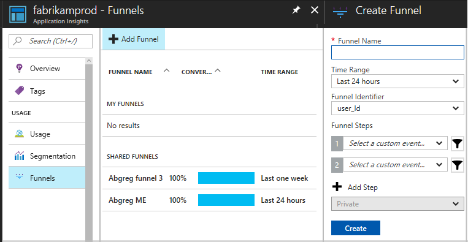
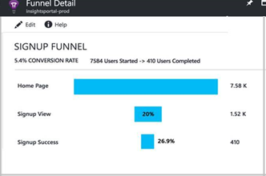
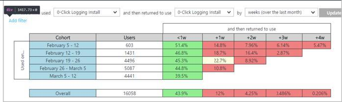
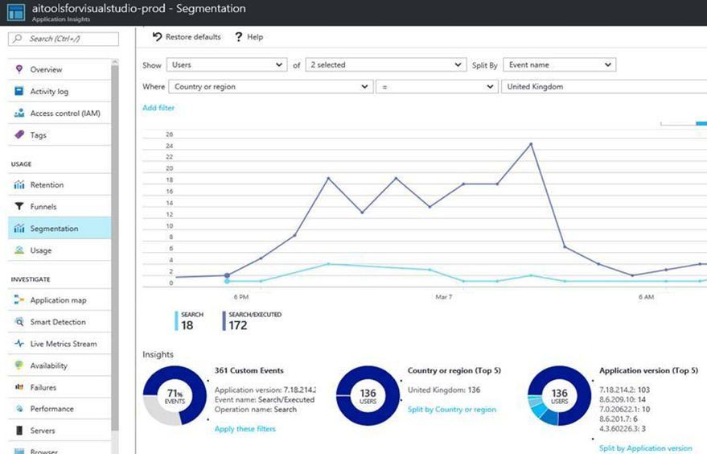

# Improve web site conversion rates with Azure Application Insights

Let’s assume that your company runs an online business. Your team is responsible for increasing user sign-ups, purchases, and engagement with new features. You want to maximize several conversion rates: 

* The rate at which visitors to your landing page click “Sign up,” then successfully complete your onboarding workflow. 
* The rate at which users with items in their shopping carts successfully complete a purchase. 
* The rate at which visitors click the button for a feature you recently added.  
* The rate of successful usage of the new feature. And where users don’t succeed, you’d like to understand how it could be made better. 

[Application Insights](app-insights-overview.md) can help your team understand your users’ behavior on your site to improve these conversion rates, identifying precise places where users drop off, and helping you understand what designs resonate with your customers. 

## Telemetry from Application Insights 

Application Insights monitors your web application while it’s running. It analyzes the operations your application performs to service each of your users. For example, the basic usage information collected by Application Insights includes the number of users you had each day, how often each user returns to your site, and how long they spent there.  

Application Insights collects this telemetry by using a lightweight add-in module in your web software. The module sends the telemetry to the Azure cloud portal, where it is available for you to analyze. Application Insights provides a variety of built-in analysis functions, and you can also create your own complex queries. The telemetry data is, of course, private to your organization. 

The standard telemetry collected by the add-in module includes logs of each web request received by your server. These events allow you to trace a user’s progress through your web pages. In addition, your development team can insert custom telemetry that sends an event whenever specific business goals are reached – for example, a sale. This helps you find out how successfully your site helps users to achieve their goals, such as making a purchase, winning a game, or whatever your site is designed to do. 

On a more detailed level, custom telemetry events can be sent when specific buttons are pressed or other actions are performed by the user in the web page. These custom events allow you to analyze in detail how users behave on your site, and which features they like, and find easy or difficult to use. 

## Viewing conversion rates with funnels 

The funnel chart helps you understand conversion rates between related user actions or steps in your app. It helps you to understand where users fail to move on to the next step that you’d like them to achieve. 

Depending on the design of your web site, each step might be represented by a request arriving at the server, or by some other custom event. 

### Creating a funnel 

To create a funnel in the funnel tool, you define a series of steps. Each step is typically represented by a specific type of web page request. For example, the “signed up” step would count the page that welcomes new users. Further steps might be viewing your product catalog, viewing a product’s details, and completing a purchase. 

As you add each step, the funnel tool shows how many of your users who got through the first step made it to the end of your sequence – the “conversion rate.” This helps you to understand whether your funnel definition is useful. 
The tool also suggests events that might be interesting steps to add. It bases this suggestion on what users tend to do after completing the funnel that you’ve defined so far. 

Once you have defined a funnel, you can come back to it whenever you like. It shows the progress of the users through the steps you defined. You can adjust the time period over which users are counted: 

 
## Retention tool 

Retention helps you understand how often your users return to use their app, based on cohorts of users that performed some action during a certain time bucket. 

## Segmentation 

The segmentation experience helps you find out how many users have performed certain actions, measured by custom events and page views. Then you can segment that usage by a variety of filters such as country, time of day, application version, and so on. This helps you to a better understanding of the context in which your users work.  

 
## Assess a new feature 

When you design a new feature, you want to know how many people use it, what aspects of it they find easy or difficult, and whether they achieve the results they (and you) are hoping for. With that information, you can plan the next cycle of design and development: You know what adjustments are needed, what features to expand on, and  

Here are some tips that you might find useful: 

### Hypothesize

You hope that the new feature will work well, and you probably have a vision for the next step you’ll take with it. For example,maybe this feature lets your users make a list of their favorite products. Your next step will be to let each user make several named lists of favorites. Why do you believe that your development team should work on this? It’s because you believe in the following hypotheses: 

1. People will use your feature, storing their favorites. 
2. Using this feature will lead to more sales – the ultimate goal of your site. 

So, before you spend too much time on a feature, make your hypotheses explicit, and plan to test them. 

### Design the telemetry with the feature

Consider what you need to know about the users’ actions, in order to prove your hypotheses. Build that telemetry into your design, if custom events are necessary. 

## Learn more

* [Tracking usage](app-insights-web-track-usage.md)
* [Application Insights](app-insights-overview.md)