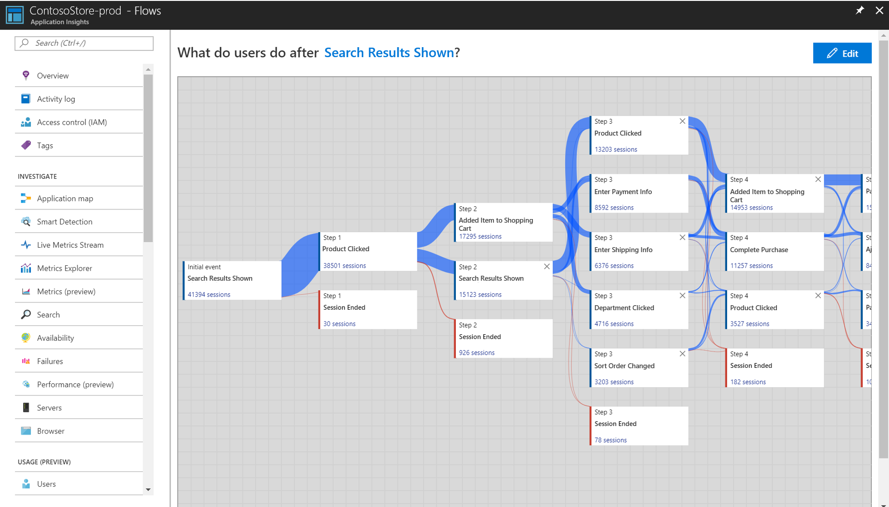
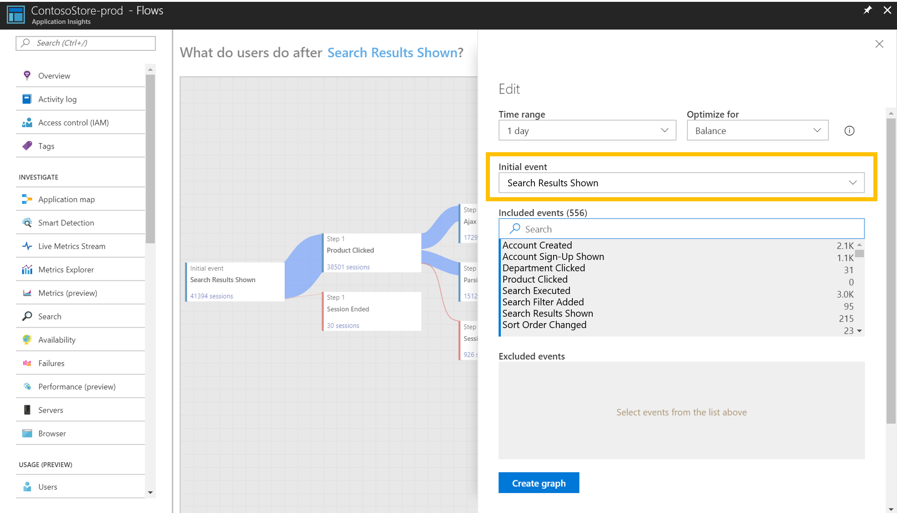
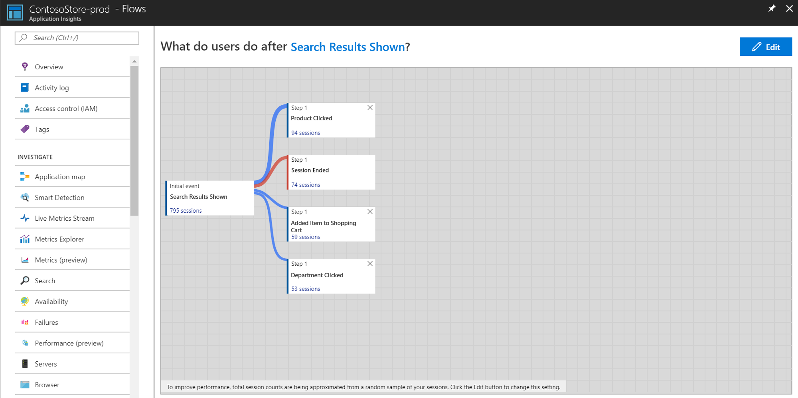
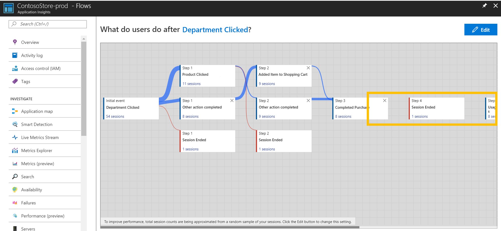

# Analyze user navigation patterns with User Flows in Application Insights

The User Flows tool visualizes how users navigate between the pages and features of your site. It's great for answering questions like:
* How do users navigate away from a page on your site?
* What do users click on a page on your site?
* Where are the places that users churn most from your site?
* Are there places where users repeat the same action over and over?

The User Flows tool starts from an initial page view or event that you specify. Given this page view or custom event, User Flows shows the page views and custom events that users sent immediately afterwards during a session, two steps afterwards, and so forth. Lines of varying thickness show how many times each path was followed by users. Special "Session Ended" nodes show how many users sent no page views or custom events after the preceding node, highlighting where users probably left your site.

> [!NOTE]
> Your Application Insights resource must contain page views or custom events to use the User Flows tool. [Learn how to set up your app to collect page views automatically with the Application Insights JavaScript SDK](app-insights-javascript.md).
> 
> 

## Start by choosing an initial page view or custom event

To get started answering questions with the User Flows tool, choose an initial page view or custom event to serve as the starting point for the visualization:
1. Click the link in the "What do users do after...?" title, or click the Edit button. 
2. Select a page view or custom event from the "Initial event" dropdown.
3. Click "Create graph".

The "Step 1" column of the visualization shows what users did most frequently just after the initial event, ordered top-to-bottom from most- to least-frequent. The "Step 2" and subsequent columns show what users did thereafter, creating a picture of all the ways users have navigated through your site.

By default, the User Flows tool randomly samples only the last 24 hours of page views and custom event from your site. You can increase the time range and change the balance of performance and accuracy for random sampling in the Edit menu.

If some of the page views and custom events aren't relevant to you, click the "X" on the nodes you want to hide. Once you've selected the nodes you want to hide, click the "Create graph" button below the visualization. To see all of the nodes you've hidden, click the Edit button, then look at the "Excluded events" section.

If page views or custom events are missing that you expect to see on the visualization:
* Check the "Excluded events" section in the Edit menu.
* Use the "Detail level" control in the Edit menu to include less-frequent events in the visualization.
* If the page view or custom event you expect is sent infrequently by users, try increasing the time range of the visualization in the Edit menu.
* Make sure the page view or custom event you expect is set up to be collected by the Application Insights SDK in the source code of your site. [Learn more about collecting custom events.](app-insights-api-custom-events-metrics.md)

If you want to see more steps in the visualization, use the "Number of steps" slider in the Edit menu.

## After visiting a page or feature, where do users go and what do they click?

If your initial event is a page view, the first column ("Step 1") of the visualization is a quick way to understand what users did immediately after visiting the page. Try opening your site in a window next to the User Flows visualization. Compare your expectations of how users interact with the page to the list of events in the "Step 1" column. Often, a UI element on the page that seems insignificant to your team can be among the most-used on the page. It can be a great starting point for design improvements to your site.

If your initial event is a custom event, the first column shows what users did just after performing that action. As with page views, consider if the observed behavior of your users matches your team's goals and expectations. If your selected initial event is "Added Item to Shopping Cart", for example, look to see if "Go to Checkout" and "Completed Purchase" appear in the visualization shortly thereafter. If user behavior is much different from your expectations, use the visualization to understand how users are getting "trapped" by your site's current design.

## Where are the places that users churn most from your site?

Watch for "Session Ended" nodes that appear high-up in a column in the visualization, especially early in a flow. This means many users probably churned from your site after following the preceding path of pages and UI interactions. Sometimes churn is expected - after completing a purchase on an eCommerce site, for example - but usually churn is a sign of design problems, poor performance, or other issues with your site that can be improved.

Keep in mind that "Session Ended" nodes are based only on telemetry collected by this Application Insights resource. If Application Insights doesn't receive telemetry for certain user interactions, users could still have interacted with your site in those ways after the User Flows tool says the session ended.

## Are there places where users repeat the same action over and over?

Look for a page view or custom event that is repeated by many users across subsequent steps in the visualization. This usually means that users are performing repetitive actions on your site. If you find repetition, think about changing the design of your site or adding new functionality to reduce repetition. For example, adding bulk edit functionality if you find users performing repetitive actions on each row of a table element.

## Common Questions

### Why do steps appear disconnected?

If steps (columns) in a User Flows visualization are disconnected, it means none of the paths taken by users between the steps were frequent enough to be shown. To show less frequent events on the visualization so the steps appear connected, adjust the "Detail level" slider in the Edit menu.

### Does the initial event represent the first time the event appears in a session, or any time it appears in a session?

The initial event on the visualization only represents the first time a user sent that page view or custom event during a session. If users can send the initial event multiple times in a session, then the "Step 1" column only shows how users behave after the *first* instance of initial event, not all instances.

## Next steps

* [Usage overview](app-insights-usage-overview.md)
* [Users, Sessions, and Events](app-insights-usage-segmentation.md)
* [Retention](app-insights-usage-retention.md)
* [Adding custom events to your app](app-insights-api-custom-events-metrics.md)