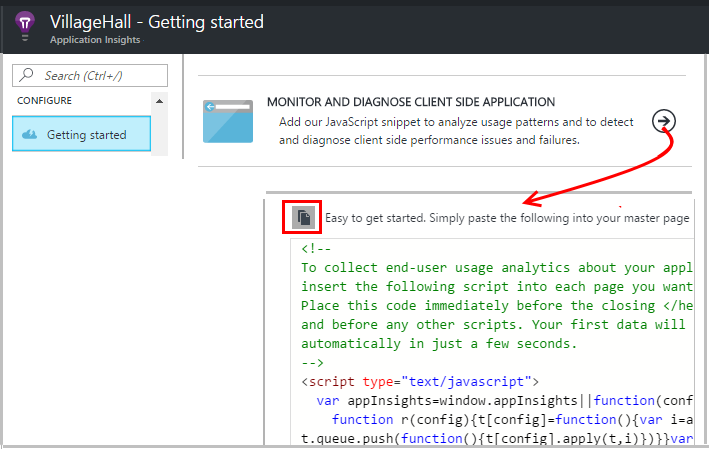
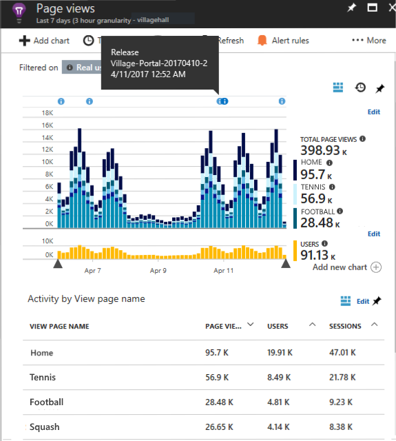
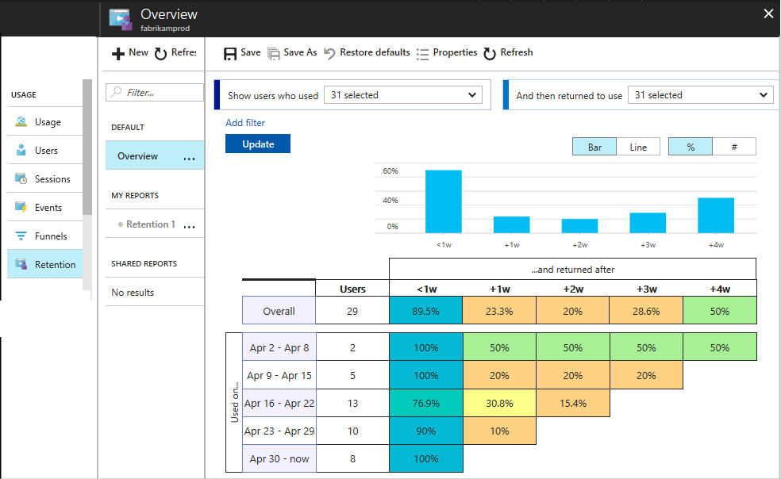

# Usage analysis for web applications with Application Insights

Which features of your web app are most popular? Do your users achieve their goals with your app? Do they drop out at particular points, and do they return later?  [Azure Application Insights](app-insights-overview.md) helps you gain powerful insights into how people use your web app. Every time you update your app, you can assess how well it works for users. With this knowledge, you can make data driven decisions about your next development cycles.

## Send telemetry from your app

The best experience is obtained by installing Application Insights both in your app server code, and in your web pages. The client and server components of your app send telemetry back to the Azure portal for analysis.

1. **Server code:** Install the appropriate module for your [ASP.NET](app-insights-asp-net.md), [Azure](app-insights-azure.md), [Java](app-insights-java-get-started.md), [Node.js](app-insights-nodejs.md), or [other](app-insights-platforms.md) app.

    * *Don't want to install server code? Just [create an Azure Application Insights resource](app-insights-create-new-resource.md).*

2. **Web page code:** Open the [Azure portal](https://portal.azure.com), open the Application Insights resource for your app, and then open **Getting Started > Monitor and Diagnose Client-Side**. 

    


3. **Get telemetry:** Run your project in debug mode for a few minutes, and then look for results in the Overview blade in Application Insights.

    Publish your app to monitor your app's performance and find out what your users are doing with your app.


## Explore usage demographics and statistics
Find out when people use your app, what pages they're most interested in, where your users are located, what browsers and operating systems they use. 

The Users and Sessions reports filter your data by pages or custom events, and segment them by properties such as location, environment,and page. You can also add your own filters.

  

Insights on the right point out interesting patterns in the set of data.  

* The **Users** report counts the numbers of unique users that access your pages within your chosen time periods. (Users are counted by using cookies. If someone accesses your site with different browsers or client machines, or clears their cookies, then they will be counted more than once.)
* The **Sessions** report counts the number of user sessions that access your site. A session is a period of activity by a user, terminated by a period of inactivity of more than half an hour.

[More about the Users, Sessions, and Events tools](app-insights-usage-segmentation.md)  

## Page views

From the Usage blade, click through the Page Views tile to get a breakdown of your most popular pages:



The example above is from a games web site. From the charts, we can instantly see:

* Usage hasn't improved in the past week. Maybe we should think about search engine optimization?
* Tennis is the most popular game page. Let's focus on further improvements to this page.
* On average, users visit the Tennis page about three times per week. (There are about three times more sessions than users.)
* Most users visit the site during the U.S. working week, and in working hours. Perhaps we should provide a "quick hide" button on the web page.
* The [annotations](app-insights-annotations.md) on the chart show when new versions of the website were deployed. None of the recent deployments had a noticeable effect on usage.

What if you want to investigate the traffic to your site in more detail, like splitting by a custom property your site sends in its page view telemetry?

1. Open the **Events** tool in the Application Insights resource menu. This tool lets you analyze how many page views and custom events were sent from your app, based on a variety of filtering, cohorting, and segmentation options.
2. In the "Who used" dropdown, select "Any Page View".
3. In the "Split by" dropdown, select a property by which to split your page view telemetry.

## Retention - how many users come back?

Retention helps you understand how often your users return to use their app, based on cohorts of users that performed some business action during a certain time bucket. 

- Understand what specific features cause users to come back more than others 
- Form hypotheses based on real user data 
- Determine whether retention is a problem in your product 

 

The retention controls on top allow you to define specific events and time range to calculate retention. The graph in the middle gives a visual representation of the overall retention percentage by the time range specified. The graph on the bottom represents individual retention in a given time period. This level of detail allows you to understand what your users are doing and what might affect returning users on a more detailed granularity.  

[More about the Retention tool](app-insights-usage-retention.md)

## Custom business events

To get a clear understanding of what users do with your web app, it's useful to insert lines of code to log custom events. These events can track anything from detailed user actions such as clicking specific buttons, to more significant business events such as making a purchase or winning a game. 

Although in some cases, page views can represent useful events, it isn't true in general. A user can open a product page without buying the product. 

With specific business events, you can chart your users' progress through your site. You can find out their preferences for different options, and where they drop out or have difficulties. With this knowledge, you can make informed decisions about the priorities in your development backlog.

Events can be logged in the web page:

```JavaScript

    appInsights.trackEvent("ExpandDetailTab", {DetailTab: tabName});
```

Or in the server side of the web app:

```C#
    var tc = new Microsoft.ApplicationInsights.TelemetryClient();
    tc.TrackEvent("CreatedAccount", new Dictionary<string,string> {"AccountType":account.Type}, null);
    ...
    tc.TrackEvent("AddedItemToCart", new Dictionary<string,string> {"Item":item.Name}, null);
    ...
    tc.TrackEvent("CompletedPurchase");
```

You can attach property values to these events, so that you can filter or split the events when you inspect them in the portal. In addition, a standard set of properties is attached to each event, such as anonymous user id, which allows you to trace the sequence of activities of an individual user.

Learn more about [custom events](app-insights-api-custom-events-metrics.md#trackevent) and [properties](app-insights-api-custom-events-metrics.md#properties).

### Slice and dice events

In the Users, Sessions, and Events tools, you can slice and dice custom events by user, event name, and properties.

  
  
## Design the telemetry with the app

When you are designing each feature of your app, consider how you are going to measure its success with your users. Decide what business events you need to record, and code the tracking calls for those events into your app from the start.

## A | B Testing
If you don't know which variant of a feature will be more successful, release both of them, making each accessible to different users. Measure the success of each, and then move to a unified version.

For this technique, you attach distinct property values to all the telemetry that is sent by each version of your app. You can do that by defining properties in the active TelemetryContext. These default properties are added to every telemetry message that the application sends - not just your custom messages, but the standard telemetry as well.

In the Application Insights portal, filter and split your data on the property values, so as to compare the different versions.

To do this, [set up a telemetry initializer](app-insights-api-filtering-sampling.md##add-properties-itelemetryinitializer):

```C#


    // Telemetry initializer class
    public class MyTelemetryInitializer : ITelemetryInitializer
    {
        public void Initialize (ITelemetry telemetry)
        {
            telemetry.Properties["AppVersion"] = "v2.1";
        }
    }
```

In the web app initializer such as Global.asax.cs:

```C#

    protected void Application_Start()
    {
        // ...
        TelemetryConfiguration.Active.TelemetryInitializers
        .Add(new MyTelemetryInitializer());
    }
```

All new TelemetryClients automatically add the property value you specify. Individual telemetry events can override the default values.

## Next steps

* [Users and sessions](app-insights-usage-segmentation.md)
* [Retention](app-insights-usage-retention.md)
* [Coding custom events](app-insights-api-custom-events-metrics.md)s

