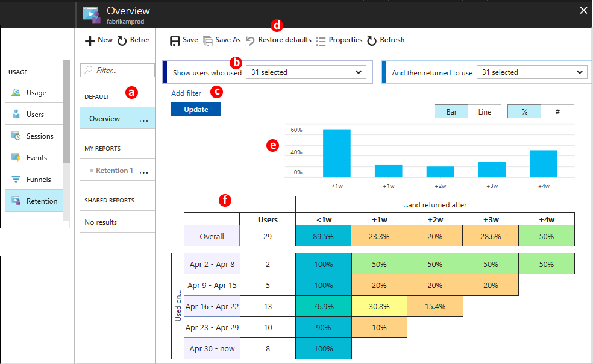

# User retention analysis for web applications with Application Insights

The retention blade in [Azure Application Insights](app-insights-overview.md) helps you analyze how many users return to your app, and how often they perform particular tasks or achieve goals. For example, if you run a game site, you could compare the numbers of users who return to the site after losing a game with the number who return after winning. This knowledge can help you improve both your user experience and your business strategy.

## Get started

If you don't yet see data in the retention blade in the Application Insights portal, [learn how to get started with the usage tools](app-insights-usage-overview.md).

## The retention tool



a. The Overview page is always there. In addition, you can save named reports with different parameter settings. Save to Shared to make the report visible to other users who have access to the resource.

b. By default, the chart counts all users who used any of the custom events or page views received from your app. Select one, or a subset, to focus on a particular user activity. 

c. Add one or more filters on properties. For example, you could focus on users in a particular country or region. Click **Update** after setting the filters.

d. **Restore defaults** always clears the custom filter and the events filters.

e. The summary chart shows totals across the selected time period.

f. The grid shows the number of users who have returned to repeat the selected actions within a particular period. Each row represents a cohort of users who performed one of the selected actions in the time period shown. Each cell in the row shows how many of that cohort returned at least once in a later period. Some users may return in more than one period.

Everyone who used the app during the time range of the chart is represented in exactly one row of the chart. Each user is counted in the period when they first performed the selected action within the chart's time range. There will therefore tend to be a larger number in the first row.


## Use business events to track retention

To get the most useful retention analysis, measure events that represent significant business activities. 

For example, many users might open a page in your app without playing the game that it displays. Tracking just the page views would therefore provide an inaccurate estimate of how many people return to play the game after enjoying it previously. To get a clear picture of returning players, your app should send a custom event when a user actually plays.  

It's good practice to code custom events that represent key business actions, and use these for your retention analysis. To capture the game outcome, you need to write a line of code to send a custom event to Application Insights. If you write it in the web page code or in Node.JS, it looks like this:

```JavaScript
    appinsights.trackEvent("won game");
```

Or in ASP.NET server code:

```C#
   telemetry.TrackEvent("won game");
```

[Learn more about writing custom events](app-insights-api-custom-events-metrics.md#trackevent).


## Next steps

* [Usage overview](app-insights-usage-overview.md)
* [Users and sessions](app-insights-usage-segmentation.md)
* [Coding custom events](app-insights-api-custom-events-metrics.md)s

