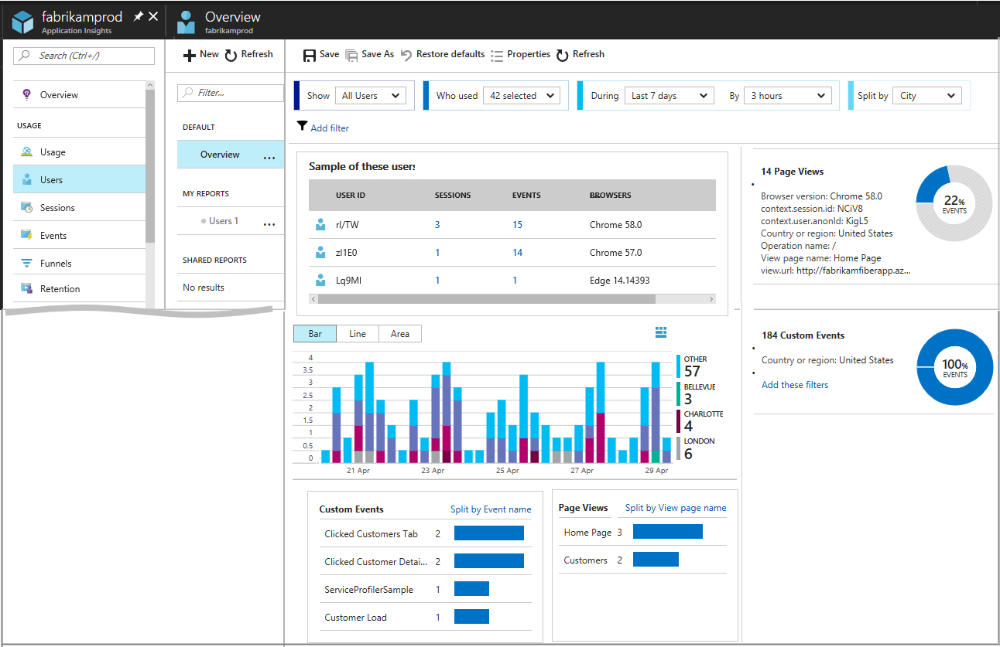

# Users, sessions, and events analysis in Application Insights

Find out when people use your web app, what pages they're most interested in, where your users are located, what browsers and operating systems they use. Analyze business and usage telemetry by using [Azure Application Insights](app-insights-overview.md).

## Get started

If you don't yet see data in the users, sessions, or events blades in the Application Insights portal, [learn how to get started with the usage tools](app-insights-usage-overview.md).

## The Users, Sessions, and Events segmentation tool

Three of the usage blades use the same tool to slice and dice telemetry from your web app from three perspectives. By filtering and splitting the data, you can uncover insights about the relative usage of different pages and features.

* **Users tool**: How many people used your app and its features.  Users are counted by using anonymous IDs stored in browser cookies. A single person using different browsers or machines will be counted as more than one user.
* **Sessions tool**: How many sessions of user activity have included certain pages and features of your app. A session is counted after half an hour of user inactivity, or after continuous 24h of use.
* **Events tool**: How often certain pages and features of your app are used. A page view is counted when a browser loads a page from your app, provided you have [instrumented it](app-insights-javascript.md). 

    A custom event represents one occurrence of something happening in your app, often a user interaction like a button click or the completion of some task. You insert code in your app to [generate custom events](app-insights-api-custom-events-metrics.md#trackevent).

## Querying for Certain Users 

Explore different groups of users by adjusting the query options at the top of the Users tool: 

* Who used: Choose custom events and page views. 
* During: Choose a time range. 
* By: Choose how to bucket the data, either by a period of time or by another property such as browser or city. 
* Split By: Choose a property by which to split or segment the data. 
* Add Filters: Limit the query to certain users, sessions, or events based on their properties, such as browser or city. 
 
## Saving and sharing reports 
You can save Users reports, either private just to you in the My Reports section, or shared with everyone else with access to this Application Insights resource in the Shared Reports section.  
 
While saving a report or editing its properties, choose "Current Relative Time Range" to save a report will continuously refreshed data, going back some fixed amount of time.  
 
Choose "Current Absolute Time Range" to save a report with a fixed set of data. Keep in mind that data in Application Insights is only stored for 90 days, so if more than 90 days have passed since a report with an absolute time range was saved, the report will appear empty. 
 
## Example instances

The Example instances section shows information about a handful of individual users, sessions, or events that are matched by the current query. Considering and exploring the behaviors of individuals, in addition to aggregates, can provide insights about how people actually use your app. 
 
## Insights 

The Insights sidebar shows large clusters of users that share common properties. These clusters can uncover surprising trends in how people use your app. For example, if 40% of all of the usage of your app comes from people using a single feature.  

## Next steps

* [Usage overview](app-insights-usage-overview.md)
* [Retention](app-insights-usage-retention.md)
* [Coding custom events](app-insights-api-custom-events-metrics.md)s

