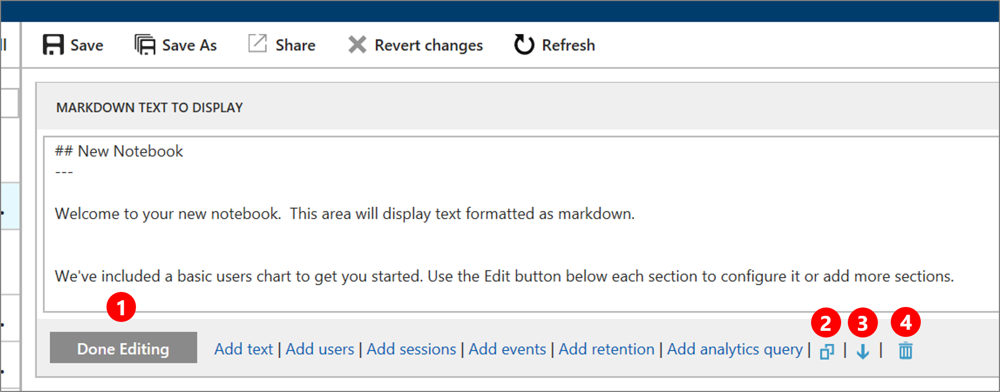
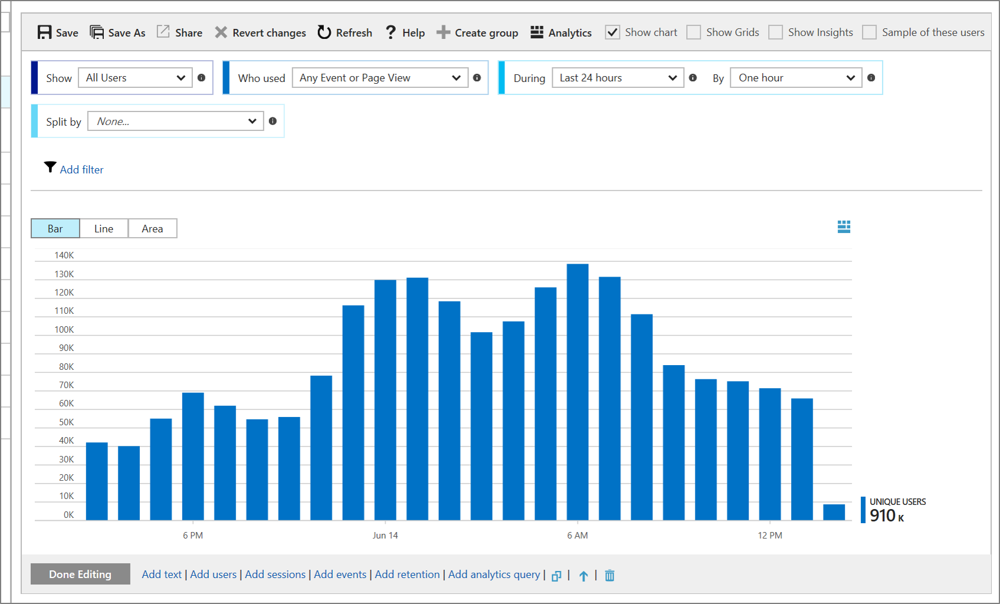
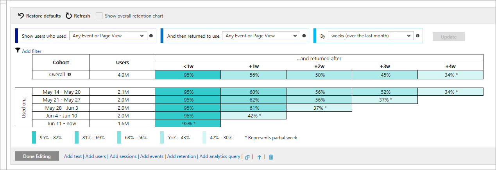
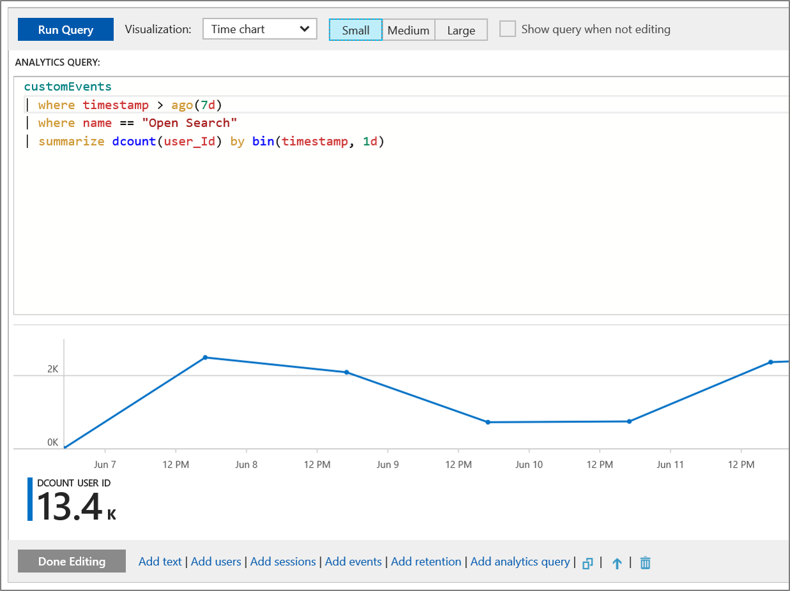

# Investigate and share usage data with interactive Workbooks in Application Insights

Workbooks combine [Azure Application Insights](app-insights-overview.md) data visualizations, [Analytics queries](app-insights-analytics.md), and text into interactive documents. Workbooks are editable by other team members with access to the same Azure resource. This means the queries and controls used to create a workbook are available to other people reading the workbook, making them easy to explore, extend, and check for mistakes.

Workbooks are helpful for scenarios like:

* Exploring the usage of your app when you don't know the metrics of interest in advance: numbers of users, retention rates, conversion rates, etc. Unlike other usage analytics tools in Application Insights, Workbooks let you combine multiple kinds of visualizations and analyses, making them great for this kind of free-form exploration.
* Explaining to your team how a newly released feature is performing, by showing user counts for key interactions and other metrics.
* Sharing the results of an A/B experiment in your app with other members of your team. You can explain the goals for the experiment with text, then show each usage metric and Analytics query used to evaluate the experiment, along with clear call-outs for whether each metric was above- or below-target.
* Reporting the impact of an outage on the usage of your app, combining data, text explanation, and a discussion of next steps to prevent outages in the future.

> [!NOTE]
> Your Application Insights resource must contain page views or custom events to use Workbooks. [Learn how to set up your app to collect page views automatically with the Application Insights JavaScript SDK](app-insights-javascript.md).
> 
> 

## Editing, rearranging, cloning, and deleting workbook sections

A workbook is a made of sections: independently editable usage visualizations, charts, tables, text, or Analytics query results.

To edit the contents of a workbook section, click the **Edit** button below and to the right of the workbook section.

1. When you're done editing a section, click **Done Editing** in the bottom left corner of the section.

2. To create a duplicate of a section, click the **Clone this section** icon. Creating duplicate sections is a great to way to iterate on a query without losing previous iterations.

3. To move up a section in a workbook, click the **Move up** or **Move down** icon.

4. To remove a section permanently, click the **Remove** icon.

## Adding usage data visualization sections

Workbooks offer four types of built-in usage analytics visualizations. Each answers a common question about the usage of your app. To add tables and charts other than these four sections, add Analytics query sections (see below).

To add a Users, Sessions, Events, or Retention section to your workbook, use the **Add Users** or other corresponding button at the bottom of the workbook, or at the bottom of any section.

**Users** sections answer "How many users viewed some page or used some feature of my site?"

**Sessions** sections answer "How many sessions did users spend viewing some page or using some feature of my site?"

**Events** sections answer "How many times did users view some page or use some feature of my site?"

Each of these three section types offers the same sets of controls and visualizations:

* [Learn more about editing Users, Sessions, and Events sections](app-insights-usage-segmentation.md)
* Toggle the main chart, histogram grids, automatic insights, and sample users visualizations using the **Show Chart**, **Show Grid**, **Show Insights**, and **Sample of These Users** checkboxes at the top of each section.

**Retention** sections answer "Of people who viewed some page or used some feature on one day or week, how many came back in a subsequent day or week?"

* [Learn more about editing Retention sections](app-insights-usage-retention.md)
* Toggle the optional Overall Retention chart using the **Show overall retention chart** checkbox at the top of the section.

## Adding Application Insights Analytics sections

To add an Application Insights Analytics query section to your workbook, use the **Add Analytics query** button at the bottom of the workbook, or at the bottom of any section.

Analytics query sections let you add arbitrary queries over your Application Insights data into Workbooks. This flexibility means Analytics query sections should be your go-to for answering any questions about your site other than the four listed above for Users, Sessions, Events, and Retention, like:

* How many exceptions did your site throw during the same time period as a decline in usage?
* What was the distribution of page load times for users viewing some page?
* How many users viewed some set of pages on your site, but not some other set of pages? This can be useful to understand if you have clusters of users who use different subsets of your site's functionality (use the `join` operator with the `kind=leftanti` modifier in the Analytics query language).

Use the [Analytics query language reference](app-insights-analytics-reference.md) to learn more about writing queries.

## Adding text and Markdown sections

Adding headings, explanations, and commentary to your workbooks helps turn a set of tables and charts into a narrative. Text sections in Workbooks support the [Markdown syntax](https://daringfireball.net/projects/markdown/) for text formatting, like headings, bold, italics, and bulleted lists.

To add a text section to your workbook, use the **Add text** button at the bottom of the workbook, or at the bottom of any section.

## Saving and sharing Workbooks with your team

Workbooks are saved within an Application Insights resource, either in the **My Reports** section that's private to you or in the **Shared Reports** section that's accessible to everyone with access to the Application Insights resource. To view all the workbooks in the resource, click the **Open** button in the action bar.

To share a workbook that's currently in **My Reports**:

1. Click **Open** in the action bar
2. Click the "..." button beside the workbook you want to share
3. Click **Move to Shared Reports**.

To share a workbook with a link or via email, click **Share** in the action bar. Keep in mind that recipients of the link need access to this resource in the Azure portal to view the workbook. To make edits, recipients need at least Contributor permissions for the resource.

To pin a link to a workbook to an Azure Dashboard:

1. Click **Open** in the action bar
2. Click the "..." button beside the workbook you want to pin
3. Click **Pin to dashboard**.

## Next steps

* [Usage overview](app-insights-usage-overview.md)
* [Users, Sessions, and Events](app-insights-usage-segmentation.md)
* [Retention](app-insights-usage-retention.md)
* [Adding custom events to your app](app-insights-api-custom-events-metrics.md)

