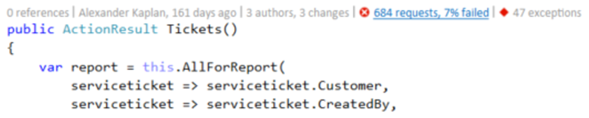
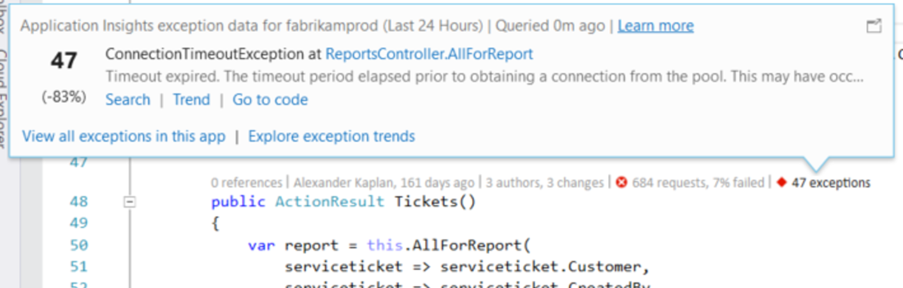
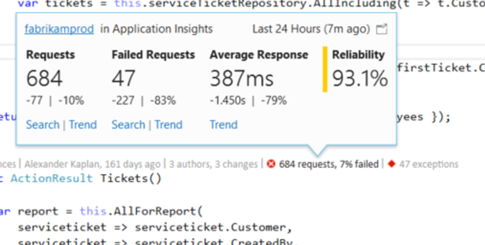
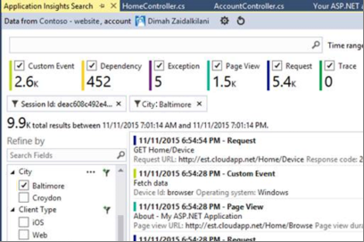

<properties 
	pageTitle="CodeLens in Visual Studio | Microsoft Azure" 
	description="Quickly access your Application Insights request and exception telemetry with CodeLens in Visual Studio." 
	services="application-insights" 
    documentationCenter=".net"
	authors="numberbycolors" 
	manager="douge"/>

<tags 
	ms.service="application-insights" 
	ms.workload="tbd" 
	ms.tgt_pltfrm="ibiza" 
	ms.devlang="na" 
	ms.topic="get-started-article" 
	ms.date="08/26/2016" 
	ms.author="daviste"/>
	
# CodeLens in Visual Studio

CodeLens provides quick, useful information in the context of your code, like the number of places a function is referenced or the last person who edited a function. With Application Insights, exception and request information from your app is available right from CodeLens.

> [AZURE.NOTE] Application Insights in CodeLens is available in Visual Studio 2015 Update 3 and later, or with the [Developer Analytics Tools extension](https://visualstudiogallery.msdn.microsoft.com/82367b81-3f97-4de1-bbf1-eaf52ddc635a) version TBD and later. CodeLens is only available in the Enterprise and Professional editions of Visual Studio. CodeLens is not available in Visual Studio Community.

## Using CodeLens

CodeLens indicators are shown above class, method, and other declarations in C# and Visual Basic code. If Application Insights data is available for a method, you'll see indicators for requests and exceptions like "100 requests, 1% failed" or "10 exceptions." Click a CodeLens indicator for more details.

> [AZURE.TIP] Application Insights request and exception indicators may take a few extra seconds to load after other CodeLens indicators appear.

## Exceptions in CodeLens

The exception CodeLens indicator shows the number of exceptions that have occurred in the past 24 hours from the 15 most frequently occuring exceptions during that period.

> [AZURE.TIP] If you see "0 exceptions" in CodeLens but you know there should be exceptions, check to make sure the right Application Insights resource is selected in CodeLens. To select another resource, right-click on your project in the Solution Explorer and choose **Application Insights > Choose Telemetry Source**.

> [AZURE.TIP] If you see "? exceptions" in CodeLens, you need to associate your Azure account with Visual Studio or your Azure account credential may have expired. In either case, click on "? exceptions" and choose **Add an account...** to enter your credentials.

## Requests in CodeLens

TBD  

## Next steps

||
|---|---
|**[Working with Application Insights in Visual Studio](app-insights-visual-studio.md)** Search telemetry, see data in CodeLens, and configure Application Insights. All within Visual Studio. |
|**[Add more data](app-insights-asp-net-more.md)** Monitor usage, availability, dependencies, exceptions. Integrate traces from logging frameworks. Write custom telemetry. | 
|**[Working with the Application Insights portal](app-insights-dashboards.md)** Dashboards, powerful diagnostic and analytic tools, alerts, a live dependency map of your application, and telemetry export. |
