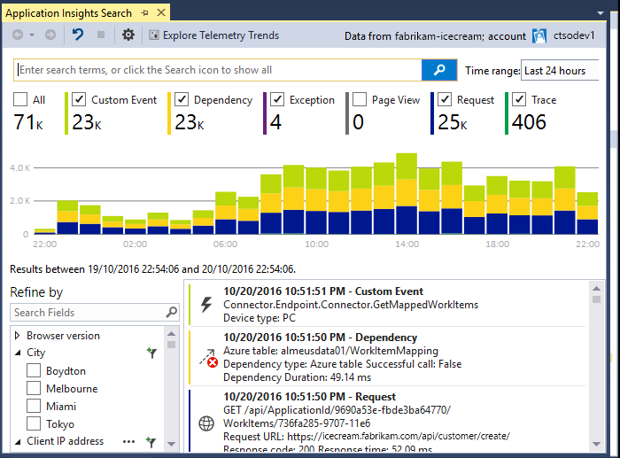

<properties 
	pageTitle="Analyzing Trends in Visual Studio | Microsoft Azure" 
	description="Analyze, visualize, and explore trends in your Application Insights telemetry in Visual Studio." 
	services="application-insights" 
    documentationCenter=".net"
	authors="numberbycolors" 
	manager="douge"/>

<tags 
	ms.service="application-insights" 
	ms.workload="tbd" 
	ms.tgt_pltfrm="ibiza" 
	ms.devlang="na" 
	ms.topic="get-started-article" 
	ms.date="08/08/2016" 
	ms.author="daviste"/>
	
# Analyzing Trends in Visual Studio

The Application Insights Trends tool visualizes how your application's important telemetry events change over time, helping you quickly identify problems and anomalies. By linking you to more detailed diagnostic information, Trends can help you improve your app's performance, track down the causes of exceptions, and uncover insights from your custom events.

> [AZURE.NOTE] Application Insights Trends is available in Visual Studio 2015 Update 3 and later, or with the [Developer Analytics Tools extension](https://visualstudiogallery.msdn.microsoft.com/82367b81-3f97-4de1-bbf1-eaf52ddc635a) version 5.209 and later.

## Open Application Insights Trends

To open the Application Insights Trends window:

* From the Application Insights toolbar button, choose **Explore Telemetry Trends**, or
* From the project context menu, choose **Application Insights > Explore Telemetry Trends**, or
* From the Visual Studio menu bar, choose **View > Other Windows > Application Insights Trends**.

You may see a prompt to select a resource. Click **Select a resource**, sign in with an Azure subscription, then choose an Application Insights resource from the list for which you'd like to analyze telemetry trends.

## Choose a trend analysis

Get started by choosing from one of five common trend analyses, each analyzing data from the last 24 hours:

* **Investigate performance issues with your server requests** - Requests made to your service, grouped by response times
* **Analyze errors in your server requests** - Requests made to your service, grouped by HTTP response code
* **Examine the exceptions in your application** - Exceptions from your service, grouped by exception type
* **Check the performance of your application's dependencies** - Services called by your service, grouped by response times
* **Inspect your custom events** - Custom events you've set up for your service, grouped by event type.

These pre-built analyses are available later from the **View common types of telemetry analysis** button in the upper-left corner of the Trends window.

## Visualize trends in your application

Application Insights Trends creates a time series visualization from your app's telemetry. Each time series visualization displays one type of telemetry, grouped by one property of that telemetry, over some time range. For example, you might want to view server requests, grouped by the country from which they originated, over the last 24 hours. In this example, each bubble on the visualization would represent a count of the server requests for some country/region during one hour.

Use the controls at the top of the window to adjust what types of telemetry you view. First, choose the telemetry types in which you're interested:

* **Telemetry Type** - Server requests, exceptions, depdendencies, or custom events
* **Time Range** - Anywhere from the last 30 minutes to the last 3 days
* **Group By** - Exception type, problem ID, country/region, and more.

Then, click **Analyze Telemetry** to run the query.

To navigate between bubbles in the visualization:

* Click to select a bubble, which updates the filters at the bottom of the window, summarizing just the events that occurred during a specific time period
* Double-click a bubble to navigate to the Search tool and see all of the individual telemetry events that occured during that time period
* Ctrl-click a bubble to de-select it in the visualization.

> [AZURE.TIP] The Trends and Search tools work together to help you pinpoint the causes of issues in your service among thousands of telemetry events. For example, if one afternoon your customers notice your app is being less responsive, start with Trends. Analyze requests made to your service over the past several hours, grouped by response time. See if there's an unusually large cluster of slow requests. Then double click that bubble to go to the Search tool, filtered to those request events. From Search, you can explore the contents of those requests and navigate to the code involved to resolve the issue.

## Filter

Discover more specific trends with the filter controls at the bottom of the window. To apply a filter, click on its name. You can quickly switch between different filters to discover trends that may be hiding in a particular dimension of your telemetry. If you apply a filter in one dimension, like Exception Type, filters in other dimensions remain clickable even though they appear grayed-out. To un-apply a filter, click it again. Ctrl-click to select multiple filters in the same dimension.

What if you want to apply multiple filters? 

1. Apply the first filter. 
2. Click the **Apply selected filters and query again** button by the name of the dimension of your first filter. This will re-query your telemetry for only events that match the first filter. 
3. Apply a second filter. 
4. Repeat the process to find trends in specific subsets of your telemetry. For example, server requests named "GET Home/Index" _and_ that came from Germany _and_ that received a 500 response code. 

To un-apply one of these filters, click the **Remove selected filters and query again** button for the dimension.

## Find anomalies

The Trends tool can highlight bubbles of events that are anomalous compared to other bubbles in the same time series. In the View Type dropdown, choose **Counts in time bucket (highlight anomalies)** or **Percentages in time bucket (highlight anomalies)**. Red bubbles are anomalous. Anomalies are defined as bubbles with counts/percentages exceeding 2.1 times the standard deviation of the counts/percentages that occured in the past two time periods (48 hours if you're viewing the last 24 hours, etc.).

> [AZURE.TIP] Highlighting anomalies is especially helpful for finding outliers in time series of small bubbles that may otherwise look similarly sized.  

## Next steps

||
|---|---
|**[Working with Application Insights in Visual Studio](app-insights-visual-studio.md)** Search telemetry, see data in CodeLens, and configure Application Insights. All within Visual Studio. |
|**[Add more data](app-insights-asp-net-more.md)** Monitor usage, availability, dependencies, exceptions. Integrate traces from logging frameworks. Write custom telemetry. | 
|**[Working with the Application Insights portal](app-insights-dashboards.md)** Dashboards, powerful diagnostic and analytic tools, alerts, a live dependency map of your application, and telemetry export. |
