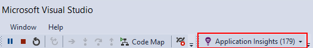
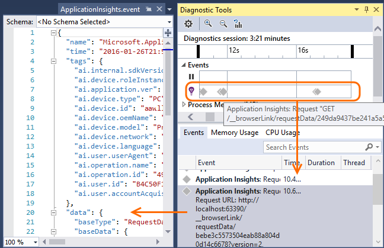
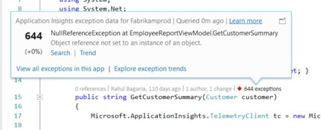
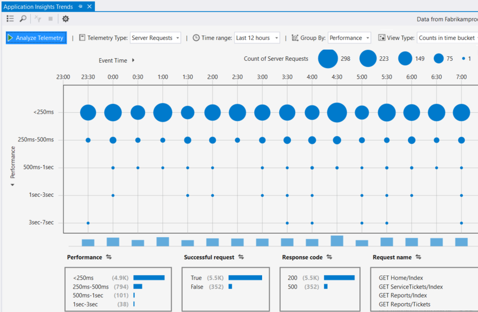

---
title: Debug applications with Azure Application Insights in Visual Studio | Microsoft Docs
description: Web app performance analysis and diagnostics during debugging and in production.
services: application-insights
documentationcenter: .net
author: mrbullwinkle
manager: carmonm

ms.assetid: 2059802b-1131-477e-a7b4-5f70fb53f974
ms.service: application-insights
ms.custom: vs-azure
ms.workload: azure-vs
ms.tgt_pltfrm: ibiza
ms.devlang: na
ms.topic: conceptual
ms.date: 07/07/2017
ms.author: mbullwin

---
# Debug your applications with Azure Application Insights in Visual Studio
In Visual Studio (2015 and later), you can analyze performance and diagnose issues in your ASP.NET web app both in debugging and in production, using telemetry from [Azure Application Insights](app-insights-overview.md).

If you created your ASP.NET web app using Visual Studio 2017 or later, it already has the Application Insights SDK. Otherwise, if you haven't done so already, [add Application Insights to your app](app-insights-asp-net.md).

To monitor your app when it's in live production, you normally view the Application Insights telemetry in the [Azure portal](https://portal.azure.com), where you can set alerts and apply powerful monitoring tools. But for debugging, you can also search and analyze the telemetry in Visual Studio. You can use Visual Studio to analyze telemetry both from your production site and from debugging runs on your development machine. In the latter case, you can analyze debugging runs even if you haven't yet configured the SDK to send telemetry to the Azure portal. 

##  Debug your project
Run your web app in local debug mode by using F5. Open different pages to generate some telemetry.

In Visual Studio, you see a count of the events that have been logged by the Application Insights module in your project.

Click this button to search your telemetry. 

## Application Insights search
The Application Insights Search window shows events that have been logged. (If you signed in to Azure when you set up Application Insights, you can search the same events in the Azure portal.)

> [!NOTE] 
> After you select or deselect filters, click the Search button at the end of the text search field.
>

The free text search works on any fields in the events. For example, search for part of the URL of a page; or the value of a property such as client city; or specific words in a trace log.

Click any event to see its detailed properties.

For requests to your web app, you can click through to the code.

You can also open related items to help diagnose failed requests or exceptions.

## View exceptions and failed requests
Exception reports show in the Search window. (In some older types of ASP.NET application, you have to [set up exception monitoring](app-insights-asp-net-exceptions.md) to see exceptions that are handled by the framework.)

Click an exception to get a stack trace. If the code of the app is open in Visual Studio, you can click through from the stack trace to the relevant line of the code.

## View request and exception summaries in the code
In the Code Lens line above each handler method, you see a count of the requests and exceptions logged by Application Insights in the past 24 h.

> [!NOTE] 
> Code Lens shows Application Insights data only if you have [configured your app to send telemetry to the Application Insights portal](app-insights-asp-net.md).
>

[More about Application Insights in Code Lens](app-insights-visual-studio-codelens.md)

## Trends
Trends is a tool for visualizing how your app behaves over time. 

Choose **Explore Telemetry Trends** from the Application Insights toolbar button or Application Insights Search window. Choose one of five common queries to get started. You can analyze different datasets based on telemetry types, time ranges, and other properties. 

To find anomalies in your data, choose one of the anomaly options under the "View Type" dropdown. The filtering options at the bottom of the window make it easy to hone in on specific subsets of your telemetry.

[More about Trends](app-insights-visual-studio-trends.md).

## Local monitoring
(From Visual Studio 2015 Update 2) If you haven't configured the SDK to send telemetry to the Application Insights portal (so that there is no instrumentation key in ApplicationInsights.config) then the diagnostics window displays telemetry from your latest debugging session. 

This is desirable if you have already published a previous version of your app. You don't want the telemetry from your debugging sessions to be mixed up with the telemetry on the Application Insights portal from the published app.

It's also useful if you have some [custom telemetry](app-insights-api-custom-events-metrics.md) that you want to debug before sending telemetry to the portal.

* *At first, I fully configured Application Insights to send telemetry to the portal. But now I'd like to see the telemetry only in Visual Studio.*
  
  * In the Search window's Settings, there's an option to search local diagnostics even if your app sends telemetry to the portal.
  * To stop telemetry being sent to the portal, comment out the line `<instrumentationkey>...` from ApplicationInsights.config. When you're ready to send telemetry to the portal again, uncomment it.

## Next steps
|  |  |
| --- | --- |
| **[Add more data](app-insights-asp-net-more.md)** Monitor usage, availability, dependencies, exceptions. Integrate traces from logging frameworks. Write custom telemetry. | |
| **[Working with the Application Insights portal](app-insights-dashboards.md)** View dashboards, powerful diagnostic and analytic tools, alerts, a live dependency map of your application, and exported telemetry data. | |

