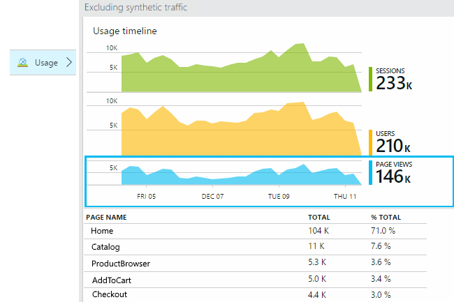
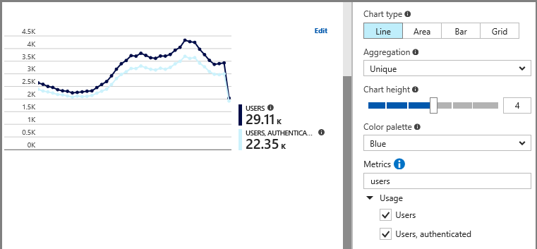
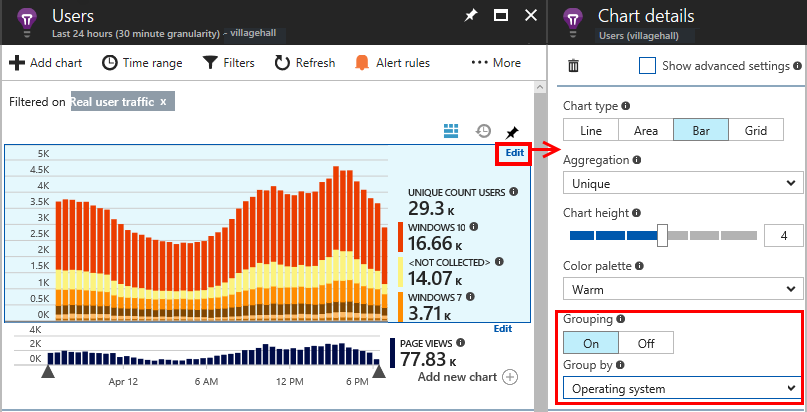
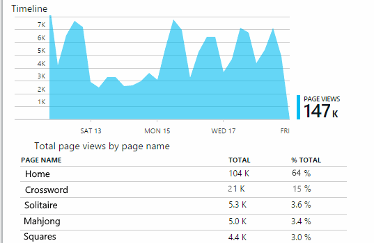
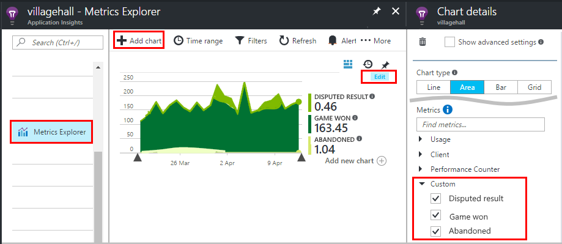
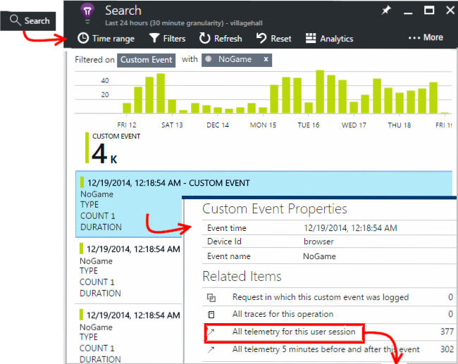
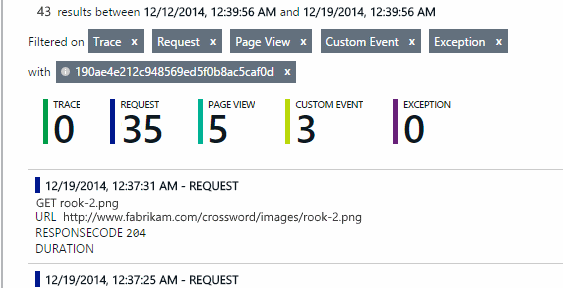
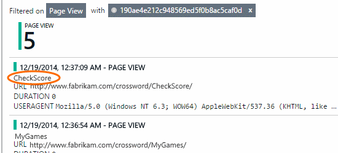
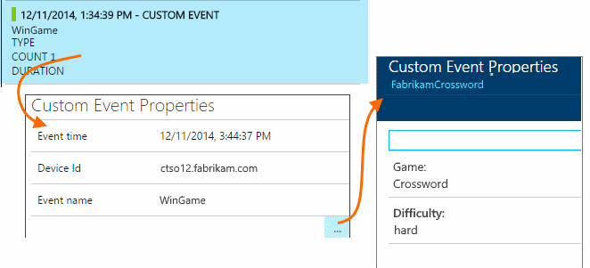
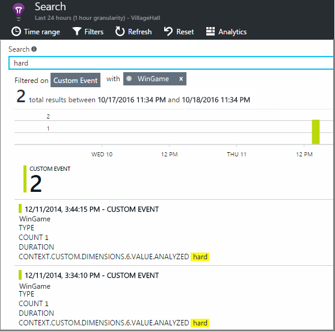

<properties 
	pageTitle="Usage analysis for web applications with Application Insights" 
	description="Overview of usage analytics with Application Insights" 
	services="application-insights" 
    documentationCenter=""
	authors="alancameronwills" 
	manager="douge"/>

<tags 
	ms.service="application-insights" 
	ms.workload="tbd" 
	ms.tgt_pltfrm="ibiza" 
	ms.devlang="na" 
	ms.topic="article" 
	ms.date="06/19/2015" 
	ms.author="awills"/>
 
# Usage analysis for web applications with Application Insights

Knowing how people use your application lets you focus your development work on the scenarios that are most important to them, and gain insights into the goals that they find easier or more difficult to achieve. 

Visual Studio Application Insights provides two levels of usage tracking:

* **User and session data** - provided out of the box.  
* **Custom telemetry** - You [write code][api] to trace your users through your app's user experience. 

## Setting up

Usage data from a web application comes from the client browser.

#### Set up an Application Insights resource 

An Application Insights resource is a place in Microsoft Azure where telemetry data from your app is analyzed and displayed. You might already have set up one to display data from your app's server side in [ASP.NET][greenbrown] or [J2EE][java]. If not, you might want to do that now.

It's usually best to display the usage data from the web client in the same resource as the data from the server. That way, you can easily correlate diagnostics and metrics from the two ends. So, if you already have a resource, skip to the next step.

But if you want to use a separate resource for usage data, just sign in to the [Azure portal][portal] and create it:

#### Insert code in your web pages

In your resource in the [Azure portal][portal] , open Quick Start get the code snippet to monitor web pages. 

Put the code in a master page such as (in .NET) _Layout.cshtml, or in an include file, to make sure it is included in all your pages.

The code snippet includes the instrumentation key (iKey) that identifies your resource. To send data to a different resource - for example during testing - you only have to replace the iKey.

Publish your web pages or use them in debug mode, to generate some telemetry data.

## How popular is my web application?

Sign in to the [Azure portal][portal], browse to your application resource, and click Usage:

* **Users:** The count of distinct users over the time range of the chart. (Cookies are used to identify returning users.)
* **Sessions:** A session is counted when a user has not made any requests for 30 minutes.
* **Page views** Counts the number of calls to trackPageView(), typically called once in each web page.

Click any of the charts to see more detail. Notice that you can change the time range of the charts.

### Which pages are read most?

Click the page views chart to see more detail.

Click a chart to see other metrics that you can display, or add a new chart and select the metrics it displays.

> [AZURE.NOTE] Metrics can only be displayed in some combinations. When you select a metric, the incompatible ones are disabled.

### Where do my users live?

From the usage blade, click the Users chart to see more detail:

 
(This example is from a website, but the charts look similar for apps that run on devices.)

### Is this the same as last week?

Compare with the previous week to see if things are changing:

### What proportion of my users are new?

Compare two metrics, for example users and new users:

### What browsers or operating systems do they use?

Group (segment) data by a property such as Browser, Operating System, or City:

## Sessions

Session is a fundamental concept in Application Insights, which strives to associate every telemetry event - such as requests, page views, exceptions, or custom events that you code yourself - with a specific user session. 

Rich context information is collected about each session, such as device characteristics, geo location, operating system, and so on.

If you instrument both the client and server ([ASP.NET][greenbrown] or [J2EE][java]), the SDKs will propagate the session id between client and server, so that events on both sides can be correlated.

When [diagnosing problems][diagnostic], you can find all the telemetry related to the session in which a problem occurred, including all requests, and any events, exceptions or traces that were logged.

Sessions provide a good measure of the popularity of contexts such as device, operating system or location. By showing the count of sessions grouped by device, for example, you get a more accurate count of how often that device is used with your app, than by counting page views. This would be a useful input to triage of any device-specific issue.

#### What's a session?

A session represents a single encounter between the user and the app. In its simplest form, session starts with a user launching the app and finishes when user leaves the app. For web apps, by default, the session terminates after 30 minutes of inactivity, or after 24 hours of activity. 

You can alter these defaults by editing the code snippet:

    <script type="text/javascript">
        var appInsights= ... { ... }({
            instrumentationKey: "...",
            sessionRenewalMs: 3600000,
            sessionExpirationMs: 172800000
        });

* `sessionRenewalMs` : The time, in milliseconds, to expire the session due to user’s inactivity. Default: 30 minutes.
* `sessionExpirationMs` : The maximum session length, in milliseconds. If the user remains active after this time, another session is counted. Default: 24 hours.

**Session duration** is a [metric][metrics] that records the span of time between the first and last telemetry items of the session. (It doesn't include the timeout period.)

**Session count** in a certain interval is defined as the number of unique sessions with some activity during this interval. When you look at a long time range such as daily session count for the past week, this is usually equivalent to the total number of sessions. 

However, when you explore shorter time ranges such as hourly grain, a long session spanning multiple hours will be counted for each hour in which the session was active. 

## Users and user counts

Each user session is associated with a unique user id. 

By default, the user is identified by placing a cookie. In this case, a user who uses multiple browsers or devices will be counted more than once.

The **user count** metric in a certain interval is defined as the number of unique users with recorded activity during this interval. As a result, users with long sessions may be accounted multiple times, when you set a time range so that the grain is less than an hour or so.

**New Users** counts the users whose first sessions with the app occurred during this interval. If the default method of counting by users by cookies is used, then this will also include users who have cleared their cookies, or who are using a new device or browser to access your app for the first time.

## Synthetic traffic

Synthetic traffic includes requests from availability and load tests, search engine crawlers and other agents. 

Application Insights tries strives to automatically determine and classify synthetic traffic and mark it appropriately. In most cases, synthetic traffic does not invoke the JavaScript SDK, so that this activity is excluded from user and session counting. 

However, for Application Insights [web tests][availability], the user id is automatically set based on POP location, and session id is set based on test run id. In default reports, synthetic traffic is filtered out by default, which will exclude these users and sessions. However, when synthetic traffic is included, it may cause a small increase in overall users and session counts.
 
## Page usage

Click through the page views chart to get a more zoomed-in version together with a breakdown of your most popular pages:

 
The example above is from a games website. From it we can instantly see:

* Usage hasn't improved in the past week. Maybe we should think about search engine optimization?
* Many fewer people see the games pages than the Home page. Why doesn't our Home page attract people to play games?
* 'Crossword' is the most popular game. We should give priority to new ideas and improvements there.

## Custom tracking

Let's suppose that instead of implementing each game in a separate web page, you decide to refactor them all into the same single-page app, with most of the functionality coded as Javascript in the web page. This allows the user to switch quickly between one game and another, or even have several games on one page. 

But you'd still like Application Insights to log the number of times each game is opened, in exactly the same way as when they were on separate web pages. That's easy: just insert a call to the telemetry module into your JavaScript where you want to record that a new 'page' has opened:

	telemetryClient.trackPageView(game.Name);

## Custom events

Use custom events to . You can send them from device apps, web pages or a web server:

(JavaScript)

    telemetryClient.trackEvent("GameEnd");

(C#)

    var tc = new Microsoft.ApplicationInsights.TelemetryClient(); 
    tc.TrackEvent("GameEnd");

(VB)

    Dim tc = New Microsoft.ApplicationInsights.TelemetryClient()
    tc.TrackEvent("GameEnd")

The most frequent custom events are listed on the overview blade.

Click the head of the table to see total numbers of events. You can segment the chart by various attributes such as the event name: 

The particularly useful feature of timelines is that you can correlate changes with other metrics and events. For example, at times when more games are played, you'd expect to see a rise in abandoned games as well. But the rise in abandoned games is disproportionate, you'd want to find out whether the high load is causing problems that users find unacceptable.

## Drill into specific events

To get a better understanding of how a typical session goes, you might want to focus on a specific user session that contains a particular type of event. 

In this example, we coded a custom event "NoGame" that is called if the user logs out without actually starting a game. Why would a user do that? Maybe if we drill into some specific occurrences, we'll get a clue. 

The custom events received from the app are listed by name on the overview blade:

 
Click through the event of interest, and select a recent specific occurrence:

 
Let's look at all the telemetry for the session in which that particular NoGame event occurred. 

 
There were no exceptions, so the user wasn't prevented from playing by some failure.
 
We can filter out all types of telemetry except page views for this session:

 
And now we can see that this user logged in simply to check the latest scores. Maybe we should consider developing a user story that makes it easier to do that. (And we should implement a custom event to report when this specific story occurs.)

## Filter, search and segment your data with properties
You can attach arbitrary tags and numeric values to events.
 

JavaScript at client

    appInsights.trackEvent("WinGame",
        // String properties:
        {Game: currentGame.name, Difficulty: currentGame.difficulty},
        // Numeric measurements:
        {Score: currentGame.score, Opponents: currentGame.opponentCount}
    );

C# at server

    // Set up some properties:
    var properties = new Dictionary <string, string> 
        {{"game", currentGame.Name}, {"difficulty", currentGame.Difficulty}};
    var measurements = new Dictionary <string, double>
        {{"Score", currentGame.Score}, {"Opponents", currentGame.OpponentCount}};

    // Send the event:
    telemetry.TrackEvent("WinGame", properties, measurements);

VB at server

    ' Set up some properties:
    Dim properties = New Dictionary (Of String, String)
    properties.Add("game", currentGame.Name)
    properties.Add("difficulty", currentGame.Difficulty)

    Dim measurements = New Dictionary (Of String, Double)
    measurements.Add("Score", currentGame.Score)
    measurements.Add("Opponents", currentGame.OpponentCount)

    ' Send the event:
    telemetry.TrackEvent("WinGame", properties, measurements)

Attach properties to page views in the same way:

JavaScript at client

    appInsights.trackPageView("Win", 
        {Game: currentGame.Name}, 
        {Score: currentGame.Score});

In Diagnostic Search, view the properties by clicking through an individual occurrence of an event.

 
Use the Search field to see event occurrences with a particular property value.

## A | B Testing

If you don't know which variant of a feature will be more successful, release both of them, making each accessible to different users. Measure the success of each, and then move to a unified version.

For this technique, you attach distinct tags to all the telemetry that is sent by each version of your app. You can do that by defining properties in the active TelemetryContext. These default properties are added to every telemetry message that the application sends - not just your custom messages, but the standard telemetry as well. 

In the Application Insights portal, you'll then be able to filter and group (segment) your data on the tags, so as to compare the different versions.

C# at server

    using Microsoft.ApplicationInsights.DataContracts;

    var context = new TelemetryContext();
    context.Properties["Game"] = currentGame.Name;
    var telemetry = new TelemetryClient(context);
    // Now all telemetry will automatically be sent with the context property:
    telemetry.TrackEvent("WinGame");

VB at server

    Dim context = New TelemetryContext
    context.Properties("Game") = currentGame.Name
    Dim telemetry = New TelemetryClient(context)
    ' Now all telemetry will automatically be sent with the context property:
    telemetry.TrackEvent("WinGame")

Individual telemetry can override the default values.

You can set up a universal initializer so that all new TelemetryClients automatically use your context.

    // Telemetry initializer class
    public class MyTelemetryInitializer : IContextInitializer
    {
        public void Initialize (TelemetryContext context)
        {
            context.Properties["AppVersion"] = "v2.1";
        }
    }

In the app initializer such as Global.asax.cs:

    protected void Application_Start()
    {
        // ...
        TelemetryConfiguration.Active.ContextInitializers
        .Add(new MyTelemetryInitializer());
    }

## Build - Measure - Learn

When you use analytics, it becomes an integrated part of your development cycle - not just something you think about to help solve problems. Here are some tips:

* Determine the key metric of your application. Do you want as many users as possible, or would you prefer a small set of very happy users? Do you want to maximize visits or sales?
* Plan to measure each story. When you sketch a new user story or feature, or plan to update an existing one, always think about how you will measure the success of the change. Before coding starts, ask "What effect will this have on our metrics, if it works? Should we track any new events?"
And of course, when the feature is live, make sure you look at the analytics and act on the results. 
* Relate other metrics to the key metric. For example, if you add a "favorites" feature, you'd like to know how often users add favorites. But it's perhaps more interesting to know how often they come back to their favorites. And, most importantly, do customers who use favorites ultimately buy more of your product?
* Canary testing. Set up a feature switch that allows you to make a new feature visible only to some users. Use Application Insights to see whether the new feature is being used in the way you envisaged. Make adjustments, then release it to a wider audience.
* Talk to your users! Analytics is not enough on its own, but complementary to maintaining a good customer relationship.

## Video

> [Azure.VIDEO usage-monitoring-application-insights]

<!--Link references-->

[api]: app-insights-api-custom-events-metrics.md
[availability]: app-insights-monitor-web-app-availability.md
[client]: app-insights-javascript.md
[diagnostic]: app-insights-diagnostic-search.md
[greenbrown]: app-insights-start-monitoring-app-health-usage.md
[java]: app-insights-java-get-started.md
[metrics]: app-insights-metrics-explorer.md
[portal]: http://portal.azure.com/
[windows]: app-insights-windows-get-started.md

 