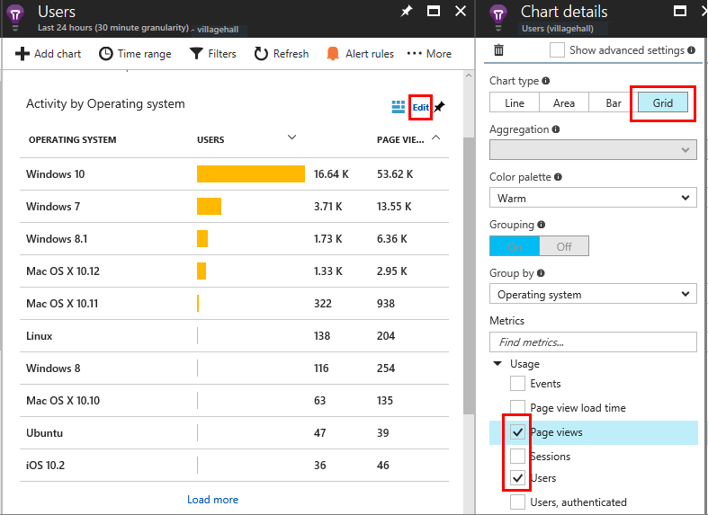
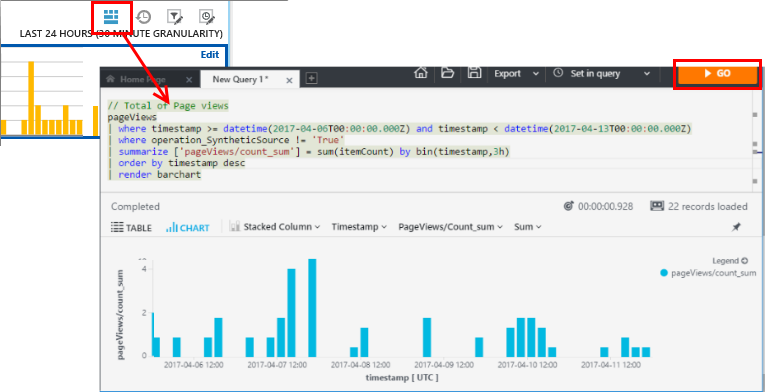

# Usage analysis for web applications with Application Insights
Knowing how people use your application lets you focus your development work on the scenarios that are most important to your users, and gain insights into the goals that they find easier or more difficult to achieve.

[Azure Application Insights](app-insights-overview.md) provides two levels of usage tracking:

* **User, session and page view data** - provided out of the box.  
* **Custom telemetry** - You [write code](app-insights-api-custom-events-metrics.md) to trace your users through your app's user experience. 


## Get started

The best experience is obtained by installing Application Insights both in your app server code, and in your web pages. The client and server components of your app send telemetry back to the Azure portal for analysis.

1. **Server code:** Install the appropriate module for your [ASP.NET](app-insights-asp-net.md), [Azure](app-insights-azure.md), [Java](app-insights-java-get-started.md), [Node.js](app-insights-nodejs.md), or [other](app-insights-platforms.md) app.

    * *Don't want to install server code? Just [create an Azure Application Insights resource](app-insights-create-new-resource.md).*

2. **Web page code:** Open the [Azure portal](https://portal.azure.com), open the Application Insights resource for your app, and then open **Getting Started > Monitor and Diagnose Client-Side**. 

    


3. **Get telemetry:** Run your project in debug mode for a few minutes, and then look for results in the Overview blade in Application Insights.

    Publish your app to monitor your app's performance and find out what your users are doing with your app.

## Usage analysis out of the box
Open the Usage blade.


Hover in the blank part above a graph to see the counts at a particular point. Otherwise, the numbers show the value aggregated over the period, such as an average, a total, or a count of distinct users over the period.

What do these charts show?

* **Users:** The count of distinct active users over the time range of the chart. In web applications, users are counted by using cookies. A person who uses several browsers, clears cookies, or uses the privacy feature will be counted several times.
* **Authenticated users** are counted if you have inserted a call to [setAuthenticatedUser()](app-insights-api-custom-events-metrics.md#authenticated-users) in your code.
* **Sessions:** The count of active sessions. A web session is counted after 30 minutes of inactivity. 
* **Page views** Counts the number of calls to trackPageView(), typically called once in each web page.

Click any of the charts to see more detail. Notice that you can change the time range of the charts.

### Where do my users live?
Click a blank part of the Users chart to see open another blade that shows more detail:


### What browsers or operating systems do they use?

Click **Edit** on the users chart, and Group (segment) data by a property such as Browser, Operating System, or City: 


To see the full set of counts, switch the chart type to **Grid**. You can also choose to display additional metrics:



For graphical chart types, you can either group by a property, or select multiple metrics, but not both. This chart compares two metrics, users and [authenticated users](app-insights-api-custom-events-metrics.md#authenticated-users). 


## Page views
From the Usage blade, click through the page views chart to get a more detailed version together with a breakdown of your most popular pages:


The example above is from a games web site. From the charts, we can instantly see:

* Usage hasn't improved in the past week. Maybe we should think about search engine optimization?
* Tennis is the most popular game page. Let's focus on further improvements to this page.
* On average, users visit the Tennis page about three times per week. (There are about three times more sessions than users.)
* Most users visit the site during the U.S. working week, and in working hours. Perhaps we should provide a "quick hide" button on the web page.
* The [annotations](app-insights-annotations.md) on the chart show when new versions of the website were deployed. None of the recent deployments had a noticeable effect on usage.

## Custom tracking
Let's suppose that instead of implementing each game in a separate web page, you decide to refactor them all into the same single-page app, with most of the functionality coded as Javascript in the web page. This allows the user to switch quickly between one game and another, or even have several games on one page.

But you'd still like Application Insights to log the number of times each game is opened, in exactly the same way as when they were on separate web pages. That's easy: just insert a call to the telemetry module into your JavaScript where you want to record that a new 'page' has opened:

```JavaScript
    telemetryClient.trackPageView(game.Name);
```
This call simulates the telemetry that logs a page view.  However, you don't always want to mix the messages up with page views. Instead, use custom events. You can send them from web pages or a web server:


```JavaScript

    telemetryClient.trackEvent("GameEnd");
```

```C#
    var tc = new Microsoft.ApplicationInsights.TelemetryClient();
    tc.TrackEvent("GameEnd");
```

```VB

    Dim tc = New Microsoft.ApplicationInsights.TelemetryClient()
    tc.TrackEvent("GameEnd")
```

[Custom telemetry inserted into your web or server code](app-insights-api-custom-events-metrics.md#trackevent) can be used in many ways to understand how your application is being used.

To view events sent by TrackEvent(): Open Metrics Explorer, add a new chart, and then edit it. Your metrics appear under Custom Metrics. 


If you set [property values](app-insights-api-custom-events-metrics.md#properties) (also called dimensions) in your events, you can group and filter by them.

Create multiple charts to correlate changes in other metrics and events. For example, at times when more games are played, you'd expect to see a rise in abandoned games as well. But the rise in abandoned games is disproportionate, you'd want to find out whether the high load is causing problems that users find unacceptable.

## Drill into specific events
To get a better understanding of how a typical session goes, you might want to focus on a specific user session that contains a particular type of event.

From a grid of events, click through the event of interest, and select a recent specific occurrence:


Let's look at all the telemetry for the session in which that particular NoGame event occurred.


There were no exceptions, so the user wasn't prevented from playing by some failure.

We can filter out all types of telemetry except page views for this session:


And now we can see that this user logged in simply to check the latest scores. Maybe we should consider developing a user story that makes it easier to do that. (And we should implement a custom event to report when this specific story occurs.)

## Filter, search and segment your data with properties
You can attach arbitrary tags and numeric values to events.

*JavaScript in web page*

```JavaScript

    appInsights.trackEvent("WinGame",
        // String properties:
        {Game: currentGame.name, Difficulty: currentGame.difficulty},
        // Numeric measurements:
        {Score: currentGame.score, Opponents: currentGame.opponentCount}
    );
```

*C# at server*

```C#

    // Set up some properties:
    var properties = new Dictionary <string, string>
        {{"game", currentGame.Name}, {"difficulty", currentGame.Difficulty}};
    var measurements = new Dictionary <string, double>
        {{"Score", currentGame.Score}, {"Opponents", currentGame.OpponentCount}};

    // Send the event:
    telemetry.TrackEvent("WinGame", properties, measurements);
```

*VB at server*

```VB

    ' Set up some properties:
    Dim properties = New Dictionary (Of String, String)
    properties.Add("game", currentGame.Name)
    properties.Add("difficulty", currentGame.Difficulty)

    Dim measurements = New Dictionary (Of String, Double)
    measurements.Add("Score", currentGame.Score)
    measurements.Add("Opponents", currentGame.OpponentCount)

    ' Send the event:
    telemetry.TrackEvent("WinGame", properties, measurements)
```

Attach properties to page views in the same way:

*JavaScript in web page*

```JS

    appInsights.trackPageView("Win", 
        url,
        {Game: currentGame.Name}, 
        {Score: currentGame.Score});
```

In Diagnostic Search, view the properties by clicking through an individual occurrence of an event.


Use the Search field to see event occurrences with a particular property value.


## Edit and create queries over your telemetry

Click the Azure Analytics icon on any chart to open an equivalent query that you can edit.
Scroll down to see if there is more than one generated query. Place the cursor in any query and click **Go**. 

Alternatively, open Analytics from the icon on the Overview blade, and write your own queries, or try some of the sample queries on the Analytics Home tab.




[Learn more about the Azure Analytics query language](app-insights-analytics.md).

For usage analysis, you may be particularly interested in these tables:

* `customEvents` - Results of [TrackEvent()](app-insights-api-custom-events-metrics.md#trackevent) calls.
* `pageViews` - Counts of pages opened in client browsers, or calls to [trackPageView()](app-insights-api-custom-events-metrics.md#page-views).


## A | B Testing
If you don't know which variant of a feature will be more successful, release both of them, making each accessible to different users. Measure the success of each, and then move to a unified version.

For this technique, you attach distinct tags to all the telemetry that is sent by each version of your app. You can do that by defining properties in the active TelemetryContext. These default properties are added to every telemetry message that the application sends - not just your custom messages, but the standard telemetry as well.

In the Application Insights portal, you'll then be able to filter and group (segment) your data on the tags, so as to compare the different versions.


```C#

    using Microsoft.ApplicationInsights.DataContracts;

    var context = new TelemetryContext();
    context.Properties["Game"] = currentGame.Name;
    var telemetry = new TelemetryClient(context);
    // Now all telemetry will automatically be sent with the context property:
    telemetry.TrackEvent("WinGame");
```


```VB

    Dim context = New TelemetryContext
    context.Properties("Game") = currentGame.Name
    Dim telemetry = New TelemetryClient(context)
    ' Now all telemetry will automatically be sent with the context property:
    telemetry.TrackEvent("WinGame")
```

Individual telemetry can override the default values.

You can set up a universal initializer so that all new TelemetryClients automatically use your context.

```C#


    // Telemetry initializer class
    public class MyTelemetryInitializer : ITelemetryInitializer
    {
        public void Initialize (ITelemetry telemetry)
        {
            telemetry.Properties["AppVersion"] = "v2.1";
        }
    }
```

In the app initializer such as Global.asax.cs:

```C#

    protected void Application_Start()
    {
        // ...
        TelemetryConfiguration.Active.TelemetryInitializers
        .Add(new MyTelemetryInitializer());
    }
```


## Build - Measure - Learn
When you use analytics, it becomes an integrated part of your development cycle - not just something you think about to help solve problems. Here are some tips:

* Determine the key metric of your application. Do you want as many users as possible, or would you prefer a small set of very happy users? Do you want to maximize visits or sales?
* Plan to measure each story. When you sketch a new user story or feature, or plan to update an existing one, always think about how you will measure the success of the change. Before coding starts, ask "What effect will this have on our metrics, if it works? Should we track any new events?"
  And of course, when the feature is live, make sure you look at the analytics and act on the results.
* Relate other metrics to the key metric. For example, if you add a 'favorites' feature, you'd like to know how often users add favorites. But it's perhaps more interesting to know how often they come back to their favorites. And, most importantly, do customers who use favorites ultimately buy more of your product?
* Canary testing. Set up a feature switch that allows you to make a new feature visible only to some users. Use Application Insights to see whether the new feature is being used in the way you envisaged. Make adjustments, then release it to a wider audience.
* Talk to your users! Analytics is not enough on its own, but complementary to maintaining a good customer relationship.

## Learn more
* [Detect, triage and diagnose crashes and performance issues in your app](app-insights-detect-triage-diagnose.md)
* [Get started with Application Insights on many platforms](app-insights-detect-triage-diagnose.md)
* [Using the API - overview](app-insights-api-custom-events-metrics.md)
* [JavaScript API reference](https://github.com/Microsoft/ApplicationInsights-JS/blob/master/API-reference.md)


