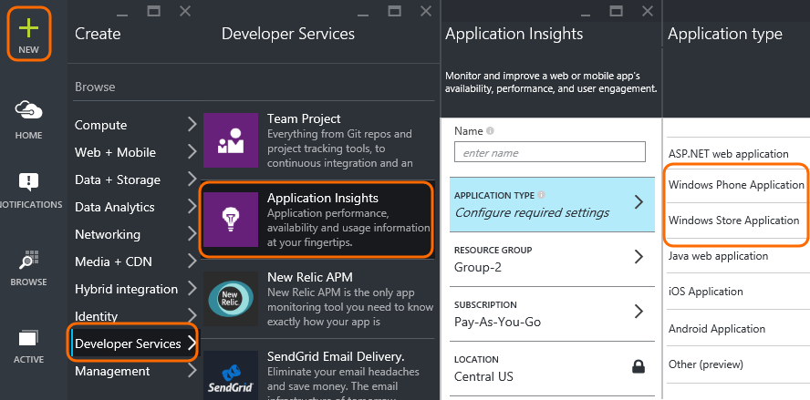
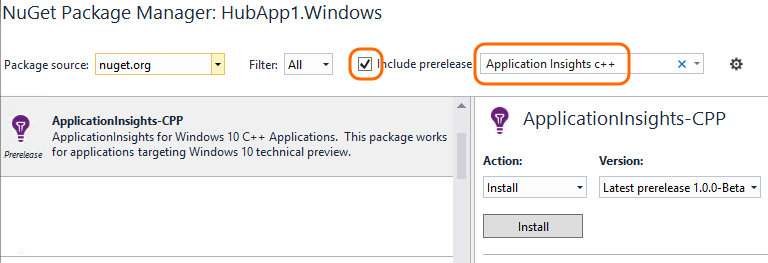
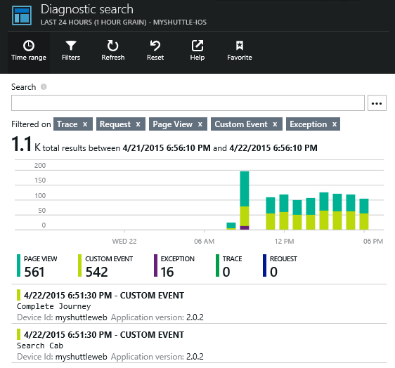
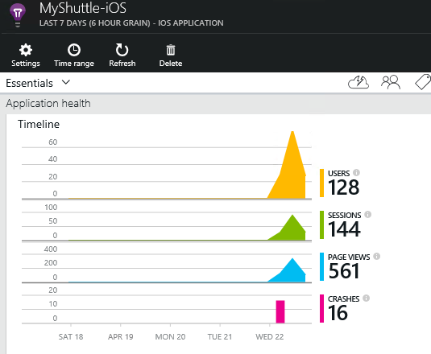
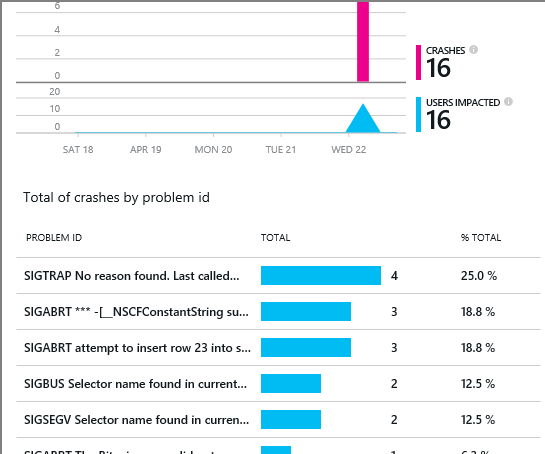

<properties 
    pageTitle="Application Insights for C++ apps" 
    description="Analyze usage and performance of your C++ app with Application Insights." 
    services="application-insights" 
    documentationCenter="cpp"
    authors="crystk" 
    manager="jakubo""/>

<tags 
    ms.service="application-insights" 
    ms.workload="mobile" 
    ms.tgt_pltfrm="universal" 
    ms.devlang="na" 
    ms.topic="article" 
	ms.date="10/06/2015" 
    ms.author="crystk"/>

# Application Insights for C++ apps

Visual Studio Application Insights lets you monitor your mobile application for usage, events, and crashes.

## Requirements

You'll need:

* A subscription with [Microsoft Azure](http://azure.com). You sign in with a Microsoft account, which you might have for Windows, XBox Live, or other Microsoft cloud services.
* Visual Studio 2015 or later.
* Windows 10 Universal Application

## Create an Application Insights resource

In the [Azure portal][portal], create a new Application Insights resource. Pick the Windows Phone or Windows Store option.



The blade that opens is the place where you'll see performance and usage data about your app. To get back to it next time you login to Azure, you should find a tile for it on the start screen. Alternatively click Browse to find it.

####  Take a copy of the Instrumentation Key.

The key identifies the resource, and you'll install it soon in the SDK to direct data to the resource.


## <a name="sdk"></a> Install the SDK in your application


1. In Visual Studio, edit the NuGet packages of your desktop app project.

    

2. Install Application Insights SDK for C++ Apps.

    

3. In your projects settings for release and debug: 
  - Add $(SolutionDir)packages\ApplicationInsights-CPP.1.0.0-Beta\src\inc to the project properties -> VC++ Directories -> Include Directories
  - Add $(SolutionDir)packages\ApplicationInsights.1.0.0-Beta\lib\native\<PLATFORM TYPE>\release\AppInsights_Win10-UAP to the project properties -> VC++ Directories -> Library Directories

4. Add ApplicationInsights.winmd as a reference to your project from  $(SolutionDir)packages\ApplicationInsights.1.0.0-Beta\lib\native\<PLATFORM TYPE>\release\ApplicationInsights
5. Add the AppInsights_Win10-UAP.dll from  $(SolutionDir)packages\ApplicationInsights.1.0.0-Beta\lib\native\<PLATFORM TYPE>\release\AppInsights_Win10-UAP. Go to properties and set content to YES. This will copy the dll to your build directory.


#### To update the SDK to future versions

When a new [SDK is released](app-insights-release-notes-windows-cpp.md):

* In NuGet package manager, select the installed SDK and choose Action: Upgrade.
* Repeat the installation steps, using the new version number.

## Use the SDK

Initialize the SDK and start tracking telemetry.

1. In App.xaml.h: 
  - Add:
    `ApplicationInsights::CX::SessionTracking^ m_session;`
2. In App.xaml.cpp:
  - Add:
    `using namespace ApplicationInsights::CX;`

  - In App:App()
	
     `// this will do automatic session tracking and automatic page view collection`
     `m_session = ref new ApplicationInsights::CX::SessionTracking();`

  - Once you have created the root Frame, (usually at the end of App::OnLaunched) initalize m_session:
	
    ```
    String^ iKey = L"<YOUR INSTRUMENTATION KEY>";
    m_session->Initialize(this, rootFrame, iKey);
	```

3. To use tracking elsewhere in your application, you can declare an instance of Telemetry client.


```

    using namespace ApplicationInsights::CX;
    TelemetryClient^ tc = ref new TelemetryClient(L"<YOUR INSTRUMENTATION KEY>");
	tc->TrackTrace(L"This is my first trace");
    tc->TrackEvent(L"I'M ON PAGE 1");
    tc->TrackMetric(L"Test Metric", 5.03);
```


## <a name="run"></a> Run your project

Run your application to generate telemetry. You can either run it in debug more on your development machine, or publish it and let your users run it.

## View your data in Application Insights

Return to http://portal.azure.com and browse to your Application Insights resource.

Click Search to open [Diagnostic Search][diagnostic] - that's where the first events will appear. If you don't see anything, wait a minute or two and click Refresh.



As your app is used, data will appear in the overview blade.



Click on any chart to get more detail. For example, crashes:




## <a name="usage"></a>Next Steps

[Track usage of your app][track]

[Use the API to send custom events and metrics][api]

[Diagnostic search][diagnostic]

[Metric Explorer][metrics]

[Troubleshooting][qna]


<!--Link references-->

[api]: app-insights-api-custom-events-metrics.md
[diagnostic]: app-insights-diagnostic-search.md
[metrics]: app-insights-metrics-explorer.md
[portal]: http://portal.azure.com/
[qna]: app-insights-troubleshoot-faq.md
[track]: app-insights-api-custom-events-metrics.md

 
