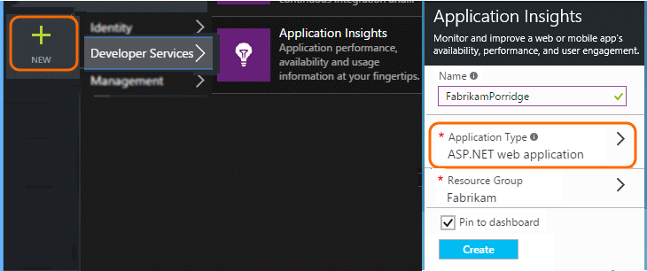
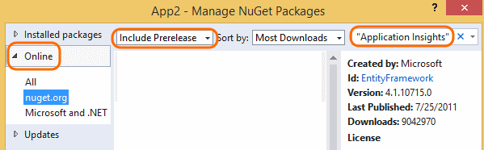

<properties 
	pageTitle="Application Insights for Windows desktop apps and services" 
	description="Analyze usage and performance of your Windows desktop app with Application Insights." 
	services="application-insights" 
    documentationCenter="windows"
	authors="alancameronwills" 
	manager="douge"/>

<tags 
	ms.service="application-insights" 
	ms.workload="tbd" 
	ms.tgt_pltfrm="ibiza" 
	ms.devlang="na" 
	ms.topic="article" 
	ms.date="04/06/2016" 
	ms.author="awills"/>

# Monitoring usage and performance in Windows Desktop apps

*Application Insights is in preview.*

Application Insights and HockeyApp let you monitor your deployed application for usage and performance.


## <a name="add"></a> Create an Application Insights resource


1.  In the [Azure portal][portal], create a new Application Insights resource. For application type, choose ASP.NET app. 

    

    (You can choose a different application type if you want - it sets the content of the Overview blade and the properties available in [metric explorer][metrics].)

2.  Take a copy of the Instrumentation Key. Find the key in the Essentials drop-down of the new resource you just created. Close the Application Map or scroll left to the overview blade for the resource.

    

## <a name="sdk"></a>Install the SDK in your application


1. In Visual Studio, edit the NuGet packages of your desktop app project.

    

2. Install the Application Insights Windows Server package: Microsoft.ApplicationInsights.WindowsServer

    

    *Can I use other packages?*

    Yes. Choose the Core API (Microsoft.ApplicationInsights) if you only want to use the API to send your own telemetry. The Windows Server package automatically includes the Core API plus a number of other packages such as performance counter collection and dependency monitoring. 

    (But don't use Microsoft.ApplicationInsights.Windows: that is intended for Windows Store apps.)

3. Set your InstrumentationKey.

    * If you only installed the core API package Microsoft.ApplicationInsights, you must set the key in code, for example in main(): 

    `TelemetryConfiguration.Active.InstrumentationKey = "` *your key* `";` 

    If you installed one of the other packages, you can either set the key using code, or set it in ApplicationInsights.config:
 
    `<InstrumentationKey>`*your key*`</InstrumentationKey>` 

    If you use ApplicationInsights.config, make sure its properties in Solution Explorer are set to **Build Action = Content, Copy to Output Directory = Copy**.

## <a name="telemetry"></a>Insert telemetry calls

Create a `TelemetryClient` instance and then [use it to send telemetry][api].


For example, in a Windows Forms application, you could write:

```C#

    public partial class Form1 : Form
    {
        private TelemetryClient tc = new TelemetryClient();
        ...
        private void Form1_Load(object sender, EventArgs e)
        {
            // Alternative to setting ikey in config file:
            tc.InstrumentationKey = "key copied from portal";

            // Set session data:
            tc.Context.User.Id = Environment.UserName;
            tc.Context.Session.Id = Guid.NewGuid().ToString();
            tc.Context.Device.OperatingSystem = Environment.OSVersion.ToString();

            // Log a page view:
            tc.TrackPageView("Form1");
            ...
        }

        protected override void OnClosing(CancelEventArgs e)
        {
            stop = true;
            if (tc != null)
            {
                tc.Flush(); // only for desktop apps

                // Allow time for flushing:
                System.Threading.Thread.Sleep(1000);
            }
            base.OnClosing(e);
        }

```

Use any of the [Application Insights API][api] to send telemetry. If you're using the core API, no telemetry is sent automatically. Typically you'd use:

* `TrackPageView(pageName)` on switching forms, pages, or tabs
* `TrackEvent(eventName)` for other user actions
* `TrackMetric(name, value)` in a background task to send regular reports of metrics not attached to specific events.
* `TrackTrace(logEvent)` for [diagnostic logging][diagnostic]
* `TrackException(exception)` in catch clauses
* `Flush()` to make sure all telemetry is sent before closing the app. Use this only if you are just using the core API (Microsoft.ApplicationInsights). The web SDKs implement this behavior automatically. (If your app runs in contexts where the internet is not always available, see also [Persistence Channel](#persistence-channel).)


#### Telemetry initializers

To see counts of users and sessions you can set the values on each `TelemetryClient` instance. Alternatively, you can use a telemetry initializer to perform this addition for all clients:

```C#

    class UserSessionInitializer : ITelemetryInitializer
    {
        public void Initialize(ITelemetry telemetry)
        {
            telemetry.Context.User.Id = Environment.UserName;
            telemetry.Context.Session.Id = Guid.NewGuid().ToString();
        }
        
    }

    static class Program
    {
        ...
        static void Main()
        {
            TelemetryConfiguration.Active.TelemetryInitializers.Add(
                new UserSessionInitializer());
            ...

```


## <a name="run"></a>Run your project

[Run your application with F5](http://msdn.microsoft.com/library/windows/apps/bg161304.aspx) and use it, so as to generate some telemetry. 

In Visual Studio, you'll see a count of the events that have been sent.


Events also appear in the diagnostics and output windows.

## <a name="monitor"></a>See monitor data

Return to your application blade in the Azure portal.

The first events will appear in [Diagnostic Search](app-insights-diagnostic-search.md). 

If you used TrackMetric or the measurements parameter of TrackEvent, open [Metric Explorer][metrics] and open the Filters blade. You should see your metrics there, but they can sometimes take a while to get through the pipeline, so you might have to close the Filters blade, wait a while and then refresh.


## Persistence Channel 

If your app runs where the internet connection is not always available or slow, consider using the persistence channel instead of the default in-memory channel. 

The default in-memory channel loses any telemetry that has not been sent by the time the app closes. Although you can use `Flush()` to attempt to send any data remaining in the buffer, it will still lose data if there is a no internet connection, or if the app shuts down before transmission is complete.

By contrast, the persistence channel buffers telemetry in a file, before sending it to the portal. `Flush()` ensures that data is stored in the file. If any data is not sent by the time the app closes, it will remain in the file. When the app restarts, the data will be sent then, if there is an internet connection. Data will accumulate in the file for as long as is necessary until a connection is available. 

### To use the persistence channel

1. Import the NuGet package [Microsoft.ApplicationInsights.PersistenceChannel](https://www.nuget.org/packages/Microsoft.ApplicationInsights.PersistenceChannel/1.2.3).
2. Include this code in your app, in a suitable initialization location:
 
    ```C# 

      using Microsoft.ApplicationInsights.Channel;
      using Microsoft.ApplicationInsights.Extensibility;
      ...

      // Set up 
      TelemetryConfiguration.Active.InstrumentationKey = "YOUR INSTRUMENTATION KEY";
 
      TelemetryConfiguration.Active.TelemetryChannel = new PersistenceChannel();
    
    ``` 
3. Use `telemetryClient.Flush()` before your app closes, to make sure data is either sent to the portal or saved to the file.

    Note that Flush() is synchronous for the persistence channel, but asynchronous for other channels.

 
The persistence channel is optimized for devices scenarios, where the number of events produced by application is relatively small and the connection is often unreliable. This channel will write events to the disk into reliable storage first and then attempt to send it. 

#### Example

Let’s say you want to monitor unhandled exceptions. You subscribe to the `UnhandledException` event. In the callback, you include a call to Flush to make sure that  the telemetry will be persisted.
 
```C# 

AppDomain.CurrentDomain.UnhandledException += CurrentDomain_UnhandledException; 
 
... 
 
private void CurrentDomain_UnhandledException(object sender, UnhandledExceptionEventArgs e) 
{ 
    ExceptionTelemetry excTelemetry = new ExceptionTelemetry((Exception)e.ExceptionObject); 
    excTelemetry.SeverityLevel = SeverityLevel.Critical; 
    excTelemetry.HandledAt = ExceptionHandledAt.Unhandled; 
 
    telemetryClient.TrackException(excTelemetry); 
 
    telemetryClient.Flush(); 
} 

``` 

When the app shuts down, you'll see a file in `%LocalAppData%\Microsoft\ApplicationInsights\`, which contains the compressed events. 
 
Next time you start this application, the channel will pick up this file and deliver telemetry to the Application Insights if it can.

#### Test example

```C#

using Microsoft.ApplicationInsights;
using Microsoft.ApplicationInsights.Channel;
using Microsoft.ApplicationInsights.Extensibility;

namespace ConsoleApplication1
{
    class Program
    {
        static void Main(string[] args)
        {
            // Send data from the last time the app ran
            System.Threading.Thread.Sleep(5 * 1000);

            // Set up persistence channel

            TelemetryConfiguration.Active.InstrumentationKey = "YOUR KEY";
            TelemetryConfiguration.Active.TelemetryChannel = new PersistenceChannel();

            // Send some data

            var telemetry = new TelemetryClient();

            for (var i = 0; i < 100; i++)
            {
                var e1 = new Microsoft.ApplicationInsights.DataContracts.EventTelemetry("persistenceTest");
                e1.Properties["i"] = "" + i;
                telemetry.TrackEvent(e1);
            }

            // Make sure it's persisted before we close
            telemetry.Flush();
        }
    }
}

```


The code of the persistence channel is on [github](https://github.com/Microsoft/ApplicationInsights-dotnet/tree/v1.2.3/src/TelemetryChannels/PersistenceChannel). 


## <a name="usage"></a>Next Steps

[Track usage of your app][knowUsers]

[Capture and search diagnostic logs][diagnostic]

[Troubleshooting][qna]


<!--Link references-->

[diagnostic]: app-insights-diagnostic-search.md
[metrics]: app-insights-metrics-explorer.md
[portal]: http://portal.azure.com/
[qna]: app-insights-troubleshoot-faq.md
[knowUsers]: app-insights-overview-usage.md
[api]: app-insights-api-custom-events-metrics.md
[CoreNuGet]: https://www.nuget.org/packages/Microsoft.ApplicationInsights
 
