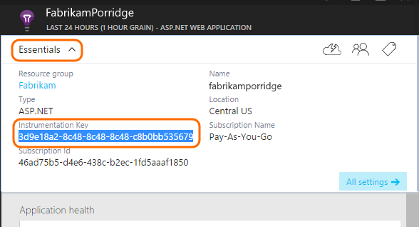

<properties 
	pageTitle="Application Insights for Windows desktop apps and services" 
	description="Analyze usage and performance of your Windows desktop app with Application Insights." 
	services="application-insights" 
    documentationCenter="windows"
	authors="alancameronwills" 
	manager="douge"/>

<tags 
	ms.service="application-insights" 
	ms.workload="tbd" 
	ms.tgt_pltfrm="ibiza" 
	ms.devlang="na" 
	ms.topic="article" 
	ms.date="06/18/2015" 
	ms.author="awills"/>

# Application Insights on Windows Desktop apps and services

*Application Insights is in preview.*

[AZURE.INCLUDE [app-insights-selector-get-started](../../includes/app-insights-selector-get-started.md)]

Application Insights lets you monitor your deployed application for usage and performance.

Support for Windows desktop apps and services are provided by the Application Insights core SDK. This SDK provides full API support for all telemetry data but does not provide any telemetry auto collection.


## <a name="add"></a> Create an Application Insights resource


1.  In the [Azure portal][portal], create a new Application Insights resource. For application type, choose Windows Store app. 

    

    (Your choice of application type sets the content of the Overview blade and the properties available in [metric explorer][metrics].)

2.  Take a copy of the Instrumentation Key.

    

## <a name="sdk"></a>Install the SDK in your application


1. In Visual Studio, edit the NuGet packages of your desktop app project.
    

2. Install the Application Insights API package.

    

3. Edit ApplicationInsights.config (which has been added by the NuGet install). Insert this just before the closing tag:

    `<InstrumentationKey>*the key you copied*</InstrumentationKey>`

    As an alternative you can achieve the same effect with this code:
    
    `TelemetryConfiguration.Active.InstrumentationKey = "your key";`


## <a name="telemetry"></a>Insert telemetry calls

Create a `TelemetryClient` instance and then [use it to send telemetry][api].

Use `TelemetryClient.Flush()` to send messages before closing the app. The Core SDK uses an in-memory buffer. The flush method will ensure this buffer is emptied helping to ensure no data loss on process shutdown. (This is not recommended for other types of app. The platforms SDKs implement this behavior automatically.)

For example, in a Windows Forms application, you could write:

```C#

    public partial class Form1 : Form
    {
        private TelemetryClient tc = new TelemetryClient();
        ...
        private void Form1_Load(object sender, EventArgs e)
        {
            // Alternative to setting ikey in config file:
            tc.InstrumentationKey = "key copied from portal";

            // Set session data:
            tc.Context.User.Id = Environment.GetUserName();
            tc.Context.Session.Id = Guid.NewGuid().ToString();
            tc.Context.Device.OperatingSystem = Environment.OSVersion.ToString();

            // Log a page view:
            tc.TrackPageView("Form1");
            ...
        }

        protected override void OnClosing(CancelEventArgs e)
        {
            stop = true;
            if (tc != null)
            {
                tc.Flush(); // only for desktop apps
            }
            base.OnClosing(e);
        }

```

Use any of the [Application Insights API][api] to send telemetry. In Windows Desktop applications, no telemetry is sent automatically. Typically you'd use:

* TrackPageView(pageName) on switching forms, pages, or tabs
* TrackEvent(eventName) for other user actions
* TrackMetric(name, value) in a background task to send regular reports of metrics not attached to specific events.
* TrackTrace(logEvent) for [diagnostic logging][diagnostic]
* TrackException(exception) in catch clauses

#### Context initializers

To see counts of users and sessions you can set the values on each `TelemetryClient` instance. Alternatively, you can use a context initializer to perform this addition for all clients:

```C#

    class UserSessionInitializer: IContextInitializer
    {
        public void Initialize(TelemetryContext context)
        {
            context.User.Id = Environment.UserName;
            context.Session.Id = Guid.NewGuid().ToString();
        }
    }

    static class Program
    {
        ...
        static void Main()
        {
            TelemetryConfiguration.Active.ContextInitializers.Add(
                new UserSessionInitializer());
            ...

```


## <a name="run"></a>Run your project

[Run your application with F5](http://msdn.microsoft.com/library/windows/apps/bg161304.aspx) and use it, so as to generate some telemetry. 

In Visual Studio, you'll see a count of the events that have been sent.


## <a name="monitor"></a>See monitor data

Return to your application blade in the Azure portal.

The first events will appear in Diagnostic Search. 

Click Refresh after a few seconds if you're expecting more data.

If you used TrackMetric or the measurements parameter of TrackEvent, open [Metric Explorer][metrics] and open the Filters blade, where you'll see your metrics.


## <a name="usage"></a>Next Steps

[Track usage of your app][knowUsers]

[Capture and search diagnostic logs][diagnostic]

[Troubleshooting][qna]


<!--Link references-->

[diagnostic]: app-insights-diagnostic-search.md
[metrics]: app-insights-metrics-explorer.md
[portal]: http://portal.azure.com/
[qna]: app-insights-troubleshoot-faq.md
[knowUsers]: app-insights-overview-usage.md
[api]: app-insights-api-custom-events-metrics.md
[CoreNuGet]: https://www.nuget.org/packages/Microsoft.ApplicationInsights
 