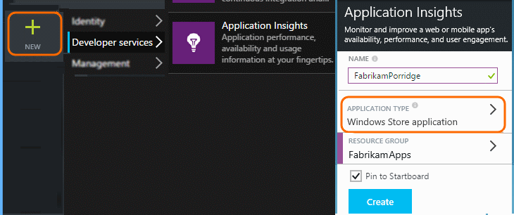
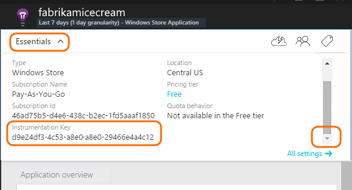
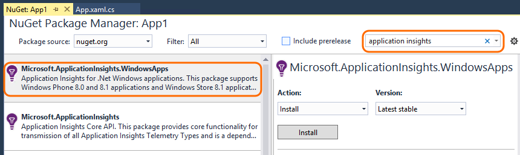
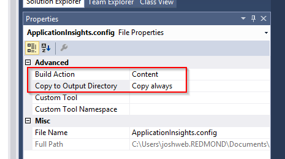
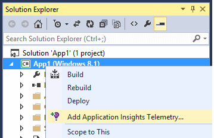

<properties
	pageTitle="Application Insights for Windows Phone and Store apps | Microsoft Azure"
	description="Analyze usage and performance of your Windows device app with Application Insights."
	services="application-insights"
    documentationCenter="windows"
	authors="alancameronwills"
	manager="douge"/>

<tags
	ms.service="application-insights"
	ms.workload="tbd"
	ms.tgt_pltfrm="ibiza"
	ms.devlang="na"
	ms.topic="get-started-article"
	ms.date="06/16/2015"
	ms.author="awills"/>

# Application Insights for Windows Phone and Store apps

*Application Insights is in preview.*

[AZURE.INCLUDE [app-insights-selector-get-started](../../includes/app-insights-selector-get-started.md)]

Visual Studio Application Insights lets you monitor your published application for:

* [**Usage**][windowsUsage]&#151;Learn how many users you have and what they are doing with your app.
* [**Crashes**][windowsCrash]&#151;Get diagnostic reports of crashes and understand their impact on users.


For many application types, [Visual Studio can add Application Insights to your app](#ide) almost without you noticing. But since you're reading this to get a better understanding of what's going on, we'll take you through the steps manually.

You'll need:

* A subscription to [Microsoft Azure][azure].
* Visual Studio 2013 or later.

## 1. Create an Application Insights resource

In the [Azure portal][portal], create a new Application Insights resource.



A [resource][roles] in Azure is an instance of a service. This resource is where telemetry from your app will be analyzed and presented to you.

#### Copy the Instrumentation Key

The key identifies the resource. You'll need it to configure the SDK to send the data to the resource.




## 2. Add the Application Insights SDK to your apps

In Visual Studio, add the appropriate SDK to your project.

If it's a Windows Universal app, repeat the steps for both the Windows Phone project and the Windows project.

1. Right-click the project in Solution Explorer and choose **Manage NuGet Packages**.

    

2. Search for "Application Insights".

    

3. Choose **Application Insights for Windows Applications**

4. Add an ApplicationInsights.config file to the root of your project and insert the instrumentation key copied from the portal. A sample xml for this config file is shown below.

	```xml

		<?xml version="1.0" encoding="utf-8" ?>
		<ApplicationInsights>
			<InstrumentationKey>YOUR COPIED INSTRUMENTATION KEY</InstrumentationKey>
		</ApplicationInsights>
	```

    Set the properties of the ApplicationInsights.config file: **Build Action** == **Content** and **Copy to Output Directory** == **Copy always**.

	

5. Add the following initialization code. It is best to add this code to the `App()` constructor. If you do it somewhere else, you might miss auto collection of the first pageviews.  

```C#

    using Microsoft.ApplicationInsights;
    ...

	public App()
	{
	   // Add this initilization line.
	   WindowsAppInitializer.InitializeAsync();

	   this.InitializeComponent();
	   this.Suspending += OnSuspending;
	}  
```

**Windows Universal apps**: Repeat the steps for both the Phone and the Store project. [Example of a Windows 8.1 Universal app](https://github.com/Microsoft/ApplicationInsights-Home/tree/master/Samples/Windows%208.1%20Universal).

## <a name="network"></a>3. Enable network access for your app

If your app doesn't already [request internet access](https://msdn.microsoft.com/library/windows/apps/hh452752.aspx), you'll have to add that to its manifest as a [required capability](https://msdn.microsoft.com/library/windows/apps/br211477.aspx).

## <a name="run"></a>4. Run your project

[Run your application with F5](http://msdn.microsoft.com/library/windows/apps/bg161304.aspx) and use it, so as to generate some telemetry.

In Visual Studio, you'll see a count of the events that have been received.


In debug mode, telemetry is sent as soon as it's generated. In release mode, telemetry is stored on the device and sent only when the app resumes.


## <a name="monitor"></a>5. See monitor data

In the [Azure portal](https://portal.azure.com), open the Application Insights resource that you created earlier.

At first, you'll just see one or two points. For example:


Click **Refresh** after a few seconds if you're expecting more data.

Click any chart to see more detail.


## <a name="deploy"></a>5. Publish your application to Store

[Publish your application](http://dev.windows.com/publish) and watch the data accumulate as users download and use it.

## Customize your telemetry

#### Choose the collectors

Application Insights SDK Includes several collectors, which collect different types of data from your app automatically. By default, they are all active. But you can choose which collectors to initialize in the app constructor:

    WindowsAppInitializer.InitializeAsync( "00000000-0000-0000-0000-000000000000",
       WindowsCollectors.Metadata
       | WindowsCollectors.PageView
       | WindowsCollectors.Session
       | WindowsCollectors.UnhandledException);

#### Send your own telemetry data

Use the [API][api] to send events, metrics and diagnostic data to Application Insights. In summary:

```C#

 var tc = new TelemetryClient(); // Call once per thread

 // Send a user action or goal:
 tc.TrackEvent("Win Game");

 // Send a metric:
 tc.TrackMetric("Queue Length", q.Length);

 // Provide properties by which you can filter events:
 var properties = new Dictionary{"game", game.Name};

 // Provide metrics associated with an event:
 var measurements = new Dictionary{"score", game.score};

 tc.TrackEvent("Win Game", properties, measurements);

```

For more details, see [API overview: Custom Events and Metrics][api].

## What's next?

* [Detect and diagnose crashes in your app][windowsCrash]
* [Learn about metrics][metrics]
* [Learn about diagnostic search][diagnostic]


## <a name="ide"></a>Automated setup

If you prefer to let Visual Studio perform the setup steps, you can do that with Windows Phone, Windows Store, and many other types of apps.

### <a name="new"></a>If you're creating a new Windows app project ...

Select **Application Insights** in the **New Project** dialog.

If you're asked to sign in, use the credentials for your Azure account (which is separate from your Visual Studio Online account).


### <a name="existing"></a>Or if it's an existing project ...

Add Application Insights from Solution Explorer.




## Upgrade to a new release of the SDK

When a [new SDK version is released](app-insights-release-notes-windows.md):

* Right-click your project and choose Manage NuGet Packages.
* Select the installed Application Insights packages and choose **Action: Upgrade**.


## <a name="usage"></a>Next Steps


[Detect and diagnose crashes in your app][windowsCrash]

[Capture and search diagnostic logs][diagnostic]


[Track usage of your app][windowsUsage]

[Use the API to send custom telemetry][api]

[Troubleshooting][qna]


<!--Link references-->

[api]: app-insights-api-custom-events-metrics.md
[azure]: ../insights-perf-analytics.md
[diagnostic]: app-insights-diagnostic-search.md
[metrics]: app-insights-metrics-explorer.md
[portal]: http://portal.azure.com/
[qna]: app-insights-troubleshoot-faq.md
[roles]: app-insights-resources-roles-access-control.md
[windowsCrash]: app-insights-windows-crashes.md
[windowsUsage]: app-insights-windows-usage.md
