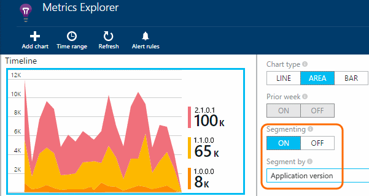
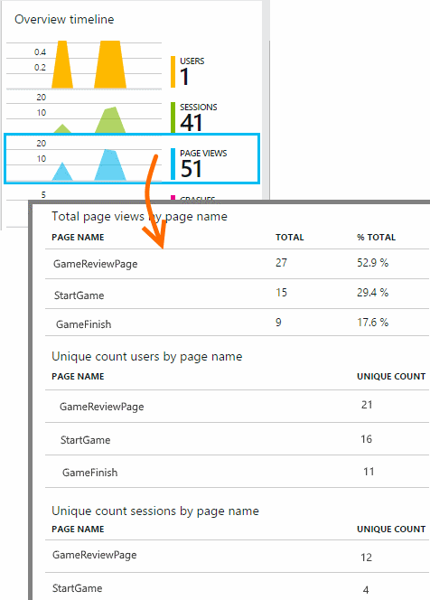
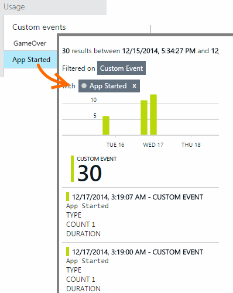
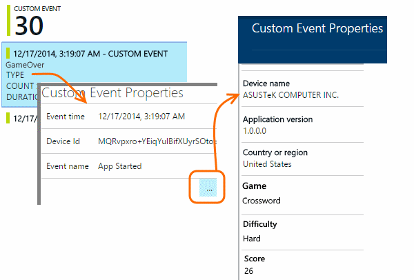

<properties 
	pageTitle="Monitor usage in Windows Store and Phone apps with Application Insights" 
	description="Analyze usage of your Windows device app with Application Insights." 
	services="application-insights" 
    documentationCenter="windows"
	authors="alancameronwills" 
	manager="douge"/>

<tags 
	ms.service="application-insights" 
	ms.workload="tbd" 
	ms.tgt_pltfrm="ibiza" 
	ms.devlang="na" 
	ms.topic="article" 
	ms.date="06/19/2015" 
	ms.author="awills"/>

#  Monitor usage in Windows Store and Windows Phone apps with Application Insights

*Application Insights is in preview.*

Learn how many users you have, and which pages they're looking at in your app. Application Insights provides you with that data out of the box. And by inserting a few lines of code in your app, you can learn more about the paths users take through your app and what they achieve with it.

If you haven't done this already, add [Application Insights to your app project][windows], and republish it. 

## Track usage

From the Overview timeline, click through Users and Sessions charts to see more detailed analytics.

* **Users** are tracked anonymously, so the same user on different devices would be counted twice.
* A **session** is counted when the app is suspended (for more than a brief interval, to avoid counting accidental suspensions).

#### Segmentation

Segment a chart to get a breakdown by a variety of criteria. For example, to see how many users are using each version of your app, open the Users chart and segment by Application Version: 

#### Page views

To discover the paths that users follow through your app, insert [page view telemetry][api] into  your code:

    var telemetry = new TelemetryClient();
    telemetry.TrackPageView("GameReviewPage");

See the results on the page views chart, and by opening its details:

Click through any page to see the details of specific occurrences.

#### Custom events

By inserting code to send custom events from your app, you can track your users' behavior and the usage of specific features and scenarios. 

For example:

    telemetry.TrackEvent("GameOver");

The data will appear in the Custom Events grid. You can either see an aggregated view in Metrics Explorer, or click through any event to see specific occurrences.

You can add string and numeric properties to any event.

    // Set up some properties:
    var properties = new Dictionary <string, string> 
       {{"Game", currentGame.Name}, {"Difficulty", currentGame.Difficulty}};
    var measurements = new Dictionary <string, double>
       {{"Score", currentGame.Score}, {"Opponents", currentGame.OpponentCount}};

    // Send the event:
    telemetry.TrackEvent("GameOver", properties, measurements);

Click through any occurrence to see its detailed properties, including those you have defined.

See [API reference][api] for more about custom events.

## Sessions

Session is a fundamental concept in Application Insights, which strives to associate every telemetry event - such as crashes or custom events that you code yourself - with a specific user session. 

Rich context information is collected about each session, such as device characteristics, geo location, operating system, and so on.

When [diagnosing problems][diagnostic], you can find all the telemetry related to the session in which a problem occurred, including all requests, and any events, exceptions or traces that were logged.

Sessions provide a good measure of the popularity of contexts such as device, operating system or location. By showing the count of sessions grouped by device, for example, you get a more accurate count of how often that device is used with your app, than by counting page views. This would be a useful input to triage of any device-specific issue.

#### What's a session?

A session represents a single encounter between the user and the app. In its simplest form, session starts with a user launching the app and finishes when user leaves the app. For mobile apps, the session is terminated when the app is suspended (moved to background) for more than 20 seconds. If the app is resumed, a new session will start. Naturally, a user may have multiple sessions in a day, or even in a single hour. 

**Session duration** is a metric that represents the span of time between the first and last telemetry items of the session. (It doesn't include the timeout period.)

**Session count** in a certain interval is defined as the number of unique sessions with some activity during this interval. When you look at a long time range such as daily session count for the past week, this is usually equivalent to the total number of sessions. 

However, when you explore shorter time ranges such as hourly grain, a long session spanning multiple hours will be counted for each hour in which the session was active. 

## Users and user counts

Each user session is associated with a unique user id, generated on the app's use and kept in device local storage. A user who uses multiple devices will be counted more than once.

The **user count** metric in a certain interval is defined as the number of unique users with recorded activity during this interval. As a result, users with long sessions may be accounted multiple times, when you set a time range so that the grain is less than an hour or so.

**New Users** counts the users whose first sessions with the app occurred during this interval. 

## Debug vs Release mode

#### Debug

If you build in debug mode, events are sent as soon as they are generated. If you lose internet connectivity and then exit the app before regaining connectivity, offline telemetry is discarded.

#### Release

If you build in release configuration, events are stored in the device and sent when the application resumes. Data is also sent on the application's first use. If there is no internet connectivity upon startup, previous telemetry as well as telemetry for the current lifecycle is stored and sent on the next resume.

## Next steps

[Know your users][knowUsers]

[Learn more about Metrics Explorer][metrics]

[Troubleshooting][qna]

<!--Link references-->

[api]: app-insights-api-custom-events-metrics.md
[diagnostic]: app-insights-diagnostic-search.md
[knowUsers]: app-insights-overview-usage.md
[metrics]: app-insights-metrics-explorer.md
[portal]: http://portal.azure.com/
[qna]: app-insights-troubleshoot-faq.md
[windows]: app-insights-windows-get-started.md

 