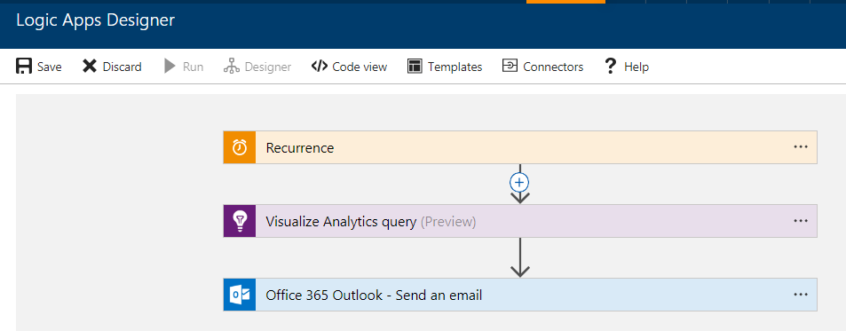

# Automate Application Insights processes with an Azure Logic App

Do you find yourself repeatedly running the same queries on your telemetry data to check that
your service is functioning properly? Looking to automate these queries for finding trends and
anomalies and build your own workflows around them? Well, Application Insights Connector (preview) for Azure Logic Apps is just what you need!
With this integration, numerous processes can now be automated without writing a single line of code. You can create your Logic App with the Application Insights connector to quickly automate any Application Insights process. You can add additional actions as well. Logic Apps makes hundreds of actions available. For example, you can automatically send an email notification, or create a bug in Visual Studio Team Services as part of your Logic App. You can also use one of the many [templates](https://docs.microsoft.com/azure/logic-apps/logic-apps-use-logic-app-templates) available for Logic Apps. These templates speed up the process of creating your Logic App. 

## Tutorial for creating an Azure Logic App for Application Insights

In this tutorial, you learn how to create an Azure Logic App that uses the Analytics auto-cluster algorithm to group attributes in the data for a web application. The flow automatically sends the results by email. This is just one example of how you can use Application Insights Analytics and Azure Logic Apps together. 

### Step 1: Create a Logic App
1. Sign in at:  https://portal.azure.com.
2. Create a new Logic App from the New/Web + Mobile menu.


### Step 2: Create a trigger for your Logic App
1.	In the Logic App Designer, under Start with a common trigger, choose Recurrence.
2.	Set the Frequency to Day with an Interval of 1.


### Step 3: Add an Azure Application Insights action
1. Click **New step** and then on **Add an action**.
2. Search for Azure Application Insights.
3. Click Azure Application Insights – Visualize Analytics query Preview.


### Step 4: Connect to an Application Insights resource

**Prerequisite**

You need an Application ID and an API Key for your resource to complete this step. You can retrieve them from the Azure portal as demonstrated in the following diagram:

 

- Provide a name for your connection along with the Application ID and API Key.


### Step 5: Specify the Analytics query and chart type
This example selects the failed requests within the last day and correlates them with exceptions that occurred as part of the operation. Analytics correlates based on the operation_Id identifier. The query then segments the results using the autocluster algorithm. 
When creating your own queries, make sure to verify that they are working properly in Analytics before adding it to your flow.

- Add the following Analytics query and select the Html table chart type. 

```
requests
| where timestamp > ago(1d)
| where success == "False"
| project name, operation_Id
| join ( exceptions
    | project problemId, outerMessage, operation_Id
) on operation_Id
| evaluate autocluster()
```


### Step 6: Configure the app to send email

1. Click **New step** and then select **Add an action**.
2. Search for Office 365 Outlook.
3. Click Office 365 Outlook – Send an email.


4. In the email action add the following data:
 - Specify the email address of the recipient
 - Provide a subject for the email
 - Place your cursor in the **Body** field, and from the dynamic content menu that opens on the right, select **Body**.
 - Click on **Show advanced options**.

 

5. From the dynamic content menu do the following:
- Select **Attachment Name**
- Select **Attachment Content**
- Select **Yes** in the **Is HTML** field


### Step 7: Save and test your Logic App
1. Click **Save** to save your changes.
1. You can either wait for the trigger to run the Logic App, or you can run it immediately by choosing **Run**.



When your Logic App runs the recipients you specified in the email list will receive an email that looks like the following:


## Next steps

- Learn more about creating [Analytics queries](app-insights-analytics-using.md).
- Learn more about [Azure Logic Apps](https://docs.microsoft.com/azure/logic-apps/logic-apps-what-are-logic-apps).


<!--Link references-->


