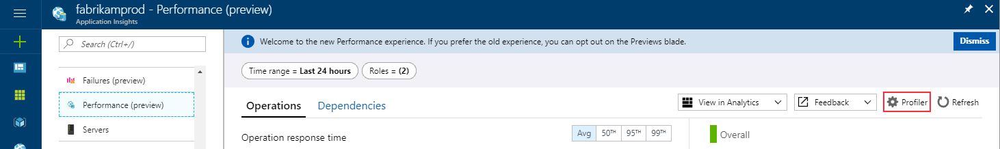
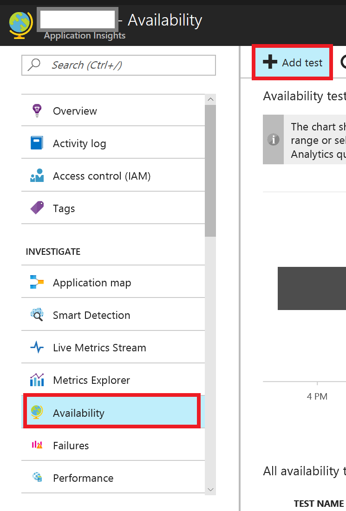
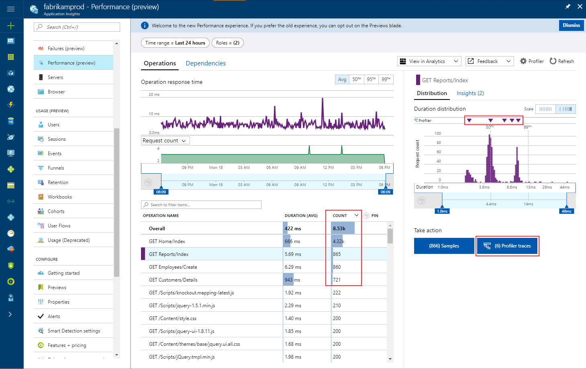
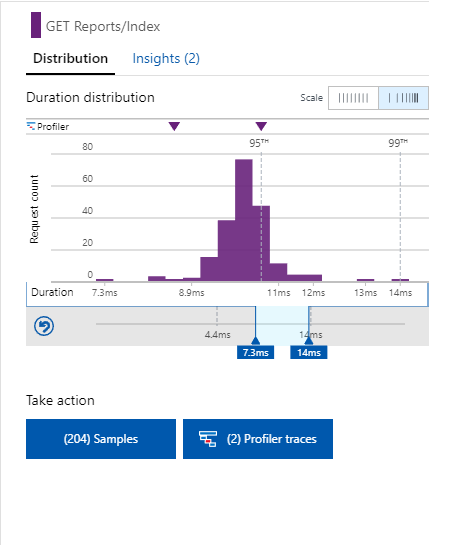

---
title: Enable Azure Application Insights Profiler on Azure Compute resources | Microsoft Docs
description: Learn how to set up the profiler on an ASP.NET application hosted by an Azure Cloud Services resource.
services: application-insights
documentationcenter: ''
author: CFreemanwa
manager: carmonm
ms.service: application-insights
ms.workload: tbd
ms.tgt_pltfrm: ibiza
ms.devlang: na
ms.topic: article
ms.date: 07/25/2017
ms.author: bwren

---

# Enable Application Insights Profiler on an Azure Cloud Services resource

This walkthrough demonstrates how to enable Azure Application Insights Profiler on an ASP.NET application hosted by an Azure Cloud Services resource. The examples include support for Azure Virtual Machines, virtual machine scale sets, and Azure Service Fabric. The examples all rely on templates that support the Azure Resource Manager deployment model. For more information about the deployment model, review [Azure Resource Manager vs. classic deployment: Understand deployment models and the state of your resources](/azure-resource-manager/resource-manager-deployment-model).

## Overview

The following diagram illustrates how the profiler works for Azure Cloud Services resources. It uses an Azure virtual machine as an example.


To collect information for processing and display on the Azure portal, you must install the Diagnostics Agent component for the Azure Cloud Services resources. The rest of the walkthrough provides guidance on how to install and configure the Diagnostics Agent to enable Application Insights Profiler.

## Prerequisites for the walkthrough

* A deployment Resource Manager template that installs the profiler agents on the VMs ([WindowsVirtualMachine.json](https://github.com/Azure/azure-docs-json-samples/blob/master/application-insights/WindowsVirtualMachine.json)) or scale sets ([WindowsVirtualMachineScaleSet.json](https://github.com/Azure/azure-docs-json-samples/blob/master/application-insights/WindowsVirtualMachineScaleSet.json)).

* An Application Insights instance enabled for profiling. For instructions, see [Enable the profile](https://docs.microsoft.com/en-us/azure/application-insights/app-insights-profiler#enable-the-profiler).

* .NET Framework 4.6.1 or later installed on the target Azure Cloud Services resource.

## Create a resource group in your Azure subscription
The following example demonstrates how to create a resource group by using a PowerShell script:

```
New-AzureRmResourceGroup -Name "Replace_With_Resource_Group_Name" -Location "Replace_With_Resource_Group_Location"
```

## Create an Application Insights resource in the resource group
On the **Application Insights** blade, enter the information for your resource, as shown in this example:


## Apply an Application Insights instrumentation key in the Azure Resource Manager template

1. If you haven't downloaded the template yet, download it from [GitHub](https://github.com/Azure/azure-docs-json-samples/blob/master/application-insights/WindowsVirtualMachine.json).

2. Find the Application Insights key.

   

3. Replace the template value.

   

## Create an Azure VM to host the web application
1. Create a secure string to save the password.

   ```
   $password = ConvertTo-SecureString -String "Replace_With_Your_Password" -AsPlainText -Force
   ```

2. Deploy the Azure Resource Manager template.

   Change the directory in the PowerShell console to the folder that contains your Resource Manager template. To deploy the template, run the following command:

   ```
   New-AzureRmResourceGroupDeployment -ResourceGroupName "Replace_With_Resource_Group_Name" -TemplateFile .\WindowsVirtualMachine.json -adminUsername "Replace_With_your_user_name" -adminPassword $password -dnsNameForPublicIP "Replace_WIth_your_DNS_Name" -Verbose
   ```

After the script runs successfully, you should find a VM named **MyWindowsVM** in your resource group.

## Configure Web Deploy on the VM
Make sure that Web Deploy is enabled on your VM so you can publish your web application from Visual Studio.

To install Web Deploy on a VM manually via WebPI, see [Installing and Configuring Web Deploy on IIS 8.0 or Later](https://docs.microsoft.com/en-us/iis/install/installing-publishing-technologies/installing-and-configuring-web-deploy-on-iis-80-or-later). For an example of how to automate installing Web Deploy by using an Azure Resource Manager template, see
[Create, configure, and deploy a web application to an Azure VM](https://azure.microsoft.com/en-us/resources/templates/201-web-app-vm-dsc/).

If you are deploying an ASP.NET MVC application, go to Server Manager, select **Add Roles and Features** > **Web Server (IIS)** > **Web Server** > **Application Development**, and enable ASP.NET 4.5 on your server.


## Install the Azure Application Insights SDK for your project
1. Open your ASP.NET web application in Visual Studio.

2. Right-click the project and select **Add** > **Connected Services**.

3. Select **Application Insights**.

4. Follow the instructions on the page. Select the Application Insights resource that you created earlier.

5. Select the **Register** button.


## Publish the project to an Azure VM
There are several ways to publish an application to an Azure VM. One way is to use Visual Studio 2017.

1. Right-click the project and select **Publish**.

2. Select **Microsoft Azure Virtual Machines** as the publish target and follow the steps.

   

3. Run a load test against your application. You should see results on the Application Insights instance portal webpage.


## Enable the profiler
1. Go to your Application Insights **Performance** blade and click on **Profiler** in the top right corner to configure it.

   

2. Select **Enable Profiler**.

   

## Add a performance test to your application
Follow these steps so we can collect some sample data to be displayed in Application Insights Profiler:

1. Browse to the Application Insights resource that you created earlier.

2. Go to the **Availability** blade and add a performance test that sends web requests to your application URL.

   

## View your performance data

1. Wait 10-15 minutes for the profiler to collect and analyze the data.

2. Go to the **Performance** blade in your Application Insights resource and view how your application is performing when it's under load. Focus on the slow operation of interest with enough usage, by sorting operational grid by the Count column. Observe which duration ranges have profiler traces by looking at the Profiler lane above the duration distribution. Note that the longer you monitor your application the more traces profiler will collect, and thus more of the distribution will be covered in the rich code-level examples supported by the profiler traces. 

   

You can zoom-in to the duration range of interest, such as the third spike around 95th percentile. This will constrain the number of samples and profiler traces in the Take Action buttons. 



Now click on the **Profiler traces** button to open Profiler with the appropriate trace.

3. Select the icon under **Examples** to open the **Trace View** blade.

   


## Work with an existing template

1. Locate the Azure Diagnostics resource declaration in your deployment template.

   If you don't have a declaration, you can create one that resembles the declaration in the following example. You can update the template from the [Azure Resource Explorer website](https://resources.azure.com).

2. Change the publisher from `Microsoft.Azure.Diagnostics` to `AIP.Diagnostics.Test`.

3. For `typeHandlerVersion`, use `0.0`.

4. Make sure that `autoUpgradeMinorVersion` is set to `true`.

5. Add the new `ApplicationInsightsProfiler` sink instance in the `WadCfg` settings object, as shown in the following example:

```
"resources": [
        {
          "type": "extensions",
          "name": "Microsoft.Insights.VMDiagnosticsSettings",
          "apiVersion": "2016-03-30",
          "properties": {
            "publisher": "AIP.Diagnostics.Test",
            "type": "IaaSDiagnostics",
            "typeHandlerVersion": "0.0",
            "autoUpgradeMinorVersion": true,
            "settings": {
              "WadCfg": {
                "SinksConfig": {
                  "Sink": [
                    {
                      "name": "Give a descriptive short name. E.g.: MyApplicationInsightsProfilerSink",
                      "ApplicationInsightsProfiler": "Enter the Application Insights instance instrumentation key guid here"
                    }
                  ]
                },
                "DiagnosticMonitorConfiguration": {
                    ...
                }
                ...
              }
              ...
            }
            ...
          }
          ...
]
```

## Enable the profiler on virtual machine scale sets
To see how to enable the profiler, download the [WindowsVirtualMachineScaleSet.json](https://github.com/Azure/azure-docs-json-samples/blob/master/application-insights/WindowsVirtualMachineScaleSet.json) template. Apply the same changes in a VM template to the diagnostics extension resource for the virtual machine scale set.

Make sure that each instance in the scale set has access to the internet. The Profiler Agent can then send the collected samples to Application Insights for display and analysis.

## Enable the profiler on Service Fabric applications
1. Provision the Service Fabric cluster to have the Azure Diagnostics extension that installs the Profiler Agent.

2. Install the Application Insights SDK in the project and configure the Application Insights key.

3. Add application code to instrument telemetry.

### Provision the Service Fabric cluster to have the Azure Diagnostics extension that installs the Profiler Agent
A Service Fabric cluster can be secure or non-secure. You can set one gateway cluster to be non-secure so it doesn't require a certificate for access. Clusters that host business logic and data should be secure. You can enable the profiler on both secure and non-secure Service Fabric clusters. This walkthrough uses a non-secure cluster as an example to explain what changes are required to enable the profiler. You can provision a secure cluster in the same way.

1. Download [ServiceFabricCluster.json](https://github.com/Azure/azure-docs-json-samples/blob/master/application-insights/ServiceFabricCluster.json). As you did for VMs and virtual machine scale sets, replace `Application_Insights_Key` with your Application Insights key:

   ```
   "publisher": "AIP.Diagnostics.Test",
                 "settings": {
                   "WadCfg": {
                     "SinksConfig": {
                       "Sink": [
                         {
                           "name": "MyApplicationInsightsProfilerSinkVMSS",
                           "ApplicationInsightsProfiler": "[Application_Insights_Key]"
                         }
                       ]
                     },
   ```

2. Deploy the template by using a PowerShell script:

   ```
   Login-AzureRmAccount
   New-AzureRmResourceGroup -Name [Your_Resource_Group_Name] -Location [Your_Resource_Group_Location] -Verbose -Force
   New-AzureRmResourceGroupDeployment -Name [Choose_An_Arbitrary_Name] -ResourceGroupName [Your_Resource_Group_Name] -TemplateFile [Path_To_Your_Template]

   ```

### Install the Application Insights SDK in the project and configure the Application Insights key
Install the Application Insights SDK from the [NuGet package](https://www.nuget.org/packages/Microsoft.ApplicationInsights.Web/). Make sure that you install a stable version, 2.3 or later.

For information about configuring Application Insights in your projects, see [Using Service Fabric with Application Insights](https://github.com/Azure-Samples/service-fabric-dotnet-getting-started/blob/dev/appinsights/ApplicationInsights.md).

### Add application code to instrument telemetry
1. For any piece of code that you want to instrument, add a using statement around it.

   In the following  example, the `RunAsync` method is doing some work, and the `telemetryClient` class captures the telemetry after it starts. The event needs a unique name across the application.

   ```
   protected override async Task RunAsync(CancellationToken cancellationToken)
       {
           // TODO: Replace the following sample code with your own logic
           //       or remove this RunAsync override if it's not needed in your service.

           while (true)
           {
               using( var operation = telemetryClient.StartOperation<RequestTelemetry>("[Insert_Event_Unique_Name]"))
               {
                   cancellationToken.ThrowIfCancellationRequested();

                   ++this.iterations;

                   ServiceEventSource.Current.ServiceMessage(this.Context, "Working-{0}", this.iterations);

                   await Task.Delay(TimeSpan.FromSeconds(1), cancellationToken);
               }

           }
       }
   ```

2. Deploy your application to the Service Fabric cluster. Wait for the app to run for 10 minutes. For better effect, you can run a load test on the app. Go to the Application Insights portal's **Performance** blade, and you should see examples of profiling traces appear.

<!---
Commenting out these sections for now
## Enable the Profiler on Cloud Services applications
[TODO]
## Enable the Profiler on classic Azure Virtual Machines
[TODO]
## Enable the Profiler on on-premise servers
[TODO]
--->

## Next steps

- Find help with troubleshooting profiler issues in [Profiler troubleshooting](app-insights-profiler.md#troubleshooting).

- Read more about the profiler in [Application Insights Profiler](app-insights-profiler.md).
