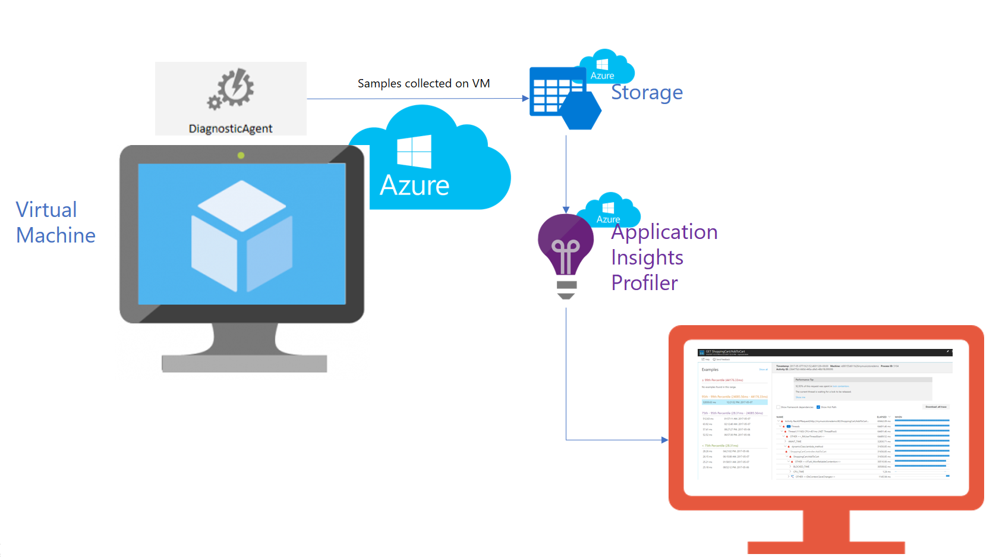
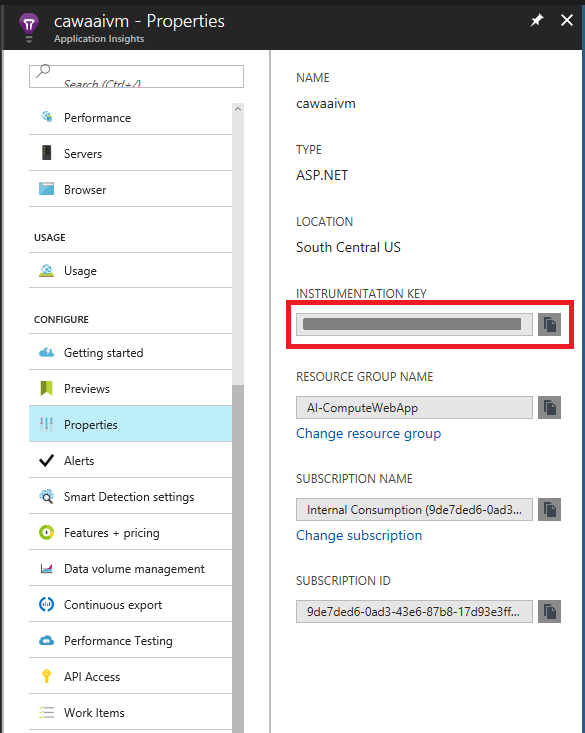

# Enable Application Insights Profiler for Azure VMs, Service Fabric, and Azure Cloud Services

This article demonstrates how to enable Azure Application Insights Profiler on an ASP.NET application that is hosted by an Azure Cloud Services resource.

The examples in this article include support for Azure Virtual Machines, virtual machine scale sets, Azure Service Fabric, and Azure Cloud Services. The examples rely on templates that support the [Azure Resource Manager](https://docs.microsoft.com/azure/azure-resource-manager/resource-group-overview) deployment model.  


## Overview

The following image shows how Application Insights Profiler works with applications that are hosted on Azure Cloud Services resources. Azure Cloud Services resources include Virtual Machines, scale sets, cloud services, and Service Fabric clusters. The image uses an Azure virtual machine as an example.  

  

To fully enable Profiler, you must change the configuration in three locations:

* The Application Insights instance pane in the Azure portal.
* The application source code (for example, an ASP.NET web application).
* The environment deployment definition source code (for example, an Azure Resource Manager template in the .json file).


## Set up the Application Insights instance

1. [Create a new Application Insights resource](https://docs.microsoft.com/azure/application-insights/app-insights-create-new-resource), or select an existing one. 

1. Go to your Application Insights resource, and then copy the instrumentation key.

   

1. To finish setting up the Application Insights instance for Profiler, complete the procedure that's described in [Enable Profiler](https://docs.microsoft.com/azure/application-insights/app-insights-profiler). You don't need to link the web apps, because the steps are specific to the app services resource. Ensure that Profiler is enabled in the **Configure Profiler** pane.


## Set up the application source code

### ASP.NET web applications, Azure Cloud Services web roles, or the Service Fabric ASP.NET web front end
Set up your application to send telemetry data to an Application Insights instance on each `Request` operation.  

Add the [Application Insights SDK](https://docs.microsoft.com/azure/application-insights/app-insights-overview#get-started) to your application project. Make sure that the NuGet package versions are as follows:  
  - For ASP.NET applications: [Microsoft.ApplicationInsights.Web](https://www.nuget.org/packages/Microsoft.ApplicationInsights.Web/) 2.3.0 or later.
  - For ASP.NET Core applications: [Microsoft.ApplicationInsights.AspNetCore](https://www.nuget.org/packages/Microsoft.ApplicationInsights.AspNetCore/) 2.1.0 or later.
  - For other .NET and .NET Core applications (for example, a Service Fabric stateless service or a Cloud Services worker role):
  [Microsoft.ApplicationInsights](https://www.nuget.org/packages/Microsoft.ApplicationInsights/) or [Microsoft.ApplicationInsights.Web](https://www.nuget.org/packages/Microsoft.ApplicationInsights.Web/) 2.3.0 or later.  

### Azure Cloud Services worker roles or the Service Fabric stateless back end
In addition to completing the preceding step, if your application is *not* an ASP.NET or ASP.NET Core application (for example, if it's an Azure Cloud Services worker role or Service Fabric stateless APIs), do the following:  

  1. Early in the application lifetime, add the following code:  

        ```csharp
        using Microsoft.ApplicationInsights.Extensibility;
        ...
        // Replace with your own Application Insights instrumentation key.
        TelemetryConfiguration.Active.InstrumentationKey = "00000000-0000-0000-0000-000000000000";
        ```
      For more information about this global instrumentation key configuration, see [Use Service Fabric with Application Insights](https://github.com/Azure-Samples/service-fabric-dotnet-getting-started/blob/dev/appinsights/ApplicationInsights.md).  

  1. For any piece of code that you want to instrument, add a `StartOperation<RequestTelemetry>` **USING** statement around it, as shown in the following example:

        ```csharp
        using Microsoft.ApplicationInsights;
        using Microsoft.ApplicationInsights.DataContracts;
        ...
        var client = new TelemetryClient();
        ...
        using (var operation = client.StartOperation<RequestTelemetry>("Insert_Your_Custom_Event_Unique_Name"))
        {
          // ... Code I want to profile.
        }
        ```

        Calling `StartOperation<RequestTelemetry>` within another `StartOperation<RequestTelemetry>` scope is not supported. You can use `StartOperation<DependencyTelemetry>` in the nested scope instead. For example:  
        
        ```csharp
        using (var getDetailsOperation = client.StartOperation<RequestTelemetry>("GetProductDetails"))
        {
        try
        {
          ProductDetail details = new ProductDetail() { Id = productId };
          getDetailsOperation.Telemetry.Properties["ProductId"] = productId.ToString();
        
          // By using DependencyTelemetry, 'GetProductPrice' is correctly linked as part of the 'GetProductDetails' request.
          using (var getPriceOperation = client.StartOperation<DependencyTelemetry>("GetProductPrice"))
          {
              double price = await _priceDataBase.GetAsync(productId);
              if (IsTooCheap(price))
              {
                  throw new PriceTooLowException(productId);
              }
              details.Price = price;
          }
        
          // Similarly, note how 'GetProductReviews' doesn't establish another RequestTelemetry.
          using (var getReviewsOperation = client.StartOperation<DependencyTelemetry>("GetProductReviews"))
          {
              details.Reviews = await _reviewDataBase.GetAsync(productId);
          }
        
          getDetailsOperation.Telemetry.Success = true;
          return details;
        }
        catch(Exception ex)
        {
          getDetailsOperation.Telemetry.Success = false;
        
          // This exception gets linked to the 'GetProductDetails' request telemetry.
          client.TrackException(ex);
          throw;
        }
        }
        ```

## Set up the environment deployment definition

The environment in which Profiler and your application execute can be a virtual machine, a virtual machine scale set, a Service Fabric cluster, or a cloud services instance.  

### Virtual machines, scale sets, or Service Fabric

For full examples, see:  
  * [Virtual machine](https://github.com/Azure/azure-docs-json-samples/blob/master/application-insights/WindowsVirtualMachine.json)
  * [Virtual machine scale set](https://github.com/Azure/azure-docs-json-samples/blob/master/application-insights/WindowsVirtualMachineScaleSet.json)
  * [Service Fabric cluster](https://github.com/Azure/azure-docs-json-samples/blob/master/application-insights/ServiceFabricCluster.json)

To set up your environment, do the following:
1. To ensure that you're using [.NET Framework 4.6.1](https://docs.microsoft.com/dotnet/framework/migration-guide/how-to-determine-which-versions-are-installed) or later, it's sufficient to confirm that the deployed OS is `Windows Server 2012 R2` or later.

1. Search for the [Azure Diagnostics](https://docs.microsoft.com/azure/monitoring-and-diagnostics/azure-diagnostics) extension in the deployment template file, and then add the following `SinksConfig` section as a child element of `WadCfg`. Replace the `ApplicationInsightsProfiler` property value with your own Application Insights instrumentation key:  

      ```json
      "SinksConfig": {
        "Sink": [
          {
            "name": "MyApplicationInsightsProfilerSink",
            "ApplicationInsightsProfiler": "00000000-0000-0000-0000-000000000000"
          }
        ]
      }
      ```

      For information about adding the Diagnostics extension to your deployment template, see [Use monitoring and diagnostics with a Windows VM and Azure Resource Manager templates](https://docs.microsoft.com/azure/virtual-machines/windows/extensions-diagnostics-template?toc=%2fazure%2fvirtual-machines%2fwindows%2ftoc.json).

> [!TIP]
> For Virtual Machines an alternative to the json based steps above is to navigate in the Azure portal to  **Virtual Machines** > **Diagnostic Settings** > **Sinks** > Set send diagnostic data to Application Insights to **Enabled** and either select an Application Insights account or a specific ikey.

### Azure Cloud Services

1. To ensure that you're using [.NET Framework 4.6.1](https://docs.microsoft.com/dotnet/framework/migration-guide/how-to-determine-which-versions-are-installed) or later, it's sufficient to confirm that the *ServiceConfiguration.\*.cscfg* files have an `osFamily` value of "5" or later.

1. Locate the [Azure Diagnostics](https://docs.microsoft.com/azure/monitoring-and-diagnostics/azure-diagnostics) *diagnostics.wadcfgx* file for your application role, as shown here:  

     

   If you can't find the file, to learn how to enable the Diagnostics extension in your Azure Cloud Services project, see [Set up diagnostics for Azure Cloud Services and virtual machines](https://docs.microsoft.com/azure/vs-azure-tools-diagnostics-for-cloud-services-and-virtual-machines#enable-diagnostics-in-cloud-service-projects-before-deploying-them).

1. Add the following `SinksConfig` section as a child element of `WadCfg`:  

      ```xml
      <WadCfg>
        <DiagnosticMonitorConfiguration>...</DiagnosticMonitorConfiguration>
        <SinksConfig>
          <Sink name="MyApplicationInsightsProfiler">
            <!-- Replace with your own Application Insights instrumentation key. -->
            <ApplicationInsightsProfiler>00000000-0000-0000-0000-000000000000</ApplicationInsightsProfiler>
          </Sink>
        </SinksConfig>
      </WadCfg>
      ```

> [!NOTE]  
> If the *diagnostics.wadcfgx* file also contains another sink of type `ApplicationInsights`, all three of the following instrumentation keys must match:  
>  * The key that's used by your application.  
>  * The key that's used by the `ApplicationInsights` sink.  
>  * The key that's used by the `ApplicationInsightsProfiler` sink.  
>
> You can find the actual instrumentation key value that's used by the `ApplicationInsights` sink in the *ServiceConfiguration.\*.cscfg* files.  
> After the Visual Studio 15.5 Azure SDK release, only the instrumentation keys that are used by the application and the `ApplicationInsightsProfiler` sink need to match each other.


## Configure environment deployment and runtime

1. Deploy the modified environment deployment definition.  

   To apply the modifications, usually involves a full template deployment or a cloud services based publish through PowerShell cmdlets or Visual Studio.  

   The following is an alternate approach for existing virtual machines that touches only the Azure Diagnostics extension:  

    ```powershell
    $ConfigFilePath = [IO.Path]::GetTempFileName()
    # After you export the currently deployed Diagnostics config to a file, edit it to include the ApplicationInsightsProfiler sink.
    (Get-AzureRmVMDiagnosticsExtension -ResourceGroupName "MyRG" -VMName "MyVM").PublicSettings | Out-File -Verbose $ConfigFilePath
    # Set-AzureRmVMDiagnosticsExtension might require the -StorageAccountName argument
    # If your original diagnostics configuration had the storageAccountName property in the protectedSettings section (which is not downloadable), be sure to pass the same original value you had in this cmdlet call.
    Set-AzureRmVMDiagnosticsExtension -ResourceGroupName "MyRG" -VMName "MyVM" -DiagnosticsConfigurationPath $ConfigFilePath
    ```

1. If the intended application is running through [IIS](https://www.microsoft.com/web/downloads/platform.aspx), enable the `IIS Http Tracing` Windows feature by doing the following:  

   a. Establish remote access to the environment, and then use the [Add Windows features]( https://docs.microsoft.com/iis/configuration/system.webserver/tracing/) window, or run the following command in PowerShell (as administrator):  

    ```powershell
    Enable-WindowsOptionalFeature -FeatureName IIS-HttpTracing -Online -All
    ```  
   b. If establishing remote access is a problem, you can use [Azure CLI](https://docs.microsoft.com/cli/azure/get-started-with-azure-cli) to run the following command:  

    ```powershell
    az vm run-command invoke -g MyResourceGroupName -n MyVirtualMachineName --command-id RunPowerShellScript --scripts "Enable-WindowsOptionalFeature -FeatureName IIS-HttpTracing -Online -All"
    ```


## Enable Profiler on on-premises servers

Enabling Profiler on an on-premises server is also known as running Application Insights Profiler in standalone mode. It's not tied to Azure Diagnostics extension modifications.

We have no plan to officially support Profiler for on-premises servers. If you are interested in experimenting with this scenario, you can [download support code](https://github.com/ramach-msft/AIProfiler-Standalone). We are *not* responsible for maintaining that code, or for responding to issues and feature requests that are related to the code.

## Next steps

- Generate traffic to your application (for example, launch an [availability test](https://docs.microsoft.com/azure/application-insights/app-insights-monitor-web-app-availability)). Then, wait 10 to 15 minutes for traces to start to be sent to the Application Insights instance.
- See [Profiler traces](https://docs.microsoft.com/azure/application-insights/app-insights-profiler#enable-the-profiler) in the Azure portal.
- Get help with troubleshooting profiler issues in [Profiler troubleshooting](app-insights-profiler.md#troubleshooting).
- Read more about Profiler in [Application Insights Profiler](app-insights-profiler.md).
