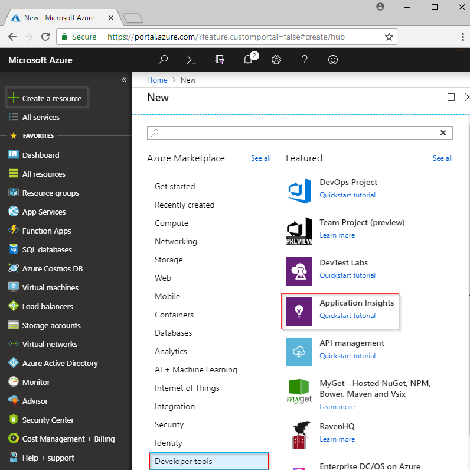
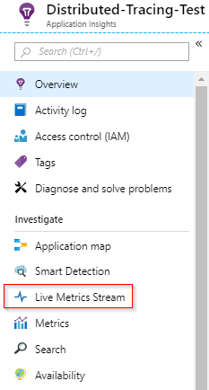

# Collect distributed traces from Python (Preview)

Open Census + local forwarder + Python

## Prerequisites

- You need an Azure Subscription.
- Python should be installed this article uses [Python 3.7.0](https://www.python.org/downloads/), though earlier versions will likely work with minor adjustment.
- Follow the instructions to install the [local forwarder as a Windows service](https://TODO)

If you don't have an Azure subscription, create a [free](https://azure.microsoft.com/free/) account before you begin.

## Log in to the Azure portal

Log in to the [Azure portal](https://portal.azure.com/).

## Create Application Insights resource

First you have to create an Application Insights resource which will generate an instrumentation key(ikey). The ikey is then used to configure the local forwarder to send distributed traces from your open census instrumented application, to Application Insights.   

1. Select **Create a resource** > **Developer Tools** > **Application Insights**.

   

   A configuration box appears; use the following table to fill out the input fields.

    | Settings        | Value           | Description  |
   | ------------- |:-------------|:-----|
   | **Name**      | Globally Unique Value | Name that identifies the app you are monitoring |
   | **Application Type** | General | Type of app you are monitoring |
   | **Resource Group**     | myResourceGroup      | Name for the new resource group to host App Insights data |
   | **Location** | East US | Choose a location near you, or near where your app is hosted |

2. Click **Create**.

## Configure local forwarder

1. Select **Overview** > **Essentials** > Copy your application's **Instrumentation Key**.

   

2. Edit your `LocalForwarder.config` file and add your instrumentation key. If you followed the instructions in the [pre-requisite](http://TODO) the file is located at `C:\LF-WindowsServiceHost`

    ```xml
      <OpenCensusToApplicationInsights>
        <!--
          Instrumentation key to track telemetry to.
          -->
        <InstrumentationKey>{enter-instrumentation-key}</InstrumentationKey>
      </OpenCensusToApplicationInsights>
    
      <!-- Describes aspects of processing Application Insights telemetry-->
      <ApplicationInsights>
        <LiveMetricsStreamInstrumentationKey>{enter-instrumentation-key}</LiveMetricsStreamInstrumentationKey>
      </ApplicationInsights>
    </LocalForwarderConfiguration>
    ```

3. Restart the application **Local Forwarder** service.

## Open Census Python package

1. Install the Open Census package for Python with pip or pipenv from the command line:

    ```python
    python -m pip install opencensus
    # pip install opencensus
    ```

    > [!NOTE]
    > `python -m pip install opencensus` assumes that you have a PATH environment variable set for your Python installation. If you have not configured this, you would need to give the full directory path to where your Python executable is located which would result in something like: `C:\Users\Administrator\AppData\Local\Programs\Python\Python37-32\python.exe -m pip install opencensus`.

2. First let's generate some trace data locally. In Python IDLE or your editor of choice enter the following code:

    ```python
    from opencensus.trace.tracer import Tracer
    
    def main():
        while True:
            valuePrompt()
    
    def valuePrompt():
        tracer = Tracer()
        with tracer.span(name="test") as span:
            line = input("Enter a value: ")
            print(line)
    
    if __name__ == "__main__":
        main()
    
    ```

3. Running the program will just repeatedly prompt you to enter a value, and with each entry the value will be printed to the shell, and a corresponding piece of **SpanData** will be generated by the Open Census Python Module.
    
    ```python
    Enter a value: 4
    4
    [SpanData(name='test', context=SpanContext(trace_id=1f07f062ac394c50925f2ae61e635e14, span_id=None, trace_options=TraceOptions(enabled=True), tracestate=None), span_id='5c17a4ad6ba14299', parent_span_id=None, attributes={}, start_time='2018-09-15T20:42:15.847292Z', end_time='2018-09-15T20:42:17.615664Z', child_span_count=0, stack_trace=None, time_events=[], links=[], status=None, same_process_as_parent_span=None, span_kind=0)]
    Enter a value: 25
    25
    [SpanData(name='test', context=SpanContext(trace_id=c71b4e88a22a495da61df52ce3eee3e1, span_id=None, trace_options=TraceOptions(enabled=True), tracestate=None), span_id='51547c0af5f046eb', parent_span_id=None, attributes={}, start_time='2018-09-15T20:42:17.615664Z', end_time='2018-09-15T20:48:11.160314Z', child_span_count=0, stack_trace=None, time_events=[], links=[], status=None, same_process_as_parent_span=None, span_kind=0)]
    Enter a value: 100
    100
    [SpanData(name='test', context=SpanContext(trace_id=b4cdcc9e6df44a8fbb6e8ddeccc1351c, span_id=None, trace_options=TraceOptions(enabled=True), tracestate=None), span_id='f2caacf7892744d1', parent_span_id=None, attributes={}, start_time='2018-09-15T20:48:11.175931Z', end_time='2018-09-15T20:48:12.629178Z', child_span_count=0, stack_trace=None, time_events=[], links=[], status=None, same_process_as_parent_span=None, span_kind=0)]
    ```

4. While this is helpful for demonstration purposes, ultimately we want to emit the SpanData in a way that it can be picked up by our **local forwarder service** and sent on to Application Insights. Modify your code from the previous step to the following:

    ```python
    from opencensus.trace.tracer import Tracer
    from opencensus.trace import config_integration
    from opencensus.trace.exporters.ocagent import trace_exporter
    from opencensus.trace import tracer as tracer_module
    
    import os
    
    def main():        
        while True:
            valuePrompt()
    
    def valuePrompt():
        export_LocalForwarder = trace_exporter.TraceExporter(
        service_name=os.getenv('SERVICE_NAME', 'python-service'),
        endpoint=os.getenv('OCAGENT_TRACE_EXPORTER_ENDPOINT'))
        
        tracer = Tracer(exporter=export_LocalForwarder)
        with tracer.span(name="test") as span:
            line = input("Enter a value: ")
            print(line)
    
    if __name__ == "__main__":
        main()
    ```

5. If you save and try running the above module you may receive a `ModuleNotFoundError` for `grpc`. If this occurs run the following to install the [grpcio package](https://pypi.org/project/grpcio/) with:

    ```
    python -m pip install grpcio
    ```

6. Now when you run the Python script from above you should still be prompted to event values, but now only the value is being printed in the shell.

7. To confirm that the **local forwarder** is picking up the traces check the `LocalForwarder.config` file. If you followed the steps in the [prerequisite](http://TODO) it will be located in `C:\LF-WindowsServiceHost`.

    In the image below of the log file you can see that prior to running the second script where we added an exporter `OpenCensus input BatchesReceived` was 0. Once we started running the updated script `BatchesReceived` incremented equal to the number of values we entered:
    
    

## Start monitoring in the Azure portal

1. You can now reopen the Application Insights **Overview** page in the Azure portal, where you retrieved your instrumentation key, to view details about your currently running application. Select **Live Metric Stream**.

   

2. If you run the second Python script again and start entering values you will see live trace data as it arrives in Application Insights from the local forwarder service.

   


2. Click **App map** for a visual layout of the dependency relationships between your application components. Each component shows KPIs such as load, performance, failures, and alerts.

   


## Next steps

