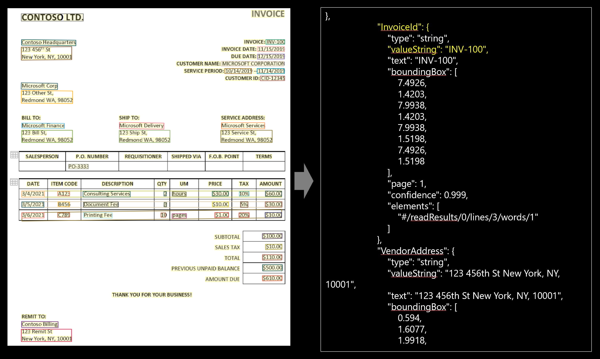

# Form Recognizer prebuilt invoice model

Azure Form Recognizer can analyze and extract information from sales invoices using its prebuilt invoice models. The Invoice API enables customers to take invoices in various formats and return structured data to automate the invoice processing. It combines our powerful [Optical Character Recognition (OCR)](../../cognitive-services/computer-vision/overview-ocr.md) capabilities with invoice understanding deep learning models to extract key information from invoices written in English. It extracts the text, tables, and information such as customer, vendor, invoice ID, invoice due date, total, invoice amount due, tax amount, ship to, bill to, line items and more. The prebuilt Invoice API is publicly available in the Form Recognizer v2.1.

## What does the Invoice service do?

The Invoice API extracts key fields and line items from invoices and returns them in an organized structured JSON response. Invoices can be from various formats and quality, including  phone-captured images, scanned documents, and digital PDFs. The invoice API will extract the structured output from all of these invoices.

## Try it

To try out the Form Recognizer Invoice Service, go to the online Sample UI Tool:

> [!div class="nextstepaction"]
> [Try invoice model](https://aka.ms/fott-2.1-ga "Start with a prebuilt model to extract data from invoices.")

You will need an Azure subscription ([create one for free](https://azure.microsoft.com/free/cognitive-services)) and a [Form Recognizer resource](https://ms.portal.azure.com/#create/Microsoft.CognitiveServicesFormRecognizer) endpoint and key to try out the Form Recognizer Invoice service.

:::image type="content" source="media/analyze-invoice-new.png" alt-text="Analyzed invoice example" lightbox="media/analyze-invoice-new.png":::

### Input requirements

[!INCLUDE [input requirements](./includes/input-requirements-receipts.md)]

## Supported locales

**Pre-built invoice v2.1** supports invoices in the **en-us** locale.

## Analyze Invoice

The [Analyze Invoice](https://westus.dev.cognitive.microsoft.com/docs/services/form-recognizer-api-v2-1/operations/5ed8c9843c2794cbb1a96291) operation takes an image or PDF of an invoice as the input and extracts the values of interest. The call returns a response header field called `Operation-Location`. The `Operation-Location` value is a URL that contains the Result ID to be used in the next step.

|Response header| Result URL |
|:-----|:----|
|Operation-Location | `https://cognitiveservice/formrecognizer/v2.1/prebuilt/invoice/analyzeResults/49a36324-fc4b-4387-aa06-090cfbf0064f` |

## Get Analyze Invoice Result

The second step is to call the [Get Analyze Invoice Result](https://westus.dev.cognitive.microsoft.com/docs/services/form-recognizer-api-v2-1/operations/5ed8c9acb78c40a2533aee83) operation. This operation takes as input the Result ID that was created by the Analyze Invoice operation. It returns a JSON response that contains a **status** field with the following possible values. You call this operation iteratively until it returns with the **succeeded** value. Use an interval of 3 to 5 seconds to avoid exceeding the requests per second (RPS) rate.

|Field| Type | Possible values |
|:-----|:----:|:----|
|status | string | notStarted: The analysis operation has not started.  running: The analysis operation is in progress.  failed: The analysis operation has failed.  succeeded: The analysis operation has succeeded.|

When the **status** field has the **succeeded** value, the JSON response will include the invoice understanding results, tables extracted and optional text recognition results, if requested. The invoice understanding result is organized as a dictionary of named field values, where each value contains the extracted text, normalized value, bounding box, confidence, and corresponding word elements. It also includes the line items extracted where each line item contains the amount, description, unitPrice, quantity etc. The text recognition result is organized as a hierarchy of lines and words, with text, bounding box and confidence information.

### Sample JSON output

The response to the Get Analyze Invoice Result operation will be the structured representation of the invoice with all the information extracted.
See here for a [sample invoice file](media/sample-invoice.jpg) and its structured output [sample invoice output](media/invoice-example-new.jpg).

The JSON output has three parts:
* `"readResults"` node contains all of the recognized text and selection marks. Text is organized by page, then by line, then by individual words.
* `"pageResults"` node contains the tables and cells extracted with their bounding boxes, confidence, and a reference to the lines and words in "readResults".
* `"documentResults"` node contains the invoice-specific values and line items that the model discovered. It is where you'll find all the fields from the invoice such as invoice ID, ship to, bill to, customer, total, line items and lots more.

## Example output

The Invoice service will extract the text, tables, and 26 invoice fields. Following are the fields extracted from an invoice in the JSON output response (the output below uses this [sample invoice](media/sample-invoice.jpg)).

### Key Value Pairs 

|Name| Type | Description | Text | Value (standardized output) |
|:-----|:----|:----|:----| :----|
| CustomerName | string | Customer being invoiced | Microsoft Corp |  |
| CustomerId | string | Reference ID for the customer | CID-12345 |  |
| PurchaseOrder | string | A purchase order reference number | PO-3333 | |
| InvoiceId | string | ID for this specific invoice (often "Invoice Number") | INV-100 | |
| InvoiceDate | date | Date the invoice was issued | 11/15/2019 | 2019-11-15 |
| DueDate | date | Date payment for this invoice is due | 12/15/2019 | 2019-12-15 |
| VendorName | string | Vendor who has created this invoice | CONTOSO LTD. | |
| VendorAddress | string | Mailing address for the Vendor | 123 456th St New York, NY, 10001 | |
| VendorAddressRecipient | string | Name associated with the VendorAddress | Contoso Headquarters | |
| CustomerAddress | string | Mailing address for the Customer | 123 Other St, Redmond WA, 98052 | |
| CustomerAddressRecipient | string | Name associated with the CustomerAddress | Microsoft Corp | |
| BillingAddress | string | Explicit billing address for the customer | 123 Bill St, Redmond WA, 98052 | |
| BillingAddressRecipient | string | Name associated with the BillingAddress | Microsoft Services | |
| ShippingAddress | string | Explicit shipping address for the customer | 123 Ship St, Redmond WA, 98052 | |
| ShippingAddressRecipient | string | Name associated with the ShippingAddress | Microsoft Delivery | |
| SubTotal | number | Subtotal field identified on this invoice | $100.00 | 100 |
| TotalTax | number | Total tax field identified on this invoice | $10.00 | 10 |
| InvoiceTotal | number | Total new charges associated with this invoice | $110.00 | 110 |
| AmountDue |  number | Total Amount Due to the vendor | $610.00 | 610 |
| ServiceAddress | string | Explicit service address or property address for the customer | 123 Service St, Redmond WA, 98052 | |
| ServiceAddressRecipient | string | Name associated with the ServiceAddress | Microsoft Services | |
| RemittanceAddress | string | Explicit remittance or payment address for the customer | 123 Remit St New York, NY, 10001 |  |
| RemittanceAddressRecipient | string | Name associated with the RemittanceAddress | Contoso Billing |  |
| ServiceStartDate | date | First date for the service period (for example, a utility bill service period) | 10/14/2019 | 2019-10-14 |
| ServiceEndDate | date | End date for the service period (for example, a utility bill service period) | 11/14/2019 | 2019-11-14 |
| PreviousUnpaidBalance | number | Explicit previously unpaid balance | $500.00 | 500 |

### Line items

Following are the line items extracted from an invoice in the JSON output response (the output below uses this [sample invoice](./media/sample-invoice.jpg))

|Name| Type | Description | Text (line item #1) | Value (standardized output) |
|:-----|:----|:----|:----| :----|
| Items | string | Full string text line of the line item | 3/4/2021 A123 Consulting Services 2 hours $30.00 10% $60.00 | |
| Amount | number | The amount of the line item | $60.00 | 100 |
| Description | string | The text description for the invoice line item | Consulting service | Consulting service |
| Quantity | number | The quantity for this invoice line item | 2 | 2 |
| UnitPrice | number | The net or gross price (depending on the gross invoice setting of the invoice) of one unit of this item | $30.00 | 30 |
| ProductCode | string| Product code, product number, or SKU associated with the specific line item | A123 | |
| Unit | string| The unit of the line item, e.g,  kg, lb etc. | hours | |
| Date | date| Date corresponding to each line item. Often it is a date the line item was shipped | 3/4/2021| 2021-03-04 |
| Tax | number | Tax associated with each line item. Possible values include tax amount, tax %, and tax Y/N | 10% | |

The invoice key value pairs and line items extracted are in the documentResults section of the JSON output. 

## Next steps

- Try your own invoices and samples in the [Form Recognizer Sample UI](https://aka.ms/fott-2.1-ga).
- Complete a [Form Recognizer quickstart](quickstarts/client-library.md) to get started writing an invoice processing app with Form Recognizer in the development language of your choice.

## See also

* [What is Form Recognizer?](./overview.md)
* [REST API reference docs](https://westus.dev.cognitive.microsoft.com/docs/services/form-recognizer-api-v2-1/operations/5ed8c9843c2794cbb1a96291)
