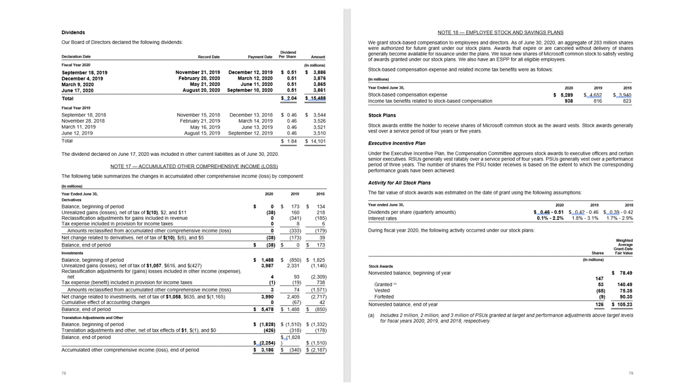

# Azure Form Recognizer layout model

::: moniker range="form-recog-3.0.0"
[!INCLUDE [applies to v3.0](includes/applies-to-v3-0.md)]
::: moniker-end

::: moniker range="form-recog-2.1.0"
[!INCLUDE [applies to v2.1](includes/applies-to-v2-1.md)]
::: moniker-end

Form Recognizer layout model is an advanced machine-learning based document analysis API available in the Form Recognizer cloud. It enables you to take documents in various formats and return structured data representations of the documents. It combines an enhanced version of our powerful [Optical Character Recognition (OCR)](../../cognitive-services/computer-vision/overview-ocr.md) capabilities with deep learning models to extract text, tables, selection marks, and document structure.

## Document layout analysis

Document structure layout analysis is the process of analyzing a document to extract regions of interest and their inter-relationships. The goal is to extract text and structural elements from the page to build better semantic understanding models. There are two types of roles that text plays in a document layout:

* **Geometric roles**: Text, tables, and selection marks are examples of geometric roles.
* **Logical roles**: Titles, headings, and footers are examples of logical roles.

The following illustration shows the typical components in an image of a sample page.

:::image type="content" source="media/document-layout-example.png" alt-text="Illustration of document layout example.":::

::: moniker range="form-recog-3.0.0"

***Sample form processed with [Form Recognizer Studio](https://formrecognizer.appliedai.azure.com/studio/layout)***

:::image type="content" source="media/studio/form-recognizer-studio-layout-newspaper.png" alt-text="Screenshot of sample newspaper page processed using Form Recognizer Studio.":::

## Development options

Form Recognizer v3.0 supports the following tools:

| Feature | Resources | Model ID |
|----------|------------|------------|
|**Layout model**| <ul><li>[**Form Recognizer Studio**](https://formrecognizer.appliedai.azure.com)</li><li>[**REST API**](https://westus.dev.cognitive.microsoft.com/docs/services/form-recognizer-api-2022-08-31/operations/AnalyzeDocument)</li><li>[**C# SDK**](quickstarts/get-started-sdks-rest-api.md?view=form-recog-3.0.0&preserve-view=true)</li><li>[**Python SDK**](quickstarts/get-started-sdks-rest-api.md?view=form-recog-3.0.0&preserve-view=true)</li><li>[**Java SDK**](quickstarts/get-started-sdks-rest-api.md?view=form-recog-3.0.0&preserve-view=true)</li><li>[**JavaScript SDK**](quickstarts/get-started-sdks-rest-api.md?view=form-recog-3.0.0&preserve-view=true)</li></ul>|**prebuilt-layout**|

::: moniker-end

::: moniker range="form-recog-2.1.0"

**Sample document processed with [Form Recognizer Sample Labeling tool layout model](https://fott-2-1.azurewebsites.net/layout-analyze)**:

:::image type="content" source="media/layout-tool-example.jpg" alt-text="Screenshot of a document processed with the layout model.":::

::: moniker-end

## Input requirements

::: moniker range="form-recog-3.0.0"

[!INCLUDE [input requirements](./includes/input-requirements.md)]

::: moniker-end

::: moniker range="form-recog-2.1.0"

* Supported file formats: JPEG, PNG, PDF, and TIFF
* For PDF and TIFF, up to 2000 pages are processed. For free tier subscribers, only the first two pages are processed.
* The file size must be less than 50 MB and dimensions at least 50 x 50 pixels and at most 10,000 x 10,000 pixels.

::: moniker-end

### Try layout extraction

See how data, including text, tables, table headers, selection marks, and structure information is extracted from documents using  Form Recognizer. You need the following resources:

* An Azure subscription—you can [create one for free](https://azure.microsoft.com/free/cognitive-services/)

* A [Form Recognizer instance](https://portal.azure.com/#create/Microsoft.CognitiveServicesFormRecognizer) in the Azure portal. You can use the free pricing tier (`F0`) to try the service. After your resource deploys, select **Go to resource** to get your key and endpoint.

 :::image type="content" source="media/containers/keys-and-endpoint.png" alt-text="Screenshot: keys and endpoint location in the Azure portal.":::

::: moniker range="form-recog-3.0.0"

## Form Recognizer Studio

> [!NOTE]
> Form Recognizer studio is available with the v3.0 API.

***Sample form processed with [Form Recognizer Studio](https://formrecognizer.appliedai.azure.com/studio/layout)***

:::image type="content" source="media/studio/form-recognizer-studio-layout-newspaper.png" alt-text="Screenshot: Layout processing a newspaper page in Form Recognizer Studio.":::

1. On the Form Recognizer Studio home page, select **Layout**

1. You can analyze the sample document or select the **+ Add** button to upload your own sample.

1. Select the **Analyze** button:

    :::image type="content" source="media/studio/layout-analyze.png" alt-text="Screenshot: analyze layout menu.":::

   > [!div class="nextstepaction"]
   > [Try Form Recognizer Studio](https://formrecognizer.appliedai.azure.com/studio/layout)

::: moniker-end

::: moniker range="form-recog-2.1.0"

## Form Recognizer Sample Labeling tool

1. Navigate to the [Form Recognizer sample tool](https://fott-2-1.azurewebsites.net/).

1. On the sample tool home page, select **Use Layout to get text, tables and selection marks**.

     :::image type="content" source="media/label-tool/layout-1.jpg" alt-text="Screenshot of connection settings for the Form Recognizer layout process.":::

1. In the **Form recognizer service endpoint** field, paste the endpoint that you obtained with your Form Recognizer subscription.

1. In the **key** field, paste  the key you obtained from your Form Recognizer resource.

1. In the **Source** field, select **URL** from the dropdown menu You can use our sample document:

    * [**Sample document**](https://raw.githubusercontent.com/Azure-Samples/cognitive-services-REST-api-samples/master/curl/form-recognizer/layout-page-001.jpg)

    * Select the **Fetch** button.

1. Select **Run Layout**. The Form Recognizer Sample Labeling tool calls the Analyze Layout API and analyze the document.

    :::image type="content" source="media/fott-layout.png" alt-text="Screenshot: Layout dropdown window.":::

1. View the results - see the highlighted text extracted, selection marks detected and tables detected.

    :::image type="content" source="media/label-tool/layout-3.jpg" alt-text="Screenshot of connection settings for the Form Recognizer Sample Labeling tool.":::

::: moniker-end

## Supported document types

| **Model**   | **Images**   | **PDF**  | **TIFF** |
| --- | --- | --- | --- |
| Layout  | ✓  | ✓  | ✓  |

## Supported languages and locales

*See* [Language Support](language-support.md) for a complete list of supported handwritten and printed languages.

::: moniker range="form-recog-3.0.0"

### Data extraction

**Starting with v3.0 GA**, it extracts paragraphs and more structure information like titles, section headings, page header, page footer, page number, and footnote from the document page. These structural elements are examples of logical roles described in the previous section. This capability is supported for PDF documents and images (JPG, PNG, BMP, TIFF).

| **Model**   | **Text**   | **Selection Marks**   | **Tables**  | **Paragraphs** | **Logical roles** |
| --- | --- | --- | --- | --- | --- |
| Layout  | ✓  | ✓  | ✓  | ✓  | ✓  |

**Supported logical roles for paragraphs**:
The paragraph roles are best used with unstructured documents.  Paragraph roles help analyze the structure of the extracted content for better semantic search and analysis.

* title
* sectionHeading
* footnote
* pageHeader
* pageFooter
* pageNumber

::: moniker-end

::: moniker range="form-recog-2.1.0"

### Data extraction support

| **Model**   | **Text** | **Tables**  | Selection marks|
| --- | --- | --- | --- |
| Layout  | ✓  | ✓| ✓ |

Form Recognizer v2.1 supports the following tools:

| Feature | Resources |
|----------|-------------------------|
|**Layout API**| <ul><li>[**Form Recognizer labeling tool**](https://fott-2-1.azurewebsites.net/layout-analyze)</li><li>[**REST API**](./how-to-guides/use-sdk-rest-api.md?pivots=programming-language-rest-api&preserve-view=true&tabs=windows&view=form-recog-2.1.0#analyze-layout)</li><li>[**Client-library SDK**](/azure/applied-ai-services/form-recognizer/how-to-guides/v2-1-sdk-rest-api)</li><li>[**Form Recognizer Docker container**](containers/form-recognizer-container-install-run.md?branch=main&tabs=layout#run-the-container-with-the-docker-compose-up-command)</li></ul>|

::: moniker-end

::: moniker range="form-recog-3.0.0"

## Model extraction

The layout model extracts text, selection marks, tables, paragraphs, and paragraph types (`roles`) from your documents.

### Paragraph extraction

The Layout model extracts all identified blocks of text in the `paragraphs` collection as a top level object under `analyzeResults`. Each entry in this collection represents a text block and includes the extracted text as`content`and the bounding `polygon` coordinates. The `span` information points to the text fragment within the top level `content` property that contains the full text from the document.

```json
"paragraphs": [
    {
        "spans": [],
        "boundingRegions": [],
        "content": "While healthcare is still in the early stages of its Al journey, we are seeing pharmaceutical and other life sciences organizations making major investments in Al and related technologies.\" TOM LAWRY | National Director for Al, Health and Life Sciences | Microsoft"
    }
]
```

### Paragraph roles

The new machine-learning based page object detection extracts logical roles like titles, section headings, page headers, page footers, and more. The Form Recognizer Layout model assigns certain text blocks in the `paragraphs` collection with their specialized role or type predicted by the model. They're best used with unstructured documents to help understand the layout of the extracted content for a richer semantic analysis. The following paragraph roles are supported:

| **Predicted role**   | **Description**   |
| --- | --- |
| `title`  | The main heading(s) in the page |
| `sectionHeading`  | One or more subheading(s) on the page  |
| `footnote`  | Text near the bottom of the page  |
| `pageHeader`  | Text near the top edge of the page  |
| `pageFooter`  | Text near the bottom edge of the page  |
| `pageNumber`  | Page number  |

```json
{
    "paragraphs": [
                {
                    "spans": [],
                    "boundingRegions": [],
                    "role": "title",
                    "content": "NEWS TODAY"
                },
                {
                    "spans": [],
                    "boundingRegions": [],
                    "role": "sectionHeading",
                    "content": "Mirjam Nilsson"
                }
    ]
}

```

### Pages extraction

The pages collection is the first object you see in the service response.

```json
"pages": [
    {
        "pageNumber": 1,
        "angle": 0,
        "width": 915,
        "height": 1190,
        "unit": "pixel",
        "words": [],
        "lines": [],
        "spans": [],
        "kind": "document"
    }
]
```

### Text lines and words extraction

The document layout model in Form Recognizer extracts print and handwritten style text as `lines` and `words`. The model outputs bounding `polygon` coordinates and `confidence` for the extracted words. The `styles` collection includes any handwritten style for lines if detected along with the spans pointing to the associated text. This feature applies to [supported handwritten languages](language-support.md).

```json
"words": [
    {
        "content": "While",
        "polygon": [],
        "confidence": 0.997,
        "span": {}
    },
],
"lines": [
    {
        "content": "While healthcare is still in the early stages of its Al journey, we",
        "polygon": [],
        "spans": [],
    }
]
```

### Selection marks extraction

The Layout model also extracts selection marks from documents. Extracted selection marks appear within the `pages` collection for each page. They include the bounding `polygon`, `confidence`, and selection `state` (`selected/unselected`). Any associated text if extracted is also included as the starting index (`offset`) and `length` that references the top level `content` property that contains the full text from the document.

```json
{
    "selectionMarks": [
        {
            "state": "unselected",
            "polygon": [],
            "confidence": 0.995,
            "span": {
                "offset": 1421,
                "length": 12
            }
        }
    ]
}
```

### Extract tables from documents and images

Extracting tables is a key requirement for processing documents containing large volumes of data typically formatted as tables. The Layout model extracts tables in the `pageResults` section of the JSON output. Extracted table information includes the number of columns and rows, row span, and column span. Each cell with its bounding polygon is output along with information whether it's recognized as a `columnHeader` or not. The model supports extracting tables that are rotated. Each table cell contains the row and column index and bounding polygon coordinates. For the cell text, the model outputs the `span` information containing the starting index (`offset`). The model also outputs the `length` within the top-level content that contains the full text from the document.

```json
{
    "tables": [
        {
            "rowCount": 9,
            "columnCount": 4,
            "cells": [
                {
                    "kind": "columnHeader",
                    "rowIndex": 0,
                    "columnIndex": 0,
                    "columnSpan": 4,
                    "content": "(In millions, except earnings per share)",
                    "boundingRegions": [],
                    "spans": []
                    },
            ]
        }
    ]
}

```

### Handwritten style for text lines (Latin languages only)

The response includes classifying whether each text line is of handwriting style or not, along with a confidence score. This feature is only supported for Latin languages. The following example shows an example JSON snippet.

```json
"styles": [
{
    "confidence": 0.95,
    "spans": [
    {
        "offset": 509,
        "length": 24
    }
    "isHandwritten": true
    ]
}
```

### Annotations extraction

The Layout model extracts annotations in documents, such as checks and crosses. The response includes the kind of annotation, along with a confidence score and bounding polygon.

```json
    {
  "pages": [
    {
      "annotations": [
        {
          "kind": "cross",
          "polygon": [...],
          "confidence": 1
        }
      ]
    }
  ]
}
```

### Barcode extraction

The Layout model extracts all identified barcodes in the `barcodes` collection as a top level object under `content`. Inside the `content`, detected barcodes are represented as `:barcode:`. Each entry in this collection represents a barcode and includes the barcode type as `kind` and the embedded barcode content as `value` along with its `polygon` coordinates. Initially, barcodes appear at the end of each page.

#### Supported barcode types

| **Barcode Type**   | **Example**   |
| --- | --- |
| QR Code |:::image type="content" source="media/barcodes/qr-code.png" alt-text="Screenshot of the QR Code.":::|
| Code 39 |:::image type="content" source="media/barcodes/code-39.png" alt-text="Screenshot of the Code 39.":::|
| Code 128 |:::image type="content" source="media/barcodes/code-128.png" alt-text="Screenshot of the Code 128.":::|
| UPC (UPC-A & UPC-E) |:::image type="content" source="media/barcodes/upc.png" alt-text="Screenshot of the UPC.":::|
| PDF417 |:::image type="content" source="media/barcodes/pdf-417.png" alt-text="Screenshot of the PDF417.":::|

   > [!NOTE]
   > The `confidence` score is hard-coded for the `2023-02-28` public preview.

   ```json
   "content": ":barcode:",
     "pages": [
       {
         "pageNumber": 1,
         "barcodes": [
           {
             "kind": "QRCode",
             "value": "http://test.com/",
             "span": { ... },
             "polygon": [...],
             "confidence": 1
           }
         ]
       }
     ]
   ```

### Extract selected pages from documents

For large multi-page documents, use the `pages` query parameter to indicate specific page numbers or page ranges for text extraction.

::: moniker-end

::: moniker range="form-recog-2.1.0"

### Natural reading order output (Latin only)

You can specify the order in which the text lines are output with the `readingOrder` query parameter. Use `natural` for a more human-friendly reading order output as shown in the following example. This feature is only supported for Latin languages.

:::image type="content" source="media/layout-reading-order-example.png" alt-text="Screenshot of layout model reading order processing." lightbox="../../cognitive-services/Computer-vision/Images/ocr-reading-order-example.png":::

### Select page numbers or ranges for text extraction

For large multi-page documents, use the `pages` query parameter to indicate specific page numbers or page ranges for text extraction. The following example shows a document with 10 pages, with text extracted for both cases - all pages (1-10) and selected pages (3-6).

:::image type="content" source="./media/layout-select-pages.png" alt-text="Screen shot of the layout model selected pages output.":::

## The Get Analyze Layout Result operation

The second step is to call the [Get Analyze Layout Result](https://westcentralus.dev.cognitive.microsoft.com/docs/services/form-recognizer-api-v2-1/operations/GetAnalyzeLayoutResult) operation. This operation takes as input the Result ID the Analyze Layout operation created. It returns a JSON response that contains a **status** field with the following possible values.

|Field| Type | Possible values |
|:-----|:----:|:----|
|status | string | `notStarted`: The analysis operation hasn't started.<br /><br />`running`: The analysis operation is in progress.<br /><br />`failed`: The analysis operation has failed.<br /><br />`succeeded`: The analysis operation has succeeded.|

Call this operation iteratively until it returns the `succeeded` value. Use an interval of 3 to 5 seconds to avoid exceeding the requests per second (RPS) rate.

When the **status** field has the `succeeded` value, the JSON response includes the extracted layout, text, tables, and selection marks. The extracted data includes extracted text lines and words, bounding boxes, text appearance with handwritten indication, tables, and selection marks with selected/unselected indicated.

### Handwritten classification for text lines (Latin only)

The response includes classifying whether each text line is of handwriting style or not, along with a confidence score. This feature is only supported for Latin languages. The following example shows the handwritten classification for the text in the image.

:::image type="content" source="./media/layout-handwriting-classification.png" alt-text="Screenshot of layout model handwriting classification process.":::

### Sample JSON output

The response to the *Get Analyze Layout Result* operation is a structured representation of the document with all the information extracted.
See here for a [sample document file](https://github.com/Azure-Samples/cognitive-services-REST-api-samples/tree/master/curl/form-recognizer/sample-layout.pdf) and its structured output [sample layout output](https://github.com/Azure-Samples/cognitive-services-REST-api-samples/tree/master/curl/form-recognizer/sample-layout-output.json).

The JSON output has two parts:

* `readResults` node contains all of the recognized text and selection mark. The text presentation hierarchy is page, then line, then individual words.
* `pageResults` node contains the tables and cells extracted with their bounding boxes, confidence, and a reference to the lines and words in "readResults".

## Example Output

### Text

Layout API extracts text from documents and images with multiple text angles and colors. It accepts photos of documents, faxes, printed and/or handwritten (English only) text, and mixed modes. Text is extracted with information provided on lines, words, bounding boxes, confidence scores, and style (handwritten or other). All the text information is included in the `readResults` section of the JSON output.

### Tables with headers

Layout API extracts tables in the `pageResults` section of the JSON output. Documents can be scanned, photographed, or digitized. Tables can be complex with merged cells or columns, with or without borders, and with odd angles. Extracted table information includes the number of columns and rows, row span, and column span. Each cell with its bounding box is output along with information whether it's recognized as part of a header or not. The model predicted header cells can span multiple rows and aren't necessarily the first rows in a table. They also work with rotated tables. Each table cell also includes the full text with references to the individual words in the `readResults` section.



### Selection marks

Layout API also extracts selection marks from documents. Extracted selection marks include the bounding box, confidence, and state (selected/unselected). Selection mark information is extracted in the `readResults` section of the JSON output.

### Migration guide

* Follow our [**Form Recognizer v3.0 migration guide**](v3-migration-guide.md) to learn how to use the v3.0 version in your applications and workflows.
::: moniker-end

## Next steps

::: moniker range="form-recog-3.0.0"

* [Learn how to process your own forms and documents](quickstarts/try-v3-form-recognizer-studio.md) with the [Form Recognizer Studio](https://formrecognizer.appliedai.azure.com/studio)

* Complete a [Form Recognizer quickstart](quickstarts/get-started-sdks-rest-api.md?view=form-recog-3.0.0&preserve-view=true) and get started creating a document processing app in the development language of your choice.

::: moniker-end

::: moniker range="form-recog-2.1.0"

* [Learn how to process your own forms and documents](quickstarts/try-sample-label-tool.md) with the [Form Recognizer Sample Labeling tool](https://fott-2-1.azurewebsites.net/)

* Complete a [Form Recognizer quickstart](quickstarts/get-started-sdks-rest-api.md?view=form-recog-2.1.0&preserve-view=true) and get started creating a document processing app in the development language of your choice.

::: moniker-end
