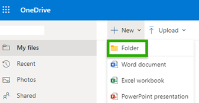

# Form Recognizer with Logic Apps Tutorial

## Introduction to Logic Apps

Azure logic apps are a tool that can be used to automate workflows without writing a single line of code. Azure logic apps are easily integrated with Microsoft applications along with third party applications. The following are the benefits of the Azure Logic Apps system:

* The ability to create business process and workflows visually.
* The ability to integrate workfolows with SaaS and enterprise applications. 
* The ability to automate EAI, B2B/EDI and buisness processes.

Please refer to [Logic Apps](https://docs.microsoft.com/en-us/azure/logic-apps/) for more info.

## Tutorial 

In this tutorial you will learn to make a Logic app connector flow that detects when an invoice is added to a folder in a one drive, processes the invoice, and sends information contained in the invoice to a pre-specified email.

### Prerequisites 

To complete this quick start, you are going to need:

* An Azure subcription - Create one for free here: [Create an Azure subscription](https://azure.microsoft.com/en-us/free/cognitive-services/)
* A one drive account - Create one for free here: [Create a One drive account](https://onedrive.live.com/signup)
* An Outlook online email account - Create one for free here: [Create an outlook online email account](https://signup.live.com/signup.aspx?lic=1&mkt=en-ca)
* a sample invoice to test your azure logic app - Download a sample [here](need to link invoice here)

### Setting up One-Drive 

Before we jump into creating the Logic app, we to have to set up a One drive folder. 

1. Got your one drive home page - [One drive home page](https://onedrive.live.com/)

2. Select "+New" in the upper left corner and select Folder.

  
  
3. Enter a name for your new folder and select create.

  
 
4.You should see the new folder in your files. For now we are done with OneDrive. Open a new tab youwill need to access this folder later. 

### Create a Form Recognizer resource 

Now we are going to create a Form recognizer resource in the Azure portal. If you already have a Form recognizer resource, you can skip this section.

1. Navigate to the Azure portal home page - [Azure home page](https://ms.portal.azure.com/#home)

2. First select create a resource from the Azure home page. 

  
   
3. You should see a screen like the one below, search Form Recognizer in the search bar. 

  
  
4. Select the Form Recognizer tile. 

  
  
5. Select the Create button. 

  

6. Now you are going to fill out the "Create Form Recognizer" fields with the following values:

* For the subscription box select your current subscription.
* For the resource group select the resource group that you created earlier from the drop down. 
* For region, select your local region.
* For Name you can enter any name that is descriptive such as "FR-Resource".
* For pricing tier you can select the free tier for this tutorial. 

7. Once you are done you should see something similar to the screenshot below. (Note: your Subscription, resource group , region and name may be different.) 

8. After you are done with this select "review + create"

9. Azure will run a quick validation check, after a few seconds you should see a green banner that says validation passed. After you see this banner select create in the bottom left. 

10.	After you click create you should be redirected to a new page that says “Deployment in proggress. After a few seconds you should see a message that says “Your deployment is complete”. Once you receive this message click the “go to resource” button.

11.	You should see a screen like the one below. Open your favorite notes app and Copy “KEY 1” and the endpoint URL into the notes app be sure to label which is which. You will need this information later. If your overview page does not have the keys and endpoint, you can click the keys and endpoint button on the left navigation bar and get them from there. 

12.	Now you have your form recognizer resource we will make logic app resource. 

### Creating a logic app resource

Now that you have the Form Recognizer resource set up it is time to create an Azure logic app resource. 

1. First select create a resoruce from the Azure home page

2. Search logic app in the search bar and select the logic app tile. 

3. Select the create button

4. On the basics page do the following:
*	Select the same resource group you used earlier in the tutorial  
*	For “Type” select consumption.
*	Enter a name for your logic app.
*	for publish select workflow and *	for region choose your local region 

5. When you are done you should have something similar to the image below (note resource group logic app name and region may be different. ) After checking these values select review and create in the bottom left. 

6.	A short validation should run after it completes select create in the bottom left

7.	You will be redirected to a screen that says “Deployment in progress” give azure some time to deploy this can take a couple minutes. After the deployment is complete you should see a banner that says, “Your deployment is complete”. When you reach, this select go to resource. 

8. You should be redirected to the logic apps designer. If you would like you can watch the short video for a quick introduction to logic apps when you are ready select the blank logic app button.

9. Now you should see a screen that looks like the one below. If the side bar is not open click the chevron to expand it.  Now you are ready to start designing and Implementing your logic app. 

### Creating automation flow

Now that you have the logic app connector resource set up and configured the only things left to do is to create the automation flow and test it out!

1. Search "OneDrive" in search b ar and select the "when a file is created" trigger.

2.	You should see a One drive node pop up onto the logic app designer and a pop up will ask you to log into your one drive account. Click the link and a pop up should appear follow the prompts to connect your account. 

3.After this a window should open in the same pane. In this section select the folder you created earlier in your one drive leave the other values to their defaults. Your window should look similar to the one below. (Note you folder name may vary from the example show.) 

4.	Now we are going to add another step click the plus button underneath the newly created one drive node.  A button will show that says add an action select this. 

5.	A new node should have been added to the logic app desiner view. Search Form recognizer in the search bar and select analzye invoice from the list . 

6. Now you should see a window that says, “Create connection”. What we are going to do here is connect your Form Recognizer resource to the Logic Apps Designer Studio. First Choose a connection name. It should be something easily recognizable. Then for “Endpoint URL” and “Account Key” use the endpoint and key you copied into your note pad from earlier. If you skipped this step earlier or lost the codes, you can navigate back to your Form Recognizer resource and re-copy them.  Your screen should look something like the screenshot below. Click create. 

7. Now you should see the parameters tab for the analyze invoice connector. Select the “Document/Image File field a dynamic content pop-up should appear if it does not select the add dynamic content button below the field. select file content form the pop up. This is essentially sending the file(s) that were created to be analyzed by form recognize invoice prebuilt. Once you see “the file content badge show up in the Document /Image file content “ you have don’t this correctly. 

8. Now we need to add the last step. Once again click the + button and add another action.

9. In the search bar search ”Outlook.com in the actions bar scroll down until you see “send an email” select this action.

10.	Just like with one drive you will be asked to sign into your outlook.com account after you sign in you should see a window like the one below. In this window we are going to format the email to be sent with the dynamic content we have gotten from the analysis form recognizer does on the invoices taken from one drive. 

11.	We are almost done! Make the following changes to the following fields:

* For the “To” field put your personal email address or any other email address you have access to.
* For the subject line: Enter “Invoice Recived from: “ and then append dynamic content “vendor name field vendor name”. Note: when you do this the logic app designer will automatically add a for each loop around the send email action this is normal. This is due to output format which may return more than one invoice from pdf in the future. The Current version only returns a single invoice per pdf.
* Reselect the send email action. For the body field we are going to add some other infromation about the invoice.
* Type “Invoice ID:” and append the dynamic content “Invoice ID field Invoice ID” .
* On a new line type “Invoice Due date:” and append “Invoice date field invoice date (date)”.
* Type “Amount due:” and append “amount due field amount due (number)”.
* Lastly, because the amount due is an important number we also want to send the confidence score for this extraction in the email to do this add the dynamic content “Amount due field confidence of amount due”. When you are done the window should look similar to this.(note your email should be different.) 

12. The logic app desinger view should look something like this. Congratulations you are done!. Click save in the upper left corner

### Testing automation flow

Let's quickly review what we have done before we test our flow. 

1.	We created a trigger – In this case scenario trigger is when a file is created in a pre-specified folder in our One Drive. 
2.	We added a Form Recognizer action to our flow – In this scenario we decided to use the invoice API to automatically analyze the invoices from the One Drive folder
3.	We added a Outlook.com action to our flow – for this scenario we sent some of the analyzed invoice data to a pre-determined email address. 

Now that we have created the flow the last thing to do is to test it and make sure we are getting the expected behavior. 

1. Now to test the logic app first open a new tab and navigate to the one drive folder you set up at the beginning of this tutorial. Now add this file to the one drive folder [Sample invoice.]()

2. Return to the logic app designer tab and click the run trigger button in the menu bar. 

3. You should see a sample run of your logic app run if all the steps have green check marks it means the run was successful. 

4.	Check your email and you should see a new email with the information we pre-specified. Congratulations! You have officially completed the tutorial.

