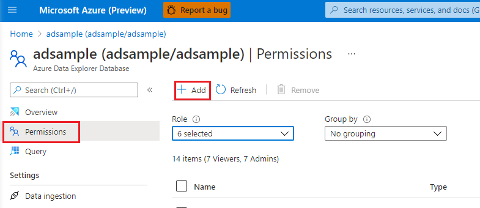
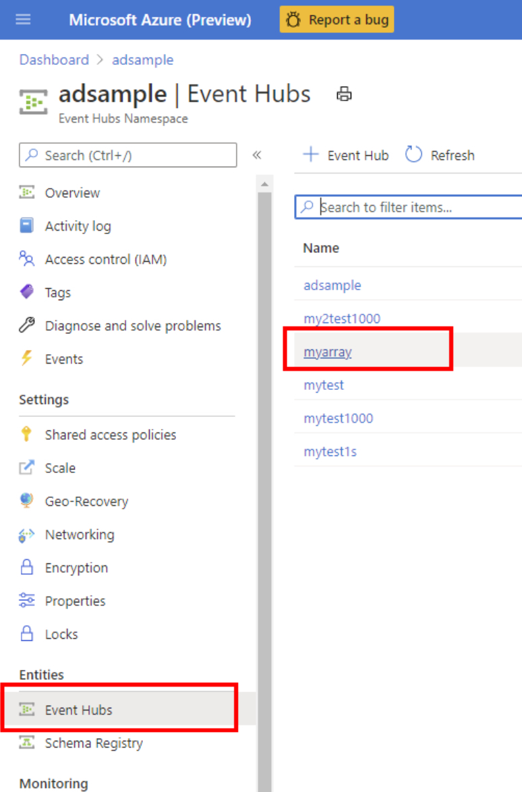
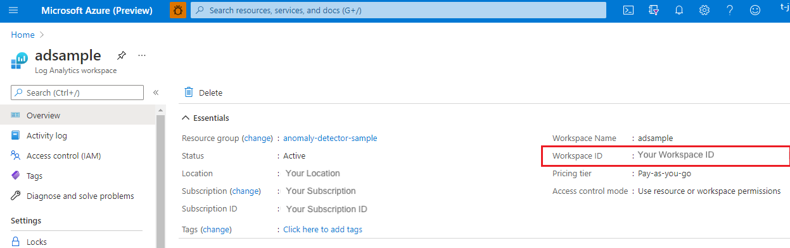
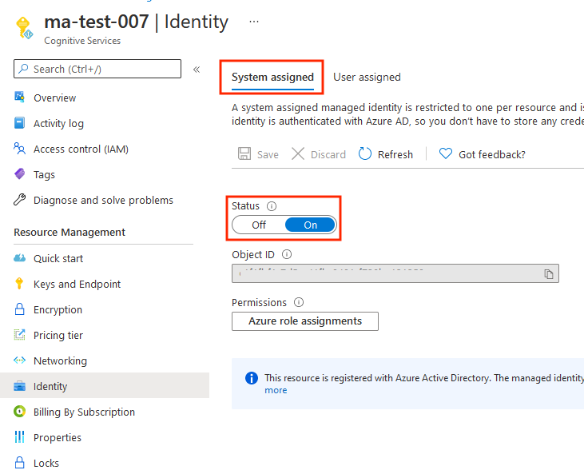
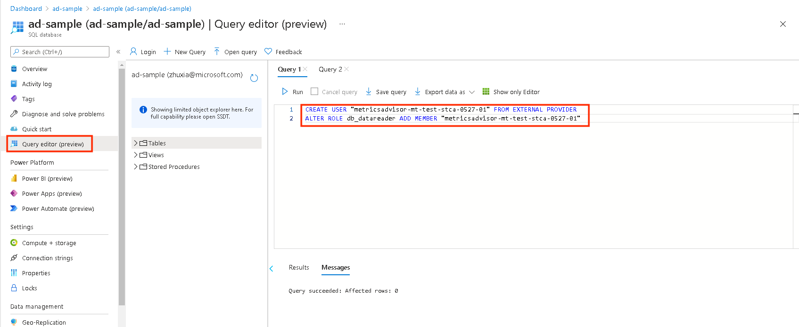

# How-to: Connect different data sources

Use this article to find the settings and requirements for connecting different types of data sources to Metrics Advisor. Make sure to read how to [Onboard your data](how-tos/onboard-your-data.md) to learn about the key concepts for using your data with Metrics Advisor. 

## Supported authentication types

| Authentication types | Description |
| ---------------------|-------------|
|**Basic** | You need to provide basic parameters for accessing data sources. For example, a connection string or a password. Data feed admins can view these credentials. |
| **Azure Managed Identity** | [Managed identities](../../active-directory/managed-identities-azure-resources/overview.md) for Azure resources is a feature of Azure Active Directory. It provides Azure services with an automatically managed identity in Azure AD. You can use the identity to authenticate to any service that supports Azure AD authentication.|
| **Azure SQL Connection String**| Store your AzureSQL connection string as a **credential entity** in Metrics Advisor, and use it directly each time when onboarding metrics data. Only admins of the credential entity can view these credentials, but enables authorized viewers to create data feeds without needing to know details for the credentials. |
| **Data Lake Gen2 Shared Key**| Store your data lake account key as a **credential entity** in Metrics Advisor and use it directly each time when onboarding metrics data. Only admins of the Credential entity can view these credentials, but enables authorized viewers to create data feed without needing to know the credential details.|
| **Service principal**| Store your [Service Principal](../../active-directory/develop/app-objects-and-service-principals.md) as a **credential entity** in Metrics Advisor and use it directly each time when onboarding metrics data. Only admins of Credential entity can view the credentials, but enables authorized viewers to create data feed without needing to know the credential details.|
| **Service principal from key vault**|Store your [Service Principal in a Key Vault](/azure-stack/user/azure-stack-key-vault-store-credentials) as a **credential entity** in Metrics Advisor and use it directly each time when onboarding metrics data. Only admins of a **credential entity** can view the credentials, but also leave viewers able to create data feed without needing to know detailed credentials. |


## Data sources supported and corresponding authentication types

| Data sources | Authentication Types |
|-------------| ---------------------|
|[**Azure Application Insights**](#appinsights) | Basic |
|[**Azure Blob Storage (JSON)**](#blob) | Basic<br>ManagedIdentity |
|[**Azure Cosmos DB (SQL)**](#cosmosdb) | Basic |
|[**Azure Data Explorer (Kusto)**](#kusto) | Basic<br>Managed Identity<br>Service principal<br>Service principal from key vault |
|[**Azure Data Lake Storage Gen2**](#adl) | Basic<br>Data Lake Gen2 Shared Key<br>Service principal<br>Service principal from key vault |
|[**Azure Event Hubs**](#eventhubs) | Basic |
|[**Azure Log Analytics**](#log) | Basic<br>Service principal<br>Service principal from key vault |
|[**Azure SQL Database / SQL Server**](#sql) | Basic<br>Managed Identity<br>Service principal<br>Service principal from key vault<br>Azure SQL Connection String |
|[**Azure Table Storage**](#table) | Basic | 
|[**InfluxDB (InfluxQL)**](#influxdb) | Basic |
|[**MongoDB**](#mongodb) | Basic |
|[**MySQL**](#mysql) | Basic |
|[**PostgreSQL**](#pgsql) | Basic|
|[**Local files(CSV)**](#csv) | Basic|

The following sections specify the parameters required for all authentication types within different data source scenarios. 

## <span id="appinsights">Azure Application Insights</span>

* **Application ID**: This is used to identify this application when using the Application Insights API. To get the Application ID, take the following steps:

   1. From your Application Insights resource, click API Access.
   
      

   2. Copy the Application ID generated into **Application ID** field in Metrics Advisor. 

* **API Key**: API keys are used by applications outside the browser to access this resource. To get the API key, take the following steps:

   1. From the Application Insights resource, click **API Access**.

   2. Click **Create API Key**.

   3. Enter a short description, check the **Read telemetry** option, and click the **Generate key** button.

      

       > [!WARNING]
       > Copy this **API key** and save it because this key will never be shown to you again. If you lose this key, you have to create a new one.

   4. Copy the API key to the **API key** field in Metrics Advisor.

* **Query**: Azure Application Insights logs are built on Azure Data Explorer, and Azure Monitor log queries use a version of the same Kusto query language. The [Kusto query language documentation](/azure/data-explorer/kusto/query) has all of the details for the language and should be your primary resource for writing a query against Application Insights. 

    Sample query:

    ``` Kusto
    [TableName] | where [TimestampColumn] >= datetime(@IntervalStart) and [TimestampColumn] < datetime(@IntervalEnd);
    ```
    You can also refer to the [Tutorial: Write a valid query](tutorials/write-a-valid-query.md) for more specific examples.
  
## <span id="blob">Azure Blob Storage (JSON)</span>

* **Connection String**: There are two authentication types for Azure Blob Storage(JSON), one is **Basic**, the other is **Managed Identity**.

    * **Basic**: See [Configure Azure Storage connection strings](../../storage/common/storage-configure-connection-string.md#configure-a-connection-string-for-an-azure-storage-account) for information on retrieving this string. Also, you can visit the Azure portal for your Azure Blob Storage resource, and find connection string directly in the **Settings > Access keys** section.
    
    * **Managed Identity**: Managed identities for Azure resources can authorize access to blob and queue data using Azure AD credentials from applications running in Azure virtual machines (VMs), function apps, virtual machine scale sets, and other services. 
    
        You can create a managed identity in Azure portal for your Azure Blob Storage resource, and choose **role assignments** in **Access Control(IAM)** section, then click **add** to create. A suggested role type is: Storage Blob Data Reader. For more details, refer to [Use managed identity to access Azure Storage](../../active-directory/managed-identities-azure-resources/tutorial-vm-windows-access-storage.md#grant-access-1).
    
        
    

* **Container**: Metrics Advisor expects time series data stored as Blob files (one Blob per timestamp) under a single container. This is the container name field.

* **Blob Template**: Metrics Advisor uses path to find the json file in your Blob storage. This is an example of a Blob file template, which is used to find the json file in your Blob storage: `%Y/%m/FileName_%Y-%m-%d-%h-%M.json`. "%Y/%m" is the path, if you have "%d" in your path, you can add after "%m". If your JSON file is named by date, you could also use `%Y-%m-%d-%h-%M.json`.

   The following parameters are supported:
   
   * `%Y` is the year formatted as `yyyy`
   * `%m` is the month formatted as `MM`
   * `%d` is the day formatted as `dd`
   * `%h` is the hour formatted as `HH`
   * `%M` is the minute formatted as `mm`
  
   For example, in the following dataset, the blob template should be "%Y/%m/%d/00/JsonFormatV2.json".
  
   
  

* **JSON format version**: Defines the data schema in the JSON files. Currently Metrics Advisor supports two versions, you can choose one to fill in the field:
  
   * **v1** (Default value)

      Only the metrics *Name* and *Value* are accepted. For example:
    
      ``` JSON
      {"count":11, "revenue":1.23}
      ```

   * **v2**

      The metrics *Dimensions* and *timestamp* are also accepted. For example:
      
      ``` JSON
      [
        {"date": "2018-01-01T00:00:00Z", "market":"en-us", "count":11, "revenue":1.23},
        {"date": "2018-01-01T00:00:00Z", "market":"zh-cn", "count":22, "revenue":4.56}
      ]
      ```

   Only one timestamp is allowed per JSON file. 

## <span id="cosmosdb">Azure Cosmos DB (SQL)</span>

* **Connection String**: The connection string to access your Azure Cosmos DB. This can be found in the Cosmos DB resource in Azure portal, in **Keys**. Also, you can find more information in [Secure access to data in Azure Cosmos DB](../../cosmos-db/secure-access-to-data.md).
* **Database**: The database to query against. This can be found in the **Browse** page under **Containers** section in the Azure portal.
* **Collection ID**: The collection ID to query against. This can be found in the **Browse** page under **Containers** section in the Azure portal.
* **SQL Query**: A SQL query to get and formulate data into multi-dimensional time series data. You can use the `@IntervalStart` and `@IntervalEnd` variables in your query. They should be formatted: `yyyy-MM-ddTHH:mm:ssZ`.

    Sample query:
    
    ```SQL
    SELECT [TimestampColumn], [DimensionColumn], [MetricColumn] FROM [TableName] WHERE [TimestampColumn] >= @IntervalStart and [TimestampColumn] < @IntervalEnd    
    ```

    For more information, refer to the [tutorial on writing a valid query](tutorials/write-a-valid-query.md) for more specific examples.

## <span id="kusto">Azure Data Explorer (Kusto)</span>

* **Connection String**: There are four authentication types for Azure Data Explorer (Kusto), they are **Basic**, **Service Principal**, **Service Principal From KeyVault**, and **Managed Identity**. The data source in connection string should be in URI format(starts with 'https'), you can find the URI in Azure portal.
    
    * **Basic**: Metrics Advisor supports accessing Azure Data Explorer(Kusto) by using Azure AD application authentication. You need to create and register an Azure AD application and then authorize it to access an Azure Data Explorer database, see detail in [Create an AAD app registration in Azure Data Explorer](/azure/data-explorer/provision-azure-ad-app) documentation.
        Here's an example of connection string:
        
        ```
        Data Source=<URI Server>;Initial Catalog=<Database>;AAD Federated Security=True;Application Client ID=<Application Client ID>;Application Key=<Application Key>;Authority ID=<Tenant ID>
        ```

    * **Service Principal**: A service principal is a concrete instance created from the application object and inherits certain properties from that application object. The service principal object defines what the app can actually do in the specific tenant, who can access the app, and what resources the app can access. There are 3 steps to use service principal in Metrics Advisor.
    
        **1. Create Azure AD application registration.** See first part in [Create an AAD app registration in Azure Data Explorer](/azure/data-explorer/provision-azure-ad-app).

        **2. Manage Azure Data Explorer database permissions.** See [Manage Azure Data Explorer database permissions](/azure/data-explorer/manage-database-permissions) to know about Service Principal and manage permissions. 

        **3. Create a credential entity in Metrics Advisor.** See how to [create a credential entity](how-tos/credential-entity.md) in Metrics Advisor, so that you can choose that entity when adding data feed for Service Principal authentication type. 
        
        Here's an example of connection string:
        
        ```
        Data Source=<URI Server>;Initial Catalog=<Database>
        ```

    * **Service Principal From Key Vault**: Key Vault helps to safeguard cryptographic keys and secret values that cloud apps and services use. By using Key Vault, you can encrypt keys and secret values. You should create a service principal first, and then store the service principal inside Key Vault.  You can go through [Create a credential entity for Service Principal from Key Vault](how-tos/credential-entity.md#sp-from-kv) to follow detailed procedure to set service principal from key vault. 
        Here's an example of connection string: 
        ```
        Data Source=<URI Server>;Initial Catalog=<Database>
        ```

    * **Managed Identity**: Managed identity for Azure resources can authorize access to blob and queue data using Azure AD credentials from applications running in Azure virtual machines (VMs), function apps, virtual machine scale sets, and other services. By using managed identity for Azure resources together with Azure AD authentication, you can avoid storing credentials with your applications that run in the cloud. Learn how to [authorize with a managed identity](../../storage/common/storage-auth-aad-msi.md#enable-managed-identities-on-a-vm). 
    
        You can create a managed identity in Azure portal for your Azure Data Explorer (Kusto), choose **Permissions** section, and click **add** to create. The suggested role type is: admin / viewer.
        
        

        Here's an example of connection string: 
        ```
        Data Source=<URI Server>;Initial Catalog=<Database>
        ```

        <!-- For more information, refer to the [tutorial on writing a valid query](tutorials/write-a-valid-query.md) for more specific examples. -->

* **Query**: See [Kusto Query Language](/azure/data-explorer/kusto/query) to get and formulate data into multi-dimensional time series data. You can use the `@IntervalStart` and `@IntervalEnd` variables in your query. They should be formatted: `yyyy-MM-ddTHH:mm:ssZ`.

    Sample query:
    
    ``` Kusto
   [TableName] | where [TimestampColumn] >= datetime(@IntervalStart) and [TimestampColumn] < datetime(@IntervalEnd);    
   ```

    For more information, refer to the [tutorial on writing a valid query](tutorials/write-a-valid-query.md) for more specific examples.

## <span id="adl">Azure Data Lake Storage Gen2</span>

* **Account Name**: There are four authentication types for Azure Data Lake Storage Gen2, they are **Basic**, **Azure Data Lake Storage Gen2 Shared Key**, **Service Principal**, and **Service Principal From KeyVault**.
    
    * **Basic**: The **Account Name** of your Azure Data Lake Storage Gen2. This can be found in your Azure Storage Account (Azure Data Lake Storage Gen2) resource in **Access keys**. 

    * **Azure Data Lake Storage Gen2 Shared Key**: First, you should specify the account key to access your Azure Data Lake Storage Gen2 （the same as Account Key in *Basic* authentication type）. This could be found in Azure Storage Account (Azure Data Lake Storage Gen2) resource in **Access keys** setting. Then you should [create a credential entity](how-tos/credential-entity.md) for *Azure Data Lake Storage Gen2 Shared Key* type and fill in the account key. 

        The account name is the same as *Basic* authentication type.
    
    * **Service Principal**: A service principal is a concrete instance created from the application object and inherits certain properties from that application object. A service principal is created in each tenant where the application is used and references the globally unique app object. The service principal object defines what the app can actually do in the specific tenant, who can access the app, and what resources the app can access.

        The account name is the same as **Basic** authentication type.
    
        **Step 1:** Create and register an Azure AD application and then authorize it to access database, see detail in [Create an AAD app registration](/azure/data-explorer/provision-azure-ad-app) documentation.

        **Step 2:** Assign roles.
        
        1. In the Azure portal, go to the **Storage accounts** service.
        
        2. Select the ADLS Gen2 account to use with this application registration.

        3. Click **Access Control (IAM)**.

        4. Click **+ Add** and select **Add role assignment** from the dropdown menu.

        5. Set the **Select** field to the Azure AD application name and set role to **Storage Blob Data Contributor**. Click **Save**.
        
        

        **Step 3:** [Create a credential entity](how-tos/credential-entity.md) in Metrics Advisor, so that you can choose that entity when adding data feed for Service Principal authentication type. 
        
    * **Service Principal From Key Vault** authentication type: Key Vault helps to safeguard cryptographic keys and secret values that cloud apps and services use. By using Key Vault, you can encrypt keys and secret values. You should create a service principal first, and then store the service principal inside Key Vault.  You can go through [Create a credential entity for Service Principal from Key Vault](how-tos/credential-entity.md#sp-from-kv) to follow detailed procedure to set service principal from key vault. The account name is the same as *Basic* authentication type.

* **Account Key** (only *Basic* needs): Specify the account key to access your Azure Data Lake Storage Gen2. This could be found in Azure Storage Account (Azure Data Lake Storage Gen2) resource in **Access keys** setting.

* **File System Name (Container)**: Metrics Advisor will expect your time series data stored as Blob files (one Blob per timestamp) under a single container. This is the container name field. This can be found in your Azure storage account (Azure Data Lake Storage Gen2)  instance, and click **'Containers'** in **'Data Lake Storage'** section, then you'll see the container name.

* **Directory Template**: This is the directory template of the Blob file. The following parameters are supported:

   * `%Y` is the year formatted as `yyyy`
   * `%m` is the month formatted as `MM`
   * `%d` is the day formatted as `dd`
   * `%h` is the hour formatted as `HH`
   * `%M` is the minute formatted as `mm`

   Query sample for a daily metric: `%Y/%m/%d`.

   Query sample for an hourly metric: `%Y/%m/%d/%h`.

* **File Template**:
   Metrics Advisor uses path to find the json file in your Blob storage. This is an example of a Blob file template, which is used to find the json file in your Blob storage: `%Y/%m/FileName_%Y-%m-%d-%h-%M.json`. `%Y/%m` is the path, if you have `%d` in your path, you can add after `%m`. 
   
   The following parameters are supported:
   
   * `%Y` is the year formatted as `yyyy`
   * `%m` is the month formatted as `MM`
   * `%d` is the day formatted as `dd`
   * `%h` is the hour formatted as `HH`
   * `%M` is the minute formatted as `mm`

   Currently Metrics Advisor supports the data schema in the JSON files as follows. For example:

   ``` JSON
   [
     {"date": "2018-01-01T00:00:00Z", "market":"en-us", "count":11, "revenue":1.23},
     {"date": "2018-01-01T00:00:00Z", "market":"zh-cn", "count":22, "revenue":4.56}
   ]
   ```

## <span id="eventhubs">Azure Event Hubs</span>

* **Limitations**: There are some limitations with Metrics Advisor Event Hub integration.

   * Metrics Advisor Event Hubs integration doesn't currently support more than 3 active data feeds in one Metrics Advisor instance in public preview.
   * Metrics Advisor will always start consuming messages from the latest offset, including when re-activating a paused data feed.
   
      * Messages during the data feed pause period will be lost.
      * The data feed ‘ingestion start time’ is set to the current UTC timestamp automatically when created and is for reference purposes only.
created, and for reference only.

   * Only one data feed can be used per consumer group . To reuse a consumer group from another deleted data feed, you need to wait at least 10 minutes after deletion.
data feed, it needs to wait at least 10 minutes after deletion.
   * The connection string and consumer group cannot be modified after the data feed is created.
   * About messages in Event Hubs: Only JSON is supported, and the JSON values cannot be a nested JSON object. The top-level element can be a JSON object or a JSON array.
    
    Valid messages as follows:

    ``` JSON
    Single JSON object 
    {
    "metric_1": 234, 
    "metric_2": 344, 
    "dimension_1": "name_1", 
    "dimension_2": "name_2"
    }
    ```
        
    ``` JSON
    JSON array 
    [
        {
            "timestamp": "2020-12-12T12:00:00", "temperature": 12.4,
            "location": "outdoor"
        },
        {
            "timestamp": "2020-12-12T12:00:00", "temperature": 24.8,
            "location": "indoor"
        }
    ]
    ```


* **Connection String**: Navigate to the **Event Hubs Instance** first. Then add a new policy or choose an existing Shared access policy. Copy the connection string in the pop-up panel.
    
    
    

    Here's an example of a connection string: 
    ```
    Endpoint=<Server>;SharedAccessKeyName=<SharedAccessKeyName>;SharedAccessKey=<SharedAccess Key>;EntityPath=<EntityPath>
    ```

* **Consumer Group**: A [consumer group](../../event-hubs/event-hubs-features.md#consumer-groups) is a view (state, position, or offset) of an entire event hub.
This can be found on the "Consumer Groups" menu of an Azure Event Hubs instance. A consumer group can only serve one data feed, otherwise, onboard and ingestion will fail. It is recommended that you create a new consumer group for each data feed.
* **Timestamp**(optional): Metrics Advisor uses the Event Hubs timestamp as the event timestamp if the user data source does not contain a timestamp field. The timestamp field is optional. If no timestamp column is chosen, we will use the enqueued time as the timestamp.

    The timestamp field must match one of these two formats:
    
    * "YYYY-MM-DDTHH:MM:SSZ" format;
    * Number of seconds or milliseconds from the epoch of 1970-01-01T00:00:00Z.
    No matter which timestamp field it will left align to granularity. For example, if timestamp is "2019-01-01T00:03:00Z", granularity is 5 minutes, then Metrics Advisor aligns the timestamp to "2019-01-01T00:00:00Z". If the event timestamp is "2019-01-01T00:10:00Z",  Metrics Advisor uses the timestamp directly without any alignment. 


## <span id="log">Azure Log Analytics</span>

There are three authentication types for Azure Log Analytics, they are **Basic**, **Service Principal** and **Service Principal From KeyVault**.
* **Basic**: You need to fill in **Tenant ID**, **Client ID**, **Client Secret**, **Workspace ID**.
   To get **Tenant ID**, **Client ID**, **Client Secret**, see [Register app or web API](../../active-directory/develop/quickstart-register-app.md).
   
   * **Tenant ID**: Specify the tenant ID to access your Log Analytics.
   * **Client ID**: Specify the client ID to access your Log Analytics.
   * **Client Secret**: Specify the client secret to access your Log Analytics.
   * **Workspace ID**: Specify the workspace ID of Log Analytics. For **Workspace ID**, you can find it in Azure portal.

    
    
* **Service Principal**: A service principal is a concrete instance created from the application object and inherits certain properties from that application object. A service principal is created in each tenant where the application is used and references the globally unique app object. The service principal object defines what the app can actually do in the specific tenant, who can access the app, and what resources the app can access.
    
     **Step 1:** Create and register an Azure AD application and then authorize it to access a database, see first part in [Create an AAD app registration](/azure/data-explorer/provision-azure-ad-app).

    **Step 2:** Assign roles.
    1. In the Azure portal, go to the **Storage accounts** service.
    2. Click **Access Control (IAM)**.
    3. Click **+ Add** and select **Add role assignment** from the dropdown menu.
    4. Set the **Select** field to the Azure AD application name and set role to **Storage Blob Data Contributor**. Click **Save**.
    
        

    
    **Step 3:** [Create a credential entity](how-tos/credential-entity.md) in Metrics Advisor, so that you can choose that entity when adding data feed for Service Principal authentication type. 
        
* **Service Principal From Key Vault** authentication type: Key Vault helps to safeguard cryptographic keys and secret values that cloud apps and services use. By using Key Vault, you can encrypt keys and secret values. You should create a service principal first, and then store the service principal inside Key Vault.  You can go through [Create a credential entity for Service Principal from Key Vault](how-tos/credential-entity.md#sp-from-kv) to follow detailed procedure to set service principal from key vault. 

* **Query**: Specify the query of Log Analytics. For more information, see [Log queries in Azure Monitor](../../azure-monitor/logs/log-query-overview.md)

    Sample query:

    ``` Kusto
    [TableName]
    | where [TimestampColumn] >= datetime(@IntervalStart) and [TimestampColumn] < datetime(@IntervalEnd)
    | summarize [count_per_dimension]=count() by [Dimension]
    ```

    For more information, refer to the [tutorial on writing a valid query](tutorials/write-a-valid-query.md) for more specific examples.

## <span id="sql">Azure SQL Database | SQL Server</span>

* **Connection String**: There are five authentication types for Azure SQL Database | SQL Server, they are **Basic**, **Managed Identity**, **Azure SQL Connection String**, **Service Principal** and **Service Principal From KeyVault**.
    
    * **Basic**: Metrics Advisor accepts an [ADO.NET Style Connection String](/dotnet/framework/data/adonet/connection-string-syntax) for sql server data source.
    Here's an example of connection string: 
    
        ```
        Data Source=<Server>;Initial Catalog=<db-name>;User ID=<user-name>;Password=<password>
        ```
    
    * <span id='jump'>**Managed Identity**</span>: Managed identity for Azure resources can authorize access to blob and queue data using Azure AD credentials from applications running in Azure virtual machines (VMs), function apps, virtual machine scale sets, and other services. By using managed identity for Azure resources together with Azure AD authentication, you can avoid storing credentials with your applications that run in the cloud. To [enable your managed entity](../../active-directory/managed-identities-azure-resources/tutorial-windows-vm-access-sql.md), you can refer to following steps:
    1. **Enabling a system-assigned managed identity is a one-click experience.** In Azure portal for your Metrics Advisor workspace, set the status as `on` in **Settings > Identity > System assigned**.
    
        

    1. **Enable Azure AD authentication.** In the Azure portal for your data source, click **Set admin** in **Settings > Active Directory admin**, select an **Azure AD user account** to be made an administrator of the server, and click **Select**.
    
        

    1. **Enable managed identity(MI) in Metrics Advisor.** There are 2 ways to choose: edit query in a **database management tool** or **Azure portal**.
    
        **Management tool**: In your database management tool, select **Active Directory - Universal with MFA support** in the authentication field. In the User name field, enter the name of the Azure AD account that you set as the server administrator in step 2, for example, test@contoso.com
    
        
        
        **Azure portal**: Select Query editor in your SQL database, sign in admin account.
        

        Then in the query window, you should execute the following lines (same for management tool method):
    
        ```
        CREATE USER [MI Name] FROM EXTERNAL PROVIDER
        ALTER ROLE db_datareader ADD MEMBER [MI Name]
        ```
    
        > [!NOTE]
        > The `MI Name` is the **Managed Identity Name** in Metrics Advisor (for service principal, it should be replaced with **Service Principal name**). Also, you can learn more detail in this document: [Authorize with a managed identity](../../storage/common/storage-auth-aad-msi.md#enable-managed-identities-on-a-vm). 
            
        Here's an example of connection string: 
       
        ```
        Data Source=<Server>;Initial Catalog=<Database>
        ```
        
    * **Azure SQL Connection String**: 
      

        Here's an example of connection string: 
        
        ```
        Data Source=<Server>;Initial Catalog=<Database>;User ID=<user-name>;Password=<password>
        ```
  

    * **Service Principal**: A service principal is a concrete instance created from the application object and inherits certain properties from that application object. A service principal is created in each tenant where the application is used and references the globally unique app object. The service principal object defines what the app can actually do in the specific tenant, who can access the app, and what resources the app can access.
    
        **Step 1:** Create and register an Azure AD application and then authorize it to access a database, see detail in [Create an AAD app registration](/azure/data-explorer/provision-azure-ad-app) documentation.

        **Step 2:** Follow the same steps with [managed identity in SQL Server](#jump), which is mentioned above. 

        **Step 3:** [Create a credential entity](how-tos/credential-entity.md) in Metrics Advisor, so that you can choose that entity when adding data feed for Service Principal authentication type. 

        Here's an example of connection string: 
        
        ```
        Data Source=<Server>;Initial Catalog=<Database>
        ```
  
    * **Service Principal From Key Vault**: Key Vault helps to safeguard cryptographic keys and secret values that cloud apps and services use. By using Key Vault, you can encrypt keys and secret values. You should create a service principal first, and then store the service principal inside Key Vault.  You can go through [Create a credential entity for Service Principal from Key Vault](how-tos/credential-entity.md#sp-from-kv) to follow detailed procedure to set service principal from key vault. Also, your connection string could be found in Azure SQL Server resource in **Settings > Connection strings** section.
        
        Here's an example of connection string: 
        
        ```
        Data Source=<Server>;Initial Catalog=<Database>
        ```

* **Query**: A SQL query to get and formulate data into multi-dimensional time series data. You can use `@IntervalStart` and `@IntervalEnd` in your query to help with getting expected metrics value in an interval. They should be formatted: `yyyy-MM-ddTHH:mm:ssZ`.


    Sample query:
    
    ```SQL
    SELECT [TimestampColumn], [DimensionColumn], [MetricColumn] FROM [TableName] WHERE [TimestampColumn] >= @IntervalStart and [TimestampColumn] < @IntervalEnd    
    ```
    
## <span id="table">Azure Table Storage</span>

* **Connection String**: Create an SAS (shared access signature) URL and fill in here. The most straightforward way to generate a SAS URL is using the Azure portal. By using the Azure portal, you can navigate graphically. To create an SAS URL via the Azure portal, first, navigate to the storage account you’d like to access under the **Settings section** then click **Shared access signature**. Check at least "Table" and "Object" checkboxes, then click the Generate SAS and connection string button. Table service SAS URL is what you need to copy and fill in the text box in the Metrics Advisor workspace.

    

* **Table Name**: Specify a table to query against. This can be found in your Azure Storage Account instance. Click **Tables** in the **Table Service** section.

* **Query**: You can use `@IntervalStart` and `@IntervalEnd` in your query to help with getting expected metrics value in an interval. They should be formatted: `yyyy-MM-ddTHH:mm:ssZ`.

    Sample query:
    
    ``` mssql
    PartitionKey ge '@IntervalStart' and PartitionKey lt '@IntervalEnd'
    ```

    For more information, refer to the [tutorial on writing a valid query](tutorials/write-a-valid-query.md) for more specific examples.

<!--
## <span id="es">Elasticsearch</span>

* **Host**: Specify the master host of Elasticsearch Cluster.
* **Port**: Specify the master port of Elasticsearch Cluster.
* **Authorization Header**: Specify the authorization header value of Elasticsearch Cluster.
* **Query**: Specify the query to get data. Placeholder `@IntervalStart` is supported. For example, when data of `2020-06-21T00:00:00Z` is ingested, `@IntervalStart = 2020-06-21T00:00:00`.


* **Request URL**: An HTTP url that can return a JSON. The placeholders %Y,%m,%d,%h,%M are supported: %Y=year in format yyyy, %m=month in format MM, %d=day in format dd, %h=hour in format HH, %M=minute in format mm. For example: `http://microsoft.com/ProjectA/%Y/%m/X_%Y-%m-%d-%h-%M`.
* **Request HTTP method**: Use GET or POST.
* **Request header**: Could add basic authentication. 
* **Request payload**: Only JSON payload is supported. Placeholder @IntervalStart is supported in the payload. The response should be in the following JSON format: `[{"timestamp": "2018-01-01T00:00:00Z", "market":"en-us", "count":11, "revenue":1.23}, {"timestamp": "2018-01-01T00:00:00Z", "market":"zh-cn", "count":22, "revenue":4.56}]`. For example, when data of `2020-06-21T00:00:00Z` is ingested, `@IntervalStart = 2020-06-21T00:00:00.0000000+00:00)`.
-->

## <span id="influxdb">InfluxDB (InfluxQL)</span>

* **Connection String**: The connection string to access your InfluxDB.
* **Database**: The database to query against.
* **Query**: A query to get and formulate data into multi-dimensional time series data for ingestion.

    Sample query:

    ``` SQL
    SELECT [TimestampColumn], [DimensionColumn], [MetricColumn] FROM [TableName] WHERE [TimestampColumn] >= @IntervalStart and [TimestampColumn] < @IntervalEnd
    ```
    
For more information, refer to the [tutorial on writing a valid query](tutorials/write-a-valid-query.md) for more specific examples.

* **User name**: This is optional for authentication. 
* **Password**: This is optional for authentication. 

## <span id="mongodb">MongoDB</span>

* **Connection String**: The connection string to access your MongoDB.
* **Database**: The database to query against.
* **Query**: A command to get and formulate data into multi-dimensional time series data for ingestion. We recommend the command is verified on [db.runCommand()](https://docs.mongodb.com/manual/reference/method/db.runCommand/index.html).

    Sample query:

    ``` MongoDB
    {"find": "[TableName]","filter": { [Timestamp]: { $gte: ISODate(@IntervalStart) , $lt: ISODate(@IntervalEnd) }},"singleBatch": true}
    ```
    

## <span id="mysql">MySQL</span>

* **Connection String**: The connection string to access your MySQL DB.
* **Query**: A query to get and formulate data into multi-dimensional time series data for ingestion.

    Sample query:

    ``` SQL
    SELECT [TimestampColumn], [DimensionColumn], [MetricColumn] FROM [TableName] WHERE [TimestampColumn] >= @IntervalStart and [TimestampColumn]< @IntervalEnd
    ```

    For more information, refer to the [tutorial on writing a valid query](tutorials/write-a-valid-query.md) for more specific examples.

## <span id="pgsql">PostgreSQL</span>

* **Connection String**: The connection string to access your PostgreSQL DB.
* **Query**: A query to get and formulate data into multi-dimensional time series data for ingestion.

    Sample query:

    ``` SQL
    SELECT [TimestampColumn], [DimensionColumn], [MetricColumn] FROM [TableName] WHERE [TimestampColumn] >= @IntervalStart and [TimestampColumn] < @IntervalEnd
    ```
    For more information, refer to the [tutorial on writing a valid query](tutorials/write-a-valid-query.md) for more specific examples.
    
## <span id="csv">Local files(CSV)</span>

> [!NOTE]
> This feature is only used for quick system evaluation focusing on anomaly detection. It only accepts static data from a local CSV and performs anomaly detection on single time series data. However, for the full experience analyzing on multi-dimensional metrics including real-time data ingestion, anomaly notification, root cause analysis, cross-metric incident analysis, use other supported data sources.

**Requirements on data in CSV:**
- Have at least one column, which represents measurements to be analyzed. For better and quicker user experience, we recommend you try a CSV file containing two columns: (1) Timestamp column (2) Metric Column. (Timestamp format: 2021-03-30T00:00:00Z, the 'seconds' part is best to be ':00Z'), and the time granularity between every record should be the same.
- Timestamp column is optional, if there's no timestamp, Metrics Advisor will use timestamp starting from today 00:00:00(UTC) and map each measure in the row at a one-hour interval. If there is timestamp column in CSV and you want to keep it, make sure the data time period follow this rule [historical data processing window].
- There is no re-ordering or gap-filling happening during data ingestion, make sure your data in CSV is ordered by timestamp  **ascending (ASC)**.
 
## Next steps

* While waiting for your metric data to be ingested into the system, read about [how to manage data feed configurations](how-tos/manage-data-feeds.md).
* When your metric data is ingested, you can [Configure metrics and fine tune detection configuration](how-tos/configure-metrics.md).