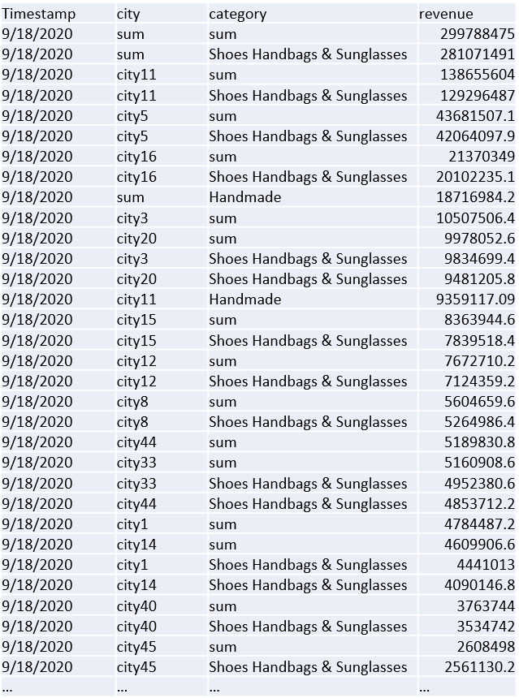

Metrics Advisor is a service for time series anomaly detection, diagnostics and analysis. As an AI powered service, it uses your data to train the model used. The service accepts tables of aggregated data with the following columns:

* **Measure** (required): A measure is a fundamental or unit-specific term and a quantifiable value of the metric. It means one or more columns containing numeric values.
* **Timestamp** (optional): zero or one column with type of `DateTime` or `String`. When this column is not set, the timestamp is set as the start time of each ingestion period. Format the timestamp into: `yyyy-MM-ddTHH:mm:ssZ`. 
* **Dimension** (optional): A dimension is one or more categorical values. The combination of those values identifies a particular univariate time series, for example: country, language, tenant, and so on. The dimension columns can be of any data type. Be cautious when working with large volumes of columns and values, to prevent excessive numbers of dimensions from being processed.

Here's an example of expected metrics schema: 

<!--  -->

Aggregate your data ahead to align with expected metrics schema if you're using data sources like ADLS, Azure Blob... which uses a file as metrics input. However, if you're using data sources like Azure SQL server, Azure Data Explorer or other sources, which support running a query to get metrics data from sources, you can use aggregation functions to aggregate data into expected schema.
