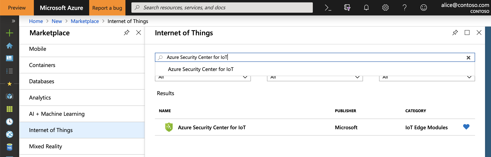
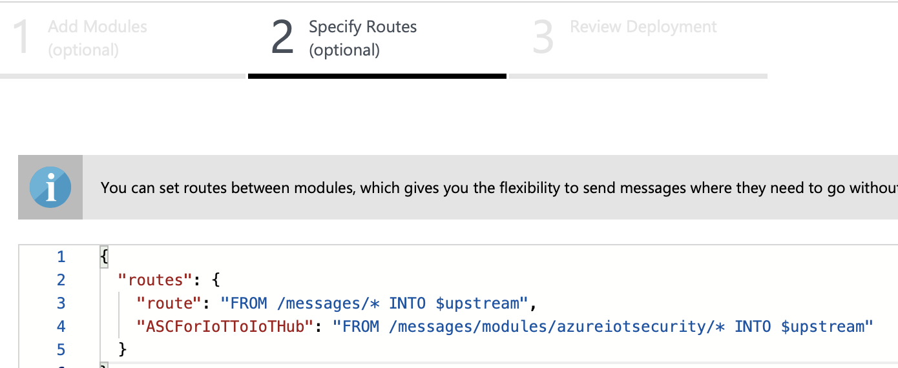

# Deploy security module on your IoT Edge device

> [!IMPORTANT]
> ASC for IoT is currently in public preview.
> This preview version is provided without a service level agreement, and it's not recommended for production workloads. Certain features might not be supported or might have constrained capabilities. 
> For more information, see [Supplemental Terms of Use for Microsoft Azure Previews](https://azure.microsoft.com/support/legal/preview-supplemental-terms/).

**Azure Security Center for IoT** module provides a comprehensive security solution for your IoT Edge device.
Security module collects, aggregates and analyzes raw security data from your Operating System and Container system into actionable security recommendations and alerts.
To learn more, see [Security module for IoT Edge](security-edge-architecture.md).

In this guide, you learn how to deploy a security module on your IoT Edge device.

## Deploy security module

Use the following steps to deploy an ASC for IoT security module for IoT Edge.

### Prerequisites

1. In your IoT Hub, make sure your device is [registered as an IoT Edge device](https://docs.microsoft.com/en-us/azure/iot-edge/how-to-register-device-portal).

1. The ASC for IoT Edge module requires the [AuditD framework](https://linux.die.net/man/8/auditd) installed on the Edge device.

   1. Install the framework by running the following command on your Edge device:
   
      `sudo apt-get install auditd audispd-plugins`
   
   1. Verify that AuditD is active by running the following command
   
      `sudo systemctl status auditd`

### Deployment using Azure portal

1. Open **Marketplace** in Azure portal.

1. Select **Azure Security Center for IoT** under **Internet of Things**.

   

1. Click **Create**.

1. Choose your **Subscription** and **IoT Hub**.
   Next, choose **Deploy to a device** to target a single device and **Deploy at Scale** to target multiple devices.
   Then click **Create**.

1. Under **Add Modules**

   1. Add the following details to **Container Registry Settings**: 

      - Name: **asotcontainerregistry**
      - Address: **asotcontainerregistry.azurecr.io**
      - Username: **6d987477-5e53-4ec0-a77b-4086e2abbcb0**
      - Password: **3b985fc9-b897-44ce-a928-7e685814b756**
   
   1. Click on **AzureSecurityCenterforIoT** under **Deployment Modules** and,
   
      1. Change the Name to **azureiotsecurity**.
      1. Verify that **Image URI** is set to **mcr.microsoft.com/ascforiot/azureiotsecurity:0.0.1**
      
      1. Verify that **Set module twin's desired properties** is checked, and that the following configuration is provided:
      
         ``` json
         "properties.desired": {
           "azureiot*com^securityAgentConfiguration^1*0*0": {
           }
         }
         ```
      1. Click **Save**.
   
   1. Click on **Configure advanced Edge Runtime settings**.
   
      1. Verify that **Image** under **Edge Hub** is set to **asotcontainerregistry.azurecr.io/edgehub:1.04-preview**.
      
      1. Verify that **Create Options** is set to 
         
         ``` json
         {
           "HostConfig": {
             "PortBindings": {
               "8883/tcp": [{"HostPort": "8883"}],
               "443/tcp": [{"HostPort": "443"}],
               "5671/tcp": [{"HostPort": "5671"}]
             }
           }
         }
         ```
      
      1. Click **Save**.
   
   1. Click **Next**.

1. Under **Specify Routes** set the **ASCForIoTToIoTHub** route to **"FROM /messages/modules/azureiotsecurity/\* INTO $upstream"**.
   
   
   Then click **Next**.

1. Under **Review Deployment** click **Submit** to complete the deployment.


## Next steps

To learn more about configuration options, continue to the how-to guide for module configuration. 
> [!div class="nextstepaction"]
> [Module configuration how to guide](./how-to-agent-configuration.md)