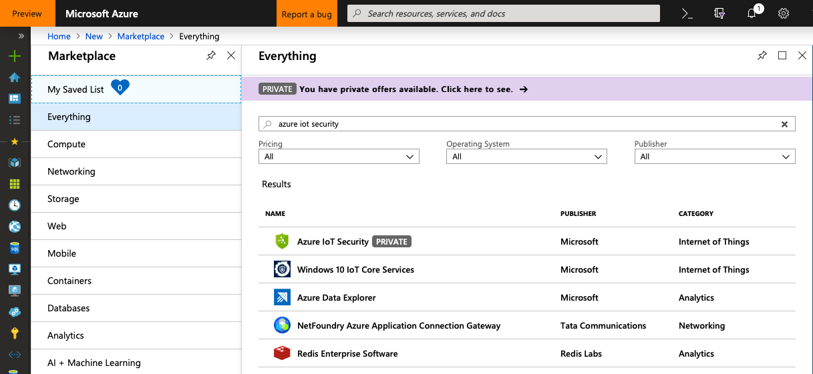

# Deploy security module on your IoT Edge device

> [!IMPORTANT]
> Azure Security Center for IoT is currently in public preview.
> This preview version is provided without a service level agreement, and it's not recommended for production workloads. Certain features might not be supported or might have constrained capabilities. 
> For more information, see [Supplemental Terms of Use for Microsoft Azure Previews](https://azure.microsoft.com/support/legal/preview-supplemental-terms/).

Azure Security Center (ASC) for IoT **azureiotsecurity** module provides a comprehensive security solution for your IoT Edge device.
Security module collects, aggregates and analyzes raw security data from your Operating System and Container system into actionable security recommendations and alerts.
To learn more, see [Security module for IoT Edge](security-edge-architecture.md).

In this guide, you learn how to deploy a security module on your IoT Edge device.

## Deploy security module

Use the following steps to deploy an ASC for IoT security module for IoT Edge.

### Prerequisites

1. Make sure your device is [registered as an IoT Edge device](https://docs.microsoft.com/en-us/azure/iot-edge/how-to-register-device-portal).

1. The ASC for IoT Edge module requires the [AuditD framework](https://linux.die.net/man/8/auditd) installed on the Edge device.

   Install the framework by running the following command on your Edge device:
   
   `apt-get install auditd audispd-plugins`

### Deployment using Azure portal

1. Open **Marketplace** in Azure portal.

1. Search for **azure iot security** and click on **Azure IoT Security**.

   

1. Click **Create**.

1. Choose your **Subscription**, **IoT Hub** and **IoT Edge Device Name**, then click **Create**.

1. Click **Next** twice to **Review Deployment**.

1. Make sure **edgeHub.settings.createOptions** is configured as follows:

   `"createOptions": "{\"HostConfig\":{\"PortBindings\":{\"8883/tcp\":[{\"HostPort\":\"8883\"}],\"443/tcp\":[{\"HostPort\":\"443\"}],\"5671/tcp\":[{\"HostPort\":\"5671\"}]}}}"`

1. Click **Submit** to complete the deployment.

## Next steps

To learn more about configuration options, continue to the how-to guide for module configuration. 
> [!div class="nextstepaction"]
> [Module configuration how to guide](./how-to-agent-configuration.md)
