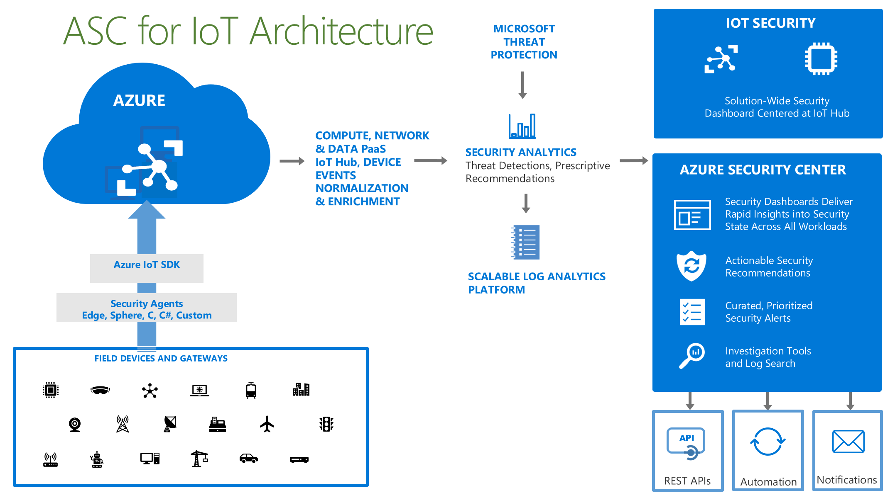

# Introducing Azure Security Center for IoT

> [!IMPORTANT]
> Azure Security Center for IoT is currently in public preview.
> This preview version is provided without a service level agreement, and it's not recommended for production workloads. Certain features might not be supported or might have constrained capabilities. 
> For more information, see [Supplemental Terms of Use for Microsoft Azure Previews](https://azure.microsoft.com/support/legal/preview-supplemental-terms/).

## Secure your Azure IoT solution 

Unify security management and enable end to end threat analysis and protection across hybrid cloud workloads and your Azure IoT solution. 

## Protect IoT and hybrid cloud workloads against evolving cyber-attacks

The Internet of Things is quickly transforming our world. With the ability to uncover insights from your connected devices and back-end systems, you can now transform those insights into powerful applications and services to help your organization achieve unprecedented levels of operational and business performance. However, as billions of new devices are connected to the internet, and integrated into our daily lives and our businesses; your security operations teams need to ensure that their security strategies evolve quickly enough to cover these new attack surfaces. Like any other system, securing your IoT solution needs protection at every stage of your implementation. 

Azure Security Center (ASC) for IoT simplifies hybrid workload protection by delivering unified visibility and control, adaptive threat prevention, and intelligent threat detection and response across workloads running on edge, on-premises, in Azure, and in other clouds. 

### Unified visibility and control

Get a unified view of security across all of your on-premises and cloud workloads, including your Azure IoT solution. Automatically discover and onboard new devices and apply security policies across your workloads (Leaf devices, Edge devices, IOT Hub) to ensure compliance with security standards.

### Adaptive threat prevention

Use ASC for IoT to continuously monitor the security of machines, networks, and Azure services, including your Azure IoT solution from edge devices to applications. You can choose to use from hundreds of built-in security assessments or create your own in the central ASC for IoT Hub dashboard. Optimize your security settings and improve your security score with actionable recommendations across virtual machines, networks, apps and data. With newly added IoT capabilities, you can now reduce attack surface for your Azure IoT solution and remediate issues before they can be exploited.

### Intelligent threat detection and response

Use advanced analytics and the Microsoft Intelligent Security Graph to get an edge over evolving cyber-attacks. Built-in behavioral analytics and machine learning identify attacks and zero-day exploits. Monitor your IoT solution for incoming attacks and post-breach activity. Streamline device investigation and remediation with interactive tools and contextual threat intelligence.

## Next steps

In this overview, you learned about the features and services of ASC for IoT. To learn more about ASC for IoT architecture, prerequisites, and learn how to get started, see the following articles:

- [Architecture](architecture.md)
- [Service prerequisites](service-prerequisites.md)
- [Getting started](getting-started.md)
- [Define your solution](quickstart-configure-your-solution.md)
- [ASC for IoT FAQ](resources-frequently-asked-questions.md)
- [ASC for IoT alerts](concept-security-alerts.md)

