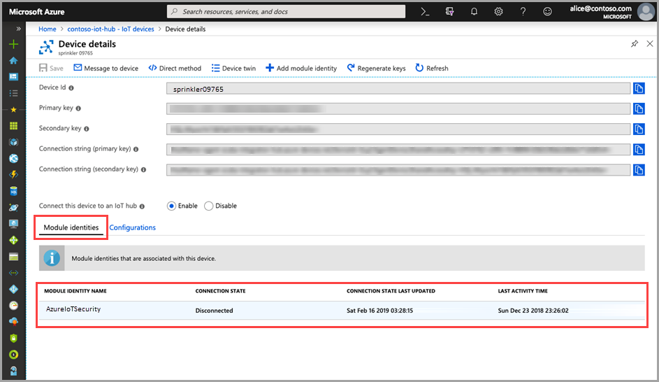

# Quickstart: Create an ASC for IoT module twin

> [!IMPORTANT]
> ASC for IoT is currently in public preview. This preview version is provided without a service level agreement, and it's not recommended for production workloads. Certain features might not be supported or might have constrained capabilities. For more information, see [Supplemental Terms of Use for Microsoft Azure Previews](https://azure.microsoft.com/support/legal/preview-supplemental-terms/).

This quickstart explanations of how to create individual ASC for IoT module twins for new devices, or batch create module twins for all devices in an IoT Hub.  

## Understanding ASC for IoT module twins 

For IoT solutions built in Azure, device twins play a key role in both device management and process automation. 

ASC for IoT offers full integration with your existing IoT device management platform, enabling you to manage your device security status as well as make use of existing device control capabilities. ASC for IoT integration is achieved by making use of the IoT Hub twin mechanism.  

See [IoT Hub module twins](https://docs.microsoft.com/azure/iot-hub/iot-hub-devguide-module-twins) to learn more about the general concept of module twins in Azure IoT Hub. 
 
ASC for IoT makes use of the module twin mechanism and maintains a security module twin for each of your devices. The security module twin holds all the information relevant to device security for each of your devices. 
 
To make full use of ASC for IoT features, you'll need to create, configure and use these security module twins for every device in the service.  

## Create ASC for IoT module twin 

ASC for IoT module twins can be created in batch mode using the default configuration, or individually with specific configurations for each device. To batch create for new devices or devices without a module twin, use the [Module batch script](https://aka.ms/iot-security-github-create-module). 

>[!NOTE] 
> Using the batch method will not overwrite existing module twins. Using the batch method ONLY creates new module twins for devices that do not already have a module twin. 

See [Modify a security module twin](how-to-modify-security-module-twin.md) to learn how to modify or change the configuration of an existing module twin. 

To create a new ASC for IoT module twin for a device use the following instructions: 

1. In your IoT Hub, locate and select the device you wish to create a security module twin for in your IoT Hub. 
1. In the **Microsoft Identity Name** field, enter **ascforiotsecurity**.
1. Click **Save**. 

## Verify creation of a module twin

To verify if a security module twin exists for a specific device:

1. In your Azure IoT Hub, select **IoT devices** from the **Explorers** menu.    
1. Enter the device ID, or select an option in the **Query device field** and click **Query devices**. 
    
1. Select the device or double click it to open the Device details page. 
1. Select the **Module identities** menu, and confirm existence of the **ascforiotsecurity** module and a **Connection State** of **Connected** in the list of module identities associated with the device. 
    

To learn more about customizing properties of ASC for IoT module twins, see [Agent configuration](concept-agent-configuration.md).

## Next steps

Advance to the next article to learn how to configure custom alerts...

> [!div class="nextstepaction"]
> [Configure custom alerts](quickstart-create-custom-alerts.md)
