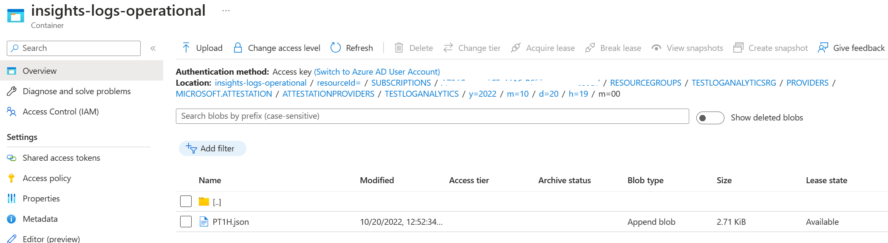

# Enable logging in Azure Attestation 

After you create one or more Azure Attestation providers, you'll likely want to monitor how and when your resources are accessed, and by whom. You can do this by enabling logging for Microsoft Azure Attestation, which saves information in an Azure storage account and/or log analytics workspace you provide.  

## What is logged

- All authenticated REST API requests, including failed requests because of access permissions, system errors, or bad requests.
- Operations on the attestation provider, including setting of attestation policy and attest operations.
- Unauthenticated requests that result in a 401 response. Examples are requests that lack a bearer token, are malformed or expired, or have an invalid token. 

## Prerequisites

To complete this tutorial, you will need an Azure Attestation provider. You can create a new provider using one of these methods: 

- [Create an attestation provider using the Azure CLI](quickstart-azure-cli.md)
- [Create an attestation provider using Azure PowerShell](quickstart-powershell.md)
- [Create an attestation provider using the Azure portal](quickstart-portal.md)

You will also need a destination for your logs. This can be an existing or new Azure storage account and/or Log Analytics workspace. You can create a new Azure storage account using one of these methods: 

- [Create a storage account using the Azure CLI]([../storage/common/storage-account-create.md)
- [Create a storage account using Azure PowerShell](../storage/common/storage-account-create.md)
- [Create a storage account using the Azure portal](../storage/common/storage-account-create.md)

You can create a new Log Analytics workspace using one of these methods: 

- [Create a Log Analytics workspace using the Azure CLI](../azure-monitor/logs/quick-create-workspace.md)
- [Create a Log Analytics workspace using Azure PowerShell](../azure-monitor/logs/quick-create-workspace.md)
- [Create a Log Analytics workspace the Azure portal](../azure-monitor/logs/quick-create-workspace.md)

 ## Enable logging 

 You can enable logging for Azure Attestation by using the Azure PowerShell, or the Azure portal. 

 ### Using Powershell with storage account as destination

```powershell

 Connect-AzAccount 

 Set-AzContext -Subscription "<Subscription id>"

 $attestationProviderName="<Name of the attestation provider>"

 $attestationResourceGroup="<Name of the resource Group>"

 $attestationProvider=Get-AzAttestation -Name $attestationProviderName -ResourceGroupName $attestationResourceGroup 

 $storageAccount=New-AzStorageAccount -ResourceGroupName $attestationProvider.ResourceGroupName -Name "<Storage Account Name>" -SkuName Standard_LRS -Location "<Location>"

 Set-AzDiagnosticSetting -ResourceId $attestationProvider.Id -StorageAccountId $storageAccount.Id -Enabled $true 

```

 When logging is enabled, logs are will be automatically created for you in **Containers** section of the specified storage account. Please expect some delay for the logs to appear in containers section. 

 ### Using portal

To configure diagnostic settings in the Azure portal, follow these steps: 

1. From the Resource pane menu, select **Diagnostic settings**, and then **Add diagnostic setting**
2. Under **Category groups**, select both **audit** and **allLogs**.
3. If Azure Log Analytics is the destination, select **Send to Log Analytics workspace** and choose your subscription and workspace from the drop-down menus. You may also select **Archive to a storage account** and choose your subscription and storage account from the drop-down menus.
4. When you have selected your desired options, select **Save**.

## Access your logs from storage account 

When logging is enabled, upto three containers will be automatically created  in your specified storage account: **insights-logs-operational, insights-logs-auditevent and insights-logs-notprocessed**. Please expect some delay for the logs to appear in containers section. 

**insights-logs-notprocessed** includes logs related to malformed requests. **insights-logs-auditevent** was created to provide early access to logs for customers using VBS. To view the logs, you have to download blobs. 

### Using PowerShell

With Azure PowerShell, use [Get-AzStorageBlob](../powershell/module/az.storage/get-azstorageblob.md). To list all the blobs in this container, enter: 

```powershell
$operationalBlob= Get-AzStorageBlob -Container " insights-logs-operational" -Context $storageAccount.Context 

$operationalBlob.Name
```

From the output of the Azure PowerShell cmdlet, you can see that the names of the blobs are in the following format: resourceId=<ARM resource ID>/y=<year>/m=<month>/d=<day of month>/h=<hour>/m=<minute>/filename.json. The date and time values use Coordinated Universal Time. 

### Using portal

To access logs in the Azure portal, follow these steps: 

1. Open your storage account and click on **Containers** from resource pane menu
2. Select **insights-logs-operational** and follow the navigation shown in the below screenshot to locate a json file and view the logs



## Use Azure Monitor logs  

You can use Azure Monitor logs to review activity in Azure Attestation resources. In Azure Monitor logs, you use log queries to analyze data and get the information you need. For more information, see [Monitoring Azure Attestation](monitor-azure-attestation.md) 

## Next steps 

- For information on how to interpret logs, see [Azure Attestation logging](view-logs.md) .
- To learn more about using Azure Monitor for analyzing Azure Attestation logs, see [Monitoring Azure Attestation](monitor-azure-attestation.md) . 
