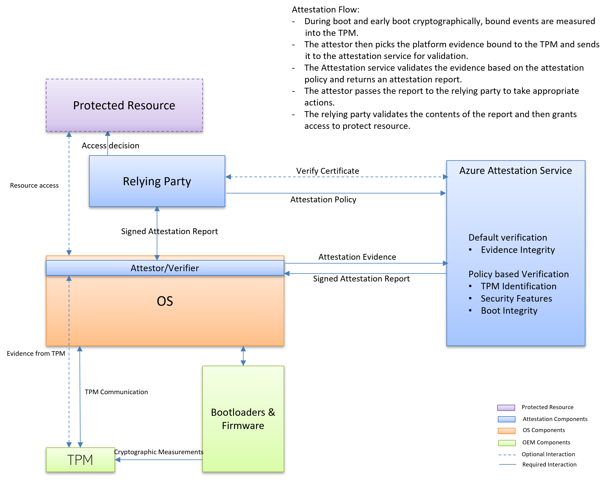

# Trusted Platform Module attestation

Devices with a Trusted Platform Module (TPM) can rely on attestation to prove that boot integrity isn't compromised along with using the Measured Boot process to detect early boot feature states.

A growing number of device types, bootloaders, and boot stack attacks require an attestation solution to evolve accordingly. An attested state of a device is driven by the attestation policy used to verify the contents on the platform evidence.

This article provides an overview of TPM attestation and capabilities supported by Azure Attestation.

## Overview

TPM attestation starts from validating the TPM itself all the way up to the point where a relying party can validate the boot flow.

In general, TPM attestation is based on the following pillars.

### Validate TPM authenticity

Validate the TPM authenticity by validating the TPM:

- Every TPM ships with a unique asymmetric key called the endorsement key (EK). This key is burned by the manufacturer. The public portion of this key is known as EKPub. The associated private key is known as EKPriv. Some TPM chips also have an EK certificate that's issued by the manufacturer for the EKPub. This certificate is known as EKCert.
- A certification authority (CA) establishes trust in the TPM either via EKPub or EKCert.
- A device proves to the CA that the key for which the certificate is being requested is cryptographically bound to the EKPub and that the TPM owns the EKPriv.
- The CA issues a certificate with a special issuance policy to denote that the key is now attested as protected by a TPM.

### Validate the measurements made during the boot

Validate the measurements made during the boot by using Azure Attestation:

- As part of Trusted Boot and Measured Boot, every step is validated and measured into the TPM. Different events are measured for different platforms. For more information about the Measured Boot process in Windows, see [Secure the Windows boot process](/windows/security/information-protection/secure-the-windows-10-boot-process).
- At boot, an attestation identity key is generated. It's used to provide cryptographic proof to the attestation service that the TPM in use was issued a certificate after EK validation was performed.
- Relying parties can perform an attestation against Azure Attestation, which can be used to validate measurements made during the boot process.
- A relying party can then rely on the attestation statement to gate access to resources or other actions.



Conceptually, TPM attestation can be visualized as shown in the preceding diagram. The relying party applies Azure Attestation to verify the integrity of the platform and any violation of promises. The verification process gives you the confidence to run workloads or provide access to resources.

## Protection from malicious boot attacks

Mature attack techniques aim to infect the boot chain. A boot attack can provide the attacker with access to system resources and allow the attacker to hide from antimalware software. Trusted Boot acts as the first order of defense. Use of Trusted Boot and attestation extends the capability to relying parties. Most attackers attempt to bypass secure boot or load an unwanted binary in the boot process.

Remote attestation allows the relying parties to verify the whole boot chain for any violation of promises. For example, the secure boot evaluation by the attestation service validates the values of the secure variables measured by UEFI.

Measured Boot instrumentation ensures cryptographically bound measurements can't be changed after they're made and that only a trusted component can make the measurement. For this reason, validating the secure variables is sufficient to ensure the enablement.

Azure Attestation signs the report to ensure the integrity of the attestation is also maintained to protect against man-in-the-middle attacks.

A simple policy can be used:

```
version=1.0;

authorizationrules { 
    => permit();
};


issuancerules
{
[type=="aikValidated", value==true] && 
[type=="secureBootEnabled", value==true] => issue(type="PlatformAttested", value=true);
};

```

Sometimes it isn't sufficient to verify only one component in the boot. Verifying complementary features like code integrity or hypervisor-protected code integrity (HVCI) and System Guard Secure Launch adds to the protection profile of a device. You also need the ability to peer into the boot so that you can evaluate any violations and be confident about the platform.

The following example takes advantage of policy version 1.2 to verify details about secure boot, HVCI, and System Guard Secure Launch. It also verifies that an unwanted (malicious.sys) driver isn't loaded during the boot:

```
version=1.2;

authorizationrules {
    => permit();
};

issuancerules
{

// Verify if secure boot is enabled
c:[type == "events", issuer=="AttestationService"] => add(type = "efiConfigVariables", value = JmesPath(c.value, "Events[?EventTypeString == 'EV_EFI_VARIABLE_DRIVER_CONFIG' && ProcessedData.VariableGuid == '8BE4DF61-93CA-11D2-AA0D-00E098032B8C']"));
c:[type=="efiConfigVariables", issuer=="AttestationPolicy"]=> add(type = "secureBootEnabled", value = JsonToClaimValue(JmesPath(c.value, "[?ProcessedData.UnicodeName == 'SecureBoot'] | length(@) == `1` && @[0].ProcessedData.VariableData == 'AQ'")));
![type=="secureBootEnabled", issuer=="AttestationPolicy"] => add(type="secureBootEnabled", value=false);

// HVCI
c:[type=="events", issuer=="AttestationService"] => add(type="srtmDrtmEventPcr", value=JmesPath(c.value, "Events[? EventTypeString == 'EV_EVENT_TAG' && (PcrIndex == `12` || PcrIndex == `19`)].ProcessedData.EVENT_TRUSTBOUNDARY"));
c:[type=="srtmDrtmEventPcr", issuer=="AttestationPolicy"] => add(type="hvciEnabledSet", value=JsonToClaimValue(JmesPath(c.value, "[*].EVENT_VBS_HVCI_POLICY | @[?String == 'HypervisorEnforcedCodeIntegrityEnable'].Value")));
c:[type=="hvciEnabledSet", issuer=="AttestationPolicy"] => issue(type="hvciEnabled", value=ContainsOnlyValue(c.value, 1));
![type=="hvciEnabled", issuer=="AttestationPolicy"] => issue(type="hvciEnabled", value=false);

// Validating unwanted(malicious.sys) driver is not loaded
c:[type=="events", issuer=="AttestationService"] => add(type="boolProperties", value=JmesPath(c.value, "Events[? EventTypeString == 'EV_EVENT_TAG' && (PcrIndex == `12` || PcrIndex == `13` || PcrIndex == `19` || PcrIndex == `20`)].ProcessedData.EVENT_TRUSTBOUNDARY"));
c:[type=="boolProperties", issuer=="AttestationPolicy"] => issue(type="MaliciousDriverLoaded", value=JsonToClaimValue(JmesPath(c.value, "[*].EVENT_LOADEDMODULE_AGGREGATION[] | [? EVENT_IMAGEVALIDATED == true && (equals_ignore_case(EVENT_FILEPATH, '\\windows\\system32\\drivers\\malicious.sys') || equals_ignore_case(EVENT_FILEPATH, '\\windows\\system32\\drivers\\wd\\malicious.sys'))] | @ != null ")));
![type=="MaliciousDriverLoaded", issuer=="AttestationPolicy"] => issue(type="MaliciousDriverLoaded", value=false);

};
```

## Extending the protection from malicious boot attacks via Integrity Measurement Architecture(IMA) on Linux

Linux systems follow a similar boot process to Windows, and with TPM attestation the protection profile can be extended to beyond boot into the kernel as well using Integrity Measurement Architecture(IMA). IMA subsystem was designed to detect if files have been accidentally or maliciously altered, both remotely and locally, it maintains a runtime measurement list and, if anchored in a hardware Trusted Platform Module(TPM), an aggregate integrity value over this list provides the benefit of resiliency from software attacks. Recent enhancements in the IMA subsystem also allow for non file based attributes to be measured and attested remotely. Azure attestation supports non file based measurements to be attested remotely to provide a holistic view of system integrity.

Enabling IMA with the following ima-policy will enable measurement of non file attributes while still enabling local file integrity attestation.

Using the following Attestation policy, you can now validate the secureboot, kernel signature, kernel version, kernel cmdline passed in by grub and other key security attributes supported by IMA.

```
version = 1.2;

configurationrules
{
};

authorizationrules
{
    [type == "aikValidated", value==true]
    => permit();
};

issuancerules {
    // Retrieve all EFI Boot variables with event = 'EV_EFI_VARIABLE_BOOT' 
    c:[type == "events", issuer=="AttestationService"] => add(type ="efiBootVariables", value = JmesPath(c.value, "Events[?EventTypeString == 'EV_EFI_VARIABLE_BOOT']"));

    // Retrieve all EFI Driver Config variables with event = 'EV_EFI_VARIABLE_DRIVER_CONFIG' 
    c:[type == "events", issuer=="AttestationService"] => add(type ="efiConfigVariables", value = JmesPath(c.value, "Events[?EventTypeString == 'EV_EFI_VARIABLE_DRIVER_CONFIG']"));

   // Grab all IMA events
   c:[type=="events", issuer=="AttestationService"] => add(type="imaMeasurementEvents", value=JmesPath(c.value, "Events[?EventTypeString == 'IMA_MEASUREMENT_EVENT']"));

   // Look for "Boot Order" from EFI Boot Data
   c:[type == "efiBootVariables", issuer=="AttestationPolicy"] => add(type = "bootOrderFound", value = JmesPath(c.value, "[?ProcessedData.UnicodeName == 'BootOrder'] | length(@) == `1` && @[0].PcrIndex == `1` && @[0].ProcessedData.VariableData"));
   c:[type=="bootOrderFound", issuer=="AttestationPolicy"] => issue(type="bootOrder", value=JsonToClaimValue(c.value));
   ![type=="bootOrderFound", issuer=="AttestationPolicy"] => issue(type="bootOrder", value=0);

   // Look for "Secure Boot" from EFI Driver Configuration Data
   c:[type == "efiConfigVariables", issuer=="AttestationPolicy"] => issue(type = "secureBootEnabled", value = JsonToClaimValue(JmesPath(c.value, "[?ProcessedData.UnicodeName == 'SecureBoot'] | length(@) == `1` && @[0].PcrIndex == `7` && @[0].ProcessedData.VariableData == 'AQ'")));
   ![type=="secureBootEnabled", issuer=="AttestationPolicy"] => issue(type="secureBootEnabled", value=false);

   // Look for "Platform Key" from EFI Boot Data
   c:[type == "efiConfigVariables", issuer=="AttestationPolicy"] => add(type = "platformKeyFound", value = JmesPath(c.value, "[?ProcessedData.UnicodeName == 'PK'] | length(@) == `1` && @[0].PcrIndex == `7` && @[0].ProcessedData.VariableData"));
   c:[type=="platformKeyFound", issuer=="AttestationPolicy"] => issue(type="platformKey", value=JsonToClaimValue(c.value));
   ![type=="platformKeyFound", issuer=="AttestationPolicy"] => issue(type="platformKey", value=0);
  
   // Look for "Key Exchange Key" from EFI Driver Configuration Data
   c:[type == "efiConfigVariables", issuer=="AttestationPolicy"] => add(type = "keyExchangeKeyFound", value = JmesPath(c.value, "[?ProcessedData.UnicodeName == 'KEK'] | length(@) == `1` && @[0].PcrIndex == `7` && @[0].ProcessedData.VariableData"));
   c:[type=="keyExchangeKeyFound", issuer=="AttestationPolicy"] => issue(type="keyExchangeKey", value=JsonToClaimValue(c.value));
   ![type=="keyExchangeKeyFound", issuer=="AttestationPolicy"] => issue(type="keyExchangeKey", value=0);

   // Look for "Key Database" from EFI Driver Configuration Data
   c:[type == "efiConfigVariables", issuer=="AttestationPolicy"] => add(type = "keyDatabaseFound", value = JmesPath(c.value, "[?ProcessedData.UnicodeName == 'db'] | length(@) == `1` && @[0].PcrIndex == `7` && @[0].ProcessedData.VariableData"));
   c:[type=="keyDatabaseFound", issuer=="AttestationPolicy"] => issue(type="keyDatabase", value=JsonToClaimValue(c.value));
   ![type=="keyDatabaseFound", issuer=="AttestationPolicy"] => issue(type="keyDatabase", value=0);

   // Look for "Forbidden Signatures" from EFI Driver  Configuration Data
   c:[type == "efiConfigVariables", issuer=="AttestationPolicy"] => add(type = "forbiddenSignaturesFound", value = JmesPath(c.value, "[?ProcessedData.UnicodeName == 'dbx'] | length(@) == `1` && @[0].PcrIndex == `7` && @[0].ProcessedData.VariableData"));
   c:[type=="forbiddenSignaturesFound", issuer=="AttestationPolicy"] => issue(type="forbiddenSignatures", value=JsonToClaimValue(c.value));
   ![type=="forbiddenSignaturesFound", issuer=="AttestationPolicy"] => issue(type="forbiddenSignatures", value=0);

   // Look for "Kernel Version" in IMA Measurement events
   c:[type=="imaMeasurementEvents", issuer=="AttestationPolicy"] => add(type="kernelVersionsFound", value=JmesPath(c.value, "[].ProcessedData.KernelVersion"));
   c:[type=="kernelVersionsFound", issuer=="AttestationPolicy"] => issue(type="kernelVersions", value=JsonToClaimValue(c.value));
   ![type=="kernelVersionsFound", issuer=="AttestationPolicy"] => issue(type="kernelVersions", value=0);

   // Look for "Built-In Trusted Keys" in IMA Measurement events
   c:[type=="imaMeasurementEvents", issuer=="AttestationPolicy"] => add(type="builtintrustedkeysFound", value=JmesPath(c.value, "[? ProcessedData.Keyring == '.builtin_trusted_keys'].ProcessedData.CertificateSubject"));
   c:[type=="builtintrustedkeysFound", issuer=="AttestationPolicy"] => issue(type="builtintrustedkeys", value=JsonToClaimValue(c.value));
   ![type=="builtintrustedkeysFound", issuer=="AttestationPolicy"] => issue(type="builtintrustedkeys", value=0);
};

```

Note: Support for non-file based measurements are only available from linux kernel version: 5.15

## TPM Key attestation support

Numerous applications rely on foundational credential management of keys and certs for protections against credential theft, and one of main ways of ensuring the credential security is the reliance of key storage providers that provide additional security from malware and attacks. Windows implements various cryptographic providers that can be either software or hardware based. 

The two most important ones are: 

* Microsoft Software Key Storage Provider: Standard provider, which stores keys software based and supports CNG (Crypto-Next Generation) 

* Microsoft Platform Crypto Provider: Hardware based which stores keys on a TPM (trusted platform module) and supports CNG as well 

Whenever a Storage provider is used, it’s usually to create a pub/priv key pair that is chained to a root of trust. At creation more properties can also be used to enable certain aspects of the key storage, exportability, etc. Key attestation in this context, is the technical ability to prove to a replying party that a private key was generated inside, and is managed inside, and in a not exportable form. Such attestation clubbed with other information can help protect from credential theft and replay type of attack. 

TPMs also provide the capability ability to attest that keys are resident in a TPM, enabling higher security assurance, backed up by non-exportability, anti-hammering, and isolation of keys. A common use case is for applications that issue digital signature certificate for subscriber keys, verifying that the subscribers private signature key is generated and managed in an approved TPM.
One can easily attest to the fact the keys are resident in a valid TPM with appropriate Nonexportability flags using a policy as below.

```
version=1.2;

authorizationrules
{
    => permit();
};

issuancerules
{
    // Key Attest Policy
    // -- Validating key types
	c:[type=="x-ms-tpm-request-key", issuer=="AttestationService"] => add(type="requestKeyType", value=JsonToClaimValue(JmesPath(c.value, "jwk.kty")));
	c:[type=="x-ms-tpm-other-keys", issuer=="AttestationService"] => add(type="otherKeysTypes", value=JsonToClaimValue(JmesPath(c.value, "[*].jwk.kty")));
    c:[type=="requestKeyType", issuer=="AttestationPolicy", value=="RSA"] => issue(type="requestKeyType", value="RSA");
    c:[type=="otherKeysTypes", issuer=="AttestationPolicy", value=="RSA"] => issue(type="otherKeysTypes", value="RSA");

    // -- Validating tpm_quote attributes
	c:[type=="x-ms-tpm-request-key", issuer=="AttestationService"] => add(type="requestKeyQuote", value=JmesPath(c.value, "info.tpm_quote"));
	c:[type=="requestKeyQuote", issuer=="AttestationPolicy"] => add(type="requestKeyQuoteHashAlg", value=JsonToClaimValue(JmesPath(c.value, "hash_alg")));
    c:[type=="requestKeyQuoteHashAlg", issuer=="AttestationPolicy", value=="sha-256"] => issue(type="requestKeyQuoteHashAlg", value="sha-256");

    // -- Validating tpm_certify attributes
    c:[type=="x-ms-tpm-request-key", issuer=="AttestationService"] => add(type="requestKeyCertify", value=JmesPath(c.value, "info.tpm_certify"));
    c:[type=="requestKeyCertify", issuer=="AttestationPolicy"] => add(type="requestKeyCertifyNameAlg", value=JsonToClaimValue(JmesPath(c.value, "name_alg")));
    c:[type=="requestKeyCertifyNameAlg", issuer=="AttestationPolicy", value==11] => issue(type="requestKeyCertifyNameAlg", value=11);

    c:[type=="requestKeyCertify", issuer=="AttestationPolicy"] => add(type="requestKeyCertifyObjAttr", value=JsonToClaimValue(JmesPath(c.value, "obj_attr")));
    c:[type=="requestKeyCertifyObjAttr", issuer=="AttestationPolicy", value==50] => issue(type="requestKeyCertifyObjAttr", value=50);

    c:[type=="requestKeyCertify", issuer=="AttestationPolicy"] => add(type="requestKeyCertifyAuthPolicy", value=JsonToClaimValue(JmesPath(c.value, "auth_policy")));
    c:[type=="requestKeyCertifyAuthPolicy", issuer=="AttestationPolicy", value=="AQIDBA"] => issue(type="requestKeyCertifyAuthPolicy", value="AQIDBA");

    c:[type=="x-ms-tpm-other-keys", issuer=="AttestationService"] => add(type="otherKeysCertify", value=JmesPath(c.value, "[*].info.tpm_certify"));
    c:[type=="otherKeysCertify", issuer=="AttestationPolicy"] => add(type="otherKeysCertifyNameAlgs", value=JsonToClaimValue(JmesPath(c.value, "[*].name_alg")));
    c:[type=="otherKeysCertifyNameAlgs", issuer=="AttestationPolicy", value==11] => issue(type="otherKeysCertifyNameAlgs", value=11);

    c:[type=="otherKeysCertify", issuer=="AttestationPolicy"] => add(type="otherKeysCertifyObjAttr", value=JsonToClaimValue(JmesPath(c.value, "[*].obj_attr")));
    c:[type=="otherKeysCertifyObjAttr", issuer=="AttestationPolicy", value==50] => issue(type="otherKeysCertifyObjAttr", value=50);

    c:[type=="otherKeysCertify", issuer=="AttestationPolicy"] => add(type="otherKeysCertifyAuthPolicy", value=JsonToClaimValue(JmesPath(c.value, "[*].auth_policy")));
    c:[type=="otherKeysCertifyAuthPolicy", issuer=="AttestationPolicy", value=="AQIDBA"] => issue(type="otherKeysCertifyAuthPolicy", value="AQIDBA");
};

```

## Next steps

- [Try out TPM attestation](azure-tpm-vbs-attestation-usage.md)
- [Device Health Attestation on Windows and interacting with Azure Attestation](/windows/client-management/mdm/healthattestation-csp#windows-11-device-health-attestation)
- [Learn more about claim rule grammar](claim-rule-grammar.md)
- [Attestation policy claim rule functions](claim-rule-functions.md)
