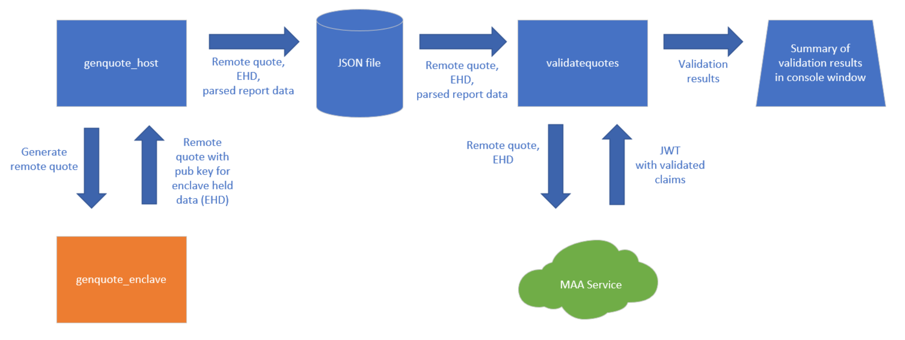
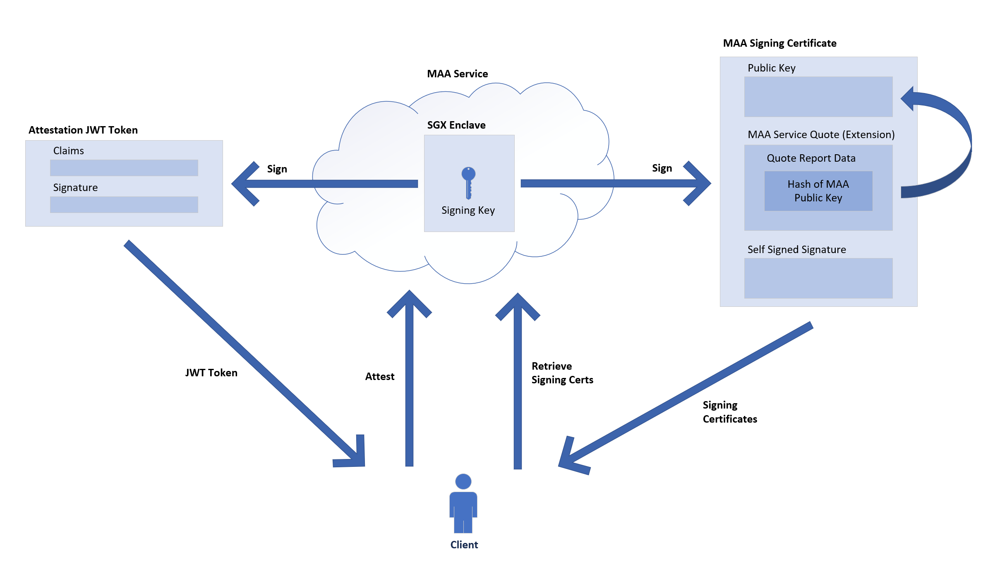

# Sample code of SGX attestation from Linux VM using Open Enclave SDK
## Overview
The SGX Attestation sample code demonstrates how to generate a quote in an SGX enclave and then get it validated by the Microsoft Azure Attestation. The "enclave held data" for the quote is populated with public key component of a 2048 bit RSA key that's held within the enclave.

The components used in the sample code are outlined in the following diagram:


The flow is:
1. ```genquote_host``` - This application is run first and performs the following:
    1. Launches the ```genquote_enclave``` SGX enclave
    1. Calls into the enclave (via an ecall) to retrieve a remote quote and a copy of the enclave held data, which in this case is the public key for a 2048 bit RSA key
    1. Calls into the Open Enclave SDK to parse the remote quote to retrieve important attributes like Security Version Number, ProductID, MRSIGNER, MRENCLAVE, etc.
    1. Persists the remote quote, enclave held data and parsed report fields to a JSON file on disk
1. ```genquote_enclave``` - This application is an SGX enclave created via the Open Enclave SDK.  It exposes one ecall to retrieve a remote quote and enclave held data.
1. ```validatequotes.core``` - This application is built on .NET core and runs on any platform.  It consumes the JSON file persisted by the ```genquote_host``` application and performs the following:
    1. Calls the Azure Attestation for validation, passing it the remote quote and enclave held data found in the JSON file
    1. Validates that the Azure Attestation JWT passes signature validation and is issued by the expected party
    1. Validates that the Azure Attestation JWT claim values match the parsed data in the JSON file for the well known fields like Security Version Number, ProductID, MRSIGNER, MRENCLAVE, etc.
    1. Produces a report in the console with the results

The following diagram depicts the relationship between the different artifacts produced the Azure Attestation for JWT token validation.


## Remote Quote Generation
*Note: The SGX enclave code in this sample is derived from the [remote_attestation sample code](https://github.com/openenclave/openenclave/tree/master/samples/remote_attestation) in Open Enclave SDK.  Many thanks to the author(s)!*

Remote quote generation is performed by the following call to the ```oe_get_report``` method in the [attestation.cpp](./genquotes/common/attestation.cpp#L43) file in the ```genquote_enclave``` application.
```
    result = oe_get_report(
        OE_REPORT_FLAGS_REMOTE_ATTESTATION,
        sha256,
        sizeof(sha256),
        NULL, 
        0,
        &temp_buf,
        remote_report_buf_size);
```

## Remote Quote Validation via Azure Attestation

The Azure Attestation is called to perform attestation by the following call in the [MaaService.cs](./validatequotes.net/MaaService.cs#L32) file:

```
    // Send request
    var response = await theHttpClient.SendAsync(request);
```

The verification that the Azure Attestation JWT passes signature validation and is issued by the expected issuer is in the  [JwtHelperValidation.cs](./validatequotes.net/Helpers/JwtValidationHelper.cs#L21) file:
```
    public static TokenValidationResult ValidateMaaJwt(string attestDnsName, string serviceJwt)
```

The verification that the Azure Attestation JWT claims match the initial parsed report data is performed in the [EnclaveInfo.cs](./validatequotes.net/EnclaveInfo.cs#L31) file:
```
    public void CompareToMaaServiceJwtToken(string serviceJwtToken, bool includeDetails)
```

If the Azure Attestation is running within an SGX enclave, the validation of the Azure Attestation quote is performed in the [MaaQuoteValidator.cs](./validatequotes.net/MaaQuoteValidator.cs#L41) file:
```
    static public void ValidateMaaQuote(string x5c, bool includeDetails)
```


## Instructions to Build and Run Yourself

To set up the pre-requisites to build and run these samples:
1. Install Ubuntu 18.04 on an [Azure Confidential Compute](https://azure.microsoft.com/en-us/solutions/confidential-compute/) VM.
1. Install the [Open Enclave SDK](https://github.com/openenclave/openenclave/blob/v0.9.x/docs/GettingStartedDocs/install_oe_sdk-Ubuntu_18.04.md) on this VM.  You don't need to install Ninja or CMake -- they are not used here.
1. Add the command "```. /opt/openenclave/share/openenclave/openenclaverc```" to your ~/.bashrc file.
1. Install the [.NET CORE SDK](https://docs.microsoft.com/en-us/dotnet/core/install/linux-package-manager-ubuntu-1804) on this VM.

To build and run the samples:
1. ```git clone``` this repo to the VM
1. ```cd``` to the subdirectory containing this sample code
1. To build, run and generate the JSON files do the following:
    1. ```cd genquotes```
    1. ```make build```
    1. ```make run```
    1. This runs the application in four different enclave configurations to generate four different remote quotes.  You should see four new files created in the ```../quotes``` directory.
1. To build, run and validate the JSON files with the Azure Attestation do the following:
    1. ```cd validatequotes.core```
    1. ```./runall.sh```
    1. This builds and runs the validation application against the four different JSON files produced earlier.
    1. The runall.sh script assumes you have access to the tradewinds.us.test.attest.azure.net attestation provider.  If you don't, edit the [runall.sh](./validatequotes.core/runall.sh#L5) script to reference your attestation provider.  

The four different JSON files are:
* *enclave.info.debug.json* - debugging enabled
* *enclave.info.release.json* - debugging disabled
* *enclave.info.securityversion.json* - security version set to 999
* *enclave.info.prodid.json* - product id set to 999

## Example Output for make run
Here is an example of what the output of ```make run``` should look like:

```
greg@acc-ubuntu-1:~/src/aas/openenclave/maa-samples/genquotes$ make run
host/genquote_host ./enclave/genquote_enclave.debug.signed              enclave.info.debug.json
    JSON file created: enclave.info.debug.json
host/genquote_host ./enclave/genquote_enclave.release.signed            enclave.info.release.json
    JSON file created: enclave.info.release.json
host/genquote_host ./enclave/genquote_enclave.prodid.signed             enclave.info.prodid.json
    JSON file created: enclave.info.prodid.json
host/genquote_host ./enclave/genquote_enclave.securityversion.signed    enclave.info.securityversion.json
    JSON file created: enclave.info.securityversion.json
```

## Example Output for ./runall.sh
Here is an example of what the output of ```./runall.sh``` should look like:

```
greg@acc-ubuntu-1:~/src/attestation/sgx.attest.sample/validatequotes$ ./runall.sh 
05/04/2020 12:32:28 : 
05/04/2020 12:32:28 : Validating file '../genquotes/quotes/enclave.info.debug.json' against attestation provider 'tradewinds.us.test.attest.azure.net' with include details 'False'
05/04/2020 12:32:28 : 
05/04/2020 12:32:31 : JWT JKU location validation:        True
05/04/2020 12:32:32 : JWT signature validation:           True
05/04/2020 12:32:32 : JWT issuer claim validation:        True
05/04/2020 12:32:32 : JWT signing cert issuer validation: True
05/04/2020 12:32:32 : IsDebuggable check:                 True
05/04/2020 12:32:32 : MRENCLAVE check:                    True
05/04/2020 12:32:32 : MRSIGNER check:                     True
05/04/2020 12:32:32 : ProductID check:                    True
05/04/2020 12:32:32 : Security Version check:             True
05/04/2020 12:32:32 : Enclave Held Data check:            True
05/04/2020 12:32:32 : 
05/04/2020 12:32:33 : 
05/04/2020 12:32:33 : Validating file '../genquotes/quotes/enclave.info.release.json' against attestation provider 'tradewinds.us.test.attest.azure.net' with include details 'False'
05/04/2020 12:32:33 : 
05/04/2020 12:32:36 : JWT JKU location validation:        True
05/04/2020 12:32:37 : JWT signature validation:           True
05/04/2020 12:32:37 : JWT issuer claim validation:        True
05/04/2020 12:32:37 : JWT signing cert issuer validation: True
05/04/2020 12:32:37 : IsDebuggable check:                 True
05/04/2020 12:32:37 : MRENCLAVE check:                    True
05/04/2020 12:32:37 : MRSIGNER check:                     True
05/04/2020 12:32:37 : ProductID check:                    True
05/04/2020 12:32:37 : Security Version check:             True
05/04/2020 12:32:37 : Enclave Held Data check:            True
05/04/2020 12:32:37 : 
05/04/2020 12:32:38 : 
05/04/2020 12:32:38 : Validating file '../genquotes/quotes/enclave.info.prodid.json' against attestation provider 'tradewinds.us.test.attest.azure.net' with include details 'False'
05/04/2020 12:32:38 : 
05/04/2020 12:32:40 : JWT JKU location validation:        True
05/04/2020 12:32:42 : JWT signature validation:           True
05/04/2020 12:32:42 : JWT issuer claim validation:        True
05/04/2020 12:32:42 : JWT signing cert issuer validation: True
05/04/2020 12:32:42 : IsDebuggable check:                 True
05/04/2020 12:32:42 : MRENCLAVE check:                    True
05/04/2020 12:32:42 : MRSIGNER check:                     True
05/04/2020 12:32:42 : ProductID check:                    True
05/04/2020 12:32:42 : Security Version check:             True
05/04/2020 12:32:42 : Enclave Held Data check:            True
05/04/2020 12:32:42 : 
05/04/2020 12:32:43 : 
05/04/2020 12:32:43 : Validating file '../genquotes/quotes/enclave.info.securityversion.json' against attestation provider 'tradewinds.us.test.attest.azure.net' with include details 'False'
05/04/2020 12:32:43 : 
05/04/2020 12:32:45 : JWT JKU location validation:        True
05/04/2020 12:32:47 : JWT signature validation:           True
05/04/2020 12:32:47 : JWT issuer claim validation:        True
05/04/2020 12:32:47 : JWT signing cert issuer validation: True
05/04/2020 12:32:47 : IsDebuggable check:                 True
05/04/2020 12:32:47 : MRENCLAVE check:                    True
05/04/2020 12:32:47 : MRSIGNER check:                     True
05/04/2020 12:32:47 : ProductID check:                    True
05/04/2020 12:32:47 : Security Version check:             True
05/04/2020 12:32:47 : Enclave Held Data check:            True
05/04/2020 12:32:47 : 
```
