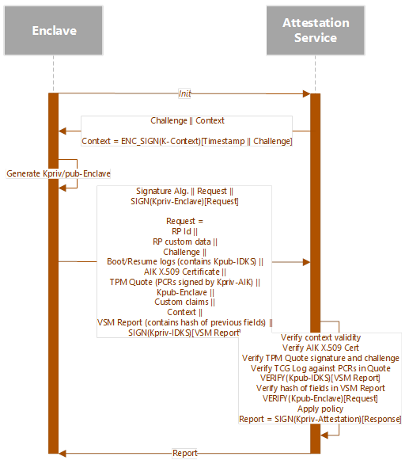

# Virtualization-based Security (VBS) attestation protocol 

For Microsoft Azure Attestation to provide strong security guarantees that the data it is reporting is authentic, it is required to build a chain of trust from the firmware to the launch of the hypervisor and secure kernel. To achieve this Azure Attestation must attest to the boot state of the machine before we can establish trust in the secure enclave. The operating system, hypervisor and secure kernel binaries must be signed by the correct official Microsoft authorities and configured in a secure way. Once we have bound trust between the Trusted Platform Module (TPM) and the health of the hypervisor, we can trust the VBS IDKS provided in the Measured Boot Log. With this we can validate that a key pair was generated by the enclave and mint an attestation report that binds trust in that key and contains other claims such as the security level and boot attestation properties.

## Protocol messages

### Init message

#### Direction

Client -> Aure Attestation

#### Payload

{
  "type": "aikcert"
}

“type” (ASCII string): represents the type of attestation requested. Currently, only “aikcert” is supported.

### Challenge message

#### Direction

Azure Attestation -> Client

#### Payload

{
  "challenge": "<BASE64URL(CHALLENGE)>",
  "service_context": "<BASE64URL(SERVICECONTEXT)>"
}

**challenge** (BASE64URL(OCTETS)): Random value issued by the service.
**service_context** (BASE64URL(OCTETS)): Opaque, encrypted context created by the service which includes, among others, the challenge and an expiration time for that challenge.


### Request message

#### Direction

Client -> Azure Attestation 

#### Payload

{
  "request": "<JWS>"
}

**request** (JWS): Request consists of a JSON Web Signature (JWS) structure. The JWS Protected Header and JWS Payload are shown below. As in any JWS structure, the final value consists of:
BASE64URL(UTF8(JWS Protected Header)) || '.' ||
BASE64URL(JWS Payload) || '.' ||
BASE64URL(JWS Signature)

JWS Protected Header
{
  "alg": "PS256",
  "typ": "attReq"
  // no "kid" parameter as the key specified by attest_key MUST sign this JWS to prove possession.
}

##### JWS Payload

JWS payload can be of type basic or VBS. Basic is used when attestation evidence does not include VBS data.

--- Basic example
{
  "att_type": "basic",
  "att_data": {
    "rp_id": "<URL>",
    "rp_data": "<BASE64URL(RPCUSTOMDATA)>",
    "challenge": "<BASE64URL(CHALLENGE)>",
    "tpm_att_data": {
      "srtm_boot_log": "<BASE64URL(SRTMBOOTLOG)>",
      "srtm_resume_log": "<BASE64URL(SRTMRESUMELOG)>",
      "drtm_boot_log": "<BASE64URL(DRTMBOOTLOG)>",
      "drtm_resume_log": "<BASE64URL(DRTMRESUMELOG)>",
      "aik_cert": "<BASE64URL(AIKCERTIFICATE)>",
      // aik_pub is represented as a JSON Web Key (JWK) object (RFC 7517).
      "aik_pub": {
        "kty": "RSA",
        "n": "<Base64urlUInt(MODULUS)>",
        "e": "<Base64urlUInt(EXPONENT)>"
      },
      "current_claim": "<BASE64URL(CURRENTCLAIM)>",
      "boot_claim": "<BASE64URL(BOOTCLAIM)>"
    },
    // attest_key is represented as a JSON Web Key (JWK) object (RFC 7517).
    "attest_key": {
      "kty": "RSA",
      "n": "<Base64urlUInt(MODULUS)>",
      "e": "<Base64urlUInt(EXPONENT)>"
    },
    "custom_claims": [
      {
        "name": "<name>",
        "value": "<value>",
        "value_type": "<value_type>"
      },
      {
        "name": "<name>",
        "value": "<value>",
        "value_type": "<value_type>"
      }
    ],
    "service_context": "<BASE64URL(SERVICECONTEXT)>"
  }
}
---

--- VBS example:
{
  "att_type": "vbs",
  "att_data": {
    "report_signed": {
      "rp_id": "<URL>",
      "rp_data": "<BASE64URL(RPCUSTOMDATA)>",
      "challenge": "<BASE64URL(CHALLENGE)>",
      "tpm_att_data": {
        "srtm_boot_log": "<BASE64URL(SRTMBOOTLOG)>",
        "srtm_resume_log": "<BASE64URL(SRTMRESUMELOG)>",
        "drtm_boot_log": "<BASE64URL(DRTMBOOTLOG)>",
        "drtm_resume_log": "<BASE64URL(DRTMRESUMELOG)>",
        "aik_cert": "<BASE64URL(AIKCERTIFICATE)>",
        // aik_pub is represented as a JSON Web Key (JWK) object (RFC 7517).
        "aik_pub": {
          "kty": "RSA",
          "n": "<Base64urlUInt(MODULUS)>",
          "e": "<Base64urlUInt(EXPONENT)>"
        },
        "current_claim": "<BASE64URL(CURRENTCLAIM)>",
        "boot_claim": "<BASE64URL(BOOTCLAIM)>"
      },
      // attest_key is represented as a JSON Web Key (JWK) object (RFC 7517).
      "attest_key": {
        "kty": "RSA",
        "n": "<Base64urlUInt(MODULUS)>",
        "e": "<Base64urlUInt(EXPONENT)>"
      },
      "custom_claims": [
        {
          "name": "<name>",
          "value": "<value>",
          "value_type": "<value_type>"
        },
        {
          "name": "<name>",
          "value": "<value>",
          "value_type": "<value_type>"
        }
      ],
      "service_context": "<BASE64URL(SERVICECONTEXT)>"
    },
    "vsm_report": "<BASE64URL(REPORT)>"
  }
}
--- 

**rp_id** (StringOrURI): Relying party identifier. Used by the service in the computation of the machine id claim.
**rp_data** (BASE64URL(OCTETS)): Opaque data passed by the relying party. This is normally used by the relying party as a nonce to guarantee freshness of the report.
**challenge** (BASE64URL(OCTETS)): Random value issued by the service.
**tpm_att_data**: TPM-related attestation data.
**srtm_boot_log** (BASE64URL(OCTETS)): SRTM boot log as retrieved by function Tbsi_Get_TCG_Log_Ex with log type = TBS_TCGLOG_SRTM_BOOT.
**srtm_resume_log** (BASE64URL(OCTETS)): SRTM resume log as retrieved by function Tbsi_Get_TCG_Log_Ex with log type = TBS_TCGLOG_SRTM_RESUME.
**drtm_boot_log** (BASE64URL(OCTETS)): DRTM boot log as retrieved by function Tbsi_Get_TCG_Log_Ex with log type = TBS_TCGLOG_DRTM_BOOT.
**drtm_resume_log** (BASE64URL(OCTETS)): DRTM resume log as retrieved by function Tbsi_Get_TCG_Log_Ex with log type = TBS_TCGLOG_DRTM_RESUME.
**aik_cert** (BASE64URL(OCTETS)): The X.509 certificate for the AIK as returned by function NCryptGetProperty with property = NCRYPT_CERTIFICATE_PROPERTY.
**aik_pub**: The public part of the AIK represented as a JSON Web Key (JWK) object (RFC 7517).
**current_claim** (BASE64URL(OCTETS)): The attestation claim for the current PCR state as returned by function NCryptCreateClaim with dwClaimType = NCRYPT_CLAIM_PLATFORM and parameter NCRYPTBUFFER_TPM_PLATFORM_CLAIM_PCR_MASK set to include all PCRs. The challenge sent by the service should also be used in the computation of this claim.
**boot_claim** (BASE64URL(OCTETS)): The attestation claim for the PCR state at boot as returned by function NCryptCreateClaim with dwClaimType = NCRYPT_CLAIM_PLATFORM and parameter NCRYPTBUFFER_TPM_PLATFORM_CLAIM_PCR_MASK set to include all PCRs.
**vbs** (BASE64URL(OCTETS)): The VBS enclave attestation report as returned by function EnclaveGetAttestationReport. The EnclaveData parameter must be the SHA-512 hash of the value of report_signed (including the opening and closing braces). The hash function input is UTF8(report_signed).
**attest_key**: The public part of the enclave key represented as a JSON Web Key (JWK) object (RFC 7517).
**custom_claims**: Array of custom enclave claims sent to the service that can be evaluated by the policy. The claim
**name** (String): Name of the claim. This name will be appended to a url determined by the Attestation Service (to avoid conflicts) and the concatenated string becomes the type of the claim that can be used in the policy.
**value** (String): Value of the claim.
**value_type** (String): Data type of the claim’s value.
**service_context** (BASE64URL(OCTETS)): Opaque, encrypted context created by the service which includes, among others, the challenge and an expiration time for that challenge.

### Report message

#### Direction

Azure Attestation -> Client

#### Payload

{
  "report": "<JWT>"
}

**report** (JWT): The attestation report in JSON Web Token (JWT) format (RFC 7519).


## Protocol


Network calls between the enclave and the Azure Attestation are actually made from VTL0 (unprotected). The figure does not show that detail for simplification. However, the attestation protocol is guaranteed to be protected even on untrusted transport mechanisms so it is not a problem that a VTL0 process is sending/receiving the data.

Messages shown in the protocol diagram and ensuing description are just a simple representation for simplification. The actual message formats are detailed in [PROTOCOL MESSAGES](# protocol-messages) section.

1. Enclave starts the protocol by requesting a challenge from the service (shown as the Init message)
2. Azure Attestation generates a random challenge and creates a session context which contains such challenge and a timestamp. The session context is encrypted and signed using    K-Context **ENC_SIGN(K-Context)[Timestamp || Challenge]**.  Context is opaque to the client
3. The enclave then:

    a.	Generates a key pair Kpriv/pub-Enclave
    
    b.	Retrieves the Boot/Resume logs and quote from the TPM using the challenge received from the service (notice that the enclave itself cannot call the TPM functions so it           calls back to VTL-0 to retrieve those values but this does not affect security as invalid/replayed logs or quotes will be detected)
    
    c.	Requests a signed report from VBS  [(EnclaveGetAttestationReport())](/windows/win32/api/winenclaveapi/nf-winenclaveapi-enclavegetattestationreport?redirectedfrom=MSDN)           with the hash of the fields in the request
    
    d.	VBS Report is signed by Kpriv-IDKS (VBS Signing IDK) in the secure kernel
    
    e.	A message to be sent to the service is created with the following format:

    ```
    Signature algorithm || Request || SIGN(Kpriv-Enclave)[Request]

    Request = RP id || RP custom data || Challenge || Boot/Resume logs || AIK X.509 Certificate || TPM Quote || Kpub-Enclave || Custom claims || VBS Report || SIGN(Kpriv-IDKS)       [VBS Report] || Context

    ```

4. Azure Attestation receives the message from the client and:

    a.	Verifies the signature and decrypts the session context. If the context has expired, the service fails the request
    
    b.	Verifies that the AIK X.509 Certificate is valid and trusted, i.e., issued by a trusted CA
    
    c.	Verifies the TPM quote was signed properly by a “known” TPM key (“known” in this context means that the TPM key used to sign the quote is indirectly trusted given that           the client uses AIK to sign the quote and the AIK Cert has already been verified). The quote must also include the same challenge as present in the context
    
    d.	Verifies the Boot/Resume logs against the PCRs in the TPM quote
    
    e.	Gets Kpub-IDKS from the now trusted Boot/Resume logs and verifies that the VBS Report was signed with it **(VERIFY(Kpub-IDKS)[VBS Report])**
    
    f.	Computes hash of the fields in the request and compares such hash against the hash present in the VBS Report, which is now trusted
    
    g.	Using the Kpub-Enclave received, confirm the client has possession of Kpriv-Enclave by verifying that the request was signed by such key **(VERIFY(Kpub-Enclave)                   [Request])**
    
    h.	Applies the policy:
    
    - Uses the authorization rules to make sure the client platform is trusted, e.g. expected enclave ID and SVN, enclave does not permit debugging, secure boot is                     enabled, test signing is disabled, etc.;
        
    - Uses the issuance rules to add claims to the final report
        
    i.	Issues an attestation report signed by Kpriv-Attestation, the attestation Service key

5. Client application can now request the attestation report from the enclave. The report can then be parsed and trusted by relying parties as it is signed by Azure                Attestation       

The reason for sending the encrypted context to the client is to relieve the service from having to keep state (context) about an attestation session. Security in this case is therefore tied to the strength of K-Context. For increased security or other reasons, it is possible to change the protocol not to send the context to the client and instead keep state in the service on a memory cache, if the connection between the client and the service node is persistent. If the connection is not persistent, the state can be stored in a database shared by all nodes, however in this case, a session identifier must be sent to the client. In this case, special care has to be taken with the session identifier to prevent an attacker from using another session’s identifier.
